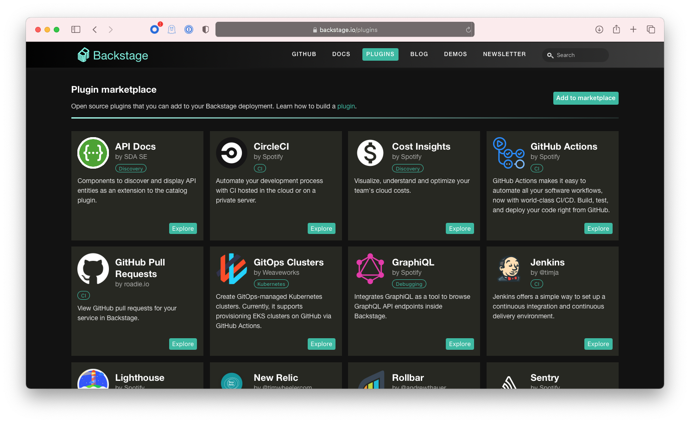

Backstage has an ambitious goal: to provide engineers with the best possible developer experience.

A great developer experience leads to happy, creative, and productive engineers. Our belief is that engineers should not have to be experts in various infrastructure tools or disciplines (e.g., machine learning or backend) to be productive. Infrastructure should be abstracted away, so that developers can spend more cycles building and testing, quickly and safely. Backstage unifies all your infrastructure tooling, services, and documentation to create a streamlined development environment from end to end.

Now you may be thinking, “Yeah, sure, that sounds nice and all, but how does Backstage actually abstract away infrastructure?” The short answer: [plugins](https://backstage.io/plugins).

<!--truncate-->

Think of plugins as a mini version of an infrastructure tool or service — just the parts you need, made quick and easy. The advantage of using a Backstage plugin instead of a tool’s dedicated UI is that all your infrastructure is packaged into a “single pane of glass” instead of being spread out like independently built “islands”. Once you grow your infrastructure portfolio, the complexity really starts to add up. The Backstage plugin model allows you to add more tools without increasing the cognitive load for your users.

Our goal for the plugin ecosystem is that anything can be a plugin. The definition of a plugin is flexible enough to allow you to expose pretty much any kind of infrastructure or software development tool as a plugin in Backstage. By following clear [design guidelines](https://backstage.io/blog/2020/09/30/backstage-design-system) we ensure the overall user experience stays consistent between plugins. If we all do our job well, the end user of Backstage does not see the boundaries between plugins. They are interacting with one consistent product — with many features.

## Building an ecosystem

Imagine a not-so-distant future where you walk up to Backstage, install it in your environment, and then choose from a gallery of existing, open source plugins that serve and match whatever infrastructure and software development needs you have inside your company. That means you can get started with Backstage and see the gains of improved productivity within days, not months. That is our vision for the Backstage plugin ecosystem.

Running services on Kubernetes? There’s a plugin for that. Using Snyk for security scanning? There’s a plugin for that. Grafana, DataDog, or Rollbar for monitoring? There’s a plugin for that. Using Jenkins, CircleCI, GitHub Actions, or Travis CI? Pick the CI plugin of your choice. You get the picture. Regardless of your stack, there’s a plugin that you can use.

Like this vision? So do we! But we can’t do it alone. We’ll need your help. For this vision to come true, we need to foster a community where many companies and individual developers build and contribute their plugins. Having been [accepted into the CNCF Sandbox](https://backstage.io/blog/2020/09/23/backstage-cncf-sandbox) provides us with the groundwork and guidance to broaden the community even faster.

This grand vision is actually not that far off. Already today there is a growing ecosystem of Backstage plugins. To highlight all the amazing work that has been done by the community, and make it easier for Backstage adopters to see what plugins are available, we now have a Plugin Marketplace: [https://backstage.io/plugins](https://backstage.io/plugins)

## Creating and suggesting new plugins

Not all plugins you need will be open source. Every company has their own homegrown tooling. Building internal plugins lets you tailor your version of Backstage to be a perfect fit for your infrastructure and software development needs. If you end up [building plugins](https://backstage.io/docs/plugins/create-a-plugin) that could be useful for other companies, please consider releasing them as open source and [add them to the Marketplace](https://backstage.io/docs/plugins/add-to-marketplace).

If you start developing a plugin that you aim to release as open source, we suggest that you create a [new plugin Issue](https://github.com/backstage/backstage/issues/new?labels=plugin&template=plugin_template.md&title=%5BPlugin%5D+THE+PLUGIN+NAME). This helps the community know what plugins are in development and opens up opportunities for collaboration. You can also use this process if you have an idea for a good plugin, but you need help building it.

We are really excited to see all the amazing plugins that have already been built, and look forward to seeing even more ideas and collaboration as the Backstage community continues to grow.

What plugins would you like to see in the Plugin Marketplace? [Tell us](https://github.com/backstage/backstage/issues/new?labels=plugin&template=plugin_template.md&title=%5BPlugin%5D+THE+PLUGIN+NAME)!

_Special shout-out to community member [Iain Billett](https://github.com/iain-b) from [Roadie](https://roadie.io) for helping build and contribute the [Plugin Marketplace page](https://backstage.io/plugins) (as his first PR no less!)._
