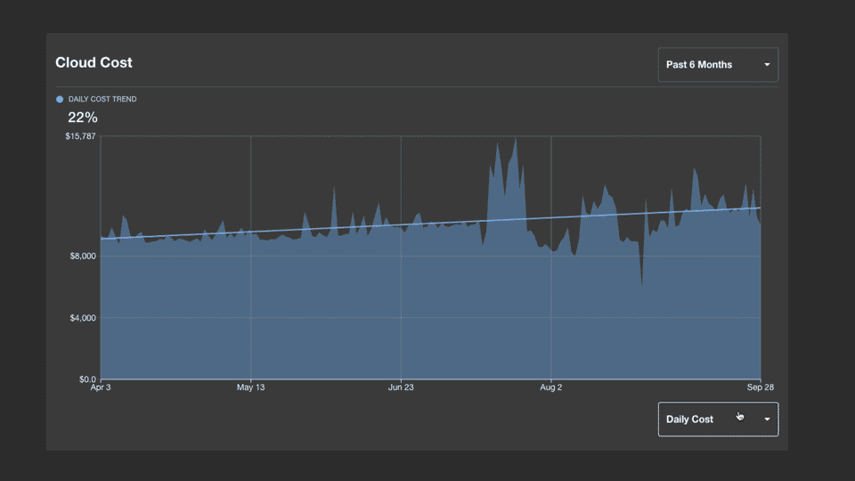
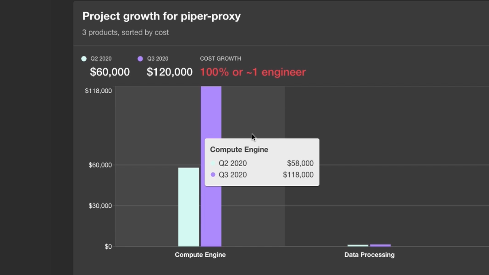
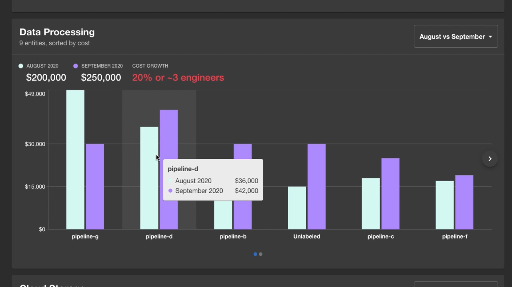

How did Spotify save millions on cloud costs within a matter of months?? We made cost optimization just another part of the daily development process. Our newly open sourced [Cost Insights plugin](https://github.com/backstage/backstage/tree/master/plugins/cost-insights) makes a team’s cloud costs visible — and actionable — right inside Backstage. So engineers can see the impact of their cloud usage (down to a product and resource level) and make optimizations wherever and whenever it makes sense. By managing cloud costs from the ground up, you can make smarter decisions that let you continue to build and scale quickly, without wasting resources.

<iframe width="780" height="440" src="https://www.youtube.com/embed/YLAd5hdXR_Q" frameBorder="0" allow="accelerometer; autoplay; encrypted-media; gyroscope; picture-in-picture" allowFullScreen></iframe>

Are we turning engineers into accountants? Nope, we’re just letting engineers do what they do best, in the place that feels natural to them: inside Backstage.

<!--truncate-->

## Why put a cost management tool in the hands of engineers?

Engineers are closest to the metal in terms of knowing why a specific feature, product, or service is using cloud resources. So they’re in the best position to understand how costs impact ongoing development (and vice versa).

If you manage costs top-down from a 10,000-foot view of your cloud infrastructure, you’re likely making decisions far removed from products, especially in larger organizations. Set a broad cost-cutting goal, and you could be creating unintended consequences — curtailing spending at the expense of growth or experimentation.

## Ground-level intelligence, data-driven solutions

Our hypothesis at Spotify was, if you bring spending data into an engineer’s everyday development workflow, they’ll naturally look for cost optimizations just like they look for any other optimization. And the cost optimizations will be more efficient and effective, because the decisions are informed at the ground level.

The problem is that most cloud platforms don’t provide cost data at a granular enough level to make those decisions. And the bigger your organization (say, two-thousand-microservices and four-thousand-data-pipelines big, like Spotify), then the less you can attribute these large, fuzzy numbers to the right team, let alone a shipping product or internal service.

That’s where Cost Insights comes in. Instead of making cost management and product development separate departments on the org chart, Backstage brings them together — with a level of detail and specificity engineers relate and respond to.

## How to turn dollars into sense

It’s not enough to make costs visible. To be useful, the numbers need to be relevant, relatable, and actionable. In other words, not just cost information, but insights. There are several ways the plugin puts data from your cloud provider in a more helpful context.

### Use business metrics to evaluate costs

Cost Insights will show you trends at a glance and also let you compare costs quarter over quarter. More importantly, you can also evaluate costs against business metrics that you care most about. In the example below, should the upward slope shown in the first screen be cause for worry? Perhaps not — if you switch views, you’ll see that cost per daily average user (DAU) is actually going down. Exactly what you hope to see as you scale.

_(Note: Screens are examples; they do not show real data.)_

### Illustrate costs with relatable, real-world comparisons

In addition to dollar amounts, Cost Insights allows teams to visualize and convert cost overages into more relatable terms. In the example below, we equate the growth in costs for virtual machine instances (100% increase) to developer time spent (about 1 engineer). We use this particular comparison in the plugin because we found it resonated with our own engineers — providing a useful perspective for spending increases. You can configure what the “cost of an engineer” means to your organization. Or engineers can build in their own comparisons — cups of coffee, carbon offset credits, electric luxury vehicles — whatever makes costs more tangible for them.

_(Note: Screens are examples; they do not show real data.)_

### Tie spending to specific products and resources

The more detailed the cost data, the more relevant, actionable, and helpful it is. Cost Insights allows you to attribute costs to products and resources in a way that makes sense to your engineers. For example, here we see a breakdown of data processing costs by individual pipelines. This allows your team to target optimizations more precisely.

_(Note: Screens are examples; they do not show real data.)_

## Driving down costs without slowing down development

When it comes to cutting costs, we actually want to guard against over-optimization. Growth and costs can go hand in hand. The trick is knowing when one is out of balance and needs addressing. Our product highlights when there’s been a large increase in spending, so that engineers are thinking about cost only when they must and aren’t distracted from their set goals and priorities.

Engineers can then determine for themselves if the time invested in an optimization was valuable compared to the costs saved. Cost Insights puts the decision in our engineers’ hands for them to choose when to focus on growth efforts and when to focus on cost. Control, as ever, remains with our developers, where we think it belongs.

## Getting started

You can begin working with the Cost Insights plugin today on [GitHub](https://github.com/backstage/backstage/tree/master/plugins/cost-insights). We include an example client with static data in the expected format. The `CostInsightsApi` should talk with a cloud billing backend that aggregates billing data from your cloud provider.

The current release of Cost Insights includes:

- Daily cost graph by team or billing account
- Cost comparisons against configurable business metrics (including an option for Daily Active Users)
- Insights panels — configurable for the cloud products your company uses
- Cost alerts and recommendations
- Selectable time periods for month-over-month or quarter-over-quarter comparisons
- Conversion of cost growth into “cost of average engineer” to help optimization trade-off decisions

Our hope is to help other companies translate their cloud cost in a relatable way for their engineers to better understand their impact and accurately identify their opportunities for optimizations.

And if you’re interested in contributing to our outstanding issues, you can find them in the issues queue, filtered under the [‘cost-insights’ label](https://github.com/backstage/backstage/labels/cost-insights).

## Ready for DevSecCostOpsPlus (and whatever’s next)

There’s DevOps, there’s DevSecOps, and then there’s Backstage: one frontend for all your infrastructure. From building, testing, and deploying to monitoring and security — Backstage helps you manage your entire tech organization and provides a seamless developer experience for engineers, from end to end to end. And now that also extends to cost management for your cloud infrastructure and tooling. Happy building and [happy optimizing](https://github.com/backstage/backstage/tree/master/plugins/cost-insights).
