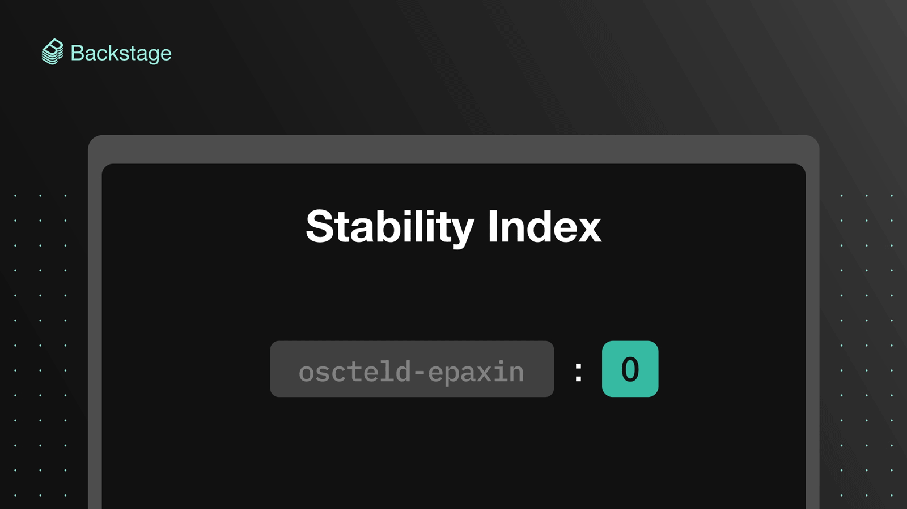

**TL;DR** Backstage is heading out of alpha and moving onto the path to stable releases and an eventual version 1.0. As the community and ecosystem continue to grow at an increasing rate, we want to provide a solid foundation for everyone building things in, with, and around Backstage. So, today we’re introducing the [Stability Index](https://backstage.io/docs/overview/stability-index) — a simple way to find out how likely (or unlikely) a specific package or plugin inside Backstage might be updated with major changes. By indicating the reliability of key features and APIs, this quick reference will help contributors and adopters better plan and coordinate their development efforts going forward.

<!--truncate-->

Backstage has a great and growing community of users and contributors. With so much valuable feedback, this inevitably means that sometimes we will go back and revise design decisions that introduce breaking changes. Furthermore, as we continue to ship new features and systems, we’ll continue this cycle of iterating, gathering feedback, and iterating again before reaching a stable API.

This rapid evolution can create uncertainty around which parts of the project are considered stable and which are not. Regardless of whether you're contributing to the project directly, setting up your own Backstage, or building plugins, you will be using various parts of the project that vary in stability. While many API surfaces of Backstage are reasonably solid and are unlikely to see any big breaking changes, others are more unstable or experimental.

## The Stability Index

In order to tackle the problem of uncertainty, and help align contributors, we have recently introduced a Stability Index. Inspired by a [similar concept with the same name in Node.js](https://nodejs.org/docs/latest-v4.x/api/documentation.html#documentation_stability_index), it’s a score assigned to subsets of the project, indicating the level of maturity of the API and the commitment to backwards compatibility. However, because of the current phase of the project, we have used a slightly different implementation. Rather than the score indicating a perceived stability, a higher score is instead a commitment to providing a smoother upgrade path for users, both through better documentation and backwards compatibility. Importantly, the Stability Index does not supersede [semantic versioning](https://semver.org/) (or semver), meaning we will still adhere to semver and only do breaking changes in minor releases as long as we are on 0.x.

You can find more details about the scores on the [Stability Index](https://backstage.io/docs/overview/stability-index) page, but the following is a TL;DR of the 0–3 scores:

- **0** — There's a changelog entry.
- **1** — There's a migration guide.
- **2** — Two weeks of deprecation.
- **3** — Three months of deprecation.

The Stability Index has been tailored for the phase that the project is currently in, and we do not intend to keep it in place in its current form forever. It is, for example, likely that we in the future will increase the deprecation time limits.

## Staying up to date

In addition to the Stability Index, we have also recently adopted a weekly release cadence where we cut new releases every Thursday. Along with the two-week deprecation period of many of the API surfaces in Backstage, there is an excellent opportunity to form a routine to update your own Backstage projects either weekly or biweekly.

In order to make the update process easier, we’ve added a new command to the Backstage CLI that allows you to easily update your project to use the latest Backstage release. The command is called `version:bump` and is executed in the root of your project using the CLI. You can see what it looks like in action below.

## Impact

The Stability Index has already been active for a couple of weeks, and we have immediately seen an impact on the consideration and care taken when working in parts of the project that we have committed to keeping more stable. Both members of the core maintainer team and contributors from the community have taken care to roll out updates responsibly, with examples such as [PR #3524](https://github.com/backstage/backstage/pull/3524) and [PR #3465](https://github.com/backstage/backstage/pull/3465).

The core team is working hard to bring more stability to broader parts of Backstage, and engineering it in a way that allows for long-term evolution. There are more learnings to be discovered as we continue evolving Backstage, but we are confident that the Stability Index will allow for a clearer path and a smoother ride for everyone involved!
