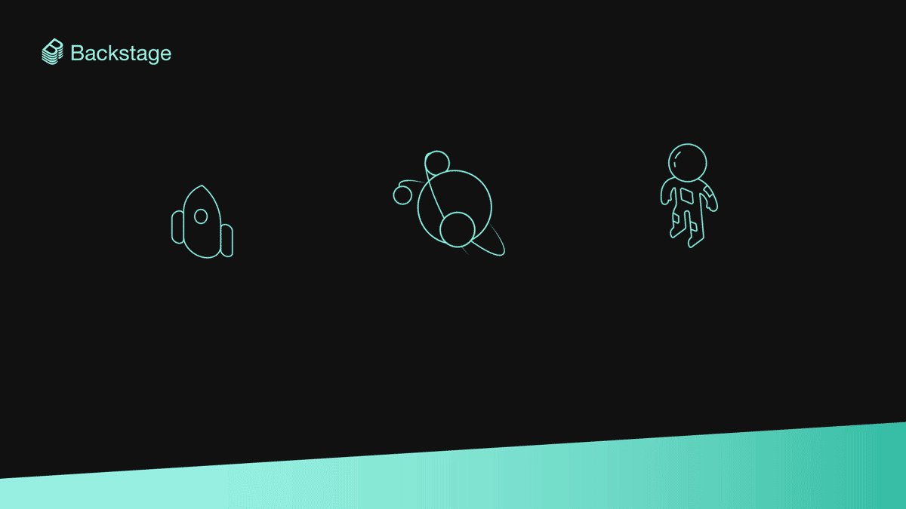

One of the greatest strengths of Backstage also presents a never-ending challenge: Backstage is highly customizable and allows you to easily build a unique developer portal suited to your organization’s needs. The downside of this flexibility is that it can be hard to know where to start. Backstage can do so many things — integrating every part of your tech infrastructure and developer experience — but if you set off building a developer portal without a plan, it’s easy to get overwhelmed by all the possibilities. To help you form your plan, this post will detail how Spotify came to design our internal portal and recommend potential models for you to use when designing and building your own.

<!--truncate-->

## Infrastructure as tech culture

Before providing recommendations on getting started with Backstage, it’s helpful to have a bit of context as to why Spotify made the design decisions we did. No two companies are identical — and thus, no two Backstage implementations are the same.

Rolling back the clock just a few years, [Spotify was challenged](https://engineering.atspotify.com/2021/05/18/a-product-story-the-lessons-of-backstage-and-spotifys-autonomous-culture/) to continue to scale our engineering team (and the number of features and components built) but retain the speed of product development. Some user research with Spotify developers highlighted a clear problem: there was simply too much non-documented institutional knowledge needed to get things done. No one could find anything and everyone was interrupting everyone else trying to figure things out.

Spotify’s developers were facing three big challenges on a daily basis:

- They not only needed to build software quickly, they also needed to pass along knowledge to new joiners about how best to create new components.
- They needed to somehow maintain a mental model of the systems their squad owned. (Or, if they were lucky, they found a hopefully-up-to-date spreadsheet tracking this information.)
- They needed to keep an eye on what squads around them might be building to ensure they could reuse systems when they needed to solve similar problems in the future.

In short, Spotify developers needed to continue building industry leading features at breakneck speed, while simultaneously maintaining a mental model for all the software at Spotify (oh, and help every new joiner develop that mental model as well!).
 

## Three jobs: Create, manage, explore

Around the same time, the [jobs to be done](https://hbr.org/2016/09/know-your-customers-jobs-to-be-done) framework was becoming popular and luckily, a few Spotifiers helped guide the vision for a _sense-making tool for developers_ toward using it. After user research and many failed attempts, we landed on three jobs Spotify developers needed to do consistently:
 

- **Create**: Spotify developers want to delight their customers with incredible features. They create new software to do that.
- **Manage**: Spotify developers are proud of their work and treat their software and data like products. That requires maintaining all the software they own on an ongoing basis.
- **Explore**: Spotify developers want to solve new, yet unsolved problems. They try to build on existing systems to help them do that.

So: make software, maintain the software you own throughout its lifecycle, and integrate with other people’s software.

Within today’s complex development environments, there are barriers both big and small that get in the way of those three jobs. Backstage provides the building blocks for removing those barriers, streamlining your development cycle, and letting developers do what they really want to do: build great features. Let’s take a closer look at each of these jobs.

### Create

**Job:** You’re an engineer, ready to start building a new microservice. Do you just pick whatever framework you want? How do you reserve capacity to run your service in production? What about managing CI/CD?

**Tool:** At Spotify, we use **Backstage Software Templates** to simplify all of this, reducing time–to–Hello World to just a few clicks. Instead of researching Spring Boot versus Helidon, opening a Jira ticket, rummaging through docs, and configuring CI automations, you just choose a template and your project is automatically set up in the repo for you, with the CI already running your first build.

**Result:** By making it easier to start new projects, your engineers get to the good part of coding features faster. And your organization’s best practices are built into the templates, encouraging standards and reducing complexity in your tech ecosystem.

### Manage

**Job:** You’re on a small team that owns a dozen services. Whenever you update and deploy those services, you’re switching between your CI, the AWS console, a security dashboard, and a CLI so you can try to figure out which Kubernetes cluster your service ended up on. In other words, you have a lot of open windows and tabs, and each step means switching to a new interface.

**Tool:** All of your team’s software components are organized together on one page in the **Backstage Service Catalog**. Go to any service’s page from there and its CI/CD status, [Kubernetes deployment status](https://backstage.io/blog/2021/01/12/new-backstage-feature-kubernetes-for-service-owners), documentation, security checks — and everything else related to that service — is grouped together in one seamless interface that shows you only the info you want.

**Result**: One page in Backstage has everything you need to manage the software you own. No more context-switching. No more digging through your cloud provider’s obscure admin features. Outside the repo and your IDE, everything you need to manage your service is right inside Backstage.

### Explore

**Job:** You're building a new mobile feature that needs to ensure a user is paying for the premium version of your product — but someone must’ve already built a library that handles that, right? A company-wide email and a few calls for help on Slack yield no response, so you resign yourself to building the capability yourself. Turns out someone did build the library you needed. They were just on vacation so they didn’t see your messages. How do you enable better discovery and collaboration across your org?

**Tools:** At Spotify, anyone can find everyone else’s software — because everything is centralized inside Backstage, organized by the **Backstage Service Catalog** and accessible by **search**. Go to any library or services page, and you’ll find the owners and documentation, even its API and how to extend it if need be.

**Result:** One place for everything, one place to search. Developers can more easily share components, build on top of each other’s work, and discover tools, libraries, frameworks, documentation, system designs, org charts, and more.

## Sounds great. Where do I start?

After talking with companies who have already adopted Backstage, we’ve seen a few common strategies for getting started. The different strategies are based on the size of your engineering org (which often also corresponds with how fast you’re growing).

 

### My org has ~200 engineers (and is growing fast)

You’re big enough to start feeling the pain, and only getting bigger. Onboarding and discoverability are your biggest challenges.

**Pain points:**

- This size seems to be the tipping point — where complexity is taking hold, collaboration starts breaking down, and ad hoc solutions stop working.
- Often this is also when you’re growing so fast (doubling in size every 6–12 months) that there are now more new engineers than old engineers.
- New engineers can’t find anything, so they ask around, which pulls all your other engineers off-task with interruptions.
- Logjams form. One company told us how it was taking 3–4 days for pull requests to get merged.

**Recommendation — Explore, then create:**

- New engineers need an easy way to find out how to do things, so you’re not just adding bodies, you’re adding happy, productive contributors.
- To streamline onboarding, start with centralizing your documentation and making your tools and software components discoverable in Backstage.
- At this size, you might not have a dedicated platform/infra team in place yet, but Backstage can provide the framework for centralizing and sharing knowledge — from managing compliance requirements to finding the right API documentation.
- This allows both new and old engineers to collaborate more efficiently, easily discover best practices, and cuts down on duplicated work (e.g., a new team doesn’t end up rebuilding a database that already exists but nobody can find).

### My org has ~1,000 engineers

You’re officially big. Lots and lots of teams are managing lots and lots of software — and the frustration of switching between all the various tools to do that is growing exponentially.

**Pain points:**

- Fragmentation and entropy are real threats to productivity. From security requirements to cluster management to a thousand data endpoints, there’s too much to keep track of, leading to cognitive overload.
- A death by a thousand cuts: constantly logging into new interfaces — from your cloud provider’s console to some brand new security tool then back to your CI/CD — is bogging your engineers down with too much context-switching and a lot of noise.
- Every day, it’s getting more and more difficult for one team to manage their own microservices, data, and documentation, let alone share their knowledge with other teams.

**Recommendation — Manage, then explore, then create:**

- Backstage will allow your teams to get a handle on the software they own, since everything they need to manage it is in one place.
- From CI/CD status to documentation to deciphering a monorepo, Backstage makes it easy to manage a service (or other software component) on a day-to-day basis.
- The service catalog also helps your developers visualize your existing software ecosystem, beyond the software they own. And with Backstage Software Templates, every new software component is already added to the catalog.
- Even at this scale, a small platform team should be all it takes to build and maintain your own version of Backstage. At Spotify, we have a 4-person team responsible for our internal version of Backstage, which is used by all of Spotify’s 1,600+ developers.

### My org has 1,000+ engineers

Integrating infrastructure of this size and complexity can seem overwhelming. It’s an even bigger challenge to bring this level of change to a well-established culture with ingrained processes.

**Pain points:**

- When you’re this large, you’ve incorporated a lot of technology and processes, as well as a lot of partners, each with their own technologies and processes.
- You’re focussed on “replacing cruft” and bringing discoverability and order to your vast ecosystem of components and tools.
- Getting your tools adopted by your engineers while modernizing your tech stack and coordinating with your infra teams to improve your engineering practices across the whole company… it’s a lot.

**Recommendation — Create, then manage, then explore:**

- The fastest way to bring change to your ecosystem is to start at the beginning of the chain with Backstage Software Templates.
- With every new component created with your templates, you’re establishing best practices and rewarding your developers with a streamlined experience focused on their needs — all the while building up your new service catalog.
- The more the templates ease the process of starting up a project, the more your engineers will adopt them, and the faster the other benefits of Backstage will build up, transforming productivity across your organization. ([That’s how we did it at Spotify](https://open.spotify.com/episode/7iuQ3ew1Wwpuiq6LbBKzCl).)

## More questions about adopting Backstage?

[Contact the Backstage team at Spotify.](https://backstage.spotify.com/) We’ll share more about what we’ve learned from our experience here at Spotify — and from other companies who are already using Backstage to transform their developer experience.
