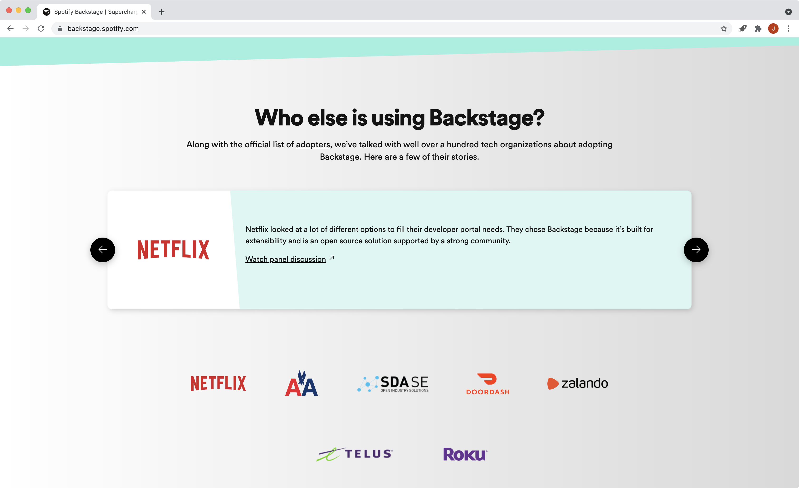
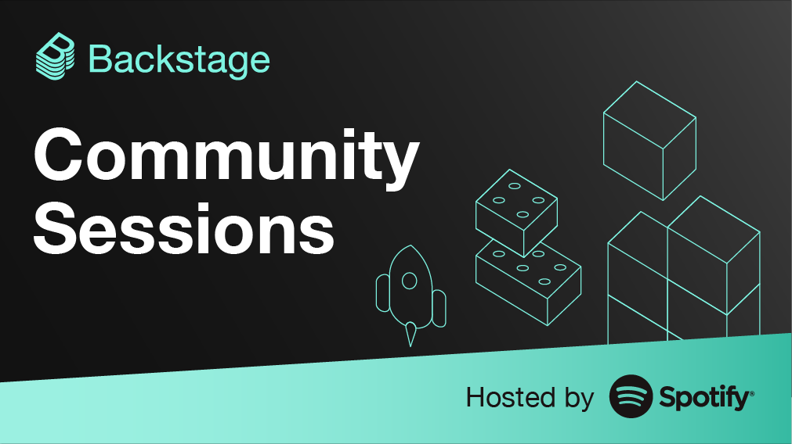
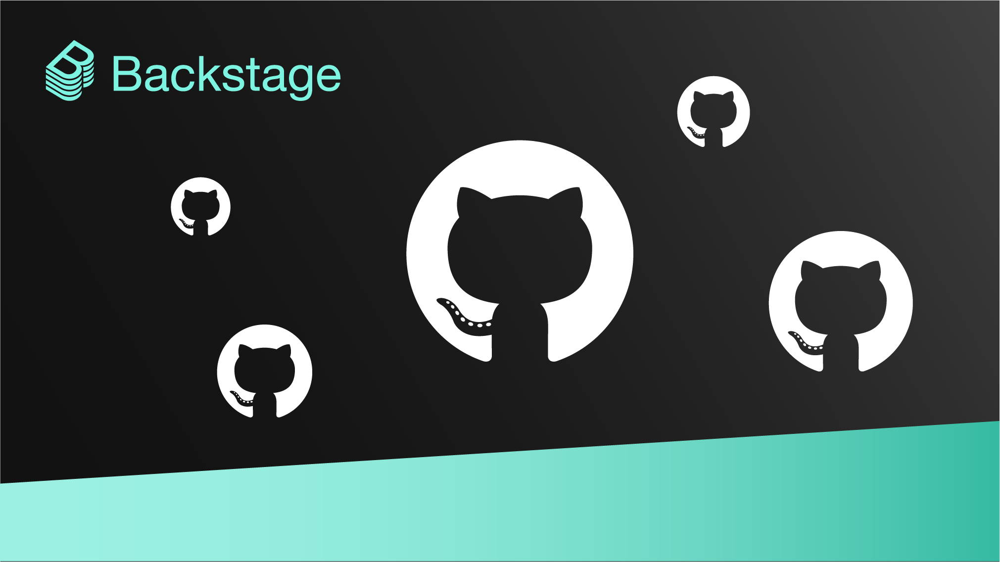

_[backstage.spotify.com](https://backstage.spotify.com)_

The Backstage community is growing! In just over [a year](https://engineering.atspotify.com/2021/03/16/happy-birthday-backstage-spotifys-biggest-open-source-project-grows-up-fast/), Backstage has gone from a few open source building blocks to a thriving platform used by engineering orgs with thousands of developers. But even with 30+ [adopting companies](https://github.com/backstage/backstage/blob/master/ADOPTERS.md) and 400+ contributors, we are still in the very early stages of reaching the platform’s potential.

In order to grow Backstage further, Spotify is increasing the support we provide both adopters (the people integrating Backstage into their organizations) and contributors (the people building features and improving the code). The more companies that adopt Backstage, the more support the project gets, the stronger the platform becomes for everyone.

And while Spotify remains committed to maturing the Backstage platform — both as original creator and active maintainer — we also want to make room for the community to take greater ownership. Backstage may have started inside Spotify, but it belongs to all of you. So, we hope you join us in what’s next.

<!--truncate-->

## What’s next: More support for adopters and contributors

Alongside the code contributions, technical support, and community leadership provided by our dedicated (and still growing) Backstage team, Spotify is introducing three additional ways to help lower the barriers to adopting the platform:

1. **New consulting support.** In addition to investing in the Backstage getting started experience and the technical support we already provide, we’re adding [consulting support](https://backstage.spotify.com) for companies who are looking to adopt (or are already in the middle of adopting) Backstage.
2. **Double the community sessions.** We are creating separate meetups for Backstage adopters and Backstage contributors for more focused discussions. (Come to both!)
3. **Adding reviewers and maintainers.** We recently introduced [reviewers](https://github.com/backstage/backstage/pull/5137) to the Backstage project to speed up PR reviews and approvals, with the hope of also adding more maintainers in the future.

## Why Spotify is increasing its investment in open source (and why now)

Before we talk in more detail about these new efforts, why is Spotify doing this? The short answer is the same answer as when we released the very first open source version of Backstage: we envision Backstage as the standard developer portal platform across the industry.

### Setting the standard, both inside and outside Spotify

We believe in Backstage — we believe in the developer experience it provides, the developer-centric culture it encourages, and the immense value that the open source community brings to it. It is no exaggeration to say that we depend on Backstage every day at Spotify. It’s the central hub for our internal R&D community, and it’s both mission-critical to our daily operations and our future growth.

### We’re an adopter, too

We (that includes Spotify’s leadership, as well as our platform teams and dedicated Backstage team) also believe that Backstage’s continued success here — inside Spotify — depends on its success out here — in the wider open source community, where Backstage can reach its full potential. Like other adopters, we’re fully invested in the platform’s growth.

### An open platform is the strongest platform

We genuinely believe that the best platform for developers can only be shaped by the most diverse group of developers. Each new adopter and every new contributor brings unique perspectives and experiences to the challenges of improving developer experience and effectiveness. As the project scales — and progresses toward CNCF graduation — we need to make more room in the community for both adopters and contributors.

So, let’s get to it.

## Consulting support (and a new website) for adopters

We’ve launched a new website at: [backstage.spotify.com](https://backstage.spotify.com). It’s a hub for new and potential adopters to receive support from Spotify and our Preferred Partners. The site is focused on helping organizations get up and running with Backstage by addressing their unique needs and use cases.

You’ll find a high-level introduction to the platform, tips and tricks tested by Spotify to accelerate developer effectiveness, and access to a group of partners that have scaled Backstage for numerous adopters. You can also use the site to book product overviews, demos, and technical deep dives with members of the Spotify team.

We will continue to post important product announcements, technical documentation, feature demos, and community news here on Backstage.io. ([Subscribe to the newsletter](https://mailchi.mp/spotify/backstage-community) to stay up to date.) And both contributors and adopting companies can continue to find around-the-clock/around-the-world technical support on [GitHub](https://github.com/backstage/backstage) and [Discord](https://discord.gg/MUpMjP2).

## Separate community sessions for adopters and contributors

Earlier this year, we began hosting [Backstage Community Sessions](https://github.com/backstage/community/#backstage-community) — official meetups for anyone who wanted to join them. Since [the very first one](https://youtu.be/4-VX9tDdJYY), the Backstage team has been inspired and humbled by the community’s participation in these sessions — from hearing the [Expedia Group team share their journey adopting Backstage](https://youtu.be/rRphwXeq33Q?t=1509) to discussions about TypeScript and Material-UI. It’s great collaborating through code — but it’s also a lot of fun when you can see each other’s faces and have a conversation.

And while these sessions have been a success, the feedback we’ve gotten from the community has been very clear: more frequent and more focused conversations. So, later this summer, we’ll be launching standalone Backstage Adopter Sessions and Backstage Contributor Sessions. We hope this will lead to more useful sessions for everyone — and, of course, you are welcome to attend either or both:

- **For the adopter sessions:** we invite you to share the challenges, learnings, and use cases you’re facing with companies similar to yourselves.
- **For the contributor sessions:** we invite you to share thoughts, suggestions, and gaps in the Backstage core with the maintainers and reviewers.

Speaking of reviewers and maintainers…

## Adding reviewers and maintainers

We have introduced [reviewers](https://github.com/backstage/backstage/blob/master/GOVERNANCE.md#reviewers) to the project! By adding this new role, we’ve expanded the number of people who are permitted to approve and merge pull requests. This will offload some of the review work from the maintainers, simplifying and speeding up the review process for contributors.

Of course, with these new efforts, we expect even more companies to adopt Backstage, which means the platform will continue to grow, and the number of PRs will continue to grow with it. As that happens, we hope to add to both the maintainer and reviewer teams in the future.

So, I’ll end this post as it began: the Backstage community is growing! And we look forward to growing even bigger, even faster, together.
