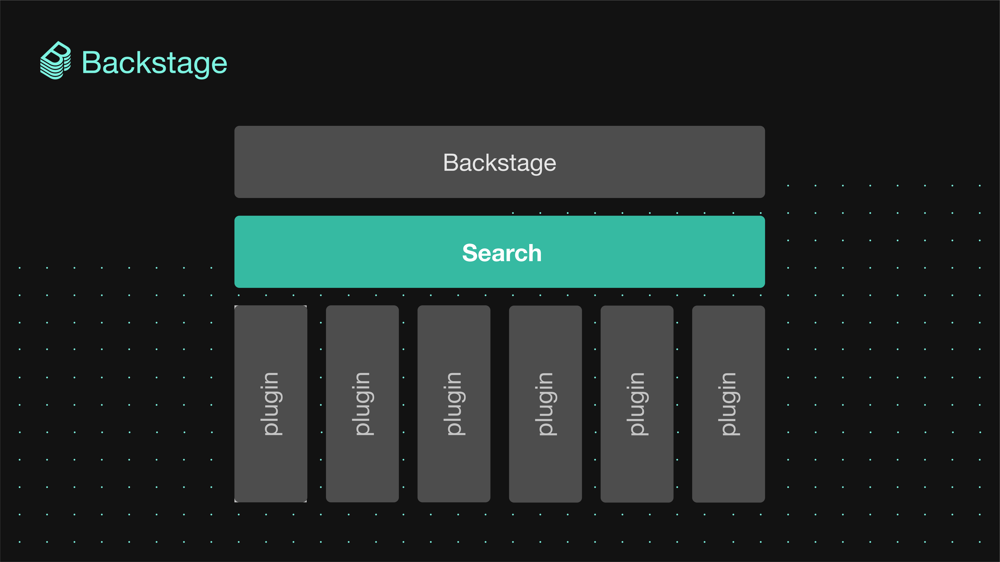
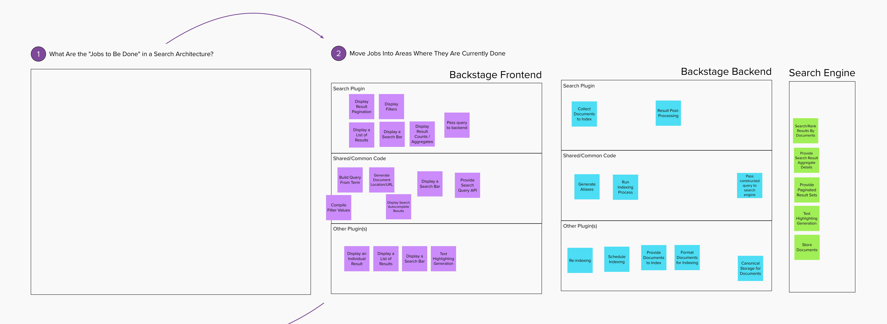
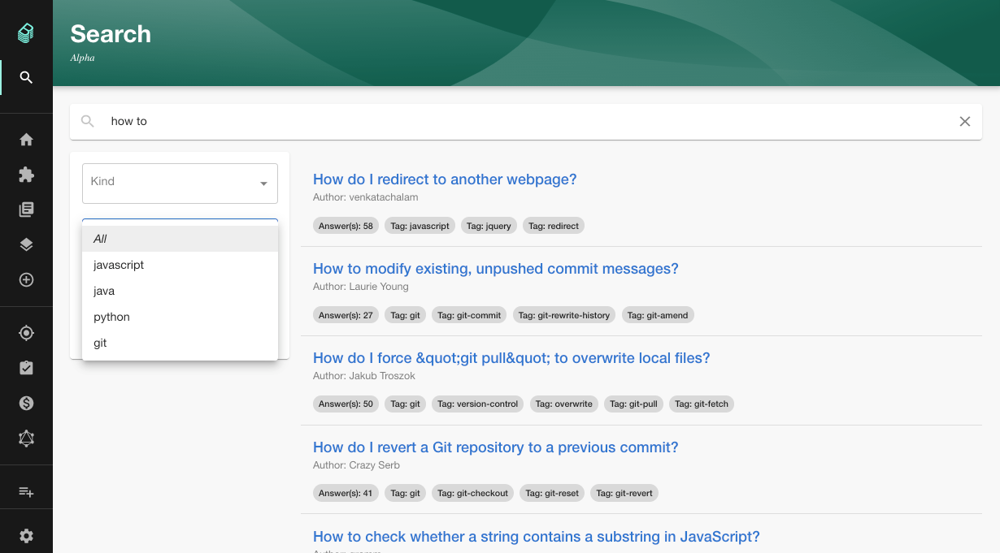

**TLDR;** The new Backstage Search is now available in alpha, ready for you to start building on. A total rethinking of the core search feature in Backstage, it’s more than just a box you type into — it’s a mini platform all by itself. With its composable frontend and extensible backend, you can design and build the search tool that suits your organization’s needs.

So, you don’t just get an improved out-of-the-box experience for searching whatever is in your software catalog. You can also add support for searching other sources, too. Customize it the way you want and you can search your catalog, your plugins and docs — and even external sources, like Stack Overflow and Confluence — all at once, all right inside Backstage.

With one query, your teams can find exactly what they’re looking for: anything and everything.

<!--truncate-->

## Search and explore

Being able to easily explore your ecosystem — to discover software, tools, documentation, and other valuable knowledge — is one of [the three main jobs of Backstage](https://backstage.io/blog/2021/05/20/adopting-backstage#three-jobs-create-manage-explore). Teams should be able to find what other teams have already built, so they can reuse and contribute to components instead of unknowingly duplicating them. Data endpoints should be shared, not siloed away. Services and their APIs should be easily discoverable. Best practices and technical documentation should be easily found.

Along with the [Backstage Service Catalog](https://backstage.io/blog/2020/06/22/backstage-service-catalog-alpha), Backstage Search is essential to enabling this discoverability — allowing new hires and old hands alike to explore your infrastructure instead of getting lost inside it.

We also quickly realized that search looks different from organization to organization. Therefore, we built a search platform that lets you plug in your own search engine, index any information you like, or build a customized search page experience that fits your users’ needs.

Since finding what you are looking for in Backstage is critical for success, we started by identifying the needs and goals of search.

## Rethinking search, inside and out

Spotify’s internal version of Backstage has had some of the features of Backstage Search for a while, and open sourcing them has been top of mind since day one. But we didn’t want to just port our internal version to the open source version. We wanted to take the opportunity to apply what we’ve learned inside Spotify over the last year, address the needs we’ve observed in the community, and ultimately open source not just a search feature but a search platform. We started the process by looking at the [jobs to be done](https://hbr.org/2016/09/know-your-customers-jobs-to-be-done).

_A high-level overview of the process, identifying all the jobs of search._

First, we looked at which jobs to be done belonged to the search plugin itself (e.g., “collect documents to index”) and which belonged to the other plugins (e.g., “format documents for indexing”), and then whether those jobs belonged to the frontend (“display results”) or the backend (“schedule indexing”).

Looking at all these various jobs, we defined four goals for the platform:

- **Flexibility:** Be search engine–agnostic
- **Simplicity:** Make it easy for content owners to make their content searchable/discoverable
- **Control:** Allow plugin developers to customize their search results components
- **Reusability:** Offer reusable components/APIs that other devs can leverage

Beginning our journey this way — by identifying the jobs to be done first, then defining the product goals from there — we could make sure that the search platform addressed real needs and improved the search experience for both users and plugin developers.

This approach not only created a better search tool for the open source community, but for Spotify, as well. So, instead of just open sourcing our internal version of search, we ended up with an even better solution — one that we can all use and build on together, both inside and outside Spotify.

## Say hello to the Backstage Search platform

We are now happy and proud to announce our alpha version of the [Backstage Search Platform](https://backstage.io/docs/features/search/architecture), featuring:

- Bring your own search engine (Flexibility)
- Collators for easily indexing content from plugins and other sources (Simplicity)
- Composable search page experiences (Control, Reusability)
- Customize the look and feel of each search result (Control, Reusability)

### Bring your own search engine

By introducing a Search Integration Layer, we have been able to keep the query translation of the search term and filters close to the search engine itself. This makes our search backend less focused on how a set of terms and filters should be translated to fit a certain search engine interface and more focused on querying and retrieving results as well as collecting results to index.

With the Search Integration Layer, your organization can bring your search engine of choice to Backstage — instead of relying on Backstage to support a specific search engine that might not fit the needs of your organization, either today or in the future.

But that doesn’t mean “batteries not included”. The current version of Backstage Search ships with Lunr support built-in — and support for ElasticSearch is not very far off. And we hope the number of supported search engines will continue to grow with the community’s help.

### Collators for easily indexing content from plugins and other sources

Since Backstage’s functionality comes from its plugins, we wanted the process of making plugin content searchable to be as frictionless as possible. Therefore we decided on a concept we call collators. Collators are responsible for collecting documents to index from a plugin. Your collators live inside your own plugin, but are registered in the Backstage app’s search backend.

Collators can also be used to index external sources, like Stack Overflow and Confluence. You can watch a demo of how easy it is to extend search with collators [here](https://youtu.be/Z78FFaObTfk?t=339).

### Composable search page experiences

Every engineering org has different needs — that is something we have definitely learned over the last year. Your software catalog might be set up differently than ours and therefore your needs for how search results look and how the search filters work will also differ.

That's why we have put effort into making your search page experience composable to your organization's needs. What do we mean by that? When you adopt Backstage and set up your app, you can set up — or, compose — your search page by using existing components or by creating your own custom ones.

### Customize the look and feel of each search result

A good example of the level of customization the platform allows is how list items are displayed in search results. A search result component can be a list, this list can consist of different list items (search results returned from the search engine) — but these list items could look different depending on what the search result returns in terms of its fields.

Let’s say that for an entity returned from the software catalog maybe the most important information to show is the name, while a result returned from the TechDocs plugin should maybe show the text content as the most important information. This can be customized by creating <CustomResultListItem /> components (like TechDocsResultListItem or CatalogResultListItem or whatever list item component you want) and configuring them in the app.

If there is no need to customize your search result list items, the <DefaultResultListItem /> component is there for you to reuse.

## Getting started with Backstage Search

We put together [a getting started guide](https://backstage.io/docs/features/search/getting-started) that provides two different ways to set up Backstage Search:

- Create a new app and get the most out of the search setup right out of the box, or
- Add the new Backstage Search setup to your existing Backstage app.

Whichever situation you’re in, we have you covered.

## What’s next?

We’ve built the foundation for the Backstage Search platform, and we can't wait to see the exciting engines, collators, and components the community builds on the platform.

You can check out our [project roadmap](https://backstage.io/docs/features/search/search-overview#project-roadmap) in our search documentation or track the progress of our [Beta milestone](https://github.com/backstage/backstage/milestone/27) and [GA milestone](https://github.com/backstage/backstage/milestone/28).

For any questions, feedback or ideas about the Backstage Search platform, join us in the #search channel on [Discord](https://discord.gg/MUpMjP2)!
