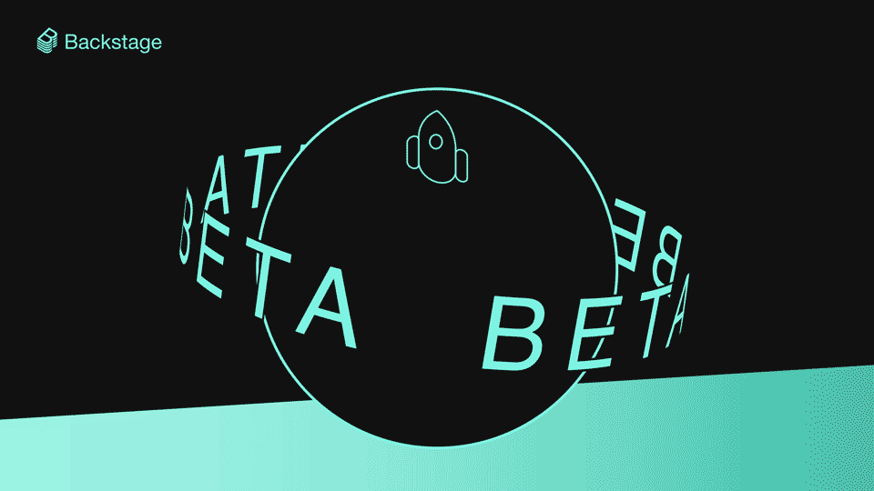
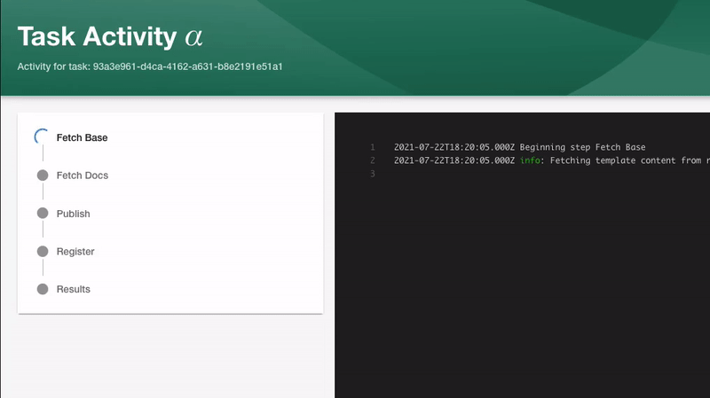
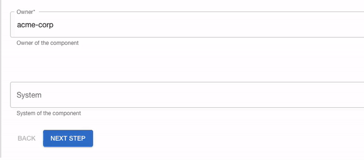

**TLDR**; At a high level, Backstage performs three main jobs: [Create, Manage, and Explore](https://backstage.io/blog/2021/05/20/adopting-backstage#three-jobs-create-manage-explore). Throughout the year, we’ve been focussed on improving the stability and scalability of these areas while enhancing the feature sets based upon requests from the community. Software Templates — which enable push-button deployments with all your standards and best practices built-in — is our first feature-complete release candidate to graduate to beta. Read on to learn how this release improves template customization and flexibility, as well as performance.

<!--truncate-->

Let’s rewind a little bit, around a year in fact. Backstage had been open sourced, and we released our first version of Software Templates and our Scaffolder plugin.

In case you missed it, [Software Templates](https://backstage.io/blog/2020/08/05/announcing-backstage-software-templates) are part of the Create feature set, where you can set up Backstage to give your engineers the ability to spin up a new microservice, website, or any other software component with your organization’s best practices built-in, right from the start.

Back when we released the first version of these templates, with the `apiVersion` `backstage.io/v1alpha1`, they were a little restrictive in what they could do. The generated repository could only have one template source and it was restricted to only being [cookiecutter](https://github.com/cookiecutter/cookiecutter) templates. And it had to fit into the three stages of templating which was `Prepare`, `Template`, and `Publish`.

We [opened up for feedback](https://github.com/backstage/backstage/issues/2771) from the community knowing that this wasn’t going to be the final version, but something of a stepping stone to where we want to be in the future.

And now we come to today…

## Anddddd… Action(s)! 🎬

Following the removal of the previously deprecated `backstage.io/v1alpha1` templates, today we’re officially announcing the beta version of Software Templates, or `backstage.io/v1beta2`.

With it comes an entirely new architecture to the Software Templates functionality, and a load of new exciting features, which I’ll dig into a little deeper.

### Template actions

We’ve totally opened up the ability to compose your own workflows for each Template that you have registered in Software Templates. This means no restrictions on where your template skeleton is kept, and no restrictions on what your workflow should look like.

Template Actions are customizable JavaScript functions that allow you to extend the capabilities of the Software Templates by adding your own business logic or reusing some of our Built-In actions.

_An example of the new template syntax with steps and parameters_

The workflow for Software Templates are now step-based, and each Software Template can have a customizable amount of steps which will in turn call these new actions.

_An example of a Template with customizable steps_

These actions are very heavily inspired by GitHub Actions and GitHub Workflows, and we’ve given back a lot of control to the template authors so they can build the boilerplate and push the code however they want.

### Custom UI extensions

A large part of the Software Templates feature is the form that we use to collect user input which is then passed on to these new actions. Sometimes, it makes sense that Template Authors want to provide their own React components which can be rendered in the frontend to maybe do some more complex things like calling internal APIs to provide autocomplete.

This is now possible with the new `ScaffolderFieldExtensions`.

_An example of `ScaffolderFieldExtension` is the `OwnerPicker` component which can automatically add options and suggest typeahead with data from an async API request_

Template Authors can create their own components to provide data to the custom actions in any way you see fit, and even override our own built in ones too like the `RepoUrlPicker`.

### Horizontal scalability

The Scaffolder Service and Software Templates are now horizontally scalable, coordinating work between your deployed backend machines. This means now that the number of instances of the `@backstage/plugin-scaffolder-backend` plugin you have, is the same amount of jobs that you can have in parallel. This ensures that your tasks are handled quickly and reliably, while providing great feedback in the process.

## Try out the new templates

We’re still on the journey to making the Software Templates a great user experience for both authors and developers — but we’re not done yet, so watch this space for new exciting features to come!

In the meantime, make sure to visit the documentation for [building templates](https://backstage.io/docs/features/software-templates/adding-templates) or creating your own [custom actions](https://backstage.io/docs/features/software-templates/writing-custom-actions).
