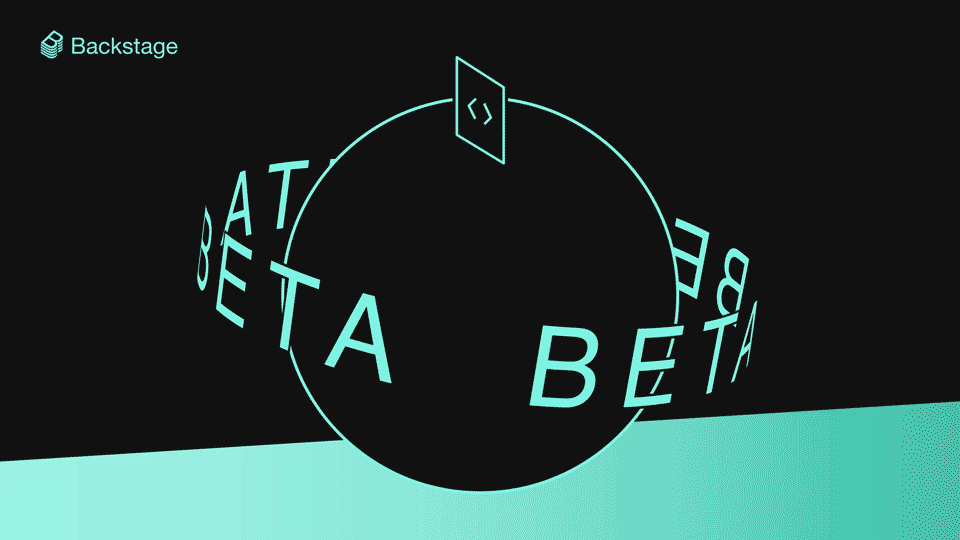
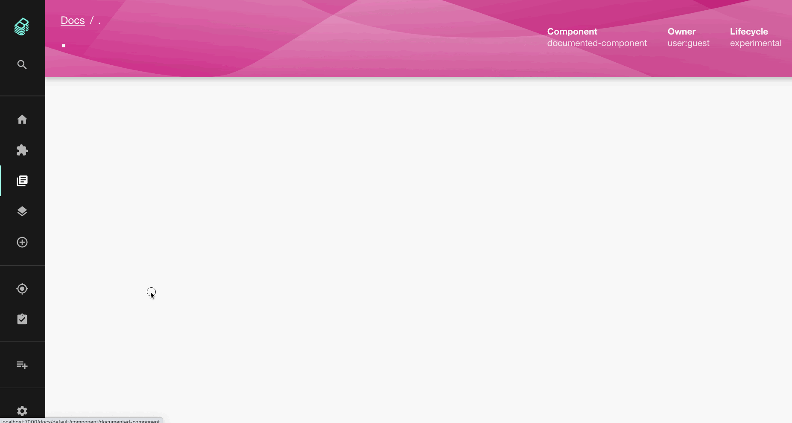

**TLDR:** Another beta has landed! We continue to focus on improving the stability and scalability of Backstage while enhancing its functionality. Thanks to focused efforts from the TechDocs core team and community, we're happy to say that TechDocs — [our docs-like-code solution](https://backstage.io/blog/2020/09/08/announcing-tech-docs) for all the software in your catalog — is now, after [Software Templates](https://backstage.io/blog/2021/07/26/software-templates-are-now-in-beta), the second core feature to graduate to beta.

<!--truncate-->

In addition to new features and improvements, we made numerous compatibility updates ahead of this feature release. You'll find support for a variety of CI systems, cloud storage solutions, and source control systems — so that TechDocs works for most orgs, right out of box. But there's much more to explore in this beta, thanks to contributions from the community.

When we set out to define what beta looked like, we combed through GitHub issues, Discord discussions, and other media to identify common pain points and challenges encountered by those around the world who consume and author TechDocs documentation in their organization's Backstage instance. Based on this research, we put together a user-focused milestone and got to work. For an issue-by-issue breakdown, check out the milestone [on GitHub](https://github.com/backstage/backstage/milestone/29?closed=1) — or, just read on to get the highlights.

## Real-time builds and feedback

TechDocs can be transformational once fully up and running (update your code and your docs with the same pull request!). But for first-time users and especially those unfamiliar with the MkDocs ecosystem upon which TechDocs is built, there are often many small, obtuse hurdles that can get in the way of success. Leading up to the beta release, we worked to surface and improve relevant errors and other details during the documentation generation process. Better still, all of this detail is now provided to users _in real-time_, as docs are generated and refreshed.

<!-- vale off -->

🙌 Shout out to <a href="https://github.com/dhenneke">Dominik Henneke</a> for implementing the interactive experience.

<!-- vale on -->

## Custom homepages: Make TechDocs yours

We strive to make it so that you can mold Backstage into the shape that best fits your organization. With this beta release, just as you can with the Catalog entities and [Search](https://backstage.io/blog/2021/06/24/announcing-backstage-search-platform#composable-search-page-experiences), you can now customize and compose your own TechDocs homepage. Use it to level up the front page of your Backstage documentation by highlighting golden documentation at your company, or use the new and improved (and Catalog-inspired) experience. Read more about [how to customize the TechDocs homepage](https://backstage.io/docs/features/techdocs/how-to-guides#how-to-customize-the-techdocs-home-page).

<!-- vale off -->

🙏 Thanks to <a href="https://github.com/kuangp">Phil Kuang</a> for the improved default TechDocs home experience.

<!-- vale on -->

## Simpler YAML annotations: What's in a ref?

We often forget that in order to enable TechDocs on a Catalog entity, documentation authors have to sprinkle a little ref annotation voodoo into their catalog-info.yaml file. The form of this magic — the `backstage.io/techdocs-ref` annotation — has evolved over TechDocs' life. But unless you're a real Backstage aficionado, the specifics of what the value meant and how to construct it could be somewhat of a mystery.

In the beta, we've simplified this annotation dramatically for documentation authors, aligning its value with TechDocs' docs-like-code philosophy itself. In the vast majority of cases, its value will simply be `dir:.` — which means this catalog entity contains documentation and the mkdocs.yml file describing this documentation lives in the current directory. We continue to support edge cases for [other techdocs-ref annotation values](https://backstage.io/docs/features/techdocs/how-to-guides#how-to-understand-techdocs-ref-annotation-values), as well.

<!-- vale off -->

👏 Another round of applause for Dominik for driving this improvement through.

<!-- vale on -->

## Everything neat and tidy

If you've ever twitched a little looking at the address bar as you navigated through your TechDocs, because the "C" in "Component" was capitalized, or cringed whilst perusing through your TechDocs storage bucket, only to see assets you definitely remember deleting from a documentation site cluttering up the place…twitch and cringe no more!

TechDocs base paths are now case-insensitive, stale files are automatically cleaned up by the TechDocs publishing process — and even though [I say _.yaml_ and you say _.yml_](https://open.spotify.com/track/6NDaYWg85ZnJ3Ae0WkILWh) — TechDocs will now happily accept either file extension for your MkDocs YAML file.

## What should I do to upgrade?

If you've been waiting for the beta to give TechDocs a shot, good news! You'll get all of the above, plus all of TechDocs' existing features, right out of the box. Newly created Backstage apps come ready-to-go. You'll know you're on beta if you're using the following versions:

- TechDocs Plugin version >= 0.11.0
- TechDocs Backend Plugin version >= 0.10.0
- TechDocs CLI version >= 0.7.0

If you're upgrading from a prior, alpha version of TechDocs, be aware that there are some breaking changes that you will need to account for. Most importantly:

- Be sure your app's instance of TechDocs is wired up to use the composability API. [See full routing instructions here](https://github.com/backstage/backstage/blob/master/packages/create-app/CHANGELOG.md#0338).
- If you've configured TechDocs to publish generated content to a remote storage solution provider like AWS S3, Google Cloud Storage, or Azure Blob Storage, you will need to use the TechDocs CLI to migrate the contents of your storage bucket. [See full migration instructions here](https://backstage.io/docs/features/techdocs/how-to-guides#how-to-migrate-from-techdocs-alpha-to-beta).
- In order to take advantage of the stale file deletion functionality, you may need to add some permissions to the account or role used by your TechDocs backend to publish contents to your storage provider. [See "Using Cloud Storage docs"](https://backstage.io/docs/features/techdocs/using-cloud-storage) for updated permissions recommendations.

Thanks again to the whole community for hitting this milestone with us! Catch us in [Discord](https://discord.gg/MUpMjP2) or an [upcoming community session](https://github.com/backstage/community) if you have any questions.
