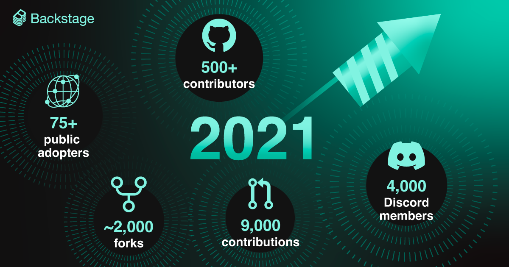
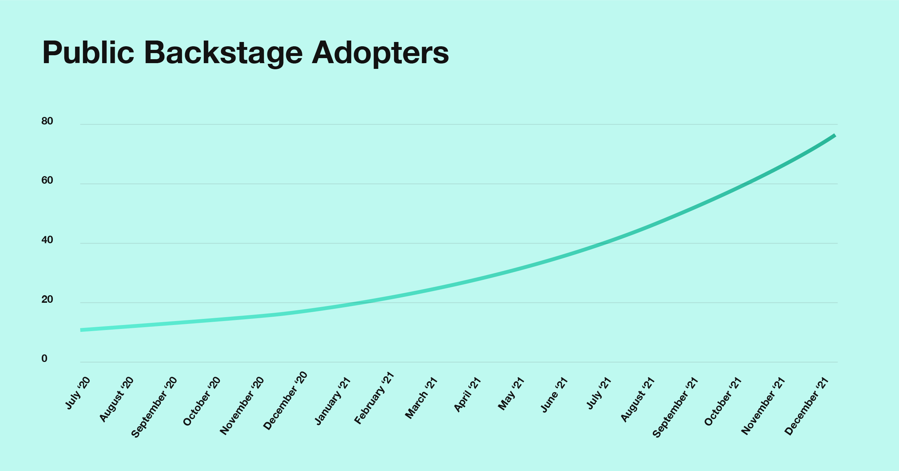
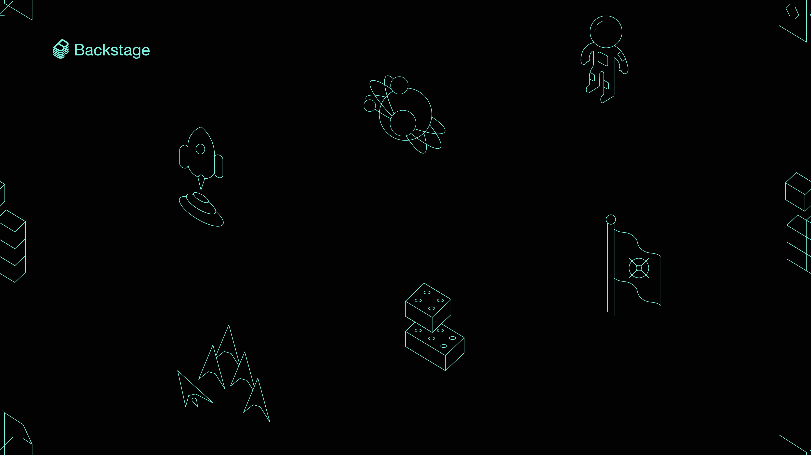

What a year 2021 has been for the Backstage project and community. As the year comes to a close, we can look back at some of the happenings, the successes, and welcome all the newcomers to our growing community.

In a year that has had its fair share of ups and downs, this community has been something that has brought me so much in the support you provide each other, your eagerness, passion, and willingness to share. Thank you to all of you for creating such a great community, and welcome to everyone joining us. I can’t wait to meet you all and see what great things we can create together in the new year.

In 2021 we’ve seen the project and community grow in every dimension, reaching over 75 public adopters, over 500 contributors from around the world all bringing new ideas and perspectives. We’ve had so many of you sharing and demoing your hard work in our monthly community sessions, added new plugins, built new features and really started to see Backstage have an impact for engineering teams across so many of our users.

Now let’s hear from the maintainers and look at the stats!

<!--truncate-->

## The community grew…and grew

This year, Netflix, [Expedia][metrics], Wayfair, Peloton, [Box][10], [DAZN][dazn], TELUS, and Unity all officially joined the community — along with more than 50 other public [adopters][md]. Contributors grew by leaps and bounds, too.

Patrik Oldsberg ([@Rugvip][rugvip]):

> It’s been awesome to see the engagement by the community grow even more in 2021, especially the way people within the community support each other. Thanks to our growing number of stable, experienced, and knowledgeable contributors it’s now possible to get help in places like Discord anytime, day or night.

### More adopters, more contributors

In January, Backstage had 17 public adopters. By September, [we had 50][50]. And the curve only got steeper from there.

- **75+ public adopters**
- **500+ contributors**
- **4,000+ Discord members**
- **9,000+ PRs & issues**

### A very busy repo

Along with the growth in contributors, PRs, and issues, our active, thriving community has crossed (or is just about to cross) other big milestones on GitHub, too.

- **Nearly 2,000 forks**
- **20,000+ commits**
- **14,000+ GitHub stars**

### Where in the world is the Backstage community?

Watch the visualization below to see where in the world all those contributions came from this past year.

<iframe width="780" height="440" src="https://www.youtube.com/embed/O1xtDv_XDt4" frameBorder="0" allow="accelerometer; autoplay; encrypted-media; gyroscope; picture-in-picture" allowFullScreen></iframe>

### What does 9,000 contributions look like?

<iframe width="780" height="440" src="https://www.youtube.com/embed/bCqhoK7it2g" frameBorder="0" allow="accelerometer; autoplay; encrypted-media; gyroscope; picture-in-picture" allowFullScreen></iframe>

Can you spot your name in the video above?

Picking up from the end of 2020, the video shows every single contribution to the Backstage source code over this past year. The visualization was built using [Gource.io][gource]:

> Software projects are displayed by Gource as an animated tree with the root directory of the project at its centre. Directories appear as branches with files as leaves. Developers can be seen working on the tree at the times they contributed to the project.

And if your name isn’t in there, it’s never too late to get started [contributing][contributing] — so that you too can become a bright, sparkling, laser-beam-shooting spider-node thing in 2022!

## Other 2021 milestones

As the community grew, so did the product — with the addition of new features as well as important performance and stability improvements to the core.

Ben Lambert ([@benjdlambert][blam]):

> We’ve had a lot of priorities this year. Our first priority was rebuilding the catalog to make it more efficient. Then, toward the later part of the year, we’ve been stabilizing the core with deprecations and API changes ahead of our 1.0 release of the Core Framework next year.
>
> It’s been a super productive year for us all as Core Maintainers, and the product has come on leaps and bounds with the help of everyone involved in the project!

### New features

These new features were built with the community, and made with customization and extensibility in mind.

- **Kubernetes Service Monitoring ([RFC][k8s])**
- **Search Platform ([Alpha][search])**
- **Composable Homepage ([README][home])**
- **Authorization Framework ([RFC][auth])**

### Major stability updates

As we get the ball rolling for [CNCF Incubation][cncf], we’ve been busy updating, refining, documenting, deprecating, and stabilizing the core.

- **Software Templates ([Beta][scaffolder])**
- **TechDocs ([Beta][techdocs])**
- **API Reference ([docs][api])**

### 50+ open source plugins

We reached [50+ plugins][plugins] built by the community this year, including official plugins (**Snyk**, **FireHydrant**), highly requested plugins (**PagerDuty**, **Prometheus**), and plugins based on new ideas and functionality (**XCMetrics**, **[Tech Insights][techrfc]**) — all tailor-made for Backstage.

### In the spotlight

This year Backstage was center stage at both community-organized events and at major conferences.

- **New (and [expanded][09]) Community Sessions**
- **Backstage Users Unconference + [Open Mic][openmic]**
- **KubeCon + CloudNativeCon [Europe][europe] & [North America][na]**
- **GitHub Universe 2021 [Keynote][day2]**

Find more talks, podcasts, blog posts, and Backstage in the news [here][news].

## Goodbye, 2021. Hello, 2022!

Lastly, thanks to everyone in the global Backstage community who contributed to the open source project in 2021.

This was the first year Spotify hosted [Backstage Community Sessions][meetups], and it’s been a great source of inspiration, motivation, and joy getting to know all the people behind the contributions. We look forward to seeing all your faces again in 2022 — and hopefully many new ones as well.

Until then, [grab this Backstage Zoom background][zoom] to use at the next Community Session.

See you then! Happy holidays from everyone on the Backstage team at Spotify!

[metrics]: https://backstage.spotify.com/blog/measuring-backstage-proof-of-value-at-expedia/
[10]: https://backstage.spotify.com/blog/community-session/10-box-and-spotify-paid-plugins/
[dazn]: https://backstage.spotify.com/blog/adopter-spotlight/dazn/
[md]: https://github.com/backstage/backstage/blob/master/ADOPTERS.md
[rugvip]: https://github.com/Rugvip
[50]: https://backstage.io/blog/2021/09/30/50-public-adopters
[gource]: https://gource.io
[contributing]: https://github.com/backstage/backstage/blob/master/CONTRIBUTING.md
[blam]: https://github.com/benjdlambert
[k8s]: https://github.com/backstage/backstage/issues/2857
[search]: https://backstage.io/blog/2021/06/24/announcing-backstage-search-platform
[home]: https://github.com/backstage/backstage/blob/master/plugins/home/README.md
[auth]: https://backstage.spotify.com/blog/authorization-framework-rfc/
[scaffolder]: https://backstage.io/blog/2021/07/26/software-templates-are-now-in-beta
[techdocs]: https://backstage.io/blog/2021/09/16/the-techdocs-beta-has-landed
[api]: https://backstage.io/docs/reference/
[cncf]: https://github.com/cncf/toc/pull/717
[plugins]: https://backstage.io/plugins
[techrfc]: https://github.com/backstage/backstage/issues/7576
[09]: https://backstage.spotify.com/blog/community-session/09-prometheus-homepage-templates/
[openmic]: https://backstage-openmic.com
[europe]: https://www.youtube.com/watch?v=aIURaocR5D8
[na]: https://backstage.spotify.com/blog/kubecon-na-2021/
[day2]: https://www.youtube.com/watch?v=7yQJlYvpoYs&t=269s
[news]: https://github.com/backstage/community#newsletters
[meetups]: https://github.com/backstage/community#meetups
[zoom]: https://drive.google.com/file/d/14wOPXEBZ5Qmi29ms4Sqp1m56dM0AIHbB/view?usp=sharing
