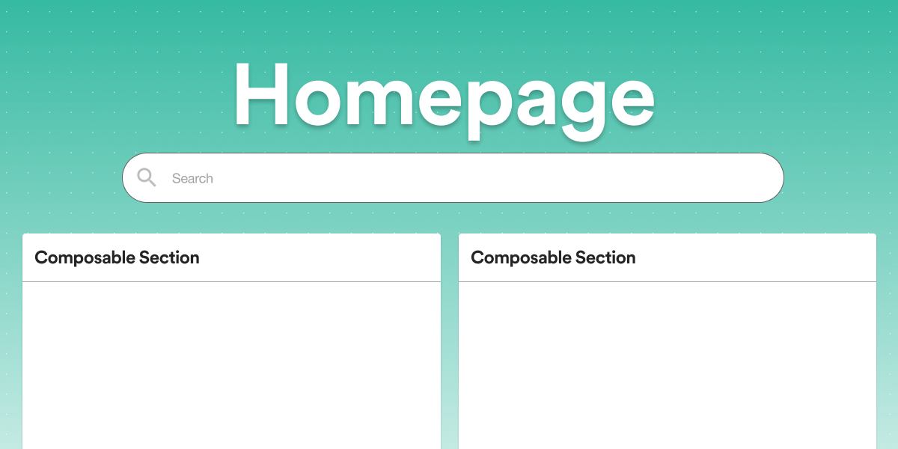
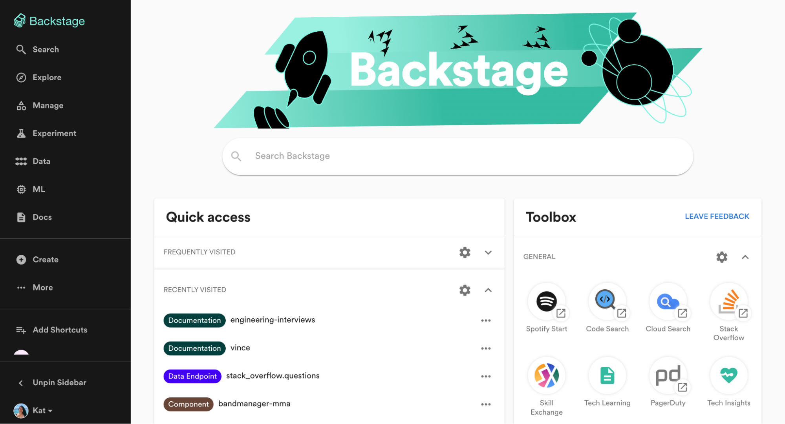
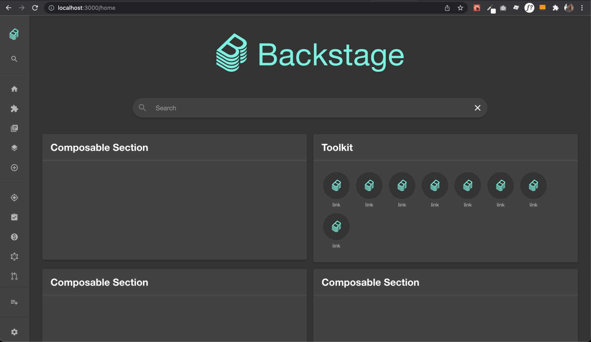
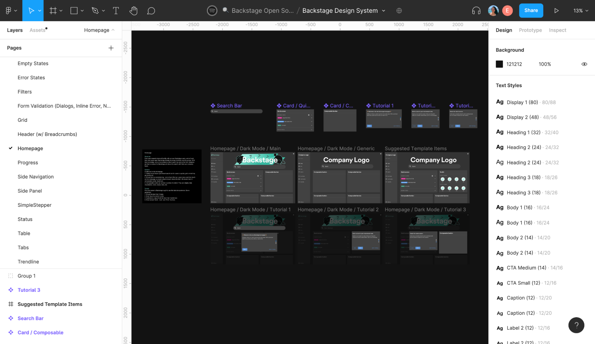

_This blog post is co-authored by Emma Indal ([@emmaindal](https://github.com/emmaindal)), Spotify._

_TLDR;_ We’re excited to announce the arrival of homepage templates for Backstage. It can be intimidating to build up your own instance of Backstage, so we decided to make your life a bit easier by giving you an out-of-the-box homepage to hit the ground running. This template can be found in our [Backstage Storybook](https://backstage.io/storybook/?path=/story/plugins-home-templates--default-template), as well as future templates that we build.

<!--truncate-->

## Why homepage templates?

At Spotify, the Backstage homepage is one of the most commonly used pages, primarily leveraged to quickly find and easily access things. Most of our users start off their Backstage experience on the homepage to quickly pivot to their intended destination. For example, folks generally prefer having a search bar available for quickly finding what they are looking for. Backstage users at Spotify also prefer having a central toolkit for navigating to tools that exist within the organization and for accessing their favorite entities and documentation pages.

But we also know that all organizations look different and have different needs. Backstage is designed with this in mind, and so is the homepage plugin. You can modify and customize your version of the Home plugin so it fits with your needs. Sometimes customizing and configuring your app can be overwhelming to get started, with the [homepage templates](https://backstage.io/storybook/?path=/story/plugins-home-templates--default-template) and components we can provide recommendations and guidelines to make adoption of Backstage more streamlined and simplified.

## What are homepage templates?

A homepage template is just a template of what a homepage can look like. You can either copy it as a whole, or pick different components from it to use. The homepage templates live in our [Backstage Storybook](https://backstage.io/storybook/?path=/story/plugins-home-templates--default-template) and we hope to see this collection grow with contributions from you all. If you don’t want to use one of the templates, you can pick and choose from our collection of [homepage components](https://backstage.io/storybook/?path=/story/plugins-home-components) that you can use right out of the box and compose your own homepage. We’ve included the [SearchBar](https://backstage.io/storybook/?path=/story/plugins-home-components-searchbar--custom-styles), [CompanyLogo](https://backstage.io/storybook/?path=/story/plugins-home-components-companylogo--custom-logo) and [Toolkit](https://backstage.io/storybook/?path=/story/plugins-home-components-toolkit--default) components in our Backstage Storybook as of today. In the future, we plan on open sourcing the widely popular QuickAccess card, which includes Favorites, Frequently Visited, and Recently Visited options.

_Composed homepage for the app using the default homepage template_

_Example of the default homepage template in Backstage Storybook_

## How to get started

To get started, you first need to set up your homepage plugin in the app if you have not already, then you can move on to composing your homepage. You can find our step-by-step documentation of how to do this under the [App Configuration - Customize the look-and-feel of your App documentation](https://backstage.io/docs/getting-started/homepage). You can also access the [Backstage UI Kit in Figma](https://www.figma.com/file/nUaAw56hTgC0RIOYkuLSrB/Backstage-Design-System?node-id=2185%3A2978) to duplicate your own version and play around with a fitting homepage for your own organization.

_Example of the homepage components in the Backstage UI Kit in Figma_

## What’s next?

Some future templates that we have in mind are more dashboard-esque ones that display a variety of relevant data for your organization. We will also open source more homepage components such as [Starred Entities](https://github.com/backstage/backstage/issues/6906) that you can use when you are composing your components.

## How to contribute

As mentioned above, we would love to build out these collections of both homepage components and homepage templates, so if you would like to contribute, please check out our [contribution documentation](https://github.com/backstage/backstage/blob/master/plugins/home/README.md#contributing) to get started.
