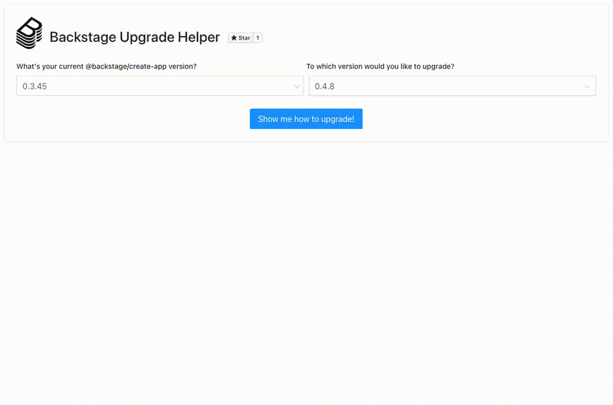

_TLDR;_ The Spotify team recently announced [Backstage Upgrade Helper](https://backstage.github.io/upgrade-helper): a tool that helps adopters keep their Backstage application up-to-date. **Spoiler alert**: this is also a hidden and heartwarming tale about the beauty of open source innovation.

<!--truncate-->

## Upgrading Backstage was a common pain point

Without a doubt, one of the most exciting things about Backstage is our community. Step into our daily [Discord conversations](https://discord.gg/sBEF5VkG) and the monthly [Community Sessions](https://www.youtube.com/watch?v=0QMQYSTKAx0) and you’ll find a ton of great ideas, problem-solving, and support for one another.

During one of these discussions, we realized we all shared the same pain point — upgrading a Backstage application.

The Backstage open source project is in hyper-growth mode, where dozens of pull requests are merged each day. This means adopters need to go through the upgrade process more often in order to get the latest and greatest features. The Spotify team heard a lot of feedback about how painful and manual this process was — so we decided to tackle this problem during one of our internal Hack Days.

At Spotify, we run Hack Days every month and a lot of ideas come from those sessions (in fact, the idea to open source Backstage itself [was born on a Hack Day](https://open.spotify.com/episode/332yTwGiILGKTS7dsHCj2P)!). During a brainstorming session, we noticed that another open source community faced a similar upgrading problem years back and came up with a really good solution.

If you have ever worked on a React Native project, you might immediately recognize what we are referring to: The [React Native Upgrade Helper](https://github.com/react-native-community/upgrade-helper) — a web tool to support React Native developers in upgrading their apps — might have saved hours of your time. It certainly saved us hours of ours. So we looked into the project details and discovered it could fulfill our Backstage needs.

We started by creating a fork from React Native’s open source project, applying a few changes on top of it to introduce Backstage support, and — _ecco_ — we had a new Backstage Upgrade Helper! In just a few days with pretty minimal effort, we created a product that would save a lot of time for the entire Backstage community. And we had fun at the same time (happy developers make happy code 😁 ).

## So what is Backstage Upgrade Helper?

The Backstage Upgrade Helper tool enables adopters to easily upgrade their Backstage app by using the power of git to create a diff between different versions.

Whenever a new version of Backstage is released, the Helper scaffolds a new sample Backstage app using the `backstage-create-app` cli utility and checks all the generated files in a specific git branch. After the branch is generated, it gets compared with all the existing ones, which results in generating specific git patches stored in specific files. By selecting the version of the current Backstage release together with the version you want to upgrade to, the UI knows which patch file needs to be picked up.

So, now you can update your Backstage application in three steps rather than manually reading the changelogs of all the Backstage modules in reverse order.

### To use the Upgrade Helper, follow these simple steps

1. Go to the [Backstage Upgrade Helper](https://backstage.github.io/upgrade-helper) and enter your current release and the release you would like to upgrade to.

2. Press **Show me how to upgrade!** After that, the feature spits out the changes between the two Backstage versions in a split-screen view for easy comparison.

   

3. Apply the suggested changes to your source code to correctly upgrade your app to the selected Backstage version. This will let you directly migrate from the version you’re currently using to the target version and skip all the intermediate steps you would have otherwise gone through manually reading all the changelogs.

[Watch the Upgrade Helper demo](https://youtu.be/nYjI2j-lWEM?t=410).

## Open source inspires

Thus far, the Backstage Upgrade Helper has gotten a lot of good feedback from the community and we’re sure to see awesome contributions in the future. But all the credit behind this idea goes to the React Native community.

With React Native’s open source contributions, we were able to quickly solve a tough problem for the entire Backstage community. Not only did React Native’s project save us time creating a new product, but it has also saved our adopters time upgrading Backstage.

This is why we love working in open source. The hard work done for one community has the power to influence and inspire another community. We hope Backstage can do the same and pay it forward to other open source projects.

For more Backstage Upgrade Helper resources, check out the [UI code](https://github.com/backstage/upgrade-helper) and the [git patches](https://github.com/backstage/upgrade-helper-diff).
