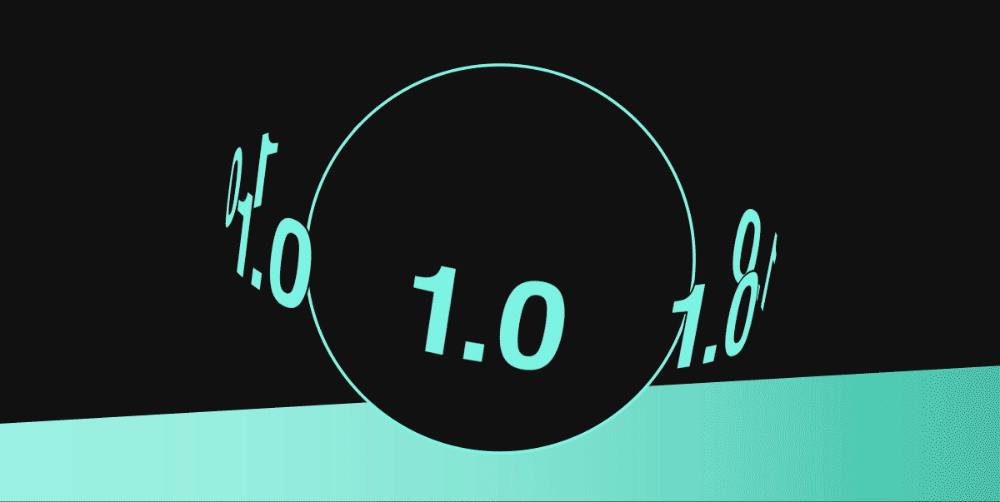

---
# prettier-ignore
title: "New release: Backstage 1.0"
author: Francesco Corti, Spotify
authorURL: https://github.com/fcorti/
authorImageURL: https://avatars.githubusercontent.com/u/6010860?v=4
---

_TL;DR:_ If you’ve been waiting for Backstage to come out of beta, we’re excited to announce that Backstage 1.0 is here!

<!--truncate-->

It’s been two years since Spotify [open sourced Backstage](https://backstage.io/blog/2020/03/16/announcing-backstage) so companies of all shapes and sizes — and in every industry all over the world — could build highly extensible and customized developer portals to best suit their organization’s needs and culture. Now hundreds of adopters are using Backstage as the single pane of glass for their core development, managing millions of components and technical documentation, and helping hundreds of thousands of developers be more productive and happy.

This milestone demonstrates Backstage’s maturity and the incredible effort from the core maintainers, contributors, and adopters. In a short time, we’ve seen a global community grow rapidly with people bringing their passion to this project and our goal of empowering developers. Because, yes, this is also your goal and your time to celebrate.

# So what is Backstage 1.0?

If you’re thinking “what is Backstage 1.0, and what does it include?” You’re not alone, so let’s get into it.

To start, let’s define Backstage: it’s an open platform for building developer portals, mainly defined by a set of libraries together with plugins that can be added, removed, or customized so that the final behavior of the developer portal product is what an adopter wants. For the past two years, the open source platform has been in beta. With Backstage 1.0, we're coming out of beta and into production with regular versioning and release cycle commitments. So, if your company requires production-ready software, you can now use Backstage and join [over 100 other public adopters](https://github.com/backstage/backstage/blob/master/ADOPTERS.md)!

Our definition of Backstage 1.0 includes:

- Backstage Core 1.0 libraries as the set of libraries to make the platform work
- [Backstage Software Catalog](https://backstage.io/docs/features/software-catalog/software-catalog-overview) 1.0
- [Backstage Software Templates](https://backstage.io/docs/features/software-templates/software-templates-index) 1.0
- [Backstage TechDocs](https://backstage.io/docs/features/techdocs/techdocs-overview) 1.0

Coming soon: [Backstage Search](https://backstage.io/docs/features/search/search-overview) 1.0 will be included in the near future as part of the regular releases to the Backstage platform.

In terms of features, the maintainers will not be shipping new stuff as part of the major release but instead:

- Refactoring the code packaging to better reflect the release numbering
- Removal of deprecated services to reduce the risk of introducing breaking changes
- Establishing clarity on the release lifecycle, numbering, and cadence as well as the support model
- Improvements to Backstage.io documentation

# The road ahead

In terms of maturity and stability, the road ahead for Backstage is bright and busy. The goal is to bring Backstage to the next level of maturity and continue improving it, according to adopter growth, feature set, and identified use cases.

You can read more about Backstage’s roadmap [here](https://backstage.io/docs/overview/roadmap), but in terms of maturity and stability we would like to highlight the following:

- CNCF incubation: The Backstage project [recently moved from Sandbox to Incubation](https://www.cncf.io/blog/2022/03/15/backstage-project-joins-the-cncf-incubator/) phase within the [CNCF maturity levels](https://www.cncf.io/projects/#:~:text=Maturity%20levels,should%20be%20adopting%20different%20projects.).
- Security auditing and strategy: With the CNCF’s support, the project maintainers are working on a security audit initiative to make the platform more secure and will share more details soon. The audit is part of an overall security strategy being developed this quarter.
- Paid plugins for advanced and enterprise use cases: Last year, [Spotify announced its work on paid plugins](https://backstage.spotify.com/blog/paid-plugins-announcement/) built on top of the Backstage open source platform. This is another example of the platform’s maturity and Spotify’s continued commitment to the project, with a focus on customers and use cases requiring enterprise-focused support and plugins developed and proven by Spotify.

# Some links to peruse

If you want to know more about this first major release, check out the following links to learn more about this release effort and receive support.

- [Release notes](https://backstage.io/docs/releases/v1.0.0) and [Changelog](https://github.com/backstage/backstage/releases/tag/v1.0.0).
- [Backstage official documentation](https://backstage.io/docs/) and [backstage.spotify.com](https://backstage.spotify.com/).
- [Discord channel](https://discord.gg/EUaBAS58).
- [Backstage repository on GitHub](https://github.com/backstage/backstage).
- [List of public adopters](https://github.com/backstage/backstage/blob/master/ADOPTERS.md).
