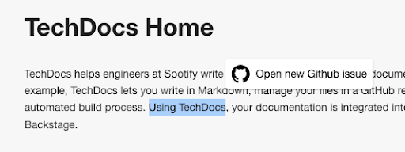
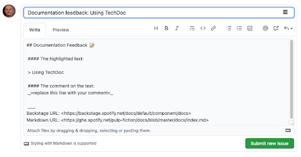
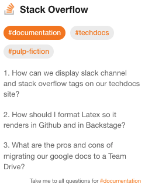

---
# prettier-ignore
title: "Introducing the TechDocs Addon Framework"
author: Gary Niemen, Spotify
authorURL: https://github.com/garyniemen/
authorImageURL: https://avatars.githubusercontent.com/u/65337273?v=4
---

_This blog post is co-authored by Eric Peterson ([@iamEAP](https://github.com/iamEAP)), Spotify._

_TL;DR:_ Introducing the TechDocs Addon Framework — a way for us all to contribute and share additional features, TechDocs Addons, on top of the base docs-like-code experience.

<!--truncate-->

[TechDocs](https://backstage.io/docs/features/techdocs/techdocs-overview) is a centralized platform for publishing, viewing, and discovering technical documentation across an entire organization. It's a solid foundation! But TechDocs doesn't solve higher order documentation needs on its own such as: How do you create and reinforce a culture of documentation? How do you build trust in the quality of technical documentation?

To address this need, we’re proud to introduce the [TechDocs Addon Framework](https://github.com/backstage/backstage/issues/9636) — a way for us all to contribute and share additional features, TechDocs Addons, on top of the base docs-like-code experience. Using TechDocs Addons, you can customize the TechDocs experience to address some of these higher order needs.

# Open source Addons from Spotify

We plan to open source many of the TechDocs Addons that we use at Spotify. The first Addon we open sourced is ReportIssue, which you can start using today. ReportIssue enables you to highlight text on a page and quickly raise a templated issue for that text, in your version control system (currently supports GitHub and GitLab). The following images depict this Addon in practice.

Other Addons coming soon include a Stack Overflow card to surface relevant questions and answers and an Issue Counter.

We encourage you to use Addons that we open source and contribute Addons of your own as you solve technical documentation problems arising in your company. We can’t wait to see what you come up with!

Here are some resources to help you get started with new TechDocs Addons:

- [Installing and using Addons](https://backstage.io/docs/features/techdocs/addons#installing-and-using-addons): add an existing TechDocs Addon to your Backstage App
- [Creating an Addon](https://backstage.io/docs/features/techdocs/addons#creating-an-addon): contribute a new Addon for others to use
- [TechDocs Addon page](https://backstage.io/docs/features/techdocs/addons): read everything you need to know about TechDocs Addons

# Next steps

At present, the TechDocs Addon Framework is focused on frontend experiences only. We know what’s available now is a solid foundation, but based on our experience developing and maintaining Addons over several years, we know there’s more to be done.

One such pattern is the occasional need for Addons to retrieve or compute data that is not easily accessible. Examples of these at Spotify are Last Updated and Top Contributors. Seemingly simple, these Addons require the ability to run non-trivial git commands to determine when documentation itself was last updated, and by whom.

This next step is a bit more tricky and we would like to work with you all to make it happen. Take a look at [this issue](https://github.com/backstage/backstage/issues/11110) in the GitHub repo, let us know what you think, and feel free to get involved.
