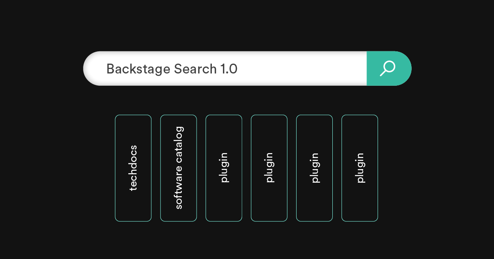

---
# prettier-ignore
title: Releasing Backstage Search 1.0 
author: Emma Indal, Spotify
authorURL: https://www.linkedin.com/in/emma-indal
---

**TL;DR** If you’ve been waiting for Backstage Search to come out of beta, we’re excited to announce that [Backstage Search 1.0](https://backstage.io/docs/features/search/search-overview#backstage-search-10) is here!

We first released the Backstage Search Platform over a year ago. Backstage Search Platform is a search experience built for you, by you.

Backstage Search Platform makes it possible for you to search across your entire software ecosystem. With a Search platform that is customizable and extendable, you can identify your needs within your organization and set up search to solve these problems. Whether it is to search through the Software Catalog or technical documentation generated by the TechDocs plugin.

<!--truncate-->

## So what is Backstage Search 1.0?

Since the first release of the Backstage Search Platform, we have seen a fantastic community grow around the search plugins. To mention just a few of these contributions:

- More search engine modules: [Elasticsearch](https://www.npmjs.com/package/@backstage/plugin-search-backend-module-elasticsearch) originally [contributed](https://github.com/backstage/backstage/pull/6569) by Roadie and [Postgres](https://www.npmjs.com/package/@backstage/plugin-search-backend-module-pg) originally [contributed](https://github.com/backstage/backstage/pull/6682) by SDA SE
- More components: Quick search modal, originally [contributed](https://github.com/backstage/backstage/pull/7316) by Expedia Group
- More plugin integrations: TechDocs also [contributed](https://github.com/backstage/backstage/pull/6375) by Roadie and [Software Catalog](https://github.com/backstage/backstage/pull/4515)

These are just a few contributions of the countless enhancements and improvements made by contributors across the globe. With a well adopted and tested search platform we feel confident to release Backstage Search as 1.0.

Packages included in Backstage Search 1.0 release are:

**Core search packages**

- [@backstage/plugin-search](https://www.npmjs.com/package/@backstage/plugin-search)
- [@backstage/plugin-search-react](https://www.npmjs.com/package/@backstage/plugin-search-react)
- [@backstage/plugin-search-common](https://www.npmjs.com/package/@backstage/plugin-search-common)
- [@backstage/plugin-search-backend](https://www.npmjs.com/package/@backstage/plugin-search-backend)
- [@backstage/plugin-search-backend-node](https://www.npmjs.com/package/@backstage/plugin-search-backend-node)

**Modules**

- [@backstage/plugin-search-backend-module-elasticsearch](https://www.npmjs.com/package/@backstage/plugin-search-backend-module-elasticsearch)

No additional features are released as part of the major release as the maintainers of the search packages focused on the following for this release:

- Bug fixes and clean up of deprecations.
- Improved error handling for missing indices.
- Separation of AWS Elastic and Open Elastic support.
- Refactor the packages by moving reusable components from `@backstage/plugin-search` to `@backstage/plugin-search-react`.
- Improved documentation including tutorials for how to [Integrate Search into a plugin](https://backstage.io/docs/plugins/integrating-search-into-plugins).

You might have noticed that the [@backstage/plugin-search-backend-module-pg](https://www.npmjs.com/package/@backstage/plugin-search-backend-module-pg) package is not part of 1.0. That’s because that package is a community supported module, and therefore we have not included it as part of 1.0. If you are interested in pushing the Postgres engine to 1.0, feel free to reach out to us in the [#search](https://discord.com/channels/687207715902193673/770283289327566848) channel on Discord.

## Elasticsearch as the recommended engine for production usage

When the Backstage Search Platform was first released, it came with an in-memory search engine as default - Lunr. While this is a good engine to use on a smaller scale and for local development (to avoid having to set up a search engine instance separately), it also has its limitations such as:

- Lunr does not scale well. Horizontally scaled deployments of Backstage and/or Backstage Search backend using Lunr result in either duplicated indexing processes and indices or inconsistent index state across nodes.
- Lunr’s filter functionality is limited, especially for [logical AND/OR operators](https://github.com/olivernn/lunr.js/issues/353).
- Lunr has a smaller community than Elasticsearch, which could mean that adopters relying on it will have less by way of resources for iterating on and improving search.

Therefore, we recommend using Elasticsearch for production usage. Moving forward, the search maintainers will prioritize the Elasticsearch engine while we’ll rely on the community to maintain the Postgres engine.

## How to contribute

If you want to contribute and to further improve search, you can check out the [open issues labeled with search](https://github.com/backstage/backstage/issues?q=is%3Aissue+search+label%3Asearch+is%3Aopen) or reach out to us at the [#search](https://discord.com/channels/687207715902193673/770283289327566848) Discord channel.

## How to get started

If you haven’t adopted the Backstage Search Platform yet and feel like now is a good time. Head over to the [getting started docs](https://backstage.io/docs/features/search/getting-started).
