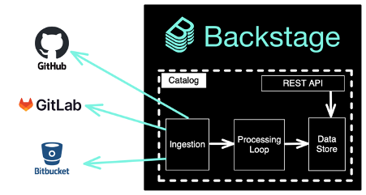
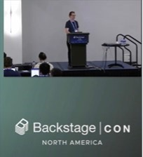

At the heart of [Backstage](https://backstage.io/) is the [Backstage Software Catalog](https://backstage.io/docs/features/software-catalog/), which is a data store that allows an organization to centralize and visualize its many software services and components. Backstage inspects and transforms an organization's disparate software services and parts into a centralized data store. This blog post introduces the concept of incremental entity providers, which allow Backstage to scale ingestion to even larger datasets.

{/* truncate */}

A common use case is for an organization to want to surface ownership and metadata about repositories. Backstage provides a mechanism for discovering and transforming repository information into a standard data structure and persisting it into the Backstage [Catalog](https://backstage.io/docs/features/software-catalog/). This process is known as ingestion, where all data is transformed into a standard Backstage data structure known as an entity. Entities in the Catalog’s data store are accessible to the Backstage App via the REST API.

Data is transformed into entities via what is known as the ingestion and processing loop, which can be thought of as an [extract, transform and load (ETL) pipeline](https://en.wikipedia.org/wiki/Extract,_transform,_load), where raw data such as GitHub repositories are loaded from GitHub, transformed into entities and outputted to the Catalog.

## Entity Providers

Backstage offers what are known as [entity providers](https://backstage.io/docs/features/software-catalog/life-of-an-entity) as a means for ingesting the raw data into the pipeline and transforming them into Backstage entities. For example, Backstage comes with a [GitHub Entity Provider](https://backstage.io/api/stable/modules/_backstage_plugin-catalog-backend-module-github.html) that finds all catalog-info.yaml files in GitHub repositories. The processing loop transforms them into Backstage entities and subsequently persists them to the software catalog.

Entity providers are a relatively new abstraction and the recommended way to ingest data into the catalog. The Backstage catalog engine starts each registered entity provider, which connects to its data source (e.g., the GitHub Entity Provider connects to GitHub). The entity provider will query the external data source and convert the data into the entity format. Finally, the entity provider issues what is known as a mutation to the catalog engine. A mutation is a signal from the entity provider to the catalog engine that entities are available to be processed and stored.

A mutation can be either a full mutation or a delta mutation. A full mutation replaces all entities previously ingested by the entity provider with a new set of entities. The entity provider will remove all entities not found in the latest ingestion. A full mutation can be used to ingest relatively small datasets (less than 10,000 entities); however, ingesting more during a full ingestion may cause out-of-memory errors and delay the processing of entities from other entity providers. A delta mutation can surgically add and remove entities from the catalog. A delta mutation is useful when the data source provides events-based APIs like webhooks, which allows the Backstage catalog engine to ingest a small number of entities as they get added, updated and/or deleted.

## Incremental entity providers

A large organization typically deals with massive datasets. Until recently, ingesting large datasets with entity providers has been problematic because performing a full ingestion resulted in out-of-memory errors, and many data sources don’t provide webhooks or other events-based APIs. At the same time, the datasets were too large to efficiently manage through targeted delta mutations.

This is a problem that [DevEx team at HP](http://hp.com) faced when building their software catalog with Backstage. [Damon Kaswell](https://github.com/dekoding), Senior Application Developer on the DevEx team at HP, shared their experience at [BackstageCon 2022](https://www.youtube.com/watch?v=5qHyZntKXRU&list=PLj6h78yzYM2OKySsTuiip3BqmdYZQRnSf&index=13), detailing the problem and the solution that [Frontside](https://frontside.com/) created in collaboration with developers on HP’s DevEx team.

The solution HP and [Frontside](https://frontside.com/) arrived at was to implement an incremental entity provider. An incremental entity provider effectively performs a full mutation using a series of delta mutations combined with a mark and sweep mechanism. It paginates through the dataset, tracking entities retrieved from each page and the cursor of the next page, pausing ingestion every few seconds to give the processing loop time to process existing entities. Once it reaches the end of the dataset, it determines which entities were not ingested during this ingestion cycle and emits a delta mutation to delete unmarked entities.

Simply by adding a few new tables to the database schema, the incremental ingestion entity provider converts any existing entity provider into an incremental entity provider. These tables allow the incremental entity provider to be long-lived and keep track of its current location in the dataset by persisting a cursor that it uses to page through any large dataset. The larger the dataset, the more pages of data or bursts of work the incremental entity provider will ingest—but there will be no out-of-memory errors, effectively removing scalability problems.

The results speak for themselves. Migrating from regular entity providers to incremental entity providers reduced ingestion time by 92% – from over 4 and a half hours to just 20 minutes. Incremental entity providers eliminated the ingestion maintenance burden from being a constant problem to a non-issue. Writing reliable integration with external services can now be done in days instead of weeks.

## Go forth and ingest!

Backstage provides a robust framework for ingesting data from external sources, but HP needed to scale it beyond its design. The Backstage framework allowed [Frontside](https://frontside.com/) and HP’s developers to extend it with a plugin to support HP’s scaling requirements.

We're delighted to share that as of [this PR](https://github.com/backstage/backstage/pull/14356), the incremental ingestion backend is available for anyone to use with Backstage. The solution was released open source as [@backstage/plugin-catalog-backend-module-incremental-ingestion](https://github.com/backstage/backstage/tree/master/plugins/catalog-backend-module-incremental-ingestion#backstageplugin-catalog-backend-module-incremental-ingestion) and contains a package for creating incremental entity providers. The plugin's [repository README](https://github.com/backstage/backstage/tree/master/plugins/catalog-backend-module-incremental-ingestion) has detailed configuration and usage outlined.

The incremental ingestion entity provider is an excellent addition to the Backstage stack. Battle-tested on large datasets, the incremental entity provider is a significant step forward in smoothing the path to successful ingestion at scale.
