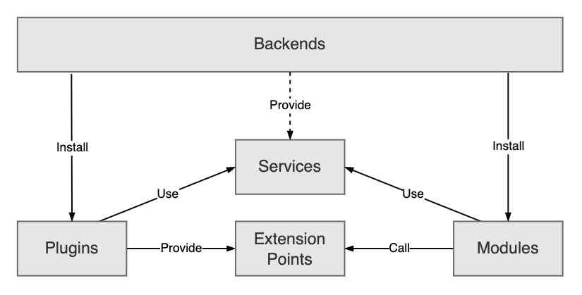

For the past year, the Backstage maintainer team has been spending time to give the [old Backstage backend system](https://backstage.io/docs/plugins/backend-plugin) a much needed revamp. Our goal was not to build something completely new from scratch, but rather to solidify the existing foundations that have grown organically. We wanted to make plugin installation a lot simpler, while maintaining and even improving the ways in which you can customize your backend setups.

We’re happy to announce that the [v1.11](https://backstage.io/docs/releases/v1.11.0) release includes the public alpha of the [new Backstage backend system](https://backstage.io/docs/backend-system/)! The system has already been available to use for some time, as some of you have already found, but this alpha release marks the point where we are finally ready to encourage widespread adoption by plugin builders. We still don’t recommend that you use this new system in your production setups just yet, more on that later.

<!--truncate-->

## History of the Backstage backend system

The backend system that we all use today has grown very organically based on all the needs that have been discovered along the journey of the Backstage Open Source project. We started out with a very flexible system that was essentially just a collection of recommended patterns for plugins, along with a couple of common interfaces and utilities. This was largely due to the fact that before it was open sourced, the Backstage backend services at Spotify were all built on top of internal frameworks and practices that we couldn’t bring with us. Back in 2020, we didn’t have a lot of knowledge about what a good backend system for Backstage would look like, so we started off with a highly flexible foundation that would evolve organically over time.

As Backstage grew across all dimensions of adopter count, community size, code size, and capability, we saw the need to take a step back and reevaluate how Backstage backend plugins are built. About one year ago, the maintainers sat down and started to sketch what a new backend system could look like.

## Designing the New System

When we set out on this project, we had a few primary goals. First, we intended to introduce as few new concepts as possible. Our existing system already had a lot of different patterns, and ideally we wanted to only give those patterns names and make them part of the framework. Second, we wanted to keep the backend system recognizable to those familiar with the frontend system. The list of goals goes on, we had a lot of reasons to build this new system, these are a few more important ones:

- Make it easier to create and maintain backend installations.
- Align how plugins provide points of customization and how those customizations are installed.
- Make it much easier to maintain plugins, in particular keeping the API stable.
- Simplify the process of splitting plugins out into separate deployments with shared environments.
- Improve the local development and testing experience.

Prioritizing simplicity is often a guiding principle that we use for designs that span multiple ownership roles. We decide on which parts of the system that we think are the most important to have as simple as possible, or, viewed from the opposite end, where in the system we put necessary complexity. In this case, we optimized for keeping the backend setup as simple as possible, followed by modules and plugins, then libraries, and lastly the framework itself. What this guidance means in practice is that when there is complexity that needs to be added to implement a certain feature, we place as much of it as possible within the framework itself, then libraries, plugins and modules, and if absolutely needed, the backend setup.

To get the Backstage backend system to where we are today, we went through three major stages, starting with some very early high level experimentation. If you’re a fan of Git archaeology, you can see some of our early ideas in [our experiments branch](https://github.com/backstage/backstage/commit/fd3e6b67fef25a04789779700db4c37047d59d1b), as well as the [separate repository](https://github.com/backstage/backend-system-exploration) that we used to explore different ideas together with [Roadie](https://roadie.io/). The output of this work was all presented in an [RFC](https://github.com/backstage/backstage/issues/11611) to gather feedback.

A few months later as the RFC settled, we resumed work and followed up with an initial implementation. At this point there were still a lot of details in the design to figure out, especially as we started looking at how our existing plugins and services fit into this new system. We identified a lot of aspects that we inevitably didn’t consider in the initial design, and started exploring technical solutions to those problems. There was a lot of zooming in and out, both implementing details and then stepping back and looking at how that affects the broader system and where to go next. This ended up being the most time consuming stage, and we spent several months iterating on this.

We wrapped up this work just before KubeCon NA 2022, with the full system implemented. The state of the system at this point was presented in our talk on the topic, which you can see just below. Except for a few API tweaks, this is what the system still looks like today.

<iframe width="780" height="440" src="https://www.youtube.com/embed/ZXF7uxrEBVY" frameBorder="0" allow="accelerometer; autoplay; encrypted-media; gyroscope; picture-in-picture" allowFullScreen></iframe>

 

The final stage was all about polish, which we picked up at the beginning of this year. By leaving a bit of space between the main implementation, or phase two, and the polish phase, phase three, it was much easier to properly scrutinize our past solutions. We forget a lot of the low level reasoning for changes, and it is easier to step back and reconsider parts of the system. For example, we found that our initial design of the `createServiceFactory` function was unnecessarily complex, and could be made much simpler for most usages. In addition to reviewing all the APIs, we also wrote more documentation to help users, ensured that the local development and testing experience was solid, and double checked that there was a smooth migration path from the old system.

## Architecture

Now that you’ve learned about the journey of designing the new system, let’s review the new architecture. This blog includes a brief introduction to the architecture of the new system. If you want to dive deeper, check out our [architecture documentation](https://backstage.io/docs/backend-system/architecture/).

The backend system has five major building blocks:

- Backend instances act as dependency injection containers and are the unit of deployment in which you install plugins and modules that you want to use.
- Plugins implement the actual features and main business logic, for example the service catalog.
- Services provide shared utilities for plugins to use, for example logging, database access, and serving HTTP. Services are provided by the backend and can be customized in each backend instance.
- Extension Points serve as an optional API surface for plugins to provide deeper customization, such as installing custom processors in the catalog. It is up to each plugin to define their own extension points.
- Modules extend individual plugins with additional features by interacting with the extension points that the plugins expose. A module might for example implement a single entity provider for the catalog.

## Benefits of the New System

This new system reduced the size of a typical backend installation from hundreds of lines of code to just about two dozen, more than an order of magnitude. This reduction comes from shifting complexity away from the backend installation and into the plugins, services, and the backend system itself. Not only does this make a typical backend setup much easier to maintain, but it also makes it much easier to build plugins and modules, and leaves fewer patterns to be unnecessarily invented.

As part of this shift, we’ve moved many concepts from being coding patterns to being features built into the framework. This will allow us to further evolve the backend system in much more interesting ways, and still bring along the entire Backstage plugin ecosystem. It also helps align Backstage plugins around a couple of extensibility patterns, rather than each plugin having their own bespoke patterns for how extensions are installed.

## Alpha, what does it mean?

With the release of the backend system into alpha, we are confident enough in the design of the system that we encourage plugin owners to add support for the new system in their plugins. This means following the [plugin migration guide](https://backstage.io/docs/backend-system/building-plugins-and-modules/migrating) and exporting a plugin instance. Do not remove support for the old system yet – keep your existing `createRouter` export intact.

While we encourage migration of plugins, we do not yet recommend migrating your backend installations to the new system. We want to create space to gather and address feedback from the plugin migration experience, and to make changes if necessary.

If you are worried about the upcoming backend migration, you can [take a peek](https://backstage.io/docs/backend-system/building-backends/migrating#migrating-the-index-file) at our `legacyPlugin` helper. It allows you to forklift over all existing plugin setups to the new backend system, and then migrate plugins one by one.

## Next Steps

During the next release we will keep working on migrating the core plugins, as well as addressing any feedback that we receive. We don’t want to rush a stable release though, and won’t encourage broad adoption until we’re confident that we won’t have to follow it up with immediate breaking changes. Yet, we are excited about where we are today, and are looking forward to the future stable release!

Useful Links:

- [Architecture Docs](https://backstage.io/docs/backend-system/architecture/)
- [Building Plugins](https://backstage.io/docs/backend-system/building-plugins-and-modules/)
- [Core Services](https://backstage.io/docs/backend-system/core-services/)
- [#backend-system](https://discord.com/channels/687207715902193673/1034089724664610938) channel in Discord
