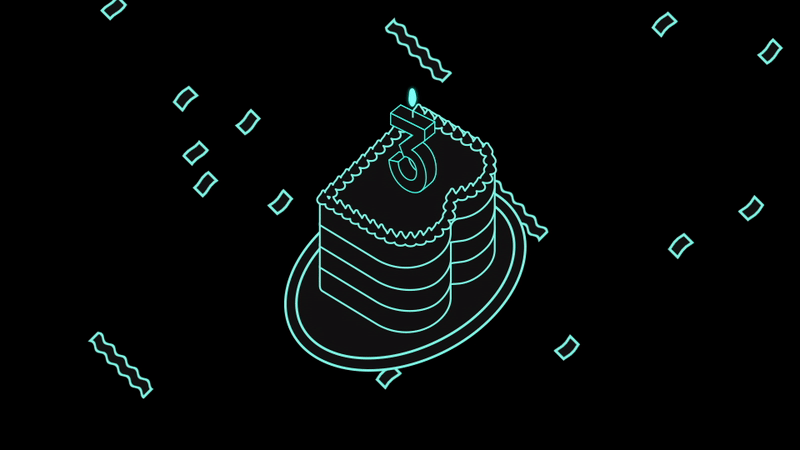

**TL;DR** Spotify released Backstage into open source three years ago today. Since then, the community has grown by leaps and bounds to stretch across the globe (and the Discord server!). Now that Backstage is a threenager, the growing pains are real. So, on this birthday, we want to cover our collective efforts to make it easier to adopt and contribute to Backstage.

{/* truncate */}

## They grow up so fast, don’t they?

Happy birthday, Backstage! Three years ago, Spotify released its homegrown developer portal into the wild after a small team collaborated on an internal Hack Week project. We’d had a lot of conversations with companies looking to build out something similar to what we’d been running for years, so our Hack Week sprint started as an experiment to see if the Backstage core plugins could be valuable in open source.

It's cliché at this point — because we’ve said it a million times — but no one could have predicted what came next.

In three short years, Backstage has grown to a Cloud Native Computing Foundation Incubating project, with more than 900 adopters and 1000+ contributors worldwide. Companies like CVS Health, Siemens, LinkedIn, REI, Vodafone, and Lego are building out their own developer portals from the Backstage framework and bringing their learnings to the project.

A few more stats we love to see (mainly coming from the [project repo](https://github.com/backstage/backstage)):

- 3k+ project forks
- 38k+ commits
- 12k+ PRs
- 15k+ total contributions
- 21k+ stars on GitHub
- 9k+ Discord members
- 100+ open source plugins in the [plugin marketplace](https://backstage.io/plugins)

But, without a doubt, the best thing about the Backstage project is the people in this community. People who are curious, collaborative, and excited to share knowledge. People who’ll sift through Discord at all hours to answer questions and support one another. People who come from all over the world but share a common trait: being passionate about enabling developers to do their best work.

Don’t take our word for it! Take a look at this birthday video we put together with a few community members.

  <iframe
    style={{
      position: 'absolute',
      top: 0,
      left: 0,
      right: 0,
      bottom: 0,
      width: '100%',
      height: '100%',
    }}
    src="https://www.youtube.com/embed/rllOa_MfEWw"
    frameBorder="0"
    allow="accelerometer; autoplay; encrypted-media; gyroscope; picture-in-picture"
    allowFullScreen
  ></iframe>

## The growing pains are real

But it's not all sunshine and roses in Backstage-land. If Year 1 was about getting this community going and Year 2 was focused on maturing the platform, then Year 3 needs to address some of the inevitable growing pains a project undergoes as it gains ground.

We hear two things pretty consistently from the community:

- **Backstage is a steep learning curve:** Over the past three years, the project has grown in scope and breadth which can translate to complexity. This is especially true for newcomers looking to get their arms wrapped around the key concepts.
- **Backstage has barriers to adoption:** Backstage adopters tell us driving widespread adoption of their developer portal remains the biggest challenge they face. Adoption barriers can be technical but are often cultural.

The maintainers and some of our most involved community members are actively tackling how we can make the Backstage onboarding process easier for contributors. There are also lots of ways the project could better support adopters on that journey and make adoption faster and smoother.

We’re looking at everything from cleaning up documentation to opinionated catalog ingestors being discussed in both the Catalog and Adoption monthly SIGs (running meeting notes [here](https://docs.google.com/document/d/1xg57CDfX2R5jTGbbWANzifm2szEb664kuTwfEEvKgZU/) and [here](https://docs.google.com/document/d/1zeYSzXYgh897bxPQmwy2btOwCFlEjlUDLf00riySLRc)). A few priorities that we’ve already mapped out:

- Make it easier to install, customize, and maintain Backstage
- Provide Golden Paths for adoption
- Improve the experience and the content on [backstage.io](https://backstage.io/docs/overview/what-is-backstage)

Because there are now so many mature adopters — Spotify included — there’s so much knowledge on how to create a roadmap for adoption and use cases, how to roll out your developer portal to your teams and drive inner source contributions, how to measure and attribute developer productivity gains, etc.

Our goal is to tap into the knowledge those adopters have gained and create more tangible resources for the entire community. But we can’t do it without help. And that’s where you come in!

## Getting (more) involved

We’re very grateful for the Backstage ride-or-dies: the contributors who show up to every community session, attend every SIG, and are always ready to jump in on any PR or issue.

But one of the areas where we think the project could greatly improve (and better address some of the growing pains I mentioned above!) is more active contribution — both the total number of people contributing and what they’re contributing.

We’ve already shared a bit on this but the maintainer team is starting to address this challenge by proposing the following three initiatives:

- Introduce more steps in between first-time contributor and maintainer in the form of a contributor ladder (loosely based on the [CNCF Project Template](https://github.com/cncf/project-template/blob/main/CONTRIBUTOR_LADDER.md)).
- Change the ownership model, for example, divide the project up into several project areas, each covering particular parts of the project.
- Introduce a new process for large contributions in the form of Backstage Enhancement Proposals (BEPs).

These two RFCs on [Updated Backstage Governance](https://github.com/backstage/backstage/issues/15317) and [Backstage Enhancement Proposals](https://github.com/backstage/backstage/issues/15318) remain open so feel free to read and join the discussion! Watch this space as we’ll share more on the go-forward governance and BEPs plan soon.

But if you’re brand-new and just looking to get your feet wet, we’ve also [compiled some small steps](https://backstage.io/docs/getting-started/getting-involved/) you can take to get involved:

- Report (or squash) bugs: Look through the GitHub issues for [bugs](https://github.com/backstage/backstage/labels/bug), [good first issues](https://github.com/backstage/backstage/labels/good%20first%20issue) or [help wanted](https://github.com/backstage/backstage/labels/help%20wanted)
- Build or suggest a plugin: The Backstage project grows with every new plugin that gets added
- Add non-code contributions: We welcome things that help the community at large, but may not fit into the scope of the core project
- Write documentation or improve the website: The current documentation and project site are pretty limited. Better content helps a lot of those growing pains.
- Contribute to Storybook: Help us [create new components](https://github.com/backstage/backstage/labels/help%20wanted) or improve stories for the existing ones
- Submit feedback: The best way to send feedback is to file [an issue](https://github.com/backstage/backstage/issues) with as much detail as possible
- Add your company to ADOPTERS: Adding your company to [ADOPTERS](https://github.com/backstage/backstage/blob/master/ADOPTERS.md) really helps the project, you can do this by filling out this [adopter form](https://form.typeform.com/to/zcOaKikB)
