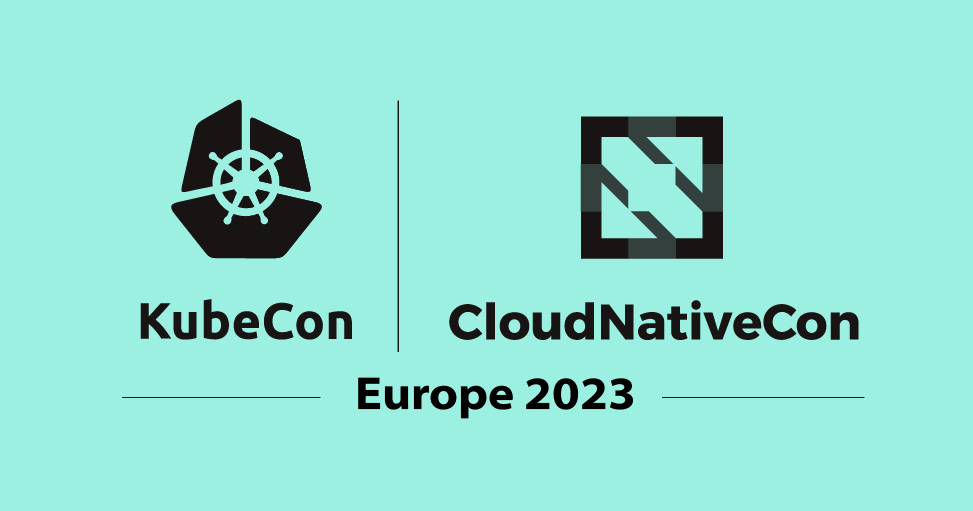

We had a blast talking all things Backstage at KubeCon EU 2023 in Amsterdam last week. In case you missed it, here’s a quick recap:

{/* truncate */}

## Backstage Project Meeting

On Tuesday the Backstage maintainers hosted a jam-packed project meeting. The community welcomed many teams and individuals that were early in their Backstage journey, either actively adopting, preparing for the POC phase, or learning about the capabilities of Backstage. Many of the newcomers were eager to learn about how Backstage could help streamline their development workflows and improve developer productivity. During the project meeting, the maintainers covered a “day in the life” of a core maintainer, walked through spinning up a new instance of Backstage in a live demo, and opened it up to questions from the community. It’s super exciting to see so much growing interest in Backstage and all of the ways adopters are adapting it to their needs.

## State of Backstage in 2023

Core maintainers [Ben Lambert](https://github.com/benjdlambert) and [Patrik Oldsberg](https://github.com/Rugvip) took center stage on Wednesday for the Backstage Maintainer Track: State of Backstage in 2023 talk. Backstage has officially hit over 1,000 adopters and 1,000 contributors – so it’s apt timing to modernize the governance model for the project. Taking pointers from the [CNCF Contributor Ladder Governance Template](https://contribute.cncf.io/maintainers/templates/), a new [Backstage Governance Model](https://github.com/backstage/community/blob/main/GOVERNANCE.md) is now in effect! Patrik walked us through the new ladder model which introduces a number of changes, one being the addition of [project area maintainers](https://github.com/backstage/community/blob/main/GOVERNANCE.md#project-area-maintainer). This role lets members of the community take increased ownership over a specific area of interest, like Catalog, Discoverability, TechDocs, Helm Charts, and Kubernetes. New project areas that will be added include Permissions and Software Templates. New project areas can be proposed by nominating a project area maintainer for the area. The new model also adds an organization member role for contributors who want to take a more active role in the Backstage community. You can open an issue to become an organization member [here](https://github.com/backstage/community/issues/new/choose).

Ben and Patrik also covered new capabilities for Software Templates and framework updates. Lots of exciting new features are planned for Software Templates including a new UI, async validation for CustomFieldExtensions, and embedded workflows. Lastly, the maintainers also announced a new focus on declarative integration – permitting plugin installation without TypeScript. Development is still early, but we can’t wait to see this in action!

## Other KubeCon excitement!

Throughout the week, we also heard success stories of adopters, like AppsFlyer’s talk, “How We Migrated Over 1000 Services to Backstage Using GitOps and Survived to Talk About It!” AppsFlyer has over 1,000 services and processes over 200 billion events per day – so migrating to Backstage as their service catalog platform was no small feat. As part of their migration, they also integrated GitOps and Terraform into their Backstage instance. Many attendees found interest in these case studies where you could see the adoption and POC process directly from other adopters. It was exciting to see firsthand how teams can extend Backstage to fit their needs on the fly.

We were thrilled to see so much excitement and interest brewing around Backstage this year! If you missed it, you can catch up as soon as more talks are added to the [CNCF YouTube channel](https://www.youtube.com/@cncf/featured). We can’t wait to catch up with you all again soon at KubeCon North America in Chicago.
