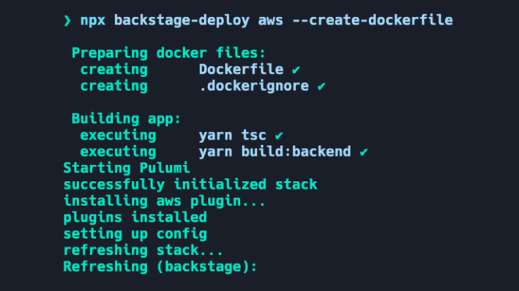

_This blog post is co-authored by Emma White ([@ewhite1997](https://github.com/ewhite1997)), Spotify._



TL;DR: Backstage released a new CLI earlier this year as part of a [new Backstage project](https://github.com/backstage/backstage-deploy). This new capability allows early adopters to deploy their Backstage proof of concept faster than before. In this blog, you’ll learn a little bit more about the Deploy CLI and how you can get started with it.

{/* truncate */}

## Why Backstage Deploy

We’ve heard from Backstage adopters that before reaching widespread adoption at their organizations, teams test out a Backstage proof of concept (POC). To create the POC, teams scaffold an instance, set up the catalog, and change the UI to suit their company’s branding. Once these milestones are completed, there's just one last step before showing off the awesomeness of a Backstage POC internally... deploying the Backstage POC from a local machine to the cloud. This final step often introduces a lot of questions that attempt to determine the easiest and fastest way to do that.

Let’s say you’re at this last step: your POC is ready for deployment, but you have some lingering questions.

For example:

- What Dockerfile should you use?
- Should the POC be deployed on Kubernetes?
- How do you deploy the POC on my cloud provider?

To address these questions and reduce friction from deploying a POC, we built a [new CLI](https://github.com/backstage/backstage-deploy). The CLI is simply called `deploy` and is invokable with `npx`. With this new CLI, you can generate a Dockerfile and deploy a Backstage instance onto a preferred cloud provider. While the package’s infrastructure is built to support all cloud providers, currently the CLI only offers an AWS implementation. In the future, we plan to add additional cloud providers to the package and [welcome any contributions](https://github.com/backstage/backstage/blob/6996b3338d678efc03307112524060e9dc2ad769/CONTRIBUTING.md) extending the suite of cloud provider implementations!

**So, what about Kubernetes?** Since the CLI is designed specifically for the POC phase, we believe that Kubernetes isn’t the right fit – as Kubernetes is better suited for production workloads. So, we explored lightweight, container-based solutions, and landed on [Amazon Lightsail](https://docs.aws.amazon.com/lightsail/index.html) as a hosting service for the POC.
Amazon Lightsail supports [lightweight container](https://lightsail.aws.amazon.com/ls/docs/en_us/articles/amazon-lightsail-container-services) deployments [at a low cost](https://aws.amazon.com/lightsail/pricing/), and has a [free trial for new users](https://aws.amazon.com/lightsail/pricing/?loc=ft#AWS_Free_Tier)! Given Lightsail’s ease of use and affordability, we recommend using Lightsail over Kubernetes to test out your Backstage POC.

With the Dockerfile and Kubernetes questions answered, we just have to address how to actually deploy the POC. And that is where the new CLI comes in.

## Get started with Deploy CLI

It's now time to put the Deploy CLI into action and deploy a Backstage POC. The following steps guide you through the deployment process.

Deploy CLI makes use of [Pulumi](https://www.pulumi.com/docs/) which is an infrastructure-as-code tool that helps provision resources in the cloud. Before you get started, ensure you have the [Pulumi CLI](https://www.pulumi.com/docs/cli/) and [AWS CLI](https://docs.aws.amazon.com/cli/latest/userguide/getting-started-install.html) installed on your local machine.

You can find the step-by-step installation documentation for Pulumi under the [Deployment section](https://backstage.io/docs/deployment/backstage-deploy/aws-lightsail).

But we summarize the steps to deploy your POC here. You can invoke the CLI you can use the following command:

```bash
$ npx backstage-deploy aws --create-dockerfile
Starting Pulumi
successfully initialized stack
installing aws plugin...
plugins installed
setting up config
refreshing stack...
Refreshing (backstage):

Instance will live at:
https://backstage-container-service.xxx.us-east-1.cs.amazonlightsail.com/
```

Once you kick off the command it will create a Dockerfile for you in the root and Pulumi will start provisioning resources in AWS.
Pulumi will then create a container based deployment in Amazon Lightsail.

After you’re done with the POC, it’s easy to delete the AWS resources you provisioned and save you costs within AWS. You can do so with the following command:

```bash
$ npx backstage-deploy aws --destroy
```

## Looking ahead

As mentioned earlier in this blog, we released the Backstage Deploy CLI with an AWS implementation only. In the next few months, we are excited to collect feedback from our end users to understand how the AWS implementation works. With those learnings, we plan to iterate on the Deploy CLI and build out implementations for other cloud providers. Of course, contributions are always welcome!

So, please try this new CLI out and let us know what you think on [Discord](https://discord.com/channels/687207715902193673/995973463208644678)!

Useful links:

- [Backstage Deploy](https://github.com/backstage/backstage-deploy)
- [Documentation](https://backstage.io/docs/deployment/backstage-deploy/aws-lightsail)
- [Pulumi docs](https://www.pulumi.com/docs/)
- [#deployment](https://discord.com/channels/687207715902193673/995973463208644678) channel in Discord
