---
# prettier-ignore
title: "Adopter Spotlight: How Stash simplified monitoring, ownership and true app health with microservices"
author: Taylor Webber, Staff Engineer, Stash
---

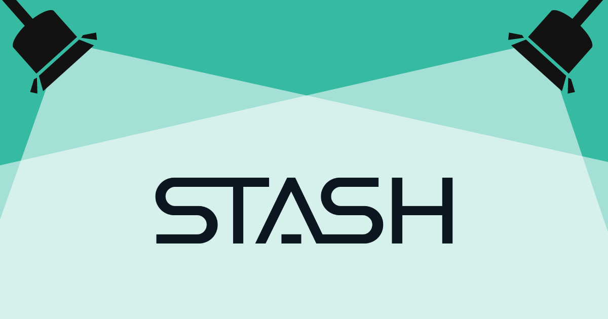

**TL;DR**: Monitoring the health of a software application goes beyond surfacing API errors and customer-facing issues. It requires a comprehensive understanding of every facet of a service, including process metrics like DORA, as well as clear ownership of services and processes. By implementing Elevate as an internal developer portal, development teams now have better visibility of ownership in the distributed systems they work in. They also have the benefit of consolidated application health data and other metrics gained from the SaaS products they utilize everyday. This approach ensures a “single pane of glass” for application ownership and health so our teams can focus on building products and features that help our customers invest for a prosperous future.

{/* truncate */}

At [Stash](https://www.stash.com), our mission is to give people the confidence to invest for a better life. Our app simplifies investing for the middle class who may be less experienced with traditional investing and retirement planning. Our customers trust us with their money, and with that, rely on us to provide a responsive and quality experience that works every time.

It isn't revolutionary to say that monitoring the health of a software application is critical for ensuring its reliability and performance in service of customers' needs. However, in a distributed architecture like microservices, tracking ownership and monitoring application health across the system quickly becomes complex. The difficulties are further compounded when leveraging multiple SaaS products, which is common in modern development but specifically so for fintechs like Stash that integrate best-of-breed software in novel ways, as we do across our platform.

What we found is that there are ways to make sense of these complex systems by tracking DevOps Research and Assessment (DORA) metrics for applications and leveraging SaaS products to create a central hub to understand the _true_ health of an application.

In this post, I'll walk you through Stash's journey to create Elevate, our Internal Developer Portal (IDP) based on the open source [Backstage](https://backstage.io/) framework. Our portal increased visibility of application health metrics, prioritized cloud cost insights, and reduced the context switching required for teams to understand service ownership and the components that make up the entirety of Stash's world-class application systems.

Elevate enables effective monitoring, streamlined incident response, improved overall application health, and most importantly, team health.

# Setting the monitoring/DORA scene

It seems counterintuitive, but trying to solve the problem of monitoring and tracking ownership with a traditional centralized approach and more SaaS monitoring tools will likely not solve the problem.

Traditional centralized monitoring approaches may not suffice in a distributed architecture due to services that may act as pass-throughs or services that call many other services to aggregate data or tasks. In traditional monitoring, you will only see the error rates and request logging for individual services. That will only ever show you part of the puzzle as you'll still be unable to trace a request from a frontend application, through your many service layers to your data stores and back out.

Utilizing multiple SaaS products for service monitoring and observability during development introduces additional complexity; each product may have its own dashboard and reporting tools. These implementation differences can make it difficult to consolidate and gain a holistic view of the application's health.

Picking the right tool for the job can make developing quality products at speed and scale easier, but what we've learned is that utilizing each tool's context for application health as a piece of the puzzle has exponentially impacted our team's effectiveness.

The team at Stash took an approach of enhanced monitoring which required introducing request tracing for services that a team owns (and the entire org) to get the full picture. We worked to distribute monitoring **_across_** services, capturing both customer-facing issues and internal process metrics that focus on service quality.

We also took a hard look at our health metrics. Some attributes of healthy applications are high availability, HTTP 500 errors are minimal, CPU and memory usage are sustainable, and the “/health” endpoint returns the health of the application. However, to gain insights into the true health of an application and the teams supporting it, tracking DORA metrics is essential.

We took four key DORA metrics — deployment frequency, lead time for changes, mean time to restore, and change failure rate — to process aspects of services and provide a comprehensive understanding of an application's overall health as well as the health of our team and organization.

# Understanding complex systems at Stash with Backstage

At Stash, we use a multitude of SaaS tools during the software development process, some of which provide varying degrees of built-in service catalogs. With many sources of truth and a lack of ability to combine data from multiple sources (eg. FireHydrant incident response with DataDog or DataDog Real User Monitoring data in PagerDuty, etc.) it was challenging to get a holistic view of the whole system..

Additionally, as we created more and more microservices, it became challenging to determine ownership for each service. Microservice owners were finding it increasingly difficult to keep track of their various consumers to assure that contracts were being maintained as new changes were introduced. Ownership clarity was **_crucial_** to our goals for effective monitoring, issue resolution, and maintaining accountability.

To consolidate application health data, simplify support and clarify ownership for those on development teams as well as for those in non-engineering roles, we implemented an instance of Backstage as an internal service catalog we call Elevate.

Utilizing Backstage as a framework, Elevate aims to improve quality and domain expertise for all things code and process at Stash. The key to accomplishing this goal is to leverage the processes and integrations we already use at Stash, but centralize and surface the data in a way that is digestible for engineers and non-engineers alike.

For the benefit of a self-managed internal service catalog to outweigh the change in processes and the cost of the catalog's infrastructure, it had to be easy to adopt and have an enlightening effect on teams.

## Ownership visibility

Elevate acts as a centralized hub for registering services, documenting ownership information, and establishing clear accountability. It provides a holistic view of distributed systems and the shared modules and libraries they use by making it easier to track ownership and ensure effective communication and collaboration.

The Backstage [Software Catalog](https://backstage.io/docs/features/software-catalog/) model allows service-level tracking, as well as dashboards for Groups (teams or squads), Systems (business units or focus areas), Domains (organization units) or even company wide.

### Easy adoption and catalog usage

The Backstage open source plugins provide the nuts and bolts for our internal service catalog functionality. Backstage's community plugins assist with the basics of catalog management. They also allow for dynamically changing the type content based on which entry is being viewed in the catalog (library, service, API, team, etc.). Each view can be custom-tailored with the information for that type of entry, which allows for shared libraries to have an overview page focused on getting engineers to documentation; while the overview page for a deployed service can focus on the current incident status and on-call information as the most important thing. The plugin for searching allows for easy discovery of items or documentation throughout the catalog.

###### Example catalog-info.yaml file to add service to Elevate

```yaml
apiVersion: backstage.io/v1alpha1
kind: Component
metadata:
  name: your-service
  description: Awesome service for awesome things
  annotations:
    backstage.io/kubernetes-namespace: your-service
    datadoghq.com/site: datadoghq.com
    datadoghq.com/dashboard-url: https://p.datadoghq.com/some-dashbaord
    firehydrant.com/service-name: your-service
    jira/project-key: your-jira-project
    github.com/project-slug: 'your-org/your-service'
    pagerduty.com/service-id: your-pagerduty-service-id
  links:
    - title: Team Slack Channel
      url: https://your-company.slack.com/archives/your-slack-channel-id
      type: Slack
      icon: chat
    - title: Getting started
      url: https://github.com/your-org/your-service/blob/main/README.md
      type: Readme
      icon: github
    - title: Confluence
      url: https://your-company.atlassian.net/your-docs-page-url
      type: Confluence
      icon: docs
spec:
  type: service
  lifecycle: production
  owner: your-team
  system: your-business-unit
```

### Connecting to subject matter experts

Elevate leverages the CODEOWNERS integration to establish expertise of specific codebases within services and ensure accountability and clarity within the development teams. Codespace ownership is typically defined with required reviewers by code owners and admins that provide additional support, but the CODEOWNERS plugin allows for clarity into who the subject matter expert of the codebase is, not just the administrative owner. The plugin also displays recent changes that have been merged into the codebase, including the authors and approvers of the changes and other valuable metadata.

This improved clarity into contributors and recent contributions can prevent developers and managers from playing telephone when effective communication is crucial to fixing a bug or resolving an incident.

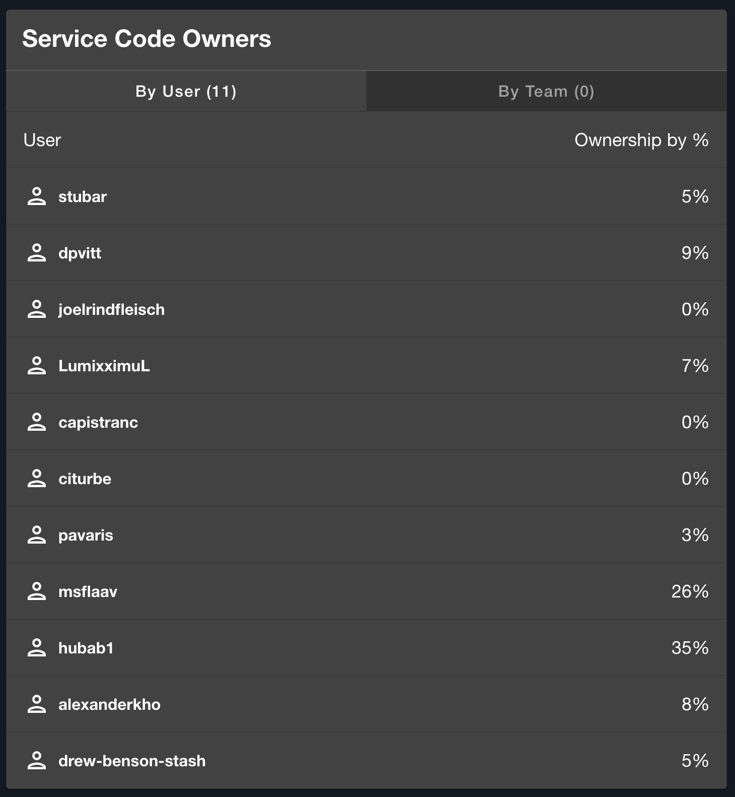

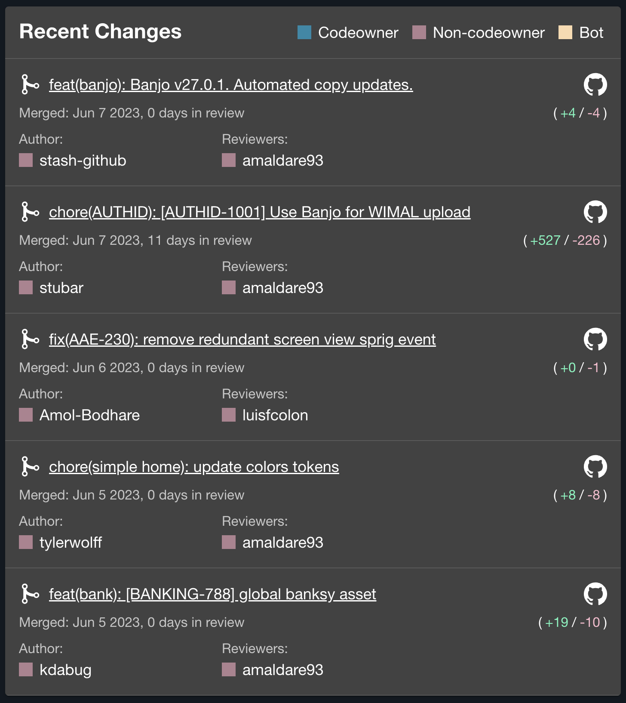

_CODEOWNER cards for service ownership and recent changes that appear on a service's overview page._

## Integration with SaaS products

Backstage offers a catalog of integrations with many popular SaaS products. With Elevate, we've integrated plugins for monitoring infrastructure and user experience, visualizing process backlog and bottlenecks, as well as giving insights into data that teams have not yet been able to see for services they support. These integrations allow for seamless data collection and aggregation, transforming Elevate into the centralized hub for application and team health data.

The key to making your service catalog scalable is to ensure you aren't requiring the duplication of data away from its source; Elevate utilizes dashboards and charts to view the data stored in the remote sources. When aggregating DORA metrics we are able to leverage our SaaS tools API within Elevate's service layer to pull data and transform it for our custom dashboards.

### Visible cohesive monitoring

At Stash, we collect performance metrics, resource utilization, and proactive alerts with DataDog and Sentry; these tools can also monitor and track API errors and customer-facing issues that would normally go undetected. To deliver the best possible experience for Stash's customers, engineers need to be able to easily monitor errors on customer devices to solve issues before they are reported.

Sentry's plugin easily surfaces uncaught errors within services. DataDog's plugin allows for plug-and-play visualizations of charts or graphs to help support services, teams and beyond. Elevate integrates these insights to monitor the overall health of the application.

### Centralized incident management

PagerDuty has been Stash's standard for on-call activities and paging while FireHydrant has more recently been adopted as a part of a more comprehensive incident management process. Together, we use these incident management platforms to establish incident response workflows and communication channels dedicated to each service.

PagerDuty's plugin allows for quick reference to the individual who is actively on-call for a service while FireHydrant's plugin lets you track open incidents that may be impacting a service and even trigger new incidents directly from within the service overview page in Elevate. Integrating these plugins allows Elevate to serve as a centralized location for the incident management process, helping our engineers quickly gather the necessary context of an issue and drive faster resolution.

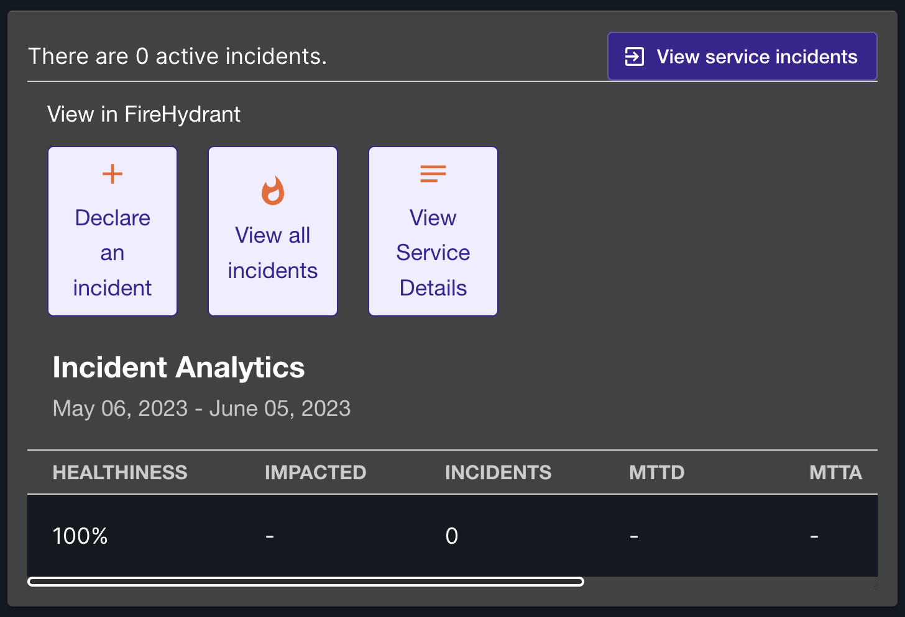

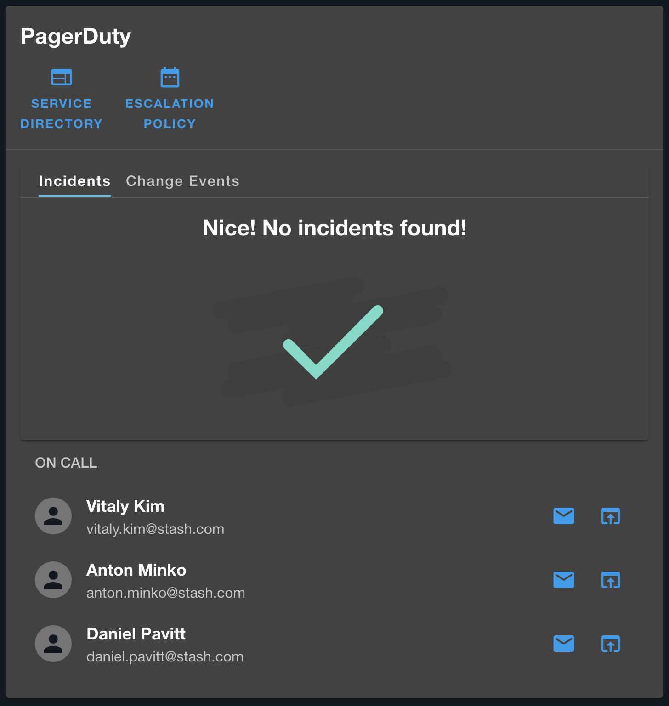

_FireHydrant and PagerDuty cards that appear on a service's overview page._

## Infrastructure cost insights across all systems

It's difficult for teams to be more efficient with their infrastructure costs if they are unable to see the problem areas for the services they support, as well as references for effective resource management to model after. The AWS Cost Insights plugin allows Elevate to monitor cost-related metrics and ensure efficient resource allocation and budgeting.

Due to the dynamic nature of how different companies may want to aggregate their cost data, the plugin is mostly frontend visualizations for displaying costs over time with drop-downs for filtering and grouping. In Elevate, we created a custom backend plugin to pull our costs data from AWS and group it properly for presentation to the visualizations.

When we surface this data with the backend layer in Elevate, the frontend is able to surface our AWS cost data to people who previously didn't have access or who found it too difficult to use the more complex AWS Cost Explorer.

In addition to these people now having access to AWS cost data, those with access now get to visualize our spend by AWS product and Stash service. These visualizations are available when looking at a single service, a team or business unit, and organization-wide.

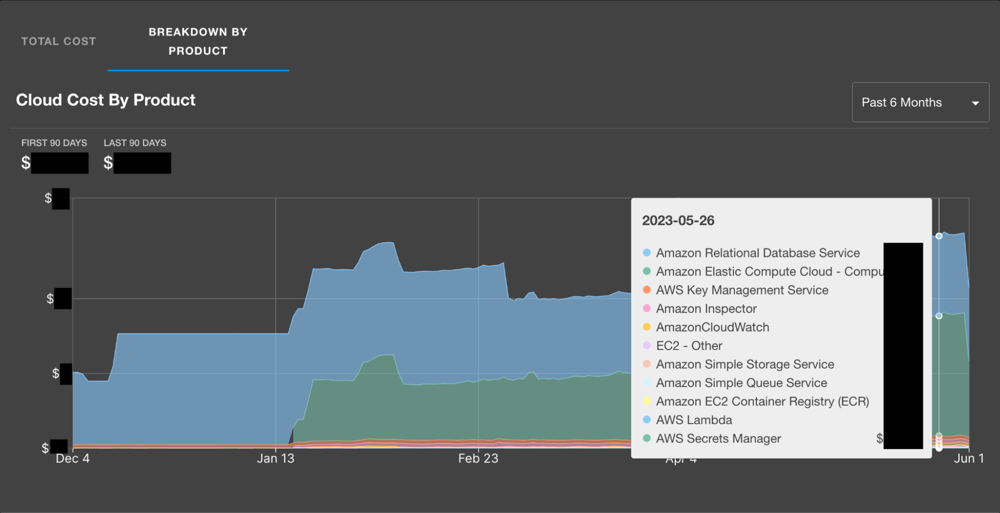

_Breakdown of costs per AWS product for a service._

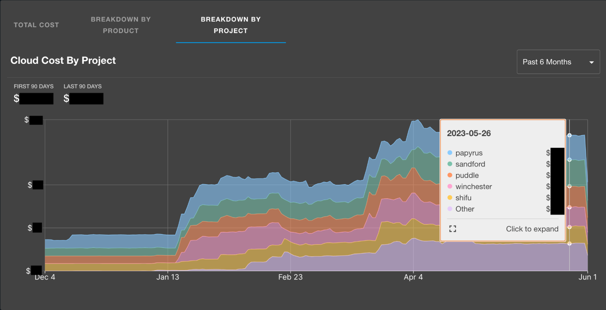

_Breakdown of total costs per service owned by a Team or Business Unit._

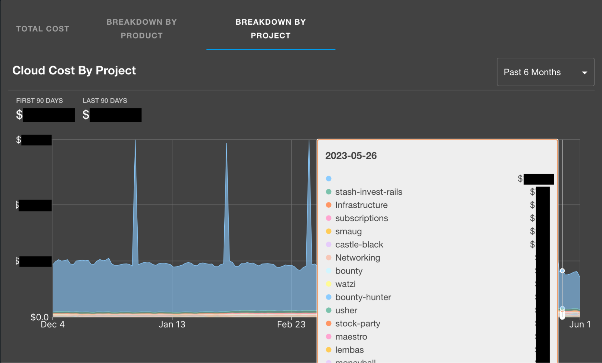

_Breakdown of total costs per service across the organization._

For those that aren't regularly in AWS Cost Explorer, a benefit of implementing these visualizations is being able to easily see where we have some room for improvement when it comes to tagging our AWS resources. The company-wide breakdown shows all resources, whereas the sub-views rely on resource tagging for service name and team name, so discrepancies may arise which will help you close any gaps in tagging you may have. If resources are not properly tagged, reducing and managing your infrastructure costs will be more time consuming than necessary and much less effective.

## Service, team and organizational health

As mentioned above, gathering DORA metrics provides important insight into the health of applications and teams, but until we built Elevate, we didn't have a hub at Stash to aggregate and present that data in an easily digestible manner.

Elevate's initial DORA metrics implementation reaches out to the source(s) of truth for each metric and groups and surfaces that in a manner similar to the AWS Cost Insights implementation.

**Deployment Frequency** from DataDog “deployment” indicator for each service

**Lead Time for Changes** from GitHub for each repo using commit sha's and releases

**Mean Time to Restore** from FireHydrant using their MTTR API for each service

**Change Failure Rate** from DataDog and FireHydrant for each service

Elevate implemented the above data sources for our DORA metrics MVP as those have been determined as our best practices for where that information should be tracked, for now.

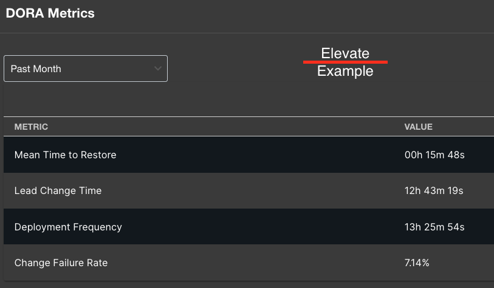

_DORA metrics that display on the overview page for each service._

Software development has an ever-changing SaaS landscape, so what serves as a best practice today, may not be in a week, a month or a year from now. The tools we use to facilitate a task or automate processes may change, but the metrics we want to track (DORA and others) are much more stable. Surfacing data in easily consumable views within Elevate has decoupled the tool we use to accomplish a task from where we monitor the health of our system and how that tool assists.

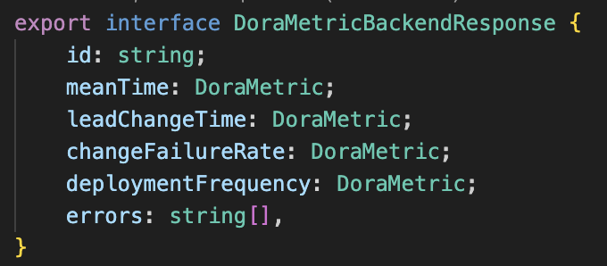

_An abstracted service layer that is agnostic of data source(s) allows for a stable integration for our frontend dashboards._

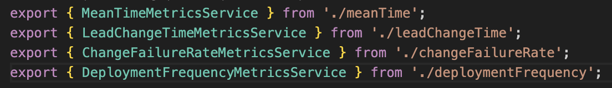

_Separate backend services by metric allow for easy updating for additional or new data sources in the future._

# tl;dr

Monitoring the health of a software application goes beyond surfacing API errors and customer-facing issues. It requires a comprehensive understanding of every facet of a service, including process metrics like DORA, as well as clear ownership of services and processes. By implementing Elevate as an internal developer portal, development teams now have better visibility of ownership in the distributed systems they work in. They also have the benefit of consolidated application health data and other metrics gained from the SaaS products they utilize everyday. This approach ensures a “single pane of glass” for application ownership and health so our teams can focus on building products and features that help our customers invest for a prosperous future.
