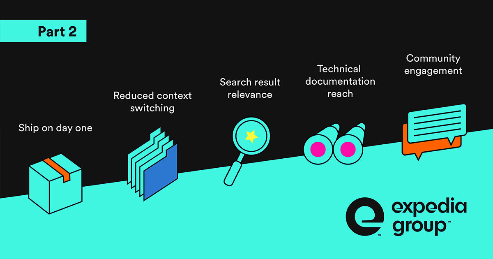
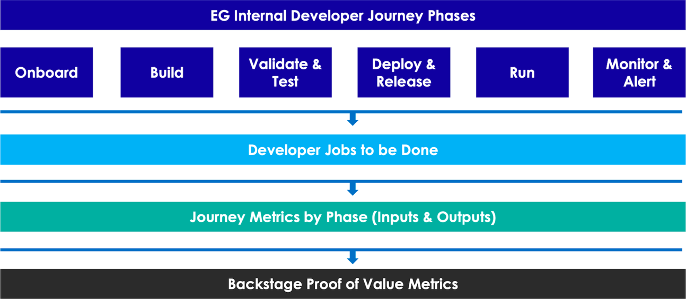

---
# prettier-ignore
title: "Expedia Group shares Backstage proof of value metrics 2.0"
author: Guillermo Manzo, Expedia Group
authorURL: https://www.linkedin.com/in/guillermomanzo
---

_Editor's Note: In this post, Expedia Group provides a follow-up to their initial Q4 2021 [post on how they measure Backstage proof of value](https://backstage.spotify.com/blog/measuring-backstage-proof-of-value-at-expedia/).
We're grateful to the Expedia Group team for sharing their processes, revised proof of value metrics, and adaptations to their approach over time in hopes of providing a successful framework for the rest of the Backstage community._

[Expedia Group's](https://expediagroup.com) mission is to power global travel for everyone, everywhere.
This vision is made possible through Expedia Group's massive platform, which connects 168 million loyalty members, 50 thousand B2B partners, 3 million properties and 500 airlines, car rentals and cruise lines across the globe. In short, the scale of our platform is enormous, which means that we need to scale our engineering capabilities as well so we can continue to provide seamless experiences to our travelers and partners.

{/* truncate */}

In August 2020, we adopted Backstage to enhance our foundational platform capabilities and reduce developer friction in the process. Its framework proved scalable for us and as EG's platform evolved, so did our application of Backstage. Since our [initial share about our Backstage deployment](https://backstage.spotify.com/blog/measuring-backstage-proof-of-value-at-expedia/), we've continued to follow our process of:

- Syncing Expedia Group's internal Developer Journey phases by key DevOps processes and Software Delivery Life Cycle (SDLC) milestones (POC, Alpha, Beta, etc).
- Identifying Developer Jobs to be Done (JTBD) by our Internal Developer Journey phases
- Aligning developer JTBD's to proof of value (PoV) metrics.

In the diagram below, you can see how we distilled these processes into Backstage PoV metrics.

To ground ourselves in the evolving developer and Backstage landscape at Expedia Group, we constantly ask ourselves, "How can we continue to show the value of Backstage to our customers and the Developer Community?" To fully answer this question, we adapted our initial proof of value metrics to reinforce our alignment to the current landscape of the Expedia Group developer journey.

## Expedia Group proof of value metrics 2.0

We are excited to share our PoV metrics because it affirms our investment in Backstage for Expedia Group's Backstage users and provides a compelling metrics-based answer on why more organizations should consider adopting it.

As our Backstage application matured, we updated our PoV metrics and aligned our 2023 roadmap to reflect these changes. Below, we highlight key wins from 2022 and outline our long-term vision for each metric.

<table>
  <thead>
    <tr>
      <th>PoV Metric</th>
      <th>Description</th>
      <th>2022 Key Win(s)</th>
      <th>Long-Term Vision</th>
    </tr>
  </thead>
  <tbody>
    <tr>
      <td>"Ship on Day One" / onboarding metrics</td>
      <td>
        

          A metric used to determine an engineer's readiness to develop at EG
          during their onboarding process.
        

        

          It measures the time from first commit to deploying code in
          production, using a "Hello World Template"
        

      </td>
      <td>
        <ul>
          <li>
            850+ engineers went through the “Ship on Day One” Bootcamp when
            first joining Expedia Group
          </li>
          <li>
            We had a success rate of ~95% of engineers completing bootcamp on
            first try
          </li>
          <li>7,000+ components created or onboarded</li>
          <li>4-min average per app creation/onboarding</li>
        </ul>
      </td>
      <td>
        <ul>
          <li>
            Develop full onboarding curriculum coverage for all critical
            capabilities offered within EG - Example: performance and quality
            management, pipeline management, etc.
          </li>
          <li>
            Create an end-to-end guided tour of the EG Developer Journey w/
            functional training
          </li>
        </ul>
      </td>
    </tr>
    <tr>
      <td>
        Reduce context switching through integration with core EG capabilities
      </td>
      <td>
        Through plugins, tool integration, reduces context-switching as
        engineers will not need to toggle between multiple tools
      </td>
      <td>
        <ul>
          <li>
            15%+ of internal developer tools are integrated within Backstage,
            reducing the amount of context-switching needed
          </li>
          <li>
            4000+ unique users using Backstage for ~20 min on average a day.
          </li>
        </ul>
      </td>
      <td>
        <ul>
          <li>
            End-to-end integration with EG paved road tools and Backstage to
            support increased developer productivity
          </li>
          <li>
            Drive broader adoption to have all EG employees using Backstage to
            manage their SDLC and to build internal UIs using plugins
          </li>
        </ul>
      </td>
    </tr>
    <tr>
      <td>Improve search results relevance</td>
      <td>
        Intuitive search capabilities to surface relevant Backstage content like
        TechDocs, entities, tools, etc.
      </td>
      <td>
        <ul>
          <li>Enabled global search functionality throughout Backstage</li>
          <li>
            
Contributed to the open source Backstage Search platform

          </li>
        </ul>
      </td>
      <td>
        <ul>
          <li>Engine optimization/ranking improvement</li>
          <li>Visualize key search metrics to support improvements</li>
          <li>Chat + AI integration with chat-based interfaces</li>
        </ul>
      </td>
    </tr>
    <tr>
      <td>Technical documentation reach</td>
      <td>
        Number of developers leveraging TechDocs for all services within EG
      </td>
      <td>
        <ul>
          <li>500+ services tied with TechDocs</li>
          <li>50,000+ average monthly TechDoc views</li>
        </ul>
      </td>
      <td>
        <ul>
          <li>
            All Backstage entities leveraging TechDocs to enable a centralized
            documentation portal integrated with the Software Catalog
          </li>
          <li>
            Quality/governance and gamification to support users and
            contributors
          </li>
          <li>
            More TechDocs and mkdocs add-ons to compliment the core capabilities
            and drive usability of documentation on Backstage
          </li>
        </ul>
      </td>
    </tr>
    <tr>
      <td>Developer Experience community engagement</td>
      <td>Enhance Backstage through community engagement</td>
      <td>
        <ul>
          <li>
            Diverse contributions to Backstage open source focused on search and
            discovery - 10+
          </li>
          <li>Community engagement through internal case studies, and blogs</li>
        </ul>
      </td>
      <td>
        <ul>
          <li>
            Continuous contributions to open-source Backstage, focused on plugin
            administration, driving documentation adoption, and improved UX
            around core capabilities
          </li>
          <li>
            Strategic community engagements to enhance the platform's usability
            and long-term confidence in adopting Backstage
          </li>
          <li>
            Event participation and storytelling around EG's Backstage journey
          </li>
        </ul>
      </td>
    </tr>
  </tbody>
</table>

## YMMV: Your Metrics May Vary!

Measuring the value of Backstage will vary depending on your organization's needs and priorities. As an early adopter of Backstage, we hope the Expedia Group PoV metrics provide a helpful framework for understanding how Backstage can be used to improve developer productivity, collaboration, and knowledge sharing.

We look forward to sharing future updates with the community as we continue to embrace a continuous improvement approach to Backstage. If you missed it, you can read about where we started in our [initial proof of value metrics](https://backstage.spotify.com/blog/measuring-backstage-proof-of-value-at-expedia/) back in 2021.

_Read more about Expedia's tech journey on [their Medium Blog](https://medium.com/expedia-group-tech)_
