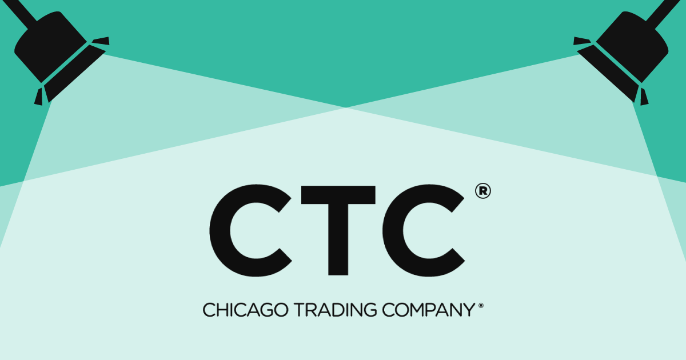

---
# prettier-ignore
title: "Adopter Spotlight: How Chicago Trading Company saved 18 months of developer effort with Backstage"
author: Tiffany Cox, Spotify
---

**_TL;DR [Chicago Trading Company](https://www.chicagotrading.com/) (CTC) adopted Backstage ten months ago to help reduce onboarding frictions with their new cloud-based DevOps Kubernetes platform. Through templatization and open feedback loops, the team has conservatively saved 18 months of developer time to date with Backstage. We spoke with CTC DevOps engineer [Scott Kausler](https://github.com/scott-kausler) who shared the details of their onboarding journey, lessons learned, and insights for other Backstage adopters._**

{/* truncate */}

## Templates or the cluster didn't happen

While mid-activation on a new cloud-based DevOps Kubernetes platform, Scott's team received early feedback that it was difficult to onboard teams onto this platform due to the breadth of requirements and new tools developers needed — from dependency management tools (such as Gradle, Conan, and Conda) to Docker/Kubernetes, Helm/FluxCD, and Vault. Not only were CTC developers required to learn new systems to build, package, and deploy their apps, in several cases even the code needed to be changed. There were also significant modifications required to existing tools such as Jenkins.

Scott's team quickly recognized that this friction could lead to lower adoption and longer onboarding times to the new platform. So he started investigating solutions that would allow him to templatize these new services and create turnkey onboarding with less reference knowledge required.

After exploring several service routes from managed to in-house/owned, CTC opted to use Backstage — already in POC for use of the [Software Catalog](https://backstage.io/docs/features/software-catalog/) — due to the [Software Templates](https://backstage.io/docs/features/software-templates/) plugin form-based input, UI/json-schema-form abilities, and its extensibility. Scott's team felt Backstage provided the most sustainable solution for growth amongst the multiple developer portal and templation options vetted and would help bridge the gap between UI-driven deployment and GitOps.

## Early wins on documentation and onboarding

The CTC DevOps team created a small special interest group to champion the developer portal build and quickly delved into the big issues impacting their developer experience. From there, the team began creating tasks and templates within Backstage.

To start, Scott worked with end-user teams outside DevOps early in the process of documenting migration to the new DevOps Kubernetes platform services. When Scott wrote the onboarding documentation, he made it a point to pair with a developer on another team that would be using it. This approach provided him with a quality sounding board, great instantaneous feedback, and a sort of "beta developer" to test V1 documentation clarity., A few weeks later, another colleague on the same end-user team followed the documentation and she didn't reach out to Scott at all.

After this early win, the team was ready for broad distribution. Partnering with the senior leadership team, Scott's team began onboarding teams to the new DevOps Kubernetes platform using the templates his team created in Backstage. At CTC, their Backstage instance is set up to automatically scan for deployments in Kubernetes; so if you're in Kubernetes, you're onboarded to Backstage.

"Backstage made onboarding [to the new DevOps platform] not scary,"" Scott said. "Because now — all of a sudden — you have this recipe for how to do it, you don't have to jump through these hoops, the templates are there and ready for you. You choose what you want based on these templates we have available, and you're off and running on your own.""

Scott's team monitored progress against their onboarding goals partially by how often the DevOps team was getting pinged for support and found that it has made support smoother. They can easily refer people to templates and repo standards instead of making them create something ad hoc.

"It's really been cool seeing how that progressed. I even have a few teams that didn't talk to DevOps at all. They used a [template] and they have a service ready. We were actually pretty excited about that, because that means now we have a scalable tool able to onboard others onto our platform."" said Scott.

Another exciting win for CTC was template additions generated outside the initial toolkit, which has eased the burden substantially for the DevOps team. They were able to create new templates to deploy against best practices such as a template for creating a brand-new Terraform module and Git repo or — Scott's favorite — ​​a template that creates a Java repository along with Jenkins jobs for CI and the Flux CD config for deployment.

"The template builds and auto-deploys a Docker image, so if you make a change to your mainline branch, then it will automatically build a new Docker image and deploy it to a Kubernetes cluster."" Scott said. "So within basically 10 minutes of you filling out a form, you actually have something deployed out to a Kubernetes cluster.""

This process eased flows for both end-user devs and DevOps teams overall.

## Measuring Backstage impact at CTC

To calculate the impact of Backstage, Scott began with reviewing template types and assigning a weighted value to each based upon their perceived workload.

At CTC, some templates create a repo, some templates create a repo with some code, some templates even go as far as creating a repo with code and all the prerequisites to deploy to Flux and Jenkins jobs. To be conservative, the highest weight Scott assigned to a template would be saving three days of developer time. Even with that conservative estimate, the figure came out to be a savings of 18 months in developer effort since Backstage was deployed ten months ago.

For CTC, the journey with Backstage has just begun. They're now looking to drive more Catalog adoption and determine what custom plugins they need to build to better support their workflows.

## The power of partnership (and good docs!)

When asked about advice he has for other Backstage adopters, Scott talked about the DevOps team's comms strategy and ensuring end-user developers had pathways to provide feedback. In addition to the focus on templates for the new services, having both a dedicated Slack channel and open-door communication with the DevOps team helped reduce onboarding friction to the DevOps Kubernetes platform.

Outside of that, he believes the approach to documentation is paramount. "Write your documentation from the perspective of, 'Hey, you have this task assigned to you to write a template, here are the exact steps you have to follow.'"" Scott said. "Think of it as a recipe. Removing your familiarity bias will help make this tool more useful for less familiar teams.""

Finally, don't be afraid to step outside the core use cases when it comes to the Backstage framework and finding solutions to meet your needs.

"Backstage gives you a lot of really easy to use features right out of the box. And one of the great things about open source is you can look at the code and see exactly what the behavior is and work within that behavior. But we've also developed our own processes for custom tasks because — at the end of the day — our platform has some very custom aspects to it."" Scott said.

Interested in more stories from Backstage adopters? Check out these recent posts from [Stash](https://backstage.io/blog/2023/07/08/stash-adopter-post) and [Expedia Group](https://backstage.io/blog/2023/08/17/expedia-proof-of-value-metrics-2).

Want to learn more about Backstage? Join our weekly [Office Hours](https://info.backstage.spotify.com/office-hours) and bring your burning questions.
