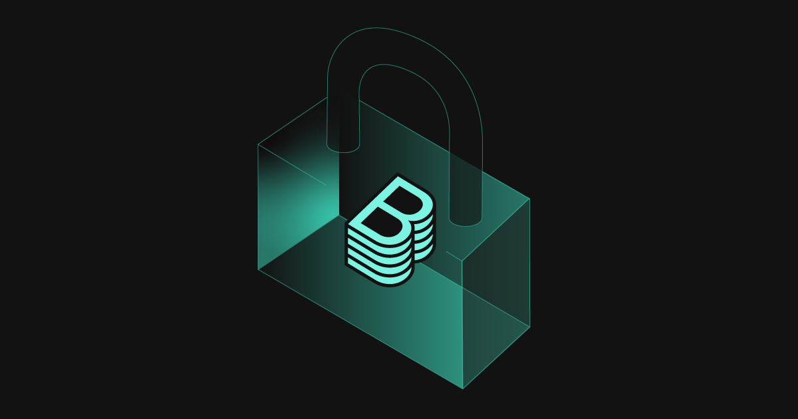

**TL;DR**: For the Backstage maintainers, ensuring that the project is secure for every adopter and end user is one of our top priorities.
With the recent discovery of [CVE-2024-26150](https://www.cve.org/CVERecord?id=CVE-2024-26150), we've shipped fixes for versions > v1.15.0.
Please update your Backstage instance.

{/* truncate */}

Last week we were notified by [Roadie](https://roadie.io/) of a potential security vulnerability in the scaffolder that they had discovered during a third-party security audit.
Roadie are running their scaffolder tasks in an isolated, ephemeral container to mitigate these kinds of issues, but as good citizens of the Backstage community, they alerted the Backstage maintainer team to make sure a fix was applied to the upstream project.
Upon further investigation, it turned out that this was a more widespread issue with the `resolveSafeChildPath` utility from the `@backstage/backend-common` package, which is used to prevent path traversal exploits.
This issue has now been fixed, and also backported to cover releases up to almost a year old.

Please make sure that you have updated your Backstage instance to the latest v.1.23.2, or that you are using `@backstage/backend-common` `v0.21.1`, `v0.19.10`, or `v0.20.2`.
If you are building backend plugins for Backstage and do any local file operations, make sure you use the `resolveSafeChildPath` utility, as this check is quite tricky to implement correctly 😊

Thanks to Roadie and the team for reporting this issue, and making the Backstage community safe!

For more information you can check out the [security advisory](https://github.com/backstage/backstage/security/advisories/GHSA-2fc9-xpp8-2g9h).
