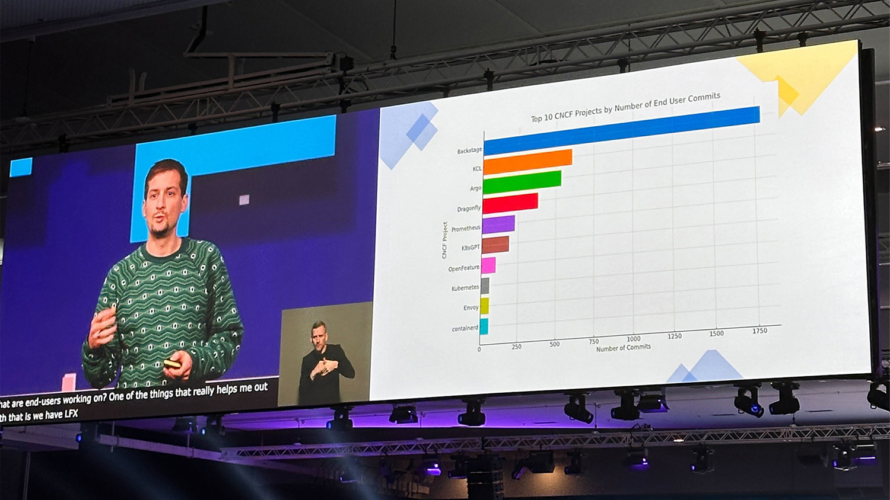

---
# prettier-ignore
title: "Backstage in Paris: Wrapping up BackstageCon and KubeCon + CloudNativeCon Europe 2024"
author: André Wanlin, Spotify
authorURL: https://github.com/awanlin
authorImageURL: https://avatars.githubusercontent.com/u/67169551?v=4
---

**tl;dr**: And with that the first BackstageCon Europe comes to an end! The City of Light was good to Backstage with many great conversations at both BackstageCon and KubeCon + CloudNativeCon Europe 2024. If you weren't able to join, the CNCF has a great playlist of all the [BackstageCon talks](https://www.youtube.com/playlist?list=PLj6h78yzYM2P4KPyeDFexAVm6ZvfAWMU8) ready to go on YouTube. Check out some of the highlights below — then grab your popcorn and settle in!

{/* truncate */}

## Celebrating Four Years of Backstage

<iframe
  src="https://www.youtube.com/embed/NgYrweEbFNE"
  width="100%"
  height="440"
  allow="accelerometer; autoplay; encrypted-media; gyroscope; picture-in-picture"
  allowFullScreen
></iframe>

Wow! Has it already been four years since we open sourced Backstage? What an amazing run it's been so far. We continue to see the rate of pull requests steadily increase, the attendance and number of [special interest groups](https://github.com/backstage/community/tree/main/sigs) (SIGs) has grown, and more people are dedicating their time to new [project areas](https://github.com/backstage/community/tree/main/project-areas)!

## Day 1: BackstageCon arrives in Europe

This was the third BackstageCon and the first to take place outside North America. As you can see, it started with a bang.

Via [Cloud Native Computing Foundation](https://www.flickr.com/photos/143247548@N03/albums/72177720315561784/) on Flickr

With hosts like [Balaji Sivasubramanian](https://www.linkedin.com/in/balajisiva) (Head of Product Management, Red Hat) and [Helen Greul](https://se.linkedin.com/in/elenagreul) (Head of Engineering for Backstage, Spotify) [kicking things off](https://www.youtube.com/watch?v=PwVUW8is_WY&list=PLj6h78yzYM2P4KPyeDFexAVm6ZvfAWMU8&index=2), how could BackstageCon Europe not be a smashing success!

More highlights from the day:

- **Happy alignment:** Do you know when teams really need to be aligned? When they're working at a bank. [Thomas Grønbæk](https://www.linkedin.com/in/thomas-grønbæk/) (Senior Manager, Bankdata) gave an exciting talk about how “[Backstage Made 500+ Developers Happy](https://www.youtube.com/playlist?list=PLj6h78yzYM2P4KPyeDFexAVm6ZvfAWMU8)” in the highly regulated banking industry.
- **Scaling up:** On the topic of scaling Backstage — a frequent subject on our [Discord](https://discord.com/invite/backstage-687207715902193673) — [Vincenzo Scamporlino](https://se.linkedin.com/in/vincenzoscamporlino) (Senior Software Engineer, Spotify) gave us [his recommendations](https://www.youtube.com/playlist?list=PLj6h78yzYM2P4KPyeDFexAVm6ZvfAWMU8) that will be helpful for many adopters who want to bring their instance to the next level.
- **Lightning round:** There were several awesome [lightning talks](https://www.youtube.com/playlist?list=PLj6h78yzYM2P4KPyeDFexAVm6ZvfAWMU8) on varying topics — dynamic plugins, accessibility, OpenAPI tooling, and localization — that left you running to your laptop to learn more!
- **Bonus:** Next door at Platform Engineering Day, [Samantha Coffman](https://uk.linkedin.com/in/samanthacoffman) (Senior Product Manager, Spotify) was representing Backstage in her talk "[Boosting Developer Platform Teams with Product Thinking](https://www.youtube.com/watch?v=Z_KCOcoliLI&list=PLj6h78yzYM2Me-TpMQFvCphDu_xm71ed_&index=12)".

Beyond the talks, it was great to meet so many different members of the community, both those who've been using Backstage since the beginning as well as people who are just learning about internal developer portals and the open source platform. I had so many great conversations, I started to lose my voice — and it was only the first day.

## Day 2: Onward to KubeCon + CloudNativeCon

Backstage also took the spotlight at KubeCon. On Wednesday, project maintainers [Patrik Oldsberg](https://github.com/Rugvip) (Senior Engineer, Spotify) and [Ben Lambert](https://github.com/benjdlambert) (Senior Engineer, Spotify) gave us a great overview on “[The State of Backstage in 2024](https://www.youtube.com/watch?v=jBf3g79xcf4)” to a packed audience. Highlights from their talk include:

- **New project areas:** There are now project areas for Community Plugins, Notifications, and the Scaffolder
- **BEPs (Backstage enhancement proposals):** This is a new formal proposal process that allows a more iterative approach then trying to use GitHub Issues as RFCs
- **Core framework:** They gave updates on the new auth changes to be secure by default, as well as updates on the New Backend System and New Frontend System
- **The future:** Dynamic features! This allows you to install new plugins without having to rebuild

## Day 3: Community, community, community!

To top things off, during his [CNCF Keynote](https://www.youtube.com/watch?v=MICHGBAe8gc&list=PLj6h78yzYM2N8nw1YcqqKveySH6_0VnI0&index=161) on Thursday morning, [Taylor Dolezal](https://www.cncf.io/people/staff/?p=taylor-dolezal) (Head of Ecosystem, The Linux Foundation) shared what should be an unsurprising stat for members of the community: Backstage is the top CNCF project by end user commits!

Top 10 CNCF Projects by Number of End User Commits

## Day 4: Au revoir! See you at the next one!

You can catch up on all the talks from [BackstageCon](https://www.youtube.com/playlist?list=PLj6h78yzYM2P4KPyeDFexAVm6ZvfAWMU8) and the rest of the week on the [CNCF's YouTube channel](https://www.youtube.com/@cncf/playlists). See you in Salt Lake City in November at KubeCon + CloudNativeCon North America!
