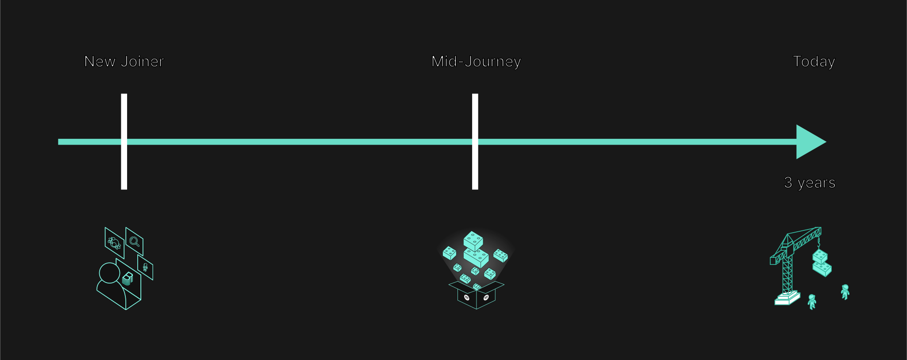

**TL;DR** There is no shortage of content that discusses the benefits that Backstage brings to organizations (and if you want to read more on that, you can just click [here](https://engineering.atspotify.com/?c=backstage), [here](https://backstage.io/blog), or [here](https://backstage.spotify.com/discover/blog/)). But I want to share what it did for me, a developer here at Spotify. And not just what it did, but how I’ve used Backstage to help me achieve goals at each stage of my journey at Spotify — from my first day as a brand new employee to today, my 1,186th day as a contributor.

{/* truncate */}

## A new joiner with a need to get up to speed

My first six months after joining Spotify, I was eager and determined to get up to speed so that I’d be able to start contributing as soon as possible. I set goals for myself and developed concrete activities to reach those goals:

### Goal 1: Learn the internal process to develop, test, secure, and publish applications.

Understanding a company’s practices and technologies is absolutely essential to getting started, no matter what company you join.

At Spotify, we use a Backstage plugin called [TechDocs](https://backstage.io/docs/features/techdocs/) to document [Golden Paths](https://engineering.atspotify.com/2020/08/how-we-use-golden-paths-to-solve-fragmentation-in-our-software-ecosystem/) — tutorials that teach us the development process for each role at the company — for web, backend, mobile, data science development, and so on.

With Backstage, I had an understanding of how to put things into production, even before I had my first task. I used the web Golden Path to guide me on setting up my environment; creating and structuring projects; and building, publishing, and monitoring production applications.

> **Reflection:** _“Is it easy for newly hired engineers to settle in and find information critical to getting started?”_

With Backstage, new hires can quickly and easily understand the nuances of their particular positions and be ready to deliver their first task to production.

### Goal 2: Find and read the documentation and source code of the products my team maintains.

Having familiarized myself with the ways of working, it was a good time to understand my specific team’s business domain. This meant spending time reading through documentation and source code to find out the value we provide to our customers. In the past, I would spend time with colleagues for knowledge transfer as opposed to learning on my own and consult my colleagues if needed.

With the [Backstage Software Catalog](https://backstage.io/docs/features/software-catalog/), I could easily browse the components my team owns, find the source repo and documentation.

> **Reflection:** _“Are you able to accomplish this without asking a teammate for help?”_

Use Backstage to get to know the products that you will be working on, and use your peers' time to ask contextualized clarifying questions instead.

### Goal 3: Figure out where my team fits within the company and with other teams.

It was also crucial for me to build a network from the beginning so that I could explore collaboration opportunities.

At Spotify, we use a Backstage plugin called Band Manager which displays information about each team and allows employees to see not only their own teams but also those within the same product area and company domain.

> **Reflection:** _“Are you going to need a one-on-one with your manager to ask this question?”_

Backstage helped me find the teams close to mine, and I took the opportunity to develop my network and talk to members from those teams to understand our boundaries and gather ideas to contribute.

It’s pretty likely that you can relate to one or more of these examples, so use Backstage to support your goals from the very beginning!

Now let’s move on to the middle of the journey, between six months and two years into life at the company.

## Two years in — from contributor to leader

After about two years of contributing to my team’s products, I began to look for opportunities to actually lead initiatives and create a new project. One of my objectives was to ensure I was upholding Spotify’s standards and choosing Spotify-approved technologies.

My goal has changed from being a contributor to being the driver, i.e., from doing what I was told to do to defining what needed to be done. I “started driving initiatives” and “supporting my peers” in order to position myself as a reference in my technical area.

### Goal 1: Quickly spin up new projects using the most appropriate technology stack.

At Spotify, we expect engineers to use technologies approved by our [Tech Radar](https://backstage.io/blog/2020/05/14/tech-radar-plugin/#what-is-tech-radar) and follow the best quality standards.

To do so, we use a plugin called [Scaffolder](https://backstage.io/api/stable/modules/_backstage_plugin-scaffolder.html) (aka Software Templates), which allows engineers to create templates for setting up new projects. Templates automate actions such as creating repositories, allocating resources, registering in the catalog, configuring deployments, and connecting to other internal systems.

> **Reflection:** _“Do you need to create a ticket to get these things done before you even start coding? And is there a lot of time spent looking for boilerplate code to start a new project and connecting it to other internal systems?"_

Backstage enabled me to quickly create and publish a new backend that can deploy code to production with just a few clicks, so I could focus on building solutions for the business. I could use Backstage to easily build the right thing. Instead of spending time scaffolding projects, I could spend my time writing code.

### Goal 2: Create products that have a healthy operational state and are easy to evolve.

Keeping track of vulnerabilities and letting my team know about technical debts were other parts of my routine.

With the [Soundcheck plugin](https://backstage.spotify.com/marketplace/spotify/plugin/soundcheck/), developers can easily configure checks to verify component health, such as reliability and other development and operational standards. We also have an internal Vulnerabilities plugin that displays fragilities in our components, so we can continuously prevent security issues.

> **Reflection:** _“Do you know which components owned by your team follows best practices and standards and which ones are lagging behind?”_

Backstage helped me gather and better understand our technical debts, enabling me to effectively prioritize during our team’s planning, visualize which entities were compliant to our team’s best practices, and identify which ones needed improvement.

### Goal 3: Respond effectively to incidents within our components or their dependencies.

If you’ve been with a company for around two years, you might have had to manage incidents in one way or another — this was certainly the case for me. A typical problem was to determine if the issue is with the service that I own or a downstream dependency.

Spotify has adopted [PagerDuty](https://backstage.spotify.com/marketplace/pagerduty/plugin/pagerduty/) to manage on-call rotation and to track incident resolutions. We integrated the PagerDuty plugin in Backstage, so we see who is on call and if there is an incident for a particular component.

> **Reflection:** _“When a downstream dependency is failing, do you know who to contact?”_

In the event that one of our components starts failing, I check whether any of the systems we rely on is experiencing an incident, and Backstage again makes it easy for me to see the dependencies between systems and the status of those dependencies.

## Today and beyond!

With three-plus years of experience at Spotify, I’m taking on more and more responsibility by embracing challenges outside my team’s scope, coordinating cross-team collaboration, attending and facilitating courses for personal development and growth, and mentoring my peers.

Backstage has allowed me to drive my pursuit of growth in a multitude of ways.

### Goal 1: Stay in the flow and optimize my time management practices.

At this point, finding time to focus — with all that I have on my plate — while also making time to learn new concepts is both fundamental and challenging for me.

Spotify encourages its developers to manage their time in order to stay in the flow and to turn to the tools that help them prioritize effectively and focus on their work.

> **Reflection:** _“How do you surface the most important notifications and avoid non-emergency distractions?”_

Backstage has been instrumental in helping me stay in the flow by surfacing the most critical notifications and call to actions related to cost spikes, security vulnerabilities in my homepage.

### Goal 2: Platformize our solutions and reuse code to boost my productivity.

Reinventing the wheel is a common problem in software development and Spotify is no different.

Autonomous teams tend to prioritize speed over reuse and develop the same solutions in different places (1) as it unblocks the delivery for their team and (2) there is no easy way to discover if a particular functionality has been developed in another part of the company and if it can be reused for their requirement.

> **Reflection:** _“Do you find yourself wondering if someone else already did it before starting a task?”_

With the [Backstage Search plugin](https://backstage.io/docs/features/search/), I can discover solutions to reuse, find inspiration, and also share what I’ve built for other developers to discover and use.

### Goal 3: Grow my career and take steps toward the next level.

I began looking for opportunities to gain new experiences and responsibilities while expanding my knowledge.

With Spotify’s [Skill Exchange plugin](https://backstage.spotify.com/marketplace/spotify/plugin/skill-exchange/) for Backstage, engineers temporarily embed with a different team, allowing them to partake in work outside their day-to-day. The plugin also helps engineers connect with mentees or mentors that align with their skills profiles.

> **Reflection:** _“Are you able to find opportunities that match your current skill set?”_

With Backstage, I've applied for an embed to experience working with another team and eventually make a permanent move to this new team, calling it my new home.

I am passionate about teaching and eager to share my knowledge to help others. Through Skill Exchange, I found a mentee, a colleague transitioning into engineering, and I am helping them take their first steps.

## What’s next?

Backstage is highly customizable, and with its extensive plugin ecosystem, engineers can use it strategically to achieve their goals.

No matter what point in your journey you are, you can find value with [Backstage](http://backstage.io). It was, after all, made by engineers for engineers. 💚

Special thanks to [Stanley Nicholl](https://github.com/stanley-nicholl), [Patrik Oldsberg](https://github.com/Rugvip), [Vincenzo Scamporlino](https://github.com/vinzscam), [Mihai Tabara](https://github.com/MihaiTabara), [Emma Indal](https://github.com/emmaindal), [Raghunandan Balachandran](https://github.com/soapraj) for all of their support.
