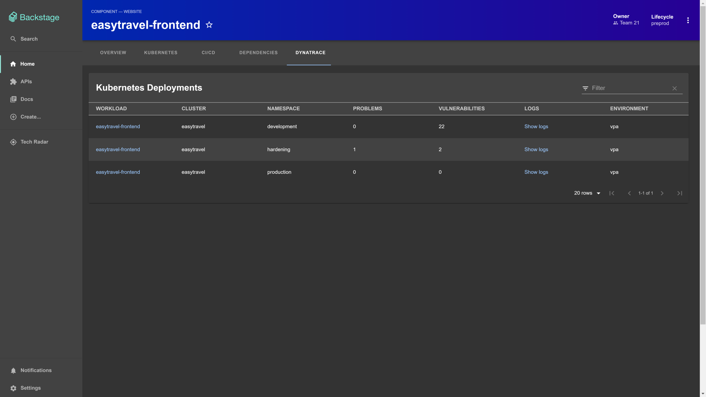

**TL;DR**
To enhance the developer experience, Dynatrace adopted Backstage as its central developer portal and enhances Backstage entities with real-time data. This decision, along with the symbiosis between the Dynatrace platform and Backstage, has unlocked two significant opportunities.

- First, centralizing all development-related artifacts and democratizing ownership have reduced onboarding time for our teams.
- Second, we enhanced the developer experience by integrating observability and security data into Backstage, offering seamless entry points to Dynatrace for in-depth analysis.

{/* truncate */}

## Why and how Dynatrace rolled out Backstage

A few years ago, Dynatrace developers worked with large monolithic repositories to develop functionality for our platform’s agent and server sides. The server component was particularly large, consisting of 260 Gradle projects in a single repository. This setup centralized development processes for the developers, making it easier for them to push the code while versioning, delivery, and hotfixes were handled automatically. However, maintaining the speed and manageability of these processes required a lot of effort.

Dynatrace decided to move towards the current Dynatrace platform model as the next evolutionary step of our product. This decision led to an architectural change of splitting the monolithic repository into multiple projects. The platform is designed to enable the development of apps on top of platform capabilities to unlock faster innovations and decouple them from the release cycles of other components. Based on this decision, it became apparent that the number of platform components and individual apps would increase significantly, eliminating the option of a single repository to unify all processes. Besides, the risk of increasing cognitive load in software development was high due to development being spread across multiple touchpoints, a challenge discussed in research for years ([Sweller, 1988](<https://doi.org/10.1016/0364-0213(88)90023-7>), [Robert, 2008](https://dl.acm.org/doi/10.5555/1388398)). Consequently, the need to standardize project creation became crucial to ensure corporate governance and compliance even before the first commit was pushed.

<!-- References:
[^1]: John Sweller, Cognitive load during problem solving: Effects on learning, Cognitive Science, Volume 12, Issue 2, 1988, Pages 257-285, ISSN 0364-0213, https://doi.org/10.1016/0364-0213(88)90023-7.
[^2]: Robert C. Martin Series, Clean Code: A Handbook of Agile Software Craftsmanship (Robert C. Martin Series), 2008, ISBN 9780132350884.
-->

Therefore, the Dynatrace Platform Engineering team initiated a project to standardize and simplify the process for starting service or application development. This effort was initially named “project initializer” and launched around the same time Backstage joined the CNCF. Although the platform engineering team saw initial success with the project initializer, we quickly realized that there was a greater demand for centralizing development activities and providing appropriate guidelines. For example, we noted that the complexity of integrating new code had shifted from the build phase to the deployment phase, transferring relatively complex integration tasks from continuous integration to continuous deployment. Overall, the main requirements and focal points were:

- **Ownership**: Who is responsible for which service or app? Who owns infrastructure resources?
- **Documentation**: Where is the documentation of a service or app?
- **CI/CD view**: How does the build pipeline in GitHub/Jenkins progress, and what about the ArgoCD deployment?
- **Dependency management**: Do we know which APIs are used?
- **Observability and security**: Where is a service deployed, and is it healthy and secure?

For more details on Dynatrace's adoption of Backstage, please watch the recording, [How We Made Backstage Improve Developer Efficiency of 1000+ Engineers](https://www.youtube.com/watch?v=0or5K_3HieA), BackstageCon, November 6, 2023 in Chicago. Illinois.

## Quick wins with ownership democratization and self-service templates

The discussion on whether to make, buy, or adopt led us to heavily favor Backstage as the chosen solution for our internal developer platform (IDP). We have successfully integrated Backstage within Dynatrace, marking our early wins. This was accomplished by linking it to our internal team management solution. Feeding this data into Backstage resolved the previously lacking transparency concerning the responsibilities and ownership of services and infrastructure. Furthermore, we have contextualized Stack Overflow and CI/CD solutions with entities monitored by Backstage to fulfill developers' requests for a unified view.

Next to establishing a solid software catalog view, providing self-service templates for project and infrastructure creation—initially a focus of the original developer experience—has also been incorporated into Backstage. This enhancement allows the use of a comprehensive set of templates for bootstrapping platform services or applications across different tool stacks. Ultimately, developers can effortlessly use a template to create a ready-to-use repository with observability and security pre-configured.

## Static model enrichment with real-time observability and security

After addressing ownership, documentation, and a centralized CI/CD view, our developers highlighted the necessity of accessing real-time data about their services and applications within the Backstage service catalog. This need arose from the understanding that integrating a code change can be optimally evaluated on a deployed version of their service alongside related components. Specifically, the developers were interested in seeing at a high level:

- Where specific versions of services are deployed,
- How their services perform in the hardening phase and production environments,
- Which inbound and outbound dependencies their service has,
- Whether any problems, security vulnerabilities, or SLO breaches are related to their service, and
- Which recent error logs have been collected.

The open source community already developed a Backstage plugin capable of fetching Dynatrace problems and synthetics into Backstage. However, we chose to develop a new plugin that works with the new Dynatrace platform API. Additionally, it was necessary to support Kubernetes use cases by default to offer, for example, deployment overviews out-of-the-box. Based on the feedback from developers, we identified four essential requirements.

### Coverage of the software development lifecycle

Observing the software development lifecycle necessitates consolidating all development and delivery phases. In Dynatrace, monitoring the development stage is distinct from rolling out new versions to the hardening and production stages. Nonetheless, developers desire an end-to-end view from development to production. To support this, the plugin allows connections to multiple Dynatrace environments to retrieve data for the various rollout phases.

### Kubernetes observability

When using the Backstage Kubernetes plugin, an annotation is required to surface your Kubernetes components as part of an entity (for more information, please refer to [Backstage documentation](https://backstage.io/docs/features/kubernetes/configuration/#surfacing-your-kubernetes-components-as-part-of-an-entity)). The Dynatrace plugin utilizes this convention to automatically populate monitoring data from Kubernetes deployments into the deployment overview in Backstage. Therefore, additional configuration is unnecessary to enrich Backstage entities with real-time observability data from Kubernetes, as shown below. Additionally, deep links open Dynatrace analysis views for more contextual details.

### Reliability and security in context

While Kubernetes observability was requested to be provided out of the box, we quickly realized that developers prefer to define the insights they want to see by themselves. To remain flexible and to reduce the customization effort required from the platform engineering teams, the plugin allows for the definition of custom queries within the `config.yaml` file. The Backstage `config.yaml` file requires special attention since platform teams use this file to standardize entity specifications, while developers use it to customize their Backstage views. After releasing this new functionality, we observed developers moving in two distinct directions:

- Querying quality gate validation results of a new version they’re developing

- Fetching runtime security vulnerability information across different stages

### Error logs at hand

Developers love logs. Direct access to logs, especially error logs, was a crucial requirement for the plugin. Our developers want to see the current number of error logs accompanied by a direct link to the raw log line, which provides significant value in problem triaging and fixing. With the plugin, we offer a high-level overview of log statistics, with the rich analysis capabilities of Dynatrace available at a single click.

## Conclusion

To enhance the developer experience, Dynatrace adopted Backstage as its central developer portal and enhances Backstage entities with real-time data. This decision, along with the symbiosis between the Dynatrace platform and Backstage, has unlocked two significant opportunities.

First, centralizing all development-related artifacts and democratizing ownership have reduced onboarding time for our teams. Although it might seem that onboarding time is only relevant for new developers, it is also important when developers move to a different team, pick up a service or application they haven’t worked on for a while, or replace their laptops. Moreover, a low onboarding time is crucial when quickly kicking off work on a new service or solution app. This became a necessity with the new Dynatrace platform.

Second, we enhanced the developer experience by integrating observability and security data into Backstage, offering seamless entry points to Dynatrace for in-depth analysis. This improvement was crucial as we noted a shift in integration tasks from build to development time, necessitating insights into a later phase of the software lifecycle for our developers. In essence, end-to-end validation of code changes could no longer be accomplished with build pipelines—either in Jenkins or GitHub—but required deployment in production-like environments that facilitate real-world interaction with other components. Consequently, real-time observability data from these environments must be relayed to the developer.

## What`s next?

Backstage is a crucial element for Dynatrace's developer experience, providing out-of-the-box core functionality for every developer and supporting extensibility where needed. Our Backstage extension is maintained as an open-source project and is available for every Backstage user. Don't hesitate to utilize it or to contribute: https://github.com/Dynatrace/backstage-plugin

If you have a great Backstage story to tell, please share your experience with us to the variety of use case areas.
