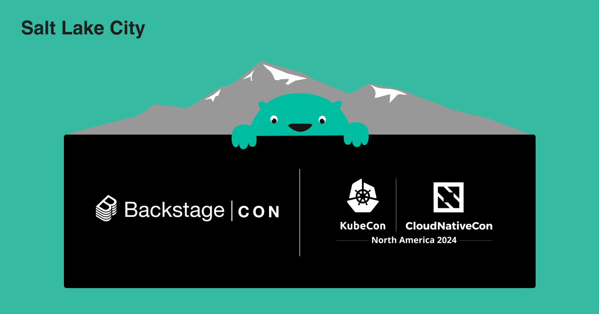
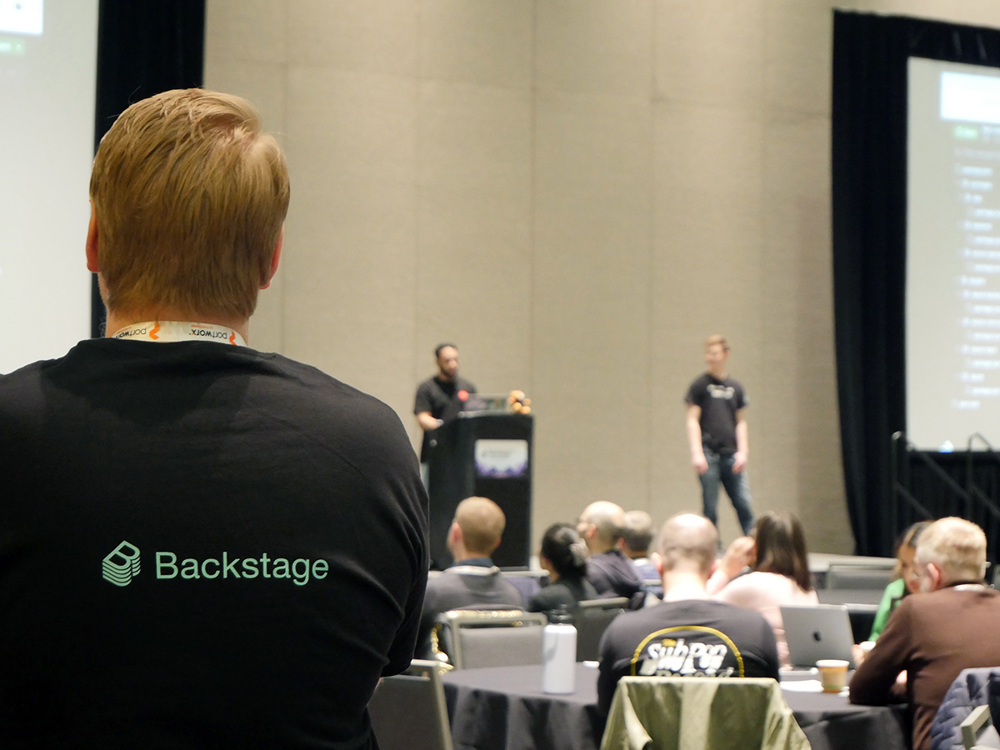
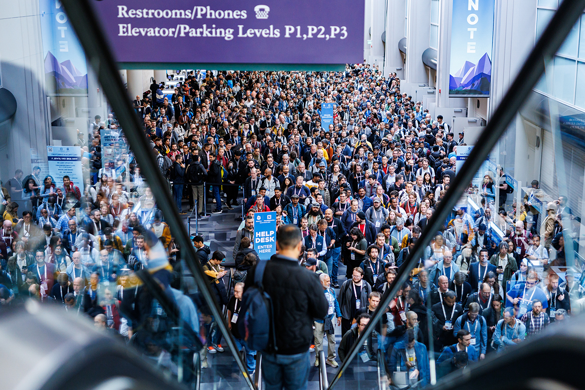
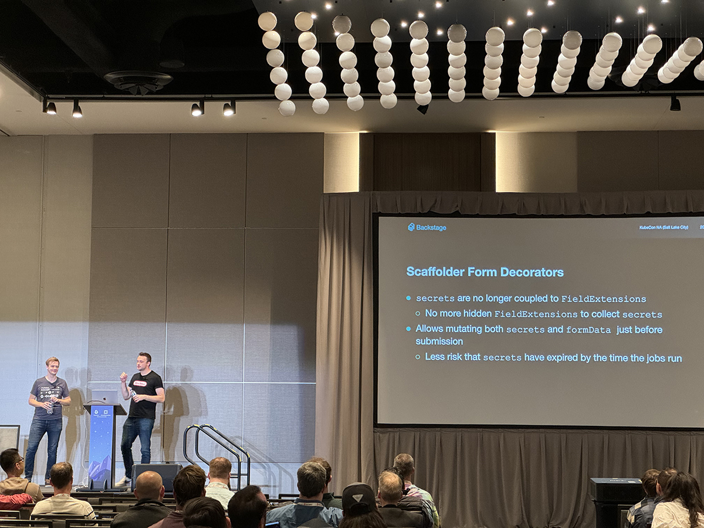
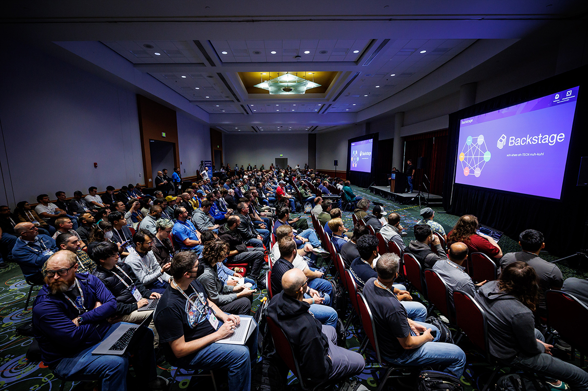
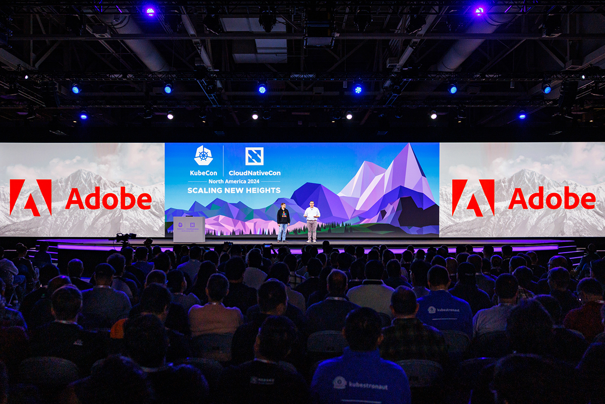
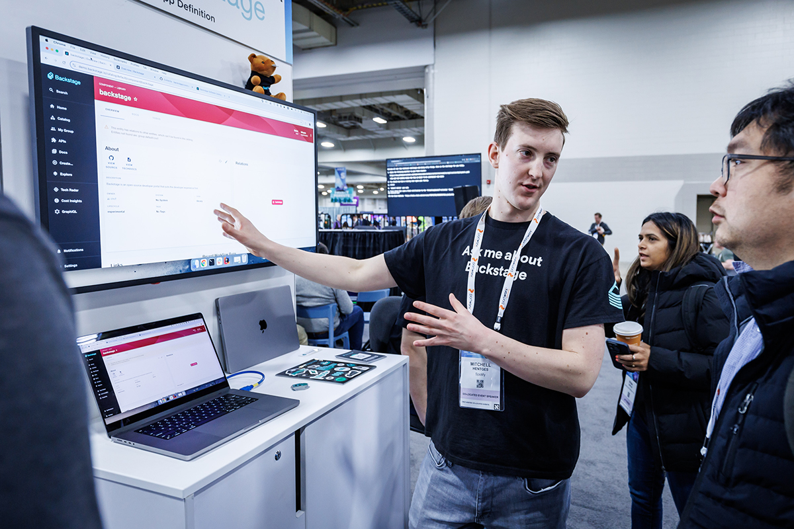
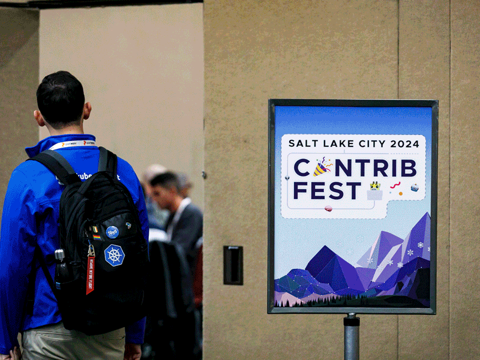
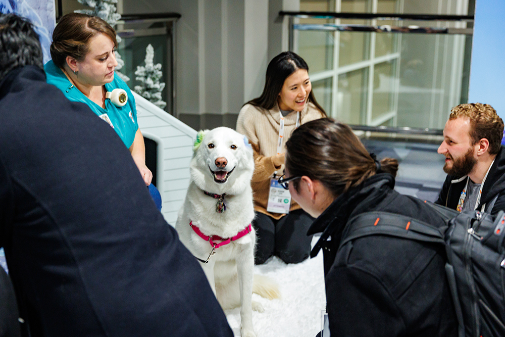

---
# prettier-ignore
title: "Backstage in Salt Lake City: Highlights from BackstageCon and KubeCon + CloudNativeCon North America 2024"
author: André Wanlin, Spotify & Camila Loiola, Spotify
---

**tl;dr:** Salt Lake City did not disappoint! Backstage continues to be at the forefront of many conversations being had at BackstageCon and across KubeCon + CloudNativeCon. If you weren't able to join us, all the [BackstageCon talks][yt] are available for replay on YouTube. Read on for the highlights — plus, photos of super cute pups — as a treat! 🐕

[yt]: https://www.youtube.com/playlist?list=PL8iP9yIjU0Q3UUDXdAoCaTC4Ci8asWg-X

{/* truncate */}

## What everyone was talking about at BackstageCon🦫

[BackstageCon](https://events.linuxfoundation.org/kubecon-cloudnativecon-north-america/co-located-events/backstagecon/) featured a day of talks tailored to the diverse Backstage community. Whether you were an evaluator, adopter, integrator, builder, or an innovator, there was something valuable for everyone. Here were the big themes from the day.

### Evaluating Backstage ROI

- Olivier (Avalia Systems) presented what makes digital portals [helpful to C-level executives][olivier].

- Himanshu (Harness) shared strategies for adopting Backstage in ways that drive [meaningful value for engineers][himanshu].

- Eric (Quantum Metric) explained [how startups can benefit][eric] from what big techies have been contributing to Backstage.

- Tom (Spotify) shared how developer productivity furthers Spotify’s mission to [empower creators][tom] and what the future holds for Backstage.

[olivier]: https://youtu.be/kb3F98fKvaQ?list=PL8iP9yIjU0Q3UUDXdAoCaTC4Ci8asWg-X
[himanshu]: https://youtu.be/FACtDHQvNf0?list=PL8iP9yIjU0Q3UUDXdAoCaTC4Ci8asWg-X
[eric]: https://youtu.be/9qPsuMSw_dM?list=PL8iP9yIjU0Q3UUDXdAoCaTC4Ci8asWg-X
[tom]: https://youtu.be/AU9BwkRMmMY?list=PL8iP9yIjU0Q3UUDXdAoCaTC4Ci8asWg-X

### Sharing Backstage adoption journeys

- A panel discussion — featuring practitioners from Adobe, American Airlines, JPMorgan Chase, Red Hat, and Roku — showcased [real-world adoption stories from large companies][panel], spanning various stages of Backstage usage. Hear how devs at American Airlines can use Scaffolder to get a new site provisioned and deployed on the .aa.com domain in 20 minutes. “I’ve done it in seven,” said Jay Cox, principal engineer. “It used to take a month.”

- Lizzie (Booz Allen Hamilton) explored corporate barriers to Backstage adoption and lessons learned along the way, including how to navigate [cultural tensions][lizzie] and the importance of listening to your devs, in order to bring the latest advancements in developer experience to a government consulting company that’s going on “110 years young”.

- Amber and Daniel (Liatrio) elaborated on why [automated governance][amber] belongs inside Backstage portals to facilitate centralized compliance — so your devs don't get held up from going to prod by unforeseen checks.

[panel]: https://youtu.be/DAjhjS2Xg4Q?list=PL8iP9yIjU0Q3UUDXdAoCaTC4Ci8asWg-X
[lizzie]: https://youtu.be/RTYVmMbkdNA?list=PL8iP9yIjU0Q3UUDXdAoCaTC4Ci8asWg-X
[amber]: https://youtu.be/GaGbjMJCcRU?list=PL8iP9yIjU0Q3UUDXdAoCaTC4Ci8asWg-X

### Maintaining a Backstage instance

- Djamaile and Mitch (Spotify) provided [actionable tips][djamaile] for managing Backstage instances, including how to keep them aligned with the latest open source features.

- Ashna and Mesut (Booking.com) showed how to customize your instance to mirror your company's unique identity and how to leverage reusability for a [smoother user experience for your devs][ashna].

- Paul (Red Hat) presented a [platform engineer’s POV][paul] of what it means to maintain a Backstage instance.

- Yishai (Linear B) spoke about how to approach software engineering intelligence (SEI) and developer productivity metrics inside Backstage, including [do’s and don’ts][yishai].

[djamaile]: https://youtu.be/dbLqwEVl52U?list=PL8iP9yIjU0Q3UUDXdAoCaTC4Ci8asWg-X
[ashna]: https://youtu.be/QV40Yz2i3jQ?list=PL8iP9yIjU0Q3UUDXdAoCaTC4Ci8asWg-X
[paul]: https://youtu.be/CtbfN--mJkE?list=PL8iP9yIjU0Q3UUDXdAoCaTC4Ci8asWg-X
[yishai]: https://youtu.be/mxVW2AGoI3A?list=PL8iP9yIjU0Q3UUDXdAoCaTC4Ci8asWg-X

### Building with Backstage core features

- Avantika and Emma (Spotify) walked us through the advantages of the new backend system, recommending [best practices for plugin development][tika] and showcasing why migrating to this updated version is an extensibility game changer.

- Will and Ryan (Microsoft) shared how Software Catalog and Templates provide the model to [build visualizations][will] of your cloud native applications.

[tika]: https://youtu.be/n7GUlLHN2tQ?list=PL8iP9yIjU0Q3UUDXdAoCaTC4Ci8asWg-X
[will]: https://youtu.be/U2-Lo-yuvdc?list=PL8iP9yIjU0Q3UUDXdAoCaTC4Ci8asWg-X

### AI-powered Backstage plugins and modules

Innovative use cases featuring AI integration took center stage.

- Niall (Amazon Web Services) demonstrated how to [interact with plugin services][niall] using artificial intelligence prompts.

- Ben (Red Hat) outlined [broader AI integrations][ben] to enhance Backstage, sparking exciting possibilities for the future.

The sessions offered a wealth of knowledge and inspiration, underscoring the versatility and potential of Backstage for organizations at every level. The Backstage booth was hopping all day long as community members and cloud natives took advantage of being able to ask the experts questions and learn more about the project.

[niall]: https://youtu.be/DCXzCrIDOAs?list=PL8iP9yIjU0Q3UUDXdAoCaTC4Ci8asWg-X
[ben]: https://youtu.be/cl6E0A5R_nI?list=PL8iP9yIjU0Q3UUDXdAoCaTC4Ci8asWg-X

## Backstage at the big show: KubeCon⎈ + CloudNativeCon☁️

📸 _[See more KubeCon photos from the CNCF’s Flickr album](https://www.flickr.com/photos/143247548@N03/albums/72177720321905538/) →_

My friends, what an intense conference!

Over the course of three packed days, there were a bunch of activities, including talks, a kiosk, and a Contribfest, all centered around Backstage.

### Maintainers take the stage

This may be old hat for those who are regular KubeCon attendees, but it’s still pretty exciting to catch up on all the Backstage updates straight from the core maintainers. Spotify’s Ben Lambert and Patrik Oldsberg were in the spotlight in Ballroom C addressing an attentive crowd of Backstage adopters, users, and fans.

Highlights of their maintainers talk include:

- **Project updates:** Yarn 4 is now the default, the new built-in event bus has arrived, and the (New) Backend System is now 1.0!
- **Security Audit:** Another security audit has been completed with the helpful support of the CNCF
- **Scaffolder updates:** Addition of Form Decorators and support for Retries!
- **New Frontend System:** Focus on the plugin builder experience!

Watch their entire talk — “[How to Expand Your IDP: The New Building Blocks of Backstage](https://youtu.be/BzPCJMQH8tg?list=PL8iP9yIjU0Q3UUDXdAoCaTC4Ci8asWg-X)” — for all the details.

### Toyota and Akamai in the house

📸 [CNCF](https://www.flickr.com/photos/143247548@N03/albums/72177720321905538/)

There were great talks from Backstage adopters during KubeCon, too. Toyota and Akamai packed the rooms with their Backstage knowledge.

- “[Shifting Gears: Leveraging CNCF Tools to Streamline Operations at Toyota Connected][toyota]”: Benson and Rob talk about failures and successes adopting CNCF tools (including ArgoCD and Backstage) to unify operations, streamline workflows, and enhance cross-team collaboration.

- “[From Chaos to Calm: Building a Unified and Scalable CI/CD Pipeline at Akamai][akamai]”: Tomer dives into development efficiency and how you can “conquer cloud-native deployments by adding the right tools, such as Argo Rollouts and Backstage”.

[toyota]: https://youtu.be/4w_AC81_GZM?list=PL8iP9yIjU0Q3UUDXdAoCaTC4Ci8asWg-X&t=856
[akamai]: https://youtu.be/RFVB9CEEn1I?list=PL8iP9yIjU0Q3UUDXdAoCaTC4Ci8asWg-X

### And the award goes to…

📸 [CNCF](https://www.flickr.com/photos/143247548@N03/albums/72177720321905538/)

Adobe gave a shoutout to Backstage from the Keynote mainstage on Thursday morning when they (spoiler alert) [accepted the CNCF’s Top End User Award][keynote], thanking the cloud native community and all the projects that they use.

But Adobe isn’t just a Backstage adopter, they are a model citizen — giving back to the community through their example, having “developed a reference architecture for its IDP, built using Argo, Backstage, Helm, and Kubernetes, which other organizations can use as a template for designing and implementing their systems”.

As Taylor Dolezal, head of ecosystem at the CNCF, [says][announcement]: “Their commitment to nurturing technological excellence and developer experience exemplifies what we hope to see in the end user ecosystem. It’s not just about tool adoption or code contributions — it’s about synthesizing these learnings into assets that empower others in their cloud native journeys.”

Way to go, Adobe!

[keynote]: https://youtu.be/p7J0lAU3AWo
[announcement]: https://www.cncf.io/announcements/2024/11/14/cncf-presents-top-end-user-award-to-adobe/

### A bustling CNCF project pavilion

📸 [CNCF](https://www.flickr.com/photos/143247548@N03/albums/72177720321905538/)

The CNCF Projects Pavilion was buzzing with activity all week, and the Backstage kiosk was a hub of excitement. Attendees stopped by with a mix of curiosity and enthusiasm, sparking conversations that highlighted the dynamic nature of our community.

Curious visitors asked, “What is Backstage all about?”, while adopters sought personalized advice on customizing Backstage for their specific company needs. Contributors dropped in to say, “Hey, you reviewed my pull request!” And professionals proudly shared their achievements as Backstage experts — in fact, now there’s a way to make that expertise official — by becoming a [Certified Backstage Associate (CBA)](https://training.linuxfoundation.org/blog/just-launched-certified-backstage-associate-cba/), a new certification that was just launched by the CNCF and The Linux Foundation.

Developers eager to give back to the community came to learn how to start contributing, and some of the kindest Backstage fans simply stopped by to say, “Thank you”. Their gratitude and encouragement are a powerful reminder of why we do what we do.

Every interaction in person made the day special, and we wrapped up with a deep sense of fulfillment and pride in how far Backstage has come. Here's to building an even brighter future together!

## Contribfest! It’s All About Community👩‍💻

📸 Spotify, [CNCF](https://www.flickr.com/photos/143247548@N03/albums/72177720321905538/)

On Thursday, the first-ever Backstage Contribfest session took place — hosted by Yi Cai and Paul Schultz from Red Hat, and André Wanlin, Patrik Oldsberg, and Ben Lambert from Spotify.

Participants who hadn't yet used or contributed to Backstage eagerly joined the project's contributors community and were eager to help. Together with the group, experienced Backstage engineers stepped in to assist attendees — whether troubleshooting environment setup or explaining how specific framework and plugin features are implemented. It was a great example of a community coming together to support learning and contribution.

The energy in the room, with 60 enthusiastic participants, was absolutely electric! It was amazing to see ideas bouncing around, impromptu collaboration happening at every corner, and a shared passion for advancing the Backstage project.

Among the great contributions to come out of this event are:

- [Add Pagination to Tech Docs Table](https://github.com/backstage/backstage/pull/27694)
- [Add Home Page Quick Start Card](https://github.com/backstage/backstage/pull/27705)
- [Truncate commit message to first newline](https://github.com/backstage/community-plugins/pull/2012)

A heartfelt thank you to everyone who joined us — it’s your talent and collaborative spirit that truly define the Backstage community. This event was a powerful reminder that it’s the people behind the project who make Backstage what it is today 💚.

And if you missed out on the fun, it's never too late to join the Backstage community. Just follow along with the [Contribfest slide deck](https://static.sched.com/hosted_files/kccncna2024/53/KubeCon-ContribFest-Backstage-NA-2024.pdf) to get started with contributing!

## Bonus pups!🐕

Nothing improves developer experience like hanging out with some fluffy friends. So please enjoy these photos from KubeCon’s “[Pet A Pup](https://www.flickr.com/photos/143247548@N03/albums/72177720321905538/with/54155382123)” station.

(All 📸 [CNCF](https://www.flickr.com/photos/143247548@N03/albums/72177720321905538/with/54155382123). Please note: the last pup is not a pup.)

The best labrador-retriever pup graciously accepting pets from the cloud native community.

The best fluffy white pup surrounded by admirers.

The best racing-style pup getting face scritches.

The best yellow pup getting pets from his twinsie.

See? Not a pup. But did get pets.

[You, too, can give these pups some love](https://www.therapyanimalsutah.org).

## Cheerio! We’ll see you in London!💂

And that’s a wrap on Salt Lake City! [Join us in London](https://events.linuxfoundation.org/kubecon-cloudnativecon-europe/) in April for more community-building fun at BackstageCon and KubeCon + CloudNativeCon Europe 2025!
