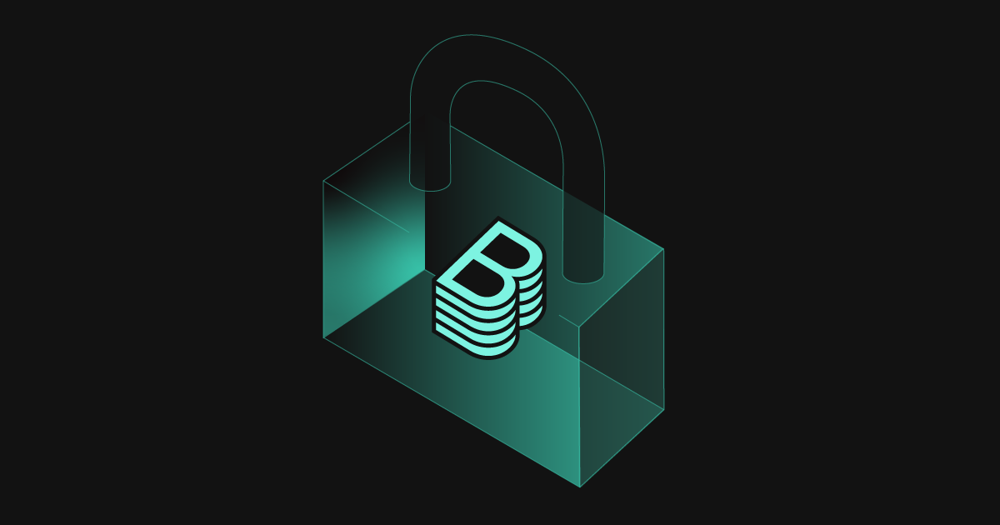

---
# prettier-ignore
title: The 2024 Backstage Security Audit
author: Patrik Oldsberg, Spotify
authorURL: https://github.com/Rugvip
---

**TL;DR** Backstage’s security posture remains strong! Today, we’re releasing the report from the second independent security audit of the Backstage project.

As an [Incubating project](https://www.cncf.io/blog/2022/03/15/backstage-project-joins-the-cncf-incubator/) within the [Cloud Native Computing Foundation](https://www.cncf.io/) (CNCF), Backstage is fortunate enough to take advantage of sponsored continuous security audits. The [Open Source Technology Improvement Fund](https://ostif.org/) (OSTIF) sponsors the audits as part of its ongoing efforts to secure the open source software ecosystem, and the audit itself was performed by [X41 D-Sec](https://x41-dsec.de/), who also performed the first audit. Our goal with the audit was to re-evaluate and further improve Backstage’s security posture, focusing on the core Backstage framework and plugins.

{/* truncate */}

## Report Findings and Fixes

The security audit and improvements concluded on October 16. The audit findings totalled three high and one medium severity vulnerability, alongside seven side findings with no direct security impact. All main findings were remedied in the [Backstage 1.31 release](https://backstage.io/docs/releases/v1.31.0), while the majority of the side findings were addressed by the [1.32 release](https://backstage.io/docs/releases/v1.32.0). For details on all findings, see the [full audit report](assets/2024-12-17/X41-Backstage-Audit-2024.pdf).

We are happy to see that there are no repeated vulnerabilities, perhaps in part due to our new [secure coding practices](https://github.com/backstage/backstage/blob/master/SECURITY.md#coding-practices) following the previous audit, as well as the introduction of the [Backstage Threat Model](https://backstage.io/docs/overview/threat-model). While there was a path traversal vulnerability that was discovered in the TechDocs backend, this was more specific and related to remote paths, rather than the local filesystem. We chose to handle this as an isolated fix as there are no other occurrences of this pattern that we are aware of.

The [previous security audit](https://backstage.io/blog/2022/08/23/backstage-security-audit/) highlighted the need for Backstage to have its own built-in protection, to be secure by default. This, as well as the need for more robust service-to-service auth, was addressed earlier this year through the new auth system, in [1.24](https://backstage.io/docs/releases/v1.24.0#breaking-auth-improvements) and following releases. The new auth system was in scope for this new security audit, and no findings were made in that area.

One area with findings in both audits is the way that the auth plugin backend handles sign-in of users. This is a complex area that can often be a source of friction for the adoption experience of Backstage. As part of this audit we have made several updates especially to the documentation for sign-in resolvers, but this remains an area where it is hard to find a solution that is both simple and secure. Of course we err on the side of caution and have updated our documentation to be more strict. We will continue to explore options for improvements to the sign-in system to keep it both simple and secure out of the box, but in the meantime be sure to read the documentation section [sign-in identity and resolver](https://backstage.io/docs/auth/identity-resolver) as you are setting up Backstage.

We are happy with the results of this security audit, it is yet another way in which we see the continuing maturity of the Backstage projects. On behalf of the Backstage maintainers and community: thanks to the CNCF, OSTIF, and X41 D-Sec for the opportunity to improve the project.

## Links and References

- [X41 Blog Post](https://x41-dsec.de/security/research/job/news/2024/12/16/backstage-review-2024/)
- [OSTIF Blog Post](https://ostif.org/backstage-audit-complete/)
- [Full Audit Report](assets/2024-12-17/X41-Backstage-Audit-2024.pdf)
- [Backstage Threat Model](https://backstage.io/docs/overview/threat-model)
- [Backstage Security Policy](https://github.com/backstage/backstage/blob/master/SECURITY.md)
