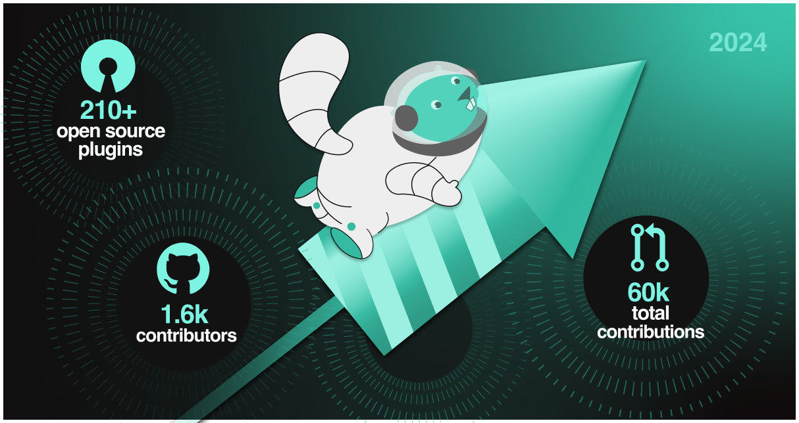
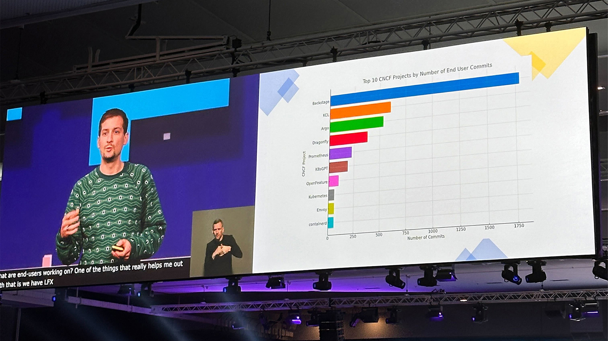
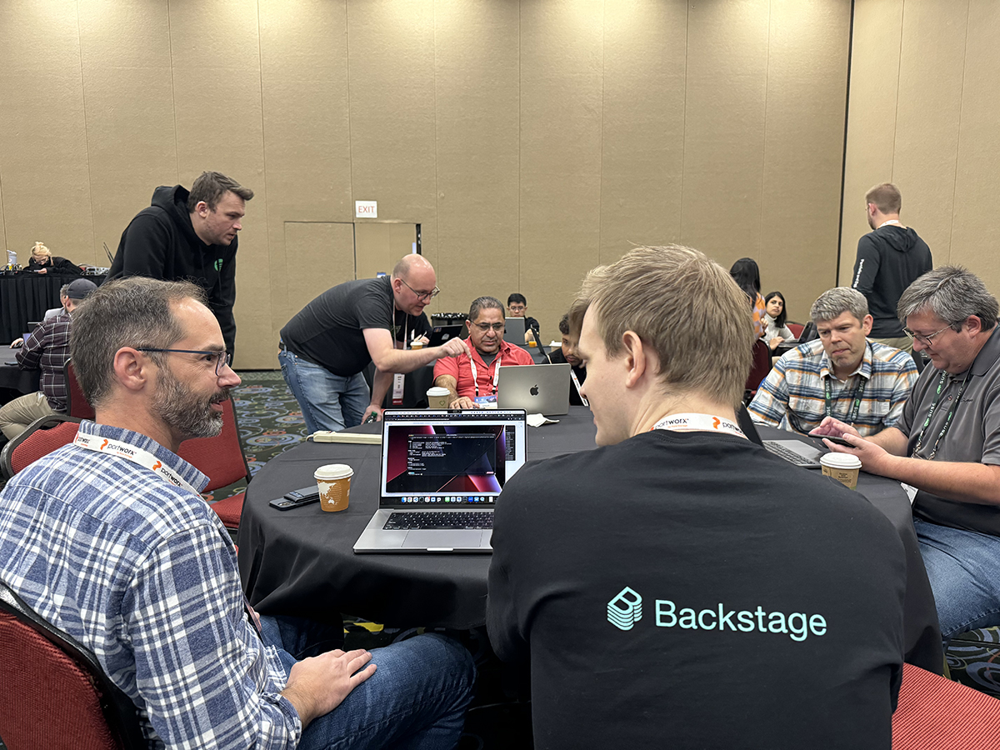
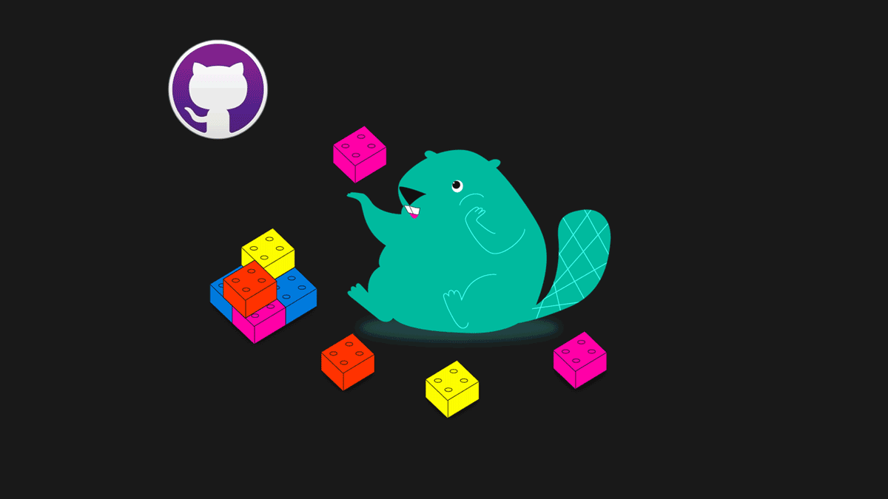
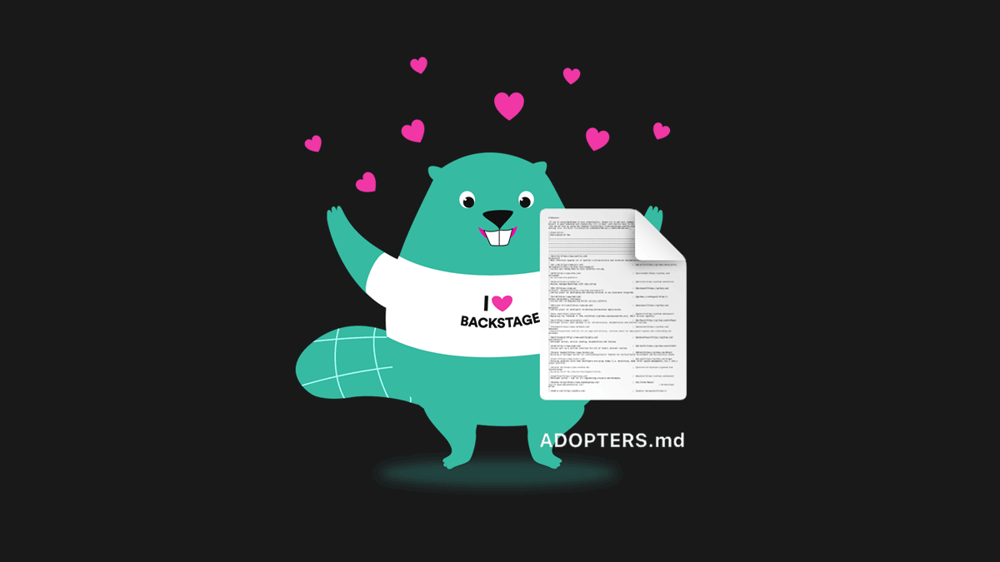
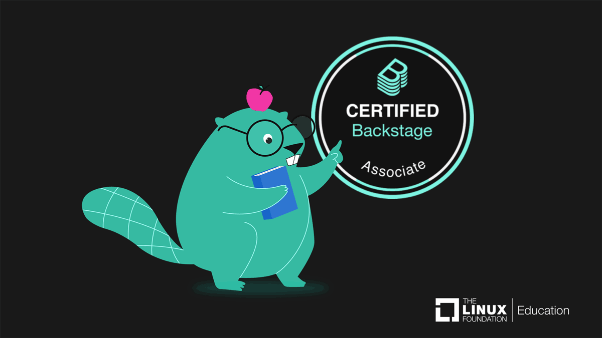
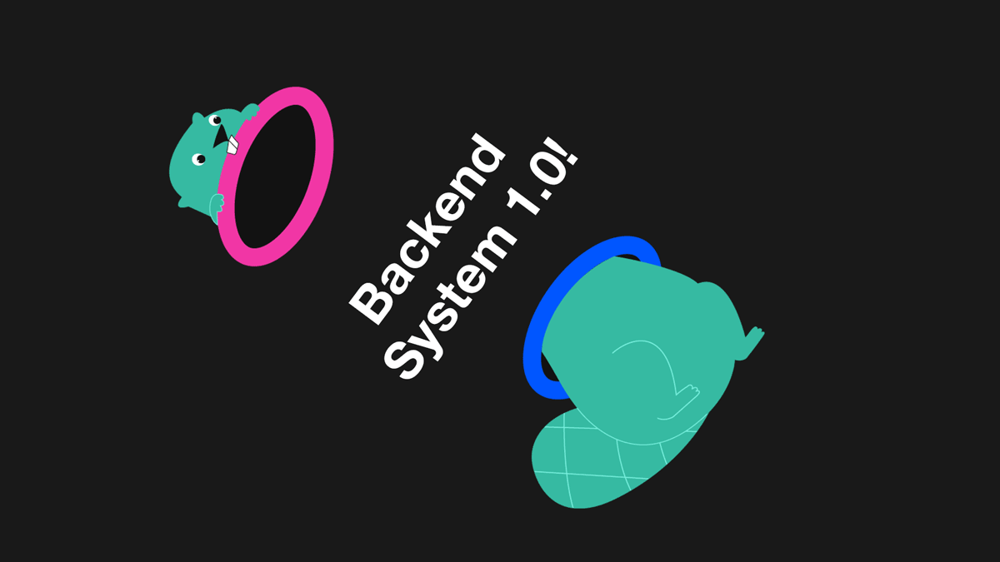
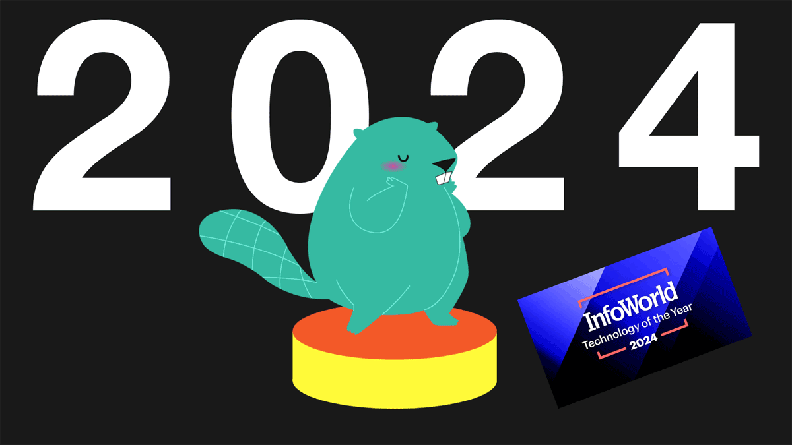

---
# prettier-ignore
title: "Backstage Wrapped 2024: The year's Top 5 milestones and highlights"
author: Patrik Oldsberg, Spotify & Ben Lambert, Spotify
---

It was another banner year for everyone's favorite platform for improving developer experience — and we're closing 2024 out with a bang🧨🎆. To give you a snapshot of how the Backstage community is doing, we're counting down our Top 5 milestones for the year (plus a few other highlights sprinkled in). To start things off, let's see what you and your 1,616 fellow contributors were up to last year…

{/* truncate */}

---

## 5️⃣: 60k+ Contributions from a Global Community of Very Busy Beavers🦫

<iframe
  src="https://www.youtube.com/embed/U0m3TJ-2cFw"
  width="100%"
  height="440"
  allow="accelerometer; autoplay; encrypted-media; gyroscope; picture-in-picture"
  allowFullScreen
></iframe>
_Behold! Every commit to the Backstage open source project this year — can you
see your name in there?_

As we shared last month when we kicked off [BackstageCon North America](https://youtu.be/OfavM6j4Z5o?list=PL8iP9yIjU0Q3UUDXdAoCaTC4Ci8asWg-X&t=112), the Backstage community hit a new milestone this year — reaching 60,000 total contributions (discussions, issues, and pull requests) to the project since Spotify donated it to the [Cloud Native Computing Foundation (CNCF)](https://www.cncf.io/projects/backstage/) in 2020. Busy Backstage beavers, indeed.

And the community was as active as ever in 2024 — if you hit play on the visualization above, you can see all 12.3k commits from the year being made. (Though, instead of busy beavers, it's more like a giant cluster of space spiders shooting galactic laser webs. Pew pew!)

### The most commits of any CNCF project, by a lot

Speaking of commits, rewinding back to [KubeCon + CloudNativeCon Europe](https://backstage.io/blog/2024/03/27/backstagecon-kubecon-24/) in March gives us another way to visualize the mightiness of the Backstage community.

From the keynote stage in Paris, Taylor Dolezal, the head of ecosystem at The Linux Foundation, [presented a chart](https://www.youtube.com/watch?v=MICHGBAe8gc&list=PLj6h78yzYM2N8nw1YcqqKveySH6_0VnI0&index=161) showing the "Top CNCF Projects by Number of End User Commits", using data from the previous four months.

At the top of the chart, a conspicuous blue bar — more than twice the length as the next longest one — had Taylor noting that, among CNCF projects, Backstage was "rocketing into the forefront when it comes to end user contributions".🚀🚀🚀

### Our first Contribfest!

What's better than ogling a nifty visualization or nerding out on a good bar graph? Feeling the buzz of those contributions in person.

Just last month at KubeCon + CloudNativeCon North America, maintainers from Spotify and Red Hat cohosted the first-ever [Backstage Contribfest](https://backstage.io/blog/2024/12/09/kubecon-slc-24/#contribfest-its-all-about-community). We packed the room with engineers obsessed with developer experience and let them loose on a curated list of issues. The session was good, old-fashioned coding fun — devs sharing ideas and solving problems together — and we look forward to doing it again with all of you.

If you missed it and want to get in on the action, just follow along with the [Contribfest slide deck](https://static.sched.com/hosted_files/kccncna2024/53/KubeCon-ContribFest-Backstage-NA-2024.pdf). Or meet us in 💂‍♂️London in April for [BackstageCon](https://events.linuxfoundation.org/kubecon-cloudnativecon-europe/co-located-events/backstagecon/) and [KubeCon + CloudNativeCon Europe 2025](https://events.linuxfoundation.org/kubecon-cloudnativecon-europe/)!

---

## 4️⃣: 210+ Open Source Plugins (and Counting)🧩

_Just a few of the plugins built by the Backstage community_

### Plugins, plugins, plugins

Everybody's building them, everywhere you look. We see official plugins from popular third-party service providers ([DX](https://backstage.spotify.com/marketplace/dx/plugin/dx/), [PagerDuty](https://pagerduty.github.io/backstage-plugin-docs/index.html), [Rootly](https://backstage.spotify.com/marketplace/rootly/plugin/rootly/)), in-house plugins going open source (like these from [DAZN](https://github.com/backstage/community-plugins/blob/main/workspaces/github-pull-requests-board/plugins/github-pull-requests-board/README.md), [Keyloop](https://github.com/backstage/community-plugins/blob/main/workspaces/azure-devops/plugins/azure-devops/README.md), and [SeatGeek](https://github.com/seatgeek/backstage-plugins)), essential plugins built and maintained by ecosystem champions and supporters ([AWS](https://github.com/awslabs/backstage-plugins-for-aws), [GCP](https://github.com/googlecloudplatform/google-cloud-backstage-plugins), [Roadie](https://roadie.io), [Spotify](https://backstage.spotify.com)), as well as creative and [useful](https://github.com/procore-oss/backstage-plugin-announcements) plugins from contributors and enthusiasts from all corners of the Backstage community.

### A yearlong plugin party

In 2024, the plugin ecosystem continued to expand — with about a hundred new plugins being introduced over the year and many others getting big updates.

SeatGeek started the plugin party in February❄️ at a Backstage Community Session where they [demoed](https://www.youtube.com/watch?v=CRw0m3J11Bc&t=526s) five of the seven plugins they've open sourced, including their [Awards Plugin](https://github.com/seatgeek/backstage-plugins/tree/main/plugins/awards) and [Entity Scaffolder Plugin](https://github.com/seatgeek/backstage-plugins/tree/main/plugins/entity-scaffolder-content).

By spring🌷, new plugins for [Linkerd](https://github.com/backstage/community-plugins/tree/main/workspaces/linkerd) and [Black Duck](https://github.com/backstage/community-plugins/tree/main/workspaces/blackduck/plugins/blackduck) had sprung onto the scene.

During the summer☀️, the official [PagerDuty](https://pagerduty.github.io/backstage-plugin-docs/index.html) plugin received updates that made it a breeze to configure existing PagerDuty services and also added support for multiple PagerDuty accounts in the same Backstage instance.

By fall🍁, some of the most-used plugins — including plugins for [Argo CD](https://www.npmjs.com/package/@roadiehq/backstage-plugin-argo-cd), [Datadog](https://www.npmjs.com/package/@roadiehq/backstage-plugin-datadog), [GitHub Actions](https://github.com/backstage/community-plugins/tree/main/workspaces/github-actions/plugins/github-actions), [Grafana](https://github.com/backstage/community-plugins/blob/main/workspaces/grafana/plugins/grafana/docs/index.md), [Jira](https://github.com/AxisCommunications/backstage-plugins/tree/main/plugins/jira-dashboard), [Kubernetes](https://backstage.io/docs/features/kubernetes/), and [Tech Radar](https://github.com/backstage/community-plugins/tree/main/workspaces/tech-radar/plugins/tech-radar) — had already been updated to support the very latest versions of the Backstage framework's [New Frontend System](https://backstage.io/docs/releases/v1.30.0) and [New Backend System](https://github.com/backstage/backstage/issues/24493). (Thanks to the teams at Roadie and Spotify for helping to kickstart a new era of easy-to-install-and-configure plugins!)

And last but not least, AWS just released the [AWS Config catalog plugin for Backstage](https://github.com/awslabs/backstage-plugins-for-aws/blob/main/plugins/core/catalog-config/README.md) — a great new plugin that makes it easy for their customers to ingest AWS resources into the Backstage Software Catalog.

Have a plugin you'd like to show off and share with the community? Sign up to demo it at one of our monthly [Backstage Community Sessions](https://github.com/backstage/community/tree/main/backstage-community-sessions#readme)!

### A shiny new plugins repo

Alongside all this plugin-building action, there was also plenty of plugin-migrating action. In April, community plugins moved to a repo they could call their own — the [Backstage Community Plugins Repository](https://backstage.io/blog/2024/04/19/community-plugins/).

With release tooling, workspace tooling, and migration guide all included, [the new repo](https://github.com/backstage/community-plugins) gives plugin owners a leg up on building and shipping plugins. Now you can release independently of the main monorepo, at your own release cadence.

Special thanks go to Red Hat as maintainers of the [community plugins project area](https://github.com/backstage/backstage/blob/master/OWNERS.md#community-plugins) and to everyone who provided feedback on the migration plan. With the new community plugins repo now established, it will be fascinating to see what new, innovative plugins we'll be talking about this time next year. [Go start building](https://backstage.io/docs/plugins/)!

---

## 3️⃣: 278 Companies Listed in ADOPTERS.md💚

_We 💚 all our Backstage adopters_

### One thing in common

At the top level of the `backstage/backstage` GitHub repo is a little file called [ADOPTERS.md](https://github.com/backstage/backstage/blob/master/ADOPTERS.md) that contains the names of hundreds of companies who have adopted Backstage and added themselves to the list.

There are companies from all over the world on that list, of all shapes and sizes, including cloud natives and cloud newbies, brand new startups and fast-growing scale-ups, airlines, banks, and healthcare companies, along with online retailers, gaming studios, digital entertainment platforms, and hundred-year-old government consulting firms.

But no matter how different their industries, their business models, their engineering cultures, or their tech stacks, when they join that list of public Backstage adopters, they all share one thing in common: their commitment to improving developer experience as the surest path to innovation. So while the file is just a simple table, it's also an invitation for other companies to join in that commitment.

This year, the following companies added themselves to ADOPTERS.md, bringing the total to 278 public Backstage adopters — let's give a big welcome to: [Anuclei](https://anuclei.com), [Fortnox](https://www.fortnox.se), [Wefox](https://www.wefox.com), [Aurora Innovation](https://aurorainnovation.com), [ENSEK](https://ensek.com/), [OP Financial Group](https://www.op.fi/op-financial-group), [Scania](https://www.scania.com), [Senora.dev](https://senora.dev), [Covestro](https://www.covestro.com), [Grupo OLX](https://www.olx.com.br/), [DPG Media](https://www.dpgmediagroup.com), [Baloise](https://www.baloise.ch), [Cigna](https://www.cigna.com/), [Evernorth](https://www.evernorth.com/), [Infobip](https://www.infobip.com/), [CloudScript](https://www.cloudscript.com.br/), [Alauda](https://www.alauda.io/), [New10](https://www.new10.com/), [Tele2 Kazakhstan](https://tele2.kz/), [Altel Digital](https://digital.altel.kz/), and [Axelerant](https://www.axelerant.com/).

### Plus, thousands more in the wild

The companies on that list represent just a fraction of the active Backstage adopters out there — we know there are thousands more of you. How do we know?

We've seen your [amazing talks](https://backstage.io/blog/2024/12/09/kubecon-slc-24/#toyota-and-akamai-in-the-house). We've read your [insightful blog posts](https://backstage.io/blog/2024/09/24/dynatrace-adopter-spotlight/). We've heard your [engaging adoption journeys](https://www.youtube.com/watch?v=nZuEMojNi9A&t=565s). We've enjoyed your [automation workshops](https://philips-labs.github.io/automation-workshop/). And we've celebrated your [well-deserved awards](https://backstage.io/blog/2024/12/09/kubecon-slc-24/#and-the-award-goes-to).

There are so many different kinds of adopters out there, and so many different ways to share with the community — and we love to see it all.

### Support the community! Add yourself to ADOPTERS.md

If you work somewhere that's using Backstage, don't be shy. Jump into 2025 by [adding your company](https://github.com/backstage/backstage/blob/master/ADOPTERS.md) to the public adopters list. We love to see you there, and it's a simple but meaningful way to contribute back to the community.🙏

---

## 2️⃣: 2 Legit 2 Quit: The Official Backstage Certification Launches🎓

_Time to make it official_

With the Backstage community growing across so many companies, the need for Backstage experts grows, as well. Now there's an easy way to spot 'em.

### Become a Certified Backstage Associate (CBA)

Last month, the CNCF and Linux Foundation Education [announced](https://training.linuxfoundation.org/blog/just-launched-certified-backstage-associate-cba/) the launch of a new certification: [Certified Backstage Associate (CBA)](https://training.linuxfoundation.org/certification/certified-backstage-associate-cba/). So now you can make your expertise for "building on top of the most popular open source IDP" official:

> Designed for IT engineers, developers, platform engineers, and other IT professionals, the CBA proves you have the mindset and skills to work in and build Backstage tools that improve performance and drive innovation benefiting your career, your team and your organization.

It's a huge help for Backstage experts and practitioners, as well as all those Backstage adopters (and future adopters) who prioritize developer experience and productivity amid the increasing complexity of modern software development.

As Pia Nilsson, head of platform developer experience at Spotify, says in the announcement, "With the CNCF's Certified Backstage Associate program, companies now have a way to identify and tap into that expertise, while helping to contribute back to the growing Backstage community."

### Enroll today!

The program to become a Certified Backstage Associate is live, so you can [enroll today](https://training.linuxfoundation.org/certification/certified-backstage-associate-cba/)!

And if you want to see what domains the 90-minute, multiple-choice CBA exam covers — and hear more about how "earning a Backstage certification can be a career game-changer for developers and IT engineer's careers" — makes sure to read the full announcement on the [The Linux Foundation Education blog](https://training.linuxfoundation.org/blog/just-launched-certified-backstage-associate-cba/).

---

## 1️⃣: Version 1.0 of the Future of Backstage🎉

_And the number one milestone of 2024 is…Backend System 1.0!_

As we saw in the video visualizing a year's worth of commits, there were a lot of changes to Backstage in 2024 — including improved documentation, the introduction of the Framework SIG ([join a Backstage special interest group](https://github.com/backstage/community/tree/main/sigs#sig)!), Yarn 4 as the default, our second security audit, a built-in event bus, major new features to the Scaffolder UI (form decorators and retries — shout-out to [Bogdan Nechyporenko](https://github.com/backstage/backstage/blob/master/OWNERS.md#scaffolder) from Bol.com!), big strides in the plugin-building experience in the [New Frontend System](https://youtu.be/BzPCJMQH8tg?list=PL8iP9yIjU0Q3UUDXdAoCaTC4Ci8asWg-X) — and much, much more. And that was just in the last six months.

But the 1.0 release of the New Backend System was the biggie of the year.

### The "New Backend System" becomes _the_ backend system

After months of testing, feedback, and improvements with the community, the New Backend System landed as a [stable v.1.0 release](https://backstage.io/docs/releases/v1.31.0/) in September — marking the beginning of a new era for building for Backstage.

The New Backend System (which shall henceforth be known as "_the_ backend system") brings a host of improvements to the way that backends and their features are constructed. Instead of the old convention-based structure that could lead to migration pains, features now fit together with dependency injection, like a jigsaw puzzle, while leveraging powerful core services and extending each other dynamically with additional behaviors.

And this is just scratching the surface of it. To see what else is new in the backend system — check out [the docs](https://backstage.io/docs/backend-system/)!

We are very excited about this important milestone after a long period of development and refinement together with our passionate community, and hope that you will find it as refreshing and simple yet powerful as it was envisioned to be. This also lays the foundation for us being able to continue iterating at a high pace without incurring undue end user breakages during upgrades.

### How to migrate your backends and plugins

We have documentation for both [migrating backends](https://backstage.io/docs/backend-system/building-backends/migrating) and [migrating plugins](https://backstage.io/docs/backend-system/building-plugins-and-modules/migrating). If you haven't migrated already, we encourage you to do so as soon as possible, so that all adopters and end users can begin to unlock the benefits of the new system!

And keep the feedback coming, either on the community [Discord](https://discord.gg/backstage-687207715902193673) or through [issues](https://github.com/backstage/backstage/issues/new/choose) on GitHub. If you're looking for a way to help, take a look at these open issues in the [backstage](https://github.com/backstage/backstage/issues/26353) and [community plugins](https://github.com/backstage/community-plugins/issues/1176) repos about deprecating old backend capabilities of already migrated plugins. To the future we go!

---

## We won! Hooray to the community! 🏆

To cap off the year, last week Backstage won the "[InfoWorld 2024 Technology of the Year Award for Software Development: Platforms](https://www.linkedin.com/posts/backstage-from-spotify_infoworlds-2024-technology-of-the-year-award-activity-7273338824561246208-KY-w/)"!

Congrats to [all the project maintainers](https://github.com/backstage/backstage/blob/master/OWNERS.md), the CNCF, and everyone in the Backstage community — including all our contributors, adopters, partners, and end users. It's great to see developer experience recognized for the critical role it plays in innovation.

Let's do it again next year!
