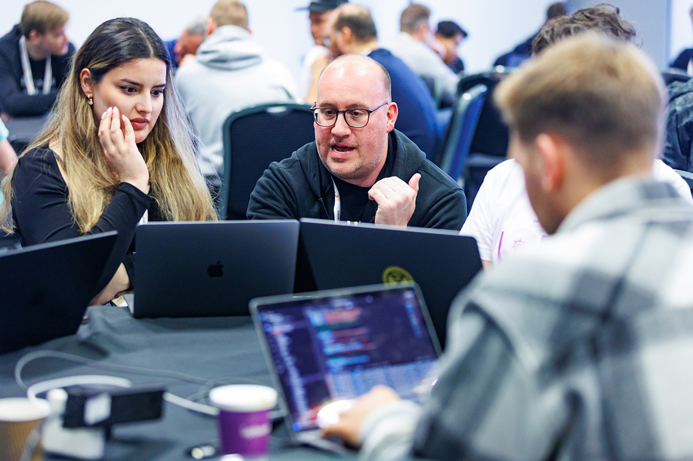

Wow, London sure didn't hold back! [Five years][birthday] after the open source framework was released, Backstage was clearly on people's minds — from those new to internal developer portals to those who have been contributing since the earliest days. Conversations about Backstage spanned from BackstageCon to the rest of KubeCon + CloudNativeCon Europe, which had a record-setting attendance of nearly 13,000 people. But if you couldn't make it, then settle in, prepare a spot of tea, and read on for highlights. Then head over to the Backstage Community's YouTube channel to [catch up on all the great Backstage talks][playlist] you missed.

[birthday]: https://www.youtube.com/watch?v=74ayHL1WHiE&list=PL8iP9yIjU0Q3K8LV_a9CcFmhvvNTAUzL1
[playlist]: https://www.youtube.com/playlist?list=PL8iP9yIjU0Q3K8LV_a9CcFmhvvNTAUzL1

{/* truncate */}

## London called — the Backstage Community answered

📸 _[CNCF][flickr]_

## Scenes from BackstageCon

📸 _[CNCF][flickr]_

Kicking the week off was the fifth-ever BackstageCon — a full day of talks featuring voices and perspectives from across the community. Here are just a few of the highlights from the day.

### #1: [Unlocking Backstage's Potential: Driving Adoption and Maturity With Your Developer Community][1]

Learn how to bridge the gap between the lofty ROI numbers you've read about and your own experiences. Spotify's Stanley Nicholl shares his insights for how to unlock internal Backstage adoption by tapping into your greatest resource: your internal developer community.

[1]: https://www.youtube.com/watch?v=Rg3ANYLyFoM&list=PL8iP9yIjU0Q3K8LV_a9CcFmhvvNTAUzL1

### #2: [Panel: What Do Cars, Clothes, Wardrobes and MRI Machines Have in Common?][2]

📸 _[CNCF][flickr]_

If that riddle of a title doesn't pull you in, I'm not sure what else to say! This panel — featuring Scott Guymer (Philips), Remi Higuchi & Tina Vincent (H&M Group), Jan Magnusson (IKEA), and Martin Wänerskär (Volvo Cars) — brings a diverse group of Backstage adopters together. It's well worth hearing their different impact and success stories, and comparing their perspectives on the business case for developer portals.

[2]: https://www.youtube.com/watch?v=h6BgF9dQDNo&list=PL8iP9yIjU0Q3K8LV_a9CcFmhvvNTAUzL1

### #3: [Lightning Talk: We Built a Unified AI Asset Catalog in Backstage][3]

📸 _[CNCF][flickr]_

With all the various AI tools out there, it's becoming hard to keep track of them all. But with the Catalog in Backstage, this becomes much easier. John Collier from Red Hat walks through how they approached this problem space internally as their inventory of AI tools — inference servers, models, and API gateways — grew and grew.

[3]: https://www.youtube.com/watch?v=tUR_2Nk0v4E&list=PL8iP9yIjU0Q3K8LV_a9CcFmhvvNTAUzL1

### #4: [Exemplar-y Backstage Templates][4]

The heart of offering your platform in a self-service way is to use Software Templates. What if you could make the templates themselves easier to update and contribute to? Brent Swisher from educational nonprofit ITHAKA walks through how they came up with a technique called “exemplar” templates to speed up the process of creating and updating templates, making them more accessible to other devs and easier to maintain.

[4]: https://www.youtube.com/watch?v=xY7fVOVsK_A&list=PL8iP9yIjU0Q3K8LV_a9CcFmhvvNTAUzL1

### #5: [From Click To Chaos: Linking Argo Workflows and Backstage for Automated Testing][5]

This talk by Chris Heisz and Luke Beamish from graph technology specialists, Neo4j, is a great showcase of how you can use the Scaffolder along with Argo Workflows to offer self-service integration and chaos testing. See how they ensure thousands of Kubernetes clusters are stable and performant. (You'll be OK, little guy!)

[5]: https://www.youtube.com/watch?v=qukwR1RDrFg&list=PL8iP9yIjU0Q3K8LV_a9CcFmhvvNTAUzL1

### Watch all the recordings

But that's just the start! There were so many more insights shared by the community. To see recordings of all the sessions, check out the full [BackstageCon playlist][playlist].

## Breaking through the bustle at KubeCon + CloudNativeCon

📸 _[CNCF][flickr]_

KubeCon was also a great showcase for Backstage, grabbing the interests of both current and potential adopters.

### Standing-room only for the State of Backstage

📸 _Spotify_

It was standing room only for the core maintainers talk — [The State of Backstage in 2025][state] — where they covered the past few months of accomplishments and outlined what they have in store for the rest of the year, including a demo of the latest features in the New Frontend System.

[state]: https://www.youtube.com/watch?v=anqWhSnN7sA&list=PL8iP9yIjU0Q3K8LV_a9CcFmhvvNTAUzL1

### Big birthday energy on the big stage

📸 _[CNCF][flickr]_

With the project just turning five, [Backstage got a nice Happy Birthday][keynote] from the Keynote main stage! Tyson Singer, Spotify's head of technology and platforms, outlined the journey Backstage took to get where it is now.

[keynote]: https://www.youtube.com/watch?v=JqG1wey7-Ao&t=563s

### Backstage Contribfest goes across the pond!

_(Hey, that's me! Thanks for all the great pics, 📸 [CNCF][flickr])_

After a successful appearance last year in [Salt Lake City][slc], Backstage ContribFest made its European debut. The community came out — with laptops in tow — for this session all about contributing to Backstage and the Community Plugins. Excited first-timers got to sit down with experienced contributors as well as core maintainers to work through a list of issues or to build plugins together. Keep your eyes on the release notes — some of those features might just have started here!

[slc]: https://backstage.io/blog/2024/12/09/kubecon-slc-24

## Cheerio, London! What's up, ATLiens!

📸 _[CNCF][flickr]_

What a jam-packed conference week! As I was walking out of the Excel London conference center, I swear I spotted Bowie in a low-riding, candy-red Cadillac saying something about needing to see [his cousins and his mama, too][spotify]? Guess we'll find out [in Atlanta this November][na]!

[spotify]: https://open.spotify.com/track/2oLwDI8tZUOh6SmTMRRfKs?si=61b5e96260c34592
[na]: https://events.linuxfoundation.org/kubecon-cloudnativecon-north-america/
[flickr]: https://www.flickr.com/photos/143247548@N03/albums/72177720324566471
