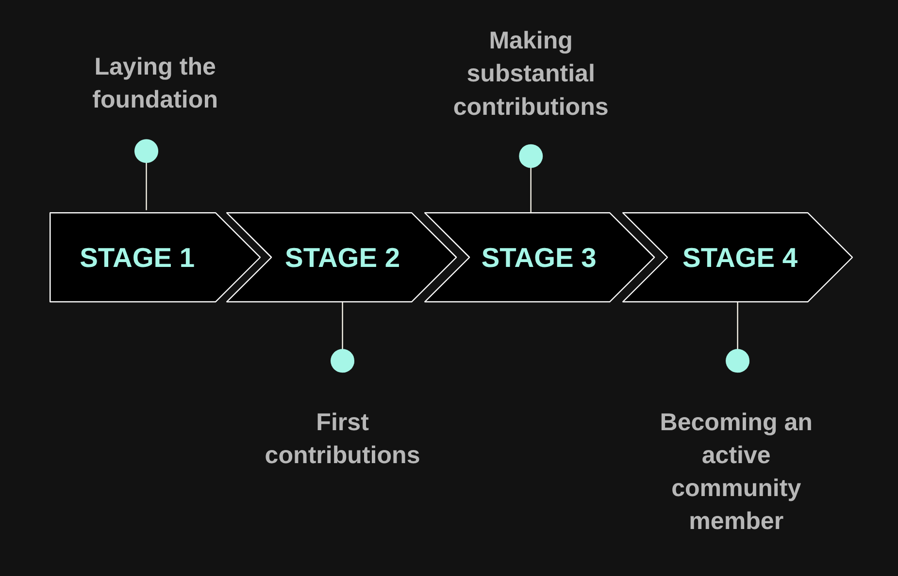
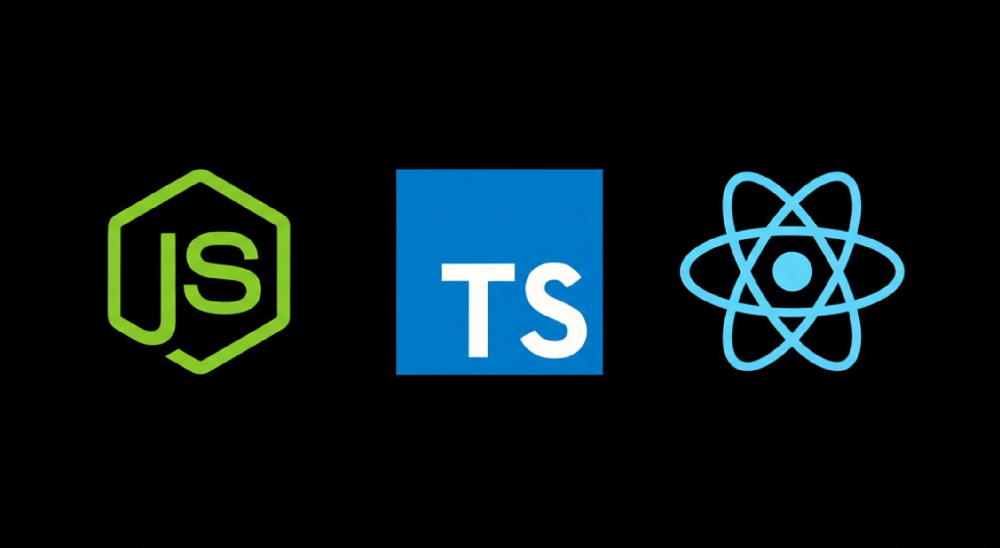
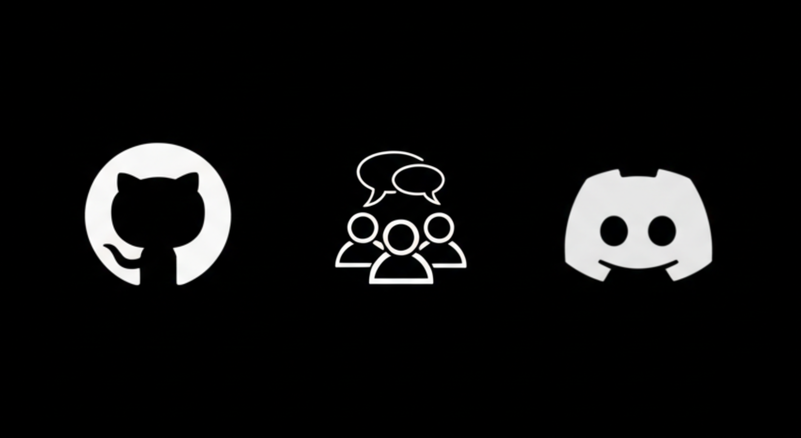
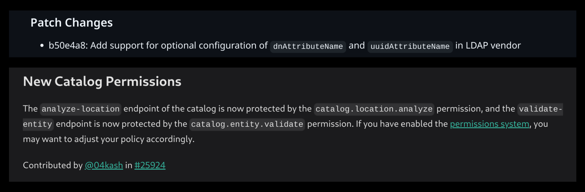

My path to becoming a maintainer in the Backstage project wasn’t paved with years of prior open source experience. As a student interning at Red Hat, I started with a relatively fresh perspective. This is the story of that journey – how I navigated the complexities of Backstage, with the support of its community, allowing me to grow and learn, and how open source can empower anyone to do the same. Whether you’re new to open source or a seasoned developer, I believe you’ll find something valuable here. For those just starting out, I hope this inspires you to take that first step. And for experienced developers, I hope this offers a fresh perspective – a look at how a new contributor navigates a complex project, and perhaps, a reminder of our own beginnings.
This journey wasn’t made in a single leap, but through a series of progressive stages. I’ll walk you through these stages, highlighting the key learnings and contributions along the way.

{/* truncate */}

## Stage 1: Laying the foundation

When I first encountered Backstage, I wasn’t deeply familiar with the tech stack it relied on — Node.js, TypeScript, and React. My only exposure previously had been through hackathons, where the focus is speed over deep understanding. Another major hurdle was Git. Up until that point, I had mainly used GitHub Desktop, rarely venturing into the command line or advanced Git concepts. Realizing that effective contribution required a deeper understanding, I dedicated a week to intensively reviewing these core technologies.

But that wasn’t all. I wanted to see Backstage in action, to really grasp what it was all about. That’s when I came across the [Spotify Learning Path for Backstage](https://backstage.spotify.com/learn/). Specifically, the [“Standing up Backstage”](https://backstage.spotify.com/learn/standing-up-backstage/) section was incredibly useful. It walked me through setting up a local running instance with a Postgres database and GitHub authentication. From there, I explored the Backstage documentation and experimented with adding features to my local instance. Honestly, for me, this stage was all about building confidence. It was about facing my knowledge gaps head-on and taking the time to learn.

## Stage 2: First contributions

With my foundational skills in place, it was time to take the leap and make my first contributions to Backstage. [My first pull request](https://github.com/backstage/community-plugins/pull/497) (PR) was quite simple — fixing broken links in the documentation. This seemingly minor fix was my first step, and it paved the way for more substantial contributions. It helped me to get comfortable with the contributing process, learn how to submit a PR, and understand the review workflow. After that, I started looking for open issues in the [community-plugins repository](https://github.com/backstage/community-plugins). I found an issue about [linking npm releases of plugins to specific Git commits](https://github.com/backstage/community-plugins/issues/489) — a task that pushed me outside my comfort zone once again. At the time, I knew very little about GitHub Actions and workflows. Learning on the fly, I relied heavily on guidance from maintainers who were incredibly welcoming.
This experience was really helpful, not just for the task itself, but also because it introduced me to key community resources like the [Backstage Discord](https://discord.com/invite/backstage-687207715902193673) and [Special Interest Groups](https://github.com/backstage/community/tree/main/sigs) (or SIGs for short). While the content of the pull requests in this stage was certainly useful, the real value came from learning the project’s workflows and community processes.

## Stage 3: Making substantial contributions

As my confidence grew, so did the complexity of the contributions that I took on. Two of my first feature-related contributions were related to Catalog Permissions and the LDAP Processor.
First, with Catalog Permissions, I noticed that two endpoints in the Catalog plugin, `/analyze-location` and `/validate-entity` weren’t restricted by permissions, posing a security risk. To address this, I needed a deep understanding of Backstage’s permissions system. I spent a lot of time reading through documentation and existing code, and asking questions on Discord. When I had [a PR](https://github.com/backstage/backstage/pull/25924) ready, I went to the Framework SIG meetings to discuss my implementation and to make sure that I was on the same page as the maintainers. Following this process, my PR was successfully merged!
Shortly after, I tackled an open issue with the [LDAP processor](https://github.com/backstage/backstage/issues/26225). This issue highlighted a problem where Backstage couldn’t correctly map user-group relationships with certain LDAP server configurations that used attribute names that were different from the ones hardcoded within the plugin. I implemented [a solution](https://github.com/backstage/backstage/pull/26511) that allowed users to override these default values. Testing against a real LDAP instance wasn’t something I could do locally, but the original issue reporter stepped in, validating my changes in their environment. It was a beautiful example of open source collaboration in action.

_My first commits in the backstage CHANGELOG_

These two tasks were a significant step up from my initial contributions. They required a deeper understanding of Backstage’s architecture and a greater level of problem-solving. Seeing my commits in the [CHANGELOG](https://backstage.io/docs/releases/v1.31.0/#new-catalog-permissions) was an accomplishment I was proud of, and it solidified my confidence so I could take on even more substantial roles within the Backstage community.

## Stage 4: Becoming an active community member

_(Source: https://www.linkedin.com/posts/mwijay_you-totally-missed-last-nights-first-cncf-ugcPost-7311005210628235264-8BES)_

_Engaging with the Open Source Community at the CNCF meetup in Toronto (Source: https://community.cncf.io/events/details/cncf-cloud-native-toronto-presents-cncf-2025-kickoff-at-shopify/)_

One of the ways I got more involved was by helping with the maintenance of the [community-plugins repository](https://github.com/backstage/community-plugins). For instance, I helped address a security vulnerability — specifically, that the `@backstage/backend-common package` relied on a vulnerable version of `jsonpath-plus` through `@kubernetes/client-node`. I proactively removed this vulnerable dependency from eight plugins, effectively safeguarding those plugins from potential risks. I also focused on improving dependency management by implementing Knip reports. These reports help us identify and remove unused dependencies, keeping the repository clean and efficient.

Beyond repository maintenance, I also began focusing on community engagement. I began reviewing pull requests regularly, helping maintain code quality and lightening the load on other maintainers. This not only deepened my understanding of the codebase but also exposed me to new features and patterns across the ecosystem. I actively participated in SIG meetings and offered guidance to fellow contributors on Discord.

This marked a turning point in my journey, as I transitioned from a contributor to an active community member. Eventually, this growing involvement led to me becoming a maintainer for the community-plugins repository. It was a fulfilling step forward, and it felt rewarding to be trusted with more responsibility in guiding the project.

## What’s next: future steps as a maintainer

_Presenting "From Zero to Contributor: My Open Source Journey with Backstage" at the CNCF 2025 Kickoff event at Shopify, Toronto (Source: https://www.linkedin.com/posts/mwijay_you-totally-missed-last-nights-first-cncf-ugcPost-7311005210628235264-8BES)_

As a maintainer, my focus is on supporting others in their open source journey and improving the overall contributor experience. I actively review PRs, guide new contributors through constructive reviews, and point them to good first issues to help them get started.
Furthermore, I aim to actively contribute to the community-plugins SIG meetings, offering suggestions and participating in discussions to help guide the project’s direction.
Ultimately, my goal is to help the community-plugins repository thrive and become an even more valuable resource for the Backstage community. I’m excited to collaborate with fellow maintainers and contributors to achieve this vision.

My journey with Backstage has been incredibly rewarding, and I’m grateful for the opportunities, support, and growth the community has given me. I’m excited to continue contributing and to see where this journey takes me next.
