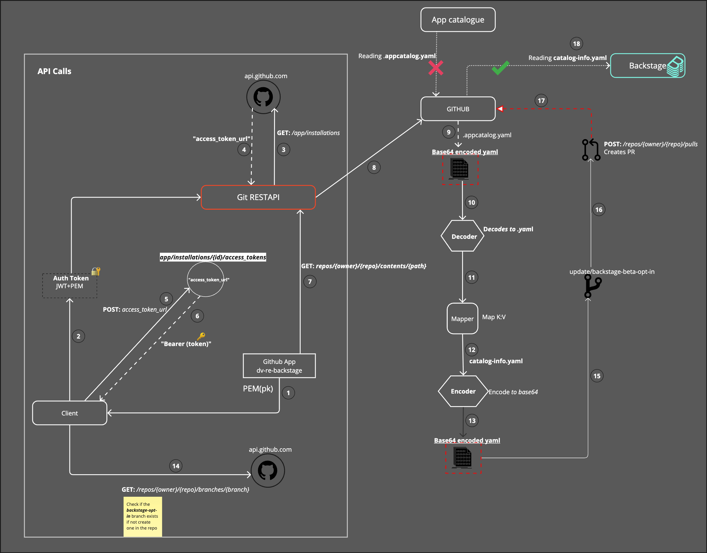
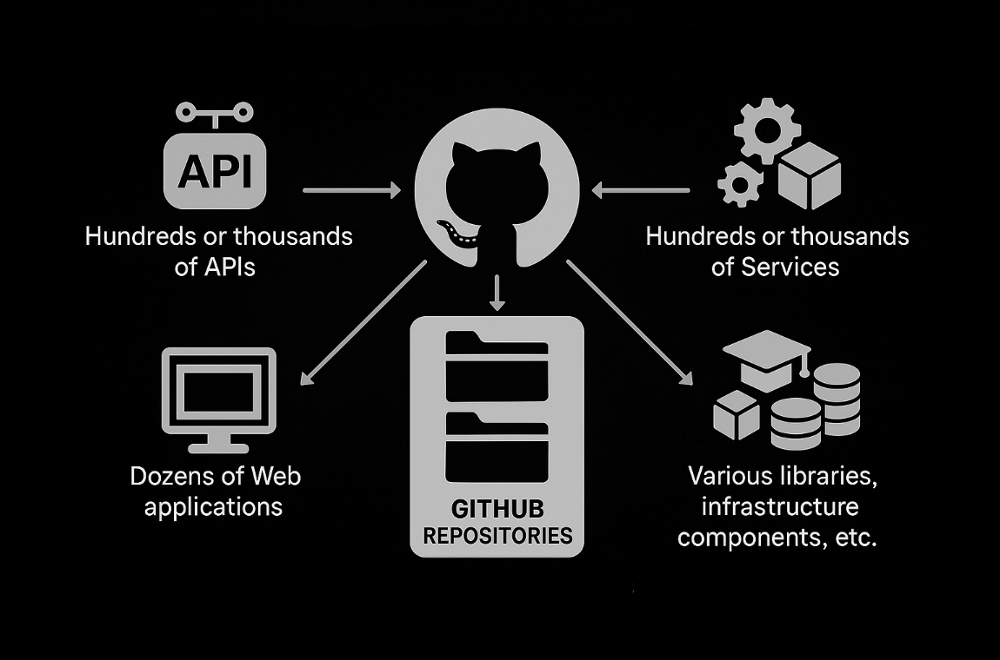
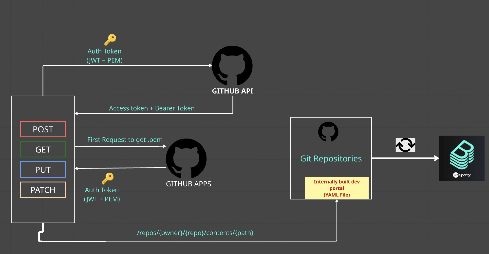
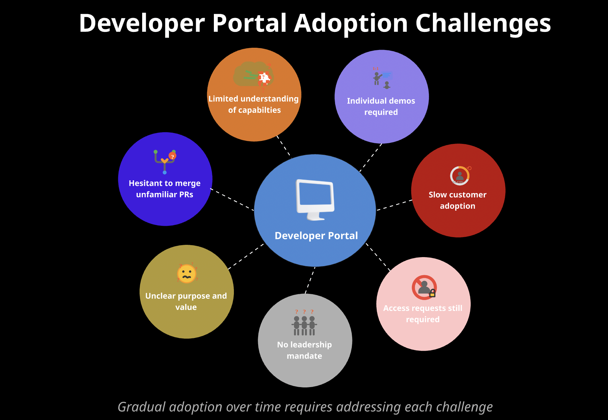
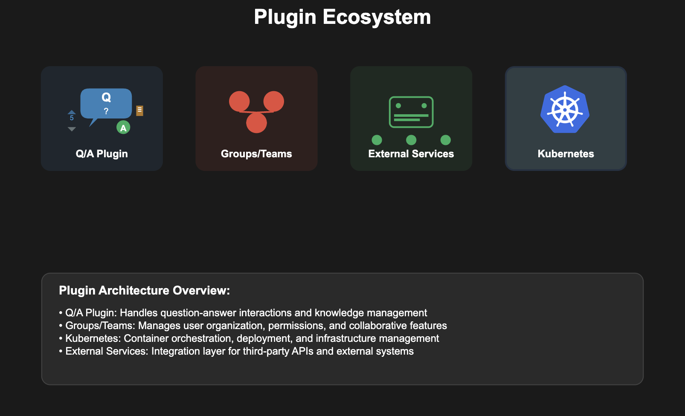

**TL;DR:** As part of our efforts to streamline service management and improve developer experience, our engineering org migrated from a legacy service catalogue to the Backstage Software Catalog. In this post, I'll share what we learned from that journey --- including how to build an automated script to migrate services from an existing internal service catalogue to a modern internal developer portal (IDP) like Backstage. I'll also outline strategies to help drive adoption across your organization, along with tips for addressing both the cultural and technical roadblocks you might encounter along the way.


{/* truncate */}

## Why and How a Modern Developer Portal Was Rolled Out

Historically, many organizations utilized internally built software tools for managing their service inventories. While these tools served their purpose, there's a growing need for more robust service
catalogues that require less maintenance and reduce over-engineered tooling. Frameworks like Backstage have emerged as powerful solutions.

The decision is often made to establish a single source of truth for services and engineering teams. The vision is typically for reliability or platform teams to envision a world where every software development
team, regardless of size or domain, can efficiently manage projects, access tools and resources, and foster a collaborative culture. A modern developer portal aims to become the go-to platform for developers, infrastructure teams, and product managers to collaborate, accelerate development cycles, and deliver high-quality software. It serves as a centralized hub, consolidating all necessary information, tools, and services that developers require throughout the software development lifecycle.

## Internal Services Landscape



In large organizations, it's common to manage thousands of GitHub repositories, encompassing a wide array of assets such as front end web applications, backend web services, mobile applications, and APIs. For instance, a typical enterprise might have:

- Hundreds or thousands of APIs
- Hundreds or thousands Services
- Dozens of Web applications
- Various libraries, infrastructure components, etc.

Migrating these internal services from various engineering teams requires a systematic approach to retrieve the existing service definitions and transform them into a format compatible with the new
developer portal. This often involves automated scripts to ensure efficient ingestion. For example, successfully migrating hundreds of services into a new portal is a common achievement in such initiatives.

## GitHub Requests Architecture for Migration

**Using an Entity Provider and a Scripted Migration**

In our Backstage setup, we took a hybrid approach: we used an automated script to generate and submit `catalog-info.yaml` files to service repositories, and relied on the GitHub Entity Provider defined in our
`app-config.yaml` to ingest them into the catalog. This gave us the best of both worlds.

The script handled the heavy lifting of migrating metadata from for example legacy `(.appcatalog.yaml)` files, transforming them into the modern format expected by Backstage. It also empowered teams by
submitting pull requests they could review and enrich adding ownership metadata, documentation links, or system context before merging. Once merged, the GitHub Entity Provider took over, ingesting the files on a
scheduled basis and ensuring Backstage stayed up to date. This pattern reduced manual overhead, maintained decentralization, and eliminated the need for a persistent integration with the legacy system. Since the old catalog was being decommissioned, this also aligned with our goal of moving forward cleanly without syncing two sources of truth.



Several technical steps are typically involved in retrieving existing service definition files `(e.g., appcatalog.yaml)`, an example yaml file, and then converting them into the modern developer portal\'s preferred
format `(e.g.catalog-info.yaml` for Backstage). Rather than manually creating new definition files, an automated Python script can be developed to generate and add them to the respective repositories or services. Without creating and using these automated scripts, doing these tasks manually can take several hours and could become extremely tedious. For example, in the case of Backstage, it would mean having to explicitly create the `catalog-info.yaml` hundreds of times in hundreds of repositories which can also result in hundreds of errors and manual lift.

**Requirement One: GitHub Apps**

A dedicated GitHub App can be utilized to extend functionality, granting the necessary permissions to submit pull requests across multiple repositories. GitHub Apps are integrations that extend GitHub's functionality and can automate tasks, interacting with and extending GitHub's features.

A private key `(.pem)` is retrieved for the GitHub App, and a JSON Web Token (JWT) is created. These two keys are combined to generate an Authentication Token, which is an encoded JSON Web Token.

**Requirement Two: An Access Token and Bearer Token**

The Authentication Token (encoded JWT) is used to make a `GET` request to the GitHub API endpoint `/app/installations` at `api.github.com.` This request retrieves an access token URL. Once that access token URL is received, another request is made to this URL to obtain the Bearer token. This Bearer token is then used for major requests to GitHub API endpoints, such as `https://api.github.com/repos/{owner}/{repo}/contents/{path}.`

**Base64 and YAML Processing**

With the Bearer token, a request can be made to retrieve the contents of GitHub repositories containing the legacy service definition files `(e.g. .appcatalog.yaml)`. GitHub typically returns these contents in
Base64 format, a binary-to-text encoding scheme that converts binary data into an ASCII string, often used for secure data transmission over HTTP.

Upon receiving the encoded Base64 content, it must be decoded to YAML. The decoded YAML is then compared to the desired key-value pairings for the new catalog-info.yaml file. This is where a custom Mapper comes into
play. A template for catalog-info.yaml is created following the developer portal\'s guidelines. The key-value pairs from this template are then mapped to the values received from the legacy service
definition file. For example:

```python
results['metadata']['title'] = data['appInfo']['appName']
# In the new format: metadata.title
# From the legacy file: appInfo.appName
```

After the comparisons and correct mapping for the new format, the data is dumped into the `catalog-info.yaml` file and finally encoded back to Base64 for submission to the GitHub repository.

An example excerpt code of encoding YAML file to base64

```python
def encode_to_base64(file):
    catalog_info_data = load_yaml(file)
    print(catalog_info_data) #json
    catalog_yaml  = yaml.dump_all(catalog_info_data) #yaml
    print('\n')
    print(catalog_yaml)

    logger({'data': catalog_yaml,'method':'encode_to_base64','level': 'debug'})

    #yaml k:v (dict) to string
    dict_to_string = str(catalog_yaml)
    encoded =  base64.b64encode(bytes(dict_to_string, 'utf-8')) # bytes
    print("\n")
    #decode to convert into to explicit string and remove b prefix in encoded
    enc_dec = encoded.decode('utf-8')
    print(enc_dec)
    return enc_dec
```

**Submitting Changes to the GitHub Repository**
Submitting the file back to the GitHub repository involves a few more steps. A `GET` request is made to the Git branches endpoint, `/repos/{owner}/{repo}/branches/{branch}`, to check if a new branch `(e.g.
update/developer-portal-opt-in)` already exists.

If the branch does not exist, it is created from the main or master branch, depending on which one is present in the repository, using `refs/heads/{branch_name}\'.format(\*\*locals()).` Finally, the pull
request with the encoded Base64 YAML is submitted to the branch using the GitHub endpoint `/repos/{owner}/{repo}/pulls.`

## Adoption and Impact



Initially, the adoption of a new developer portal can face challenges
for several reasons:

- Engineering teams may be hesitant to merge unfamiliar pull requests into their repositories or services.
- Some teams or engineers might lack a robust understanding of the new portal's purpose or value.
- The new tooling might not be a strictly defined, top-down mandated requirement from leadership.
- Access requests might still be required, even for a centralized portal.
- Customer adoption can be slow, sometimes requiring individual demonstrations even after widespread presentations.
- Some individuals might understand what the portal is but not its full capabilities or limitations.

**Gaining Traction and Growth**

Despite initial hurdles, a new developer portal can gain immense traction and adoption after numerous pitches to various teams. A key factor in widespread adoption often includes contributions from various engineering teams beyond the initial implementation group.

The transformation can primarily be driven by a concerted effort to understand team needs, strategically "sell" the platform's value, and address early friction points. The key to this success lies in demonstrating tangible benefits and integrating features that directly solved developer pain points.

#### Understanding Team Needs

During the discovery and initial implementation phases, it became clear what capabilities teams truly desired from a developer portal:

- **Visibility into Ownership and Relationships:** Teams were highly interested in features like a **dependency graph** or **organizational chart**. They wanted clear visibility into service ownership and relationships between different services, enabling them to quickly identify whom to contact for specific issues or collaborations.
- **Service Discoverability:** Once they grasped the concept and value of having their services represented in a central catalogue, teams actively sought to have their services migrated or ingested using the scaffolder. Their motivation was clear: they wanted other engineers to easily find and understand their services within the portal.

## Strategies for Selling the Idea

A combined approach was crucial to effectively "sell" the developer portal idea to various teams:

1. **Clear Roadmap:** Presenting a comprehensive roadmap that outlined the portal's current state and its future potential helped teams envision its long-term value.
2. **Engaging Presentations and RFCs:** Conducting engineering presentations to numerous teams and sharing Requests for Comments (RFCs) allowed for broader review, gathered valuable insights, and fostered a sense of community involvement.
3. **Highlighting Discoverability:** Emphasizing that their services would be easily discoverable by other teams and that the portal would serve as a single source of truth for all component information related to their services was a powerful selling point.
4. **Personalized Demos:** Conducting 1:1 Slack huddles with individual engineers to demo the platform provided a personalized experience and allowed for direct addressing of questions.
5. **Visual Aids:** Utilizing diagrams of various components and illustrating their benefits helped simplify complex concepts and showcase the portal's advantages.
6. **Addressing Codebase Concerns:** When submitting the automated pull requests with the migration script, it was crucial to explain to teams that these changes would not result in any loss of functionality, nor would they have any adverse effects or modifications to their existing codebase.

### Addressing Early Friction

Despite these efforts, initial friction was inevitable:

1.  **Pushback on Automated PRs:** There was initial pushback regarding the automated pull requests submitted to their repositories.
2.  **Reluctance to Merge:** Engineering teams were hesitant to merge a "random" PR into their repositories, especially without a full understanding of its purpose.
3.  **Lack of Understanding:** Some teams simply didn\'t have a robust understanding of what the portal was or its value, leading them to either not merge the `catalog-info.yaml` PR or, in some cases,
    even delete it.

Through persistent engagement, clear communication, and demonstrating tangible value, these initial resistances can be gradually overcome. The strategic addition of features and the active involvement of other
engineering teams, particularly those focused on reliability platforms and SRE, proved instrumental in demonstrating the platform's utility and appeal.

## Feature Additions Driving Adoption



The addition of components like a [Tech Radar](https://www.thoughtworks.com/en-us/radar) can significantly increase engineer interest. A Tech Radar is typically implemented to help engineers and cross-functional teams understand the "paved road" technology stack, what should be used for new systems andwhat existing systems should aspire to move towards. Thoughtworks created this system and can be seen here:
[https://www.thoughtworks.com/en-us/radar](https://www.thoughtworks.com/en-us/radar)

Some other [plugins](https://backstage.io/plugins/) that
can increase widespread adoption of a developer portal:

1.  Q/A Plugin
2.  Groups or teams plugins
3.  Kubernetes plugin
4.  Managing External services

A critical component that contributes to widespread adoption is the **linter plugin**. For developers migrating services to the new developer portal, ensuring the `catalog-info.yaml.` file is correct and accurate is paramount. The linter plugin, often integrated with an external API, provides an invaluable and accurate way to validate these files, making the process of creating and maintaining them much easier and less error-prone for developers. One of the most accurate ways to implement the linter plugin is making a request to [Entity validator](https://github.com/RoadieHQ/backstage-entity-validator) to make sure it is correct.

Complementing this, a **Scaffolder** feature also plays a vital role. The Scaffolder allows developers to generate new service or component `catalog-info.yaml` files (and often entire project structures) from
pre-defined templates. This capability effectively eliminates the need for developers to manually create these files from scratch or worry about linting them, as the generated output is inherently compliant with the portal's schema.

Ultimately, such efforts can successfully ingest hundreds of services, leading to a significant number of components residing within the new developer portal.

## Conclusion

The migration of legacy internal services to a modern developer portal like Backstage represents a significant leap forward in standardizing and streamlining developer experiences. By transitioning from an internally maintained "App Catalogue" to a centralized, community-driven "Developer Portal," organizations can lay the groundwork for enhanced collaboration, improved resource accessibility, and accelerated development cycles. Despite initial adoption challenges, the strategic implementation of features like the Tech Radar and the linter plugin, coupled with persistent outreach and contributions from various engineering teams, proves instrumental in demonstrating the inherent value of such a platform. The successful ingestion of hundreds of services stands as a testament to the effectiveness of automated migration scripts and the dedication of the teams involved. This endeavor not only provides a robust and less over-engineered service catalogue but also fosters a culture of shared ownership and continuous improvement within the engineering organization.

## What's Next

My involvement as a software engineer with open source tools and developer portal projects like Backstage, including implementation and service migration, has provided me valuable opportunities to contribute to their open-source documentation and repositories. This can be seen in contributions such as [Update app-custom-theme.md](https://github.com/backstage/backstage/pull/12863) and [Update getting-started.md](https://github.com/backstage/backstage/pull/12714), which deepen understanding of custom themes and style components. I’m now looking at future efforts focusing on contributing more to the open-source project (e.g., Model context protocol with A.I (MCP) at [RFC: Distributed Actions with MCP in Backstage](https://github.com/backstage/backstage/issues/30218)) and continuing to improve and scale this critical developer portal for engineers across the world.
