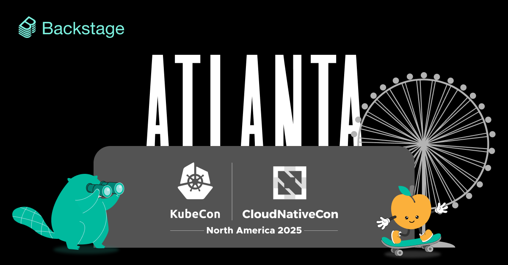

Pack your laptop and mark your calendars! Backstage will once again be taking part in the ContribFest track at KubeCon! Join us at KubeCon 2025 North America in Atlanta on Monday, November 13. Feel free to [bookmark it on your schedule](https://kccncna2025.sched.com/event/27Nl6/contribfest-level-up-your-open-source-journey-hands-on-backstage-contributions-andre-wanlin-patrik-oldsberg-emma-indal-spotify-aramis-sennyey-doordash-kurt-king-procore). Then read on to get yourself prepared for the session beforehand to maximize your time working with other contributors and Backstage experts during the session.

{/* truncate */}

## Contrib-what?

Before we dive into preparation for the Backstage ContribFest session we should probably take a detour and answer the question: What the heck is ContribFest?

ContribFest is a track at KubeCon where various CNCF projects will host hands-on sessions working with their respective communities on contributions towards their projects. You don't have to be a past contributor to participate — new community members are encouraged to join!

These sessions are 75 minutes long and take place in a room with roughly a dozen circular tables that seat about eight people making it easy to work and collaborate. They usually lead off with some getting started steps and then give attendees the rest of the time to work on their contributions with the aid of experts from the project.

## What to prepare before you get there

For the Backstage ContribFest session, there are some preparation steps you can complete on your own well before the session. Let's cover those now:

### 1. Fork the repos

You'll have the option to contribute to the Backstage repo or the Backstage Community Plugins repo. To get those onto your system, you need to follow the GitHub ["Forking a repository"](https://docs.github.com/en/pull-requests/collaborating-with-pull-requests/working-with-forks/fork-a-repo#forking-a-repository) guide and fork these:

- Backstage: [https://github.com/backstage/backstage](https://github.com/backstage/backstage)
- Backstage Community Plugins: [https://github.com/backstage/community-plugins](https://github.com/backstage/community-plugins)

### 2. Update Node.js and Yarn

Backstage has [a few prerequisites](https://backstage.io/docs/getting-started/#prerequisites) that you'll need to have in place before you can run Backstage or the various Backstage Community Plugins. Here's what you need:

- Backstage uses Node.js — you'll want to install version 22 for the session.
  - To make this easier, we recommend you use Node Version Manager nvm, you can [follow these instructions to install it](https://github.com/nvm-sh/nvm#install--update-script).
  - Once you have nvm installed, you can run this command to get Node 22 installed and activated: `nvm install 22`
- Yarn is the package manager used by Backstage — you'll want to install it as well.

  - Simply run `corepack enable` to do so.

### 3. Test your setups

Now let's do a quick test to confirm that everything is working.

First, let's check that you can run the Backstage codebase:

1. Navigate to your cloned fork of the Backstage repo
2. From the root, run `yarn install`
3. Then run `yarn tsc`
4. Finally run `yarn start`
5. Backstage will open in a new browser window or tab

Now, let's check the Backstage Community Plugins:

1. Navigate to your your cloned fork of the Backstage Community Plugins repo
2. This repo is structured in a way where there are many plugins that live in their own dedicated workspace — for this test, we'll use the `linguist` workspace. From the root, run `cd workspaces/linguist`
3. From here run `yarn install`
4. Then run `yarn tsc`
5. Finally run `yarn start`
6. An example Backstage app will open in a new browser window or tab

### Bonus: Check out the contribution guides

At this point, you have all the prerequisites in place and are ready to take part in the Backstage ContribFest session. From here, we recommend you take some time to read the contributions guides as that will get you more familiar with the overall process. Here they are:

- [Backstage Contribution Guide](https://github.com/backstage/backstage/blob/master/CONTRIBUTING.md)
- [Backstage Community Plugins Contribution Guide](https://github.com/backstage/community-plugins/blob/main/CONTRIBUTING.md)

## 👋 See you in Atlanta!

On behalf of myself and the other co-hosts of Backstage ContribFest, thanks for following along! We look forward to seeing you in Atlanta and working with you on your contributions. Make sure to say hello!
