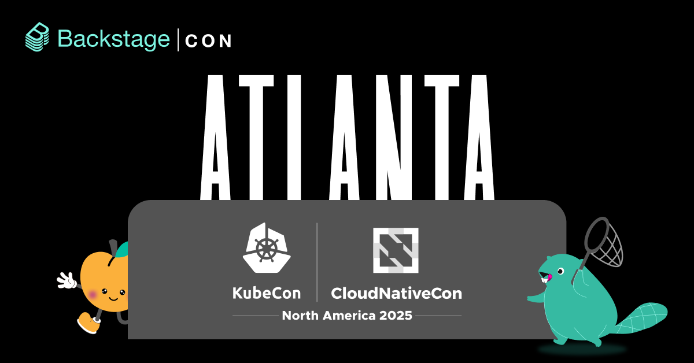
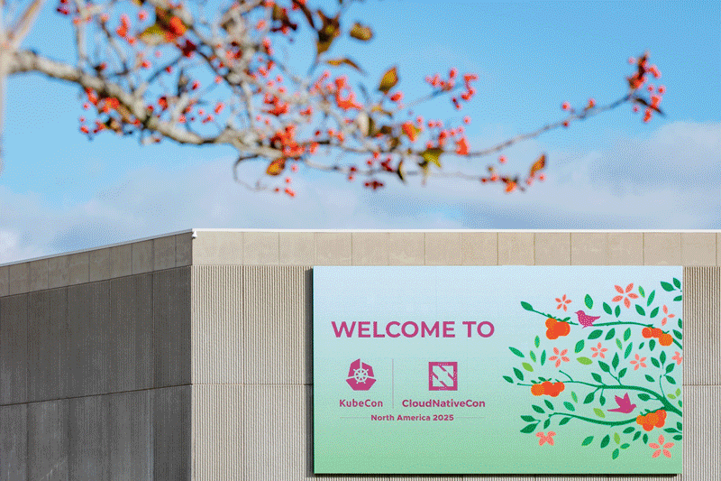
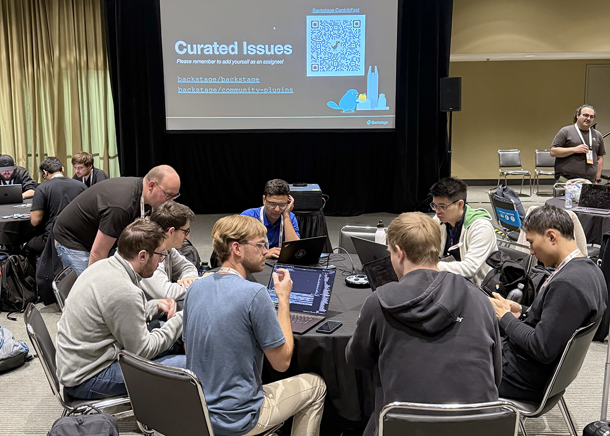
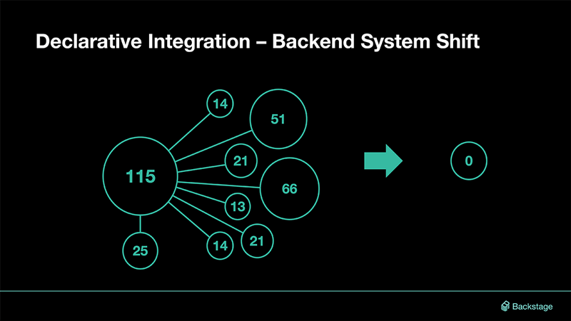

Cancelled flights and wonky Wi-Fi couldn't hold us back from having an amazing time in the Big Peach! It was great to head south and commune with the community in person at [BackstageCon](https://colocatedeventsna2025.sched.com/overview/type/BackstageCon) and [KubeCon + CloudNativeCon North America 2025](https://kccncna2025.sched.com) in Atlanta. We gave talks, shared insights, chatted without having to type into little text boxes, and tackled issues elbow-to-elbow during [ContribFest](https://backstage.io/blog/2025/10/15/backstage-contribfest-kubecon-guide). The week was capped off with the [Backstage maintainers talk](https://www.youtube.com/watch?v=evmmr-uxNsc&list=PL8iP9yIjU0Q33vpSaBlAvIhgDb-9smXUU) where we celebrated a year of milestones, the release of the adoption-ready New Frontend System, and work towards an AI-Native Backstage. Catch up with recordings of [all the Backstage talks](https://www.youtube.com/playlist?list=PL8iP9yIjU0Q33vpSaBlAvIhgDb-9smXUU) and check out highlights from our week in the Big A below.

{/* truncate */}

## Scenes from BackstageCon (and beyond)

  
_📸 [CNCF](https://www.flickr.com/photos/143247548@N03/albums/72177720330018728/)_

Brrr…it was a cold start with “Hot 'Lanta” bringing a serious autumn chill on Monday morning. But all the spicy DevEx insights would soon heat things up in the halls of the Georgia World Conference Center. Throughout the day, we heard discussions around how organizations adopt Backstage and scale it for productivity, as well as practical lessons on governance, deployment models, change management, and standardizing best practices around Backstage.

And despite an unfortunate amount of flight disruptions waylaying some of the speakers, the organizers were able to work around all the last-minute issues for a day full of presentations, demos, lightning talks, and keynotes. Check out our community YouTube channel to watch recordings of [all the Backstage talks](https://www.youtube.com/playlist?list=PL8iP9yIjU0Q33vpSaBlAvIhgDb-9smXUU) from Atlanta. Not sure where to start?

### A few personal picks

Here are six BackstageCon talks that we attended and thought were worth sharing. They feature Backstage adopters across a range of industries — from finance and healthcare, to networking, automotive experiences, and beyond — all sharing use cases that relate to almost any engineering org:

- 🏦 [Supercharging Backstage Scaffolder for Workflows](https://www.youtube.com/watch?v=0m94ERF0k4Q&list=PL8iP9yIjU0Q33vpSaBlAvIhgDb-9smXUU): Jonathan Chan and Francis Hackenberger, engineers from the Royal Bank of Canada's cloud team, talk about how they scale up the power of Backstage Software Templates at one of Canada's largest banks.

- 🩺 [From Friction to Flow: How Backstage Transformed Our Security Experience](https://www.youtube.com/watch?v=ZCM9i1zD364&list=PL8iP9yIjU0Q33vpSaBlAvIhgDb-9smXUU): In this lightning talk, Christopher Diaz, principal engineer at RVO Health, squeezes three years' worth of Backstage learnings into a 10-minute lightning talk — including how Backstage has unlocked an inner source culture within their org, with teams building custom plugins to extend their instance (“That's what makes it so much fun to build on Backstage: everything you need to solve a problem is literally just a pull request away” 🙌).

- 📶 [How Ericsson Scaled Developer Experience with Backstage](https://www.youtube.com/watch?v=1mDEkiN4NTs&list=PL8iP9yIjU0Q33vpSaBlAvIhgDb-9smXUU): Ericsson principal engineer Damien O'Toole and engineering manager Kieran Egan share what they learned on the way to scaling internal Backstage adoption to over 1,260 users and over 4,073 weekly visits.

- 🚗 [Cruising the AI Highway: Standardized MCP Deployment and Governance with Backstage](https://www.youtube.com/watch?v=pFSSpDHB2rU&list=PL8iP9yIjU0Q33vpSaBlAvIhgDb-9smXUU): Engineers from Toyota Connected — “recovering system administrator” Rob Heckel and platform engineer Tyler Rothenberg — share how they deploy MCP servers across their org in an easy, secure, and sustainable way, covering everything from the basics of MCP to deploying MCP servers using cloud native tools and integrating them with Backstage.

- 📊 [Lego Bricks for Developers: Turning Insights into Golden Paths at Neo4j](https://www.youtube.com/watch?v=IdLXeK8motg&list=PL8iP9yIjU0Q33vpSaBlAvIhgDb-9smXUU): Developer advocate Jeremy Adams (stepping in for a waylayed Chris Heisz) joins engineer Luke Beamish to talk about how they use Golden Paths at Neo4j, a leader in graph technology whose tech is used for cancer research, GenAI, and NASA's mission to Mars.

- 🔔 [Driving Adoption by Generating High Value Notifications in Backstage](https://www.youtube.com/watch?v=N4gCLbhxTHA&list=PL8iP9yIjU0Q33vpSaBlAvIhgDb-9smXUU): How do notifications work in Backstage and what makes them such a powerful way to drive Backstage adoption within your org? Watch this talk by Spotify engineering manager Avantika Iyer and customer success engineer/Backstage community maintainer André Wanlin. [Hey, that's me! Seriously, tho, notifications are the jam. — AW]

### Backstage at KubeCon

The Backstage-related talks continued throughout the week during KubeCon + CloudNativeCon, including:

- 🚀 [The Journey of Deploying Backstage in a Large Organization](https://www.youtube.com/watch?v=l7OQdrUkoVI&list=PL8iP9yIjU0Q33vpSaBlAvIhgDb-9smXUU), as told by engineers Mathieu Girard and Teddy Poingt from Beneva, Canada's largest mutual insurance company.

- 📚 [Build Your Internal Developer Platform with the Experts](https://www.youtube.com/watch?v=eqxKB6Gq7oc&list=PL8iP9yIjU0Q33vpSaBlAvIhgDb-9smXUU) in this hands-on workshop led by CNCF ambassadors and project maintainers.

- 🎵 [Harmonizing Strategy and Engineering: Lessons Learnt in Building a Platform Plugin for Diverse Users](https://www.youtube.com/watch?v=2t_Pdiu3B1E&list=PL8iP9yIjU0Q33vpSaBlAvIhgDb-9smXUU) from Spotify senior product manager Sri Chandrasekaran and senior engineer Kate Klymkovska. [Hey, that's me! What André said, except product vision instead of notifications. — KK]

### Watch 'em all!

📺 There's much more to explore and dive into. Head over to the Backstage Community YouTube channel to [watch all the Backstage talks](https://www.youtube.com/playlist?list=PL8iP9yIjU0Q33vpSaBlAvIhgDb-9smXUU) from BackstageCon and KubeCon.

## Our third Backstage ContribFest

We talked about Backstage a ton, but we also invited attendees to help us build it. In Atlanta, we co-hosted our third [Backstage Contribfest](https://backstage.io/blog/2025/10/15/backstage-contribfest-kubecon-guide) with participants of all experience and skill levels diving into the Backstage repos to tackle issues together — and with plenty of Backstage maintainers and contributors close at hand to help out.

A few ContribFest-fueled pull requests have already popped up in the repos:

- fix(ui): render html in gfm mode in MarkdownContent component ([#31770](https://github.com/backstage/backstage/pull/31770))
- catalog-react: OwnerEntityPicker case insensitive ([#31756](https://github.com/backstage/backstage/pull/31756))
- fix: making the github urls case insensitive ([#31754](https://github.com/backstage/backstage/pull/31754))
- fix: success announcements should be transient ([#6041](https://github.com/backstage/community-plugins/pull/6041) — ✅ merged!)

Many thanks to all the participants and to our fellow hosts — Kurt King from Procore and Aramis Sennyey from DoorDash!🙏

🛠️ If you haven't yet joined our worldwide community of contributors, [there's no time like the present](https://github.com/backstage/backstage/blob/master/CONTRIBUTING.md)!

## Maintainers talk: Stable foundations, MCP innovations

As always, the main event for the community is the Maintainers Track session. Backstage core maintainers Ben Lambert and Patrik Oldsberg closed out the week celebrating a year of milestones — including contributions big and small from the community — while looking ahead to what's next for the framework.

In their talk, [Backstage Celebrations: Stable Foundations and MCP Innovations](https://www.youtube.com/watch?v=evmmr-uxNsc&list=PL8iP9yIjU0Q33vpSaBlAvIhgDb-9smXUU), they shared:

- **Project Updates:** Adopters, plugins, and stars — and all the other ways the Backstage community continues to grow, including in the community-plugins repo. Plus, improvements to issue handling and more.

- **Project Maturity:** With the new backend ([released as a stable 1.0 last year](https://backstage.io/docs/releases/v1.31.0/)) and new frontend ([adoption-ready as of this year](https://backstage.io/docs/releases/v1.42.0)) now both in place, the Backstage framework has modern foundations built for the future. With more emphasis on declarative integration (and less TypeScript code), Backstage is more accessible and easier to maintain — and plugins are simpler than ever to build and integrate. Make sure to watch the demo to see how quickly you can install plugins into a fresh Backstage instance.

- **New Stuff ✨:** MCP, MCP, MCP, and MCP: What happens when you combine your AI tools with your engineering source of truth? Learn about Backstage + MCP, the latest improvements to the Backstage Actions Registry, authorization via new dynamic client registration and CLI authentication, and a live demo. Plus, all the latest on the framework's new design system, [Backstage UI](https://ui.backstage.io) (BUI).

- **Roadmap:** Looking ahead to what's next for the New Frontend System, the Backstage UI rollout, the plugin ecosystem, MCP, CLI, and the release process.

📺 Watch the entire [Backstage maintainers talk](https://www.youtube.com/watch?v=evmmr-uxNsc&list=PL8iP9yIjU0Q33vpSaBlAvIhgDb-9smXUU) to dig into the past, present, and future of the framework, including live demos showcasing the newest features and capabilities.

## See you in 🌷Amsterdam!

  
_Cloud native puppies improving developer experience in Atlanta. 📸 [CNCF](https://www.flickr.com/photos/143247548@N03/albums/72177720330018728/)_

And that's a wrap for Atlanta! We say goodbye to the home of 🎤 trap music and get ready to say hello to a [stroopwafel](https://en.wikipedia.org/wiki/Stroopwafel) fika 🧇.

See you next year at [BackstageCon](https://events.linuxfoundation.org/kubecon-cloudnativecon-europe/co-located-events/backstagecon/) and [KubeCon + CloudNativeCon Europe 2026](https://events.linuxfoundation.org/kubecon-cloudnativecon-europe/) in Amsterdam!
