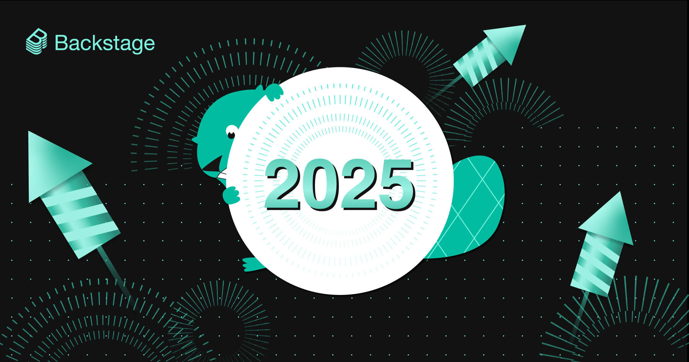
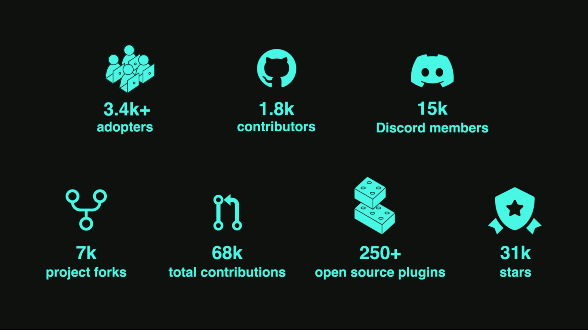

This year was another big one for Backstage and our worldwide community of adopters, contributors, and partners. Backstage turned five, the New Frontend System became adoption-ready, and your favorite platform for developer experience gained AI superpowers with the introduction of the Actions Registry and MCP server support. Let's blast into the New Year with a quick look back, along with a peek around the corner at what's coming next.

{/* truncate */}

---

## Busy beavers here, there, and everywhere

As in years past, we've visualized how our vibrant global community lights up the Backstage open source repo with enthusiasm, creativity, and commits. This year, we're visualizing contributions to the Community Plugins repo, too. Can you spot your name in the videos below?

<iframe
  src="https://www.youtube.com/embed/-D8PGN1tPn8"
  width="100%"
  height="440"
  allow="accelerometer; autoplay; encrypted-media; gyroscope; picture-in-picture"
  allowFullScreen
></iframe>

_All 7.7k commits to `backstage/backstage` in 2025_

<iframe
  src="https://www.youtube.com/embed/Vaz0AbOJdi0"
  width="100%"
  height="440"
  allow="accelerometer; autoplay; encrypted-media; gyroscope; picture-in-picture"
  allowFullScreen
></iframe>

_All 3.3k commits to `backstage/community-plugins` in 2025_

Couldn't spot your name in the videos? Here's one more chance — every contributor who helped shape Backstage in 2025, all in one picture.

## Mature for a five-year-old

_The growing Backstage ecosystem, by the numbers_

Earlier this year, the Backstage project [celebrated its 5th birthday][bday] on the main stage at [KubeCon + CloudNativeCon in London][kcon-eu].

While the framework still isn't old enough to shave, it's matured into the industry standard for internal developer portals (IDPs). According to [this DX survey][dx] released in March:

> Backstage is dominating the IDP market, holding an impressive 89% market share compared to SaaS competitors and achieving a remarkable 67% overall market penetration. These percentages are even higher for enterprise companies.

As you can see above in the [latest project stats][video], the Backstage ecosystem continues to expand, growing in adopters and contributors, as well as plugins and third-party service providers.

Want to dive into more Backstage stats? Check out the project's health scores and more on the relaunched [LFX Insights][lfx] site.

[bday]: https://www.youtube.com/watch?v=JqG1wey7-Ao&t=563s&list=PL8iP9yIjU0Q3K8LV_a9CcFmhvvNTAUzL1
[kcon-eu]: https://backstage.io/blog/2025/04/29/backstagecon-kubecon-25-london#big-birthday-energy-on-the-big-stage
[dx]: https://newsletter.getdx.com/p/backstage-and-the-developer-portal-market
[video]: https://www.youtube.com/watch?v=Wih0a1v1Et0&list=PL8iP9yIjU0Q33vpSaBlAvIhgDb-9smXUU
[lfx]: https://insights.linuxfoundation.org/project/backstage

## Building the future on modern foundations

Just because Backstage has cemented its place as the standard for IDPs doesn't mean it's sitting still. From backend to frontend, from AI to UI, the technical foundations of the platform have been modernized, updated, and revamped — this is why today's Backstage is ready to build the future of developer experience.

Top 2025 highlights:

- Goodbye to the old backend system
- New Frontend System is adoption-ready
- Hello to the Actions Registry + MCP server support
- Introducing a new design system with Backstage UI

With the [New Backend System][backend] released as a stable 1.0 last year and the [New Frontend System][frontend] becoming [adoption-ready][1-42] this year, Backstage is easier than ever to use, maintain, and build on — making it both more accessible and more capable for adopters, old and new.

This year also saw the debut of the [Actions Registry][actions] and MCP server support — so now Backstage can empower both your human developers and their AI helpers.

And [Backstage UI][ui] is coming! The alpha release of the upcoming design system made huge strides in 2025, preparing the way for a new level of usability throughout the Backstage experience.

Catch up on a whole year's worth of improvements — and see where Backstage is heading next — in the recordings below.

[backend]: https://backstage.io/docs/backend-system/
[frontend]: https://backstage.io/docs/frontend-system/
[1-42]: https://backstage.io/docs/releases/v1.42.0
[actions]: https://backstage.io/docs/backend-system/core-services/actions-registry
[ui]: https://ui.backstage.io/

<iframe
  src="https://www.youtube.com/embed/anqWhSnN7sA"
  width="100%"
  height="440"
  allow="accelerometer; autoplay; encrypted-media; gyroscope; picture-in-picture"
  allowFullScreen
></iframe>

_Watch the Backstage maintainers' talk at [KubeCon in London][lon], where they demoed the New Frontend System and introduced the Actions Registry._

<iframe
  src="https://www.youtube.com/embed/evmmr-uxNsc"
  width="100%"
  height="440"
  allow="accelerometer; autoplay; encrypted-media; gyroscope; picture-in-picture"
  allowFullScreen
></iframe>
_Watch the maintainers' talk at [KubeCon in Atlanta][atl], where they shared
work towards an AI-Native Backstage, progress on Backstage UI, and more._

[lon]: https://backstage.io/blog/2025/04/29/backstagecon-kubecon-25-london
[atl]: https://backstage.io/blog/2025/11/25/backstagecon-kubecon-25-atlanta

## See you in 2026!

Happy New Year, Backstage Community! See you in the repos!
