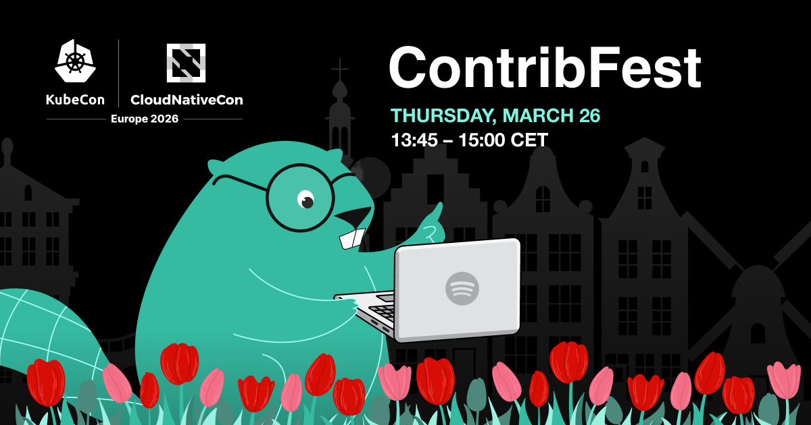

Become a Contrib Champ and join us at ContribFest, where commits become legendary!

We are once again hosting ContribFest at KubeCon + CloudNativeCon. This time around, it's taking place in Amsterdam on March 26, 2026, at 13:45 CET — make sure to [add it to your schedule](https://kccnceu2026.sched.com/event/2EF7v/contribfest-supercharge-your-open-source-impact-backstage-contribfest-live-andre-wanlin-emma-indal-spotify-heikki-hellgren-op-financial-group-elaine-bezerra-db-systel-gmbh?iframe=no). Learn more about what to expect below and get started now by exploring the new [ContribFest web app](https://contribfest.backstage.io/).

{/* truncate */}

## Introducing the ContribFest web app

We're excited to announce the new ContribFest web app: [https://contribfest.backstage.io/](https://contribfest.backstage.io/). The app simplifies local setup and helps you quickly find good issues to work on from the curated list pre-selected by your ContribFest co-hosts.

You'll see that the app is broken down into five sections:

- [Welcome](https://contribfest.backstage.io/): This is where you'll find links to all the things, including the session's slide deck, assignment sheet, the Backstage and Community Plugins repositories, and their respective contribution guides.
- [Getting Started](https://contribfest.backstage.io/getting-started/): Whether you are new to Backstage or an old hat, use this handy checklist to help you get your local environment set up for contributing, including all the commands. (Make sure you check all the boxes, you never know what might happen! 😉)
- [Curated Issues](https://contribfest.backstage.io/issues/): This is what you come to the session for: finding an issue that speaks to you and contributing towards it. This section has a list of issues that we've curated — and filters, so you can slice and dice the list to find the perfect issue to work on.
- [Contrib Champs](https://contribfest.backstage.io/contrib-champs/): We've hosted three other ContribFests in the past — this is where you'll find merged PRs from those sessions, a place to celebrate contributions. Make sure to tag your PRs with “ContribFest”, and maybe your name will show up here one day, too! 🏆
- [Hall of Hosts](https://contribfest.backstage.io/hall-of-hosts/): ContribFest would not take place without the various community members who have stepped up to help co-host the sessions. This is where you'll see an honor roll of past co-hosts. 🙏

## About those Contrib Champs

The goals of the Backstage ContribFest sessions are many — foster community, work with experts, etc. — but it's pretty obvious that contributions are the most important. It's in the name after all. Here are a few past contributions that we wanted to share to give you an idea of what that looks like:

- [#27694](https://github.com/backstage/backstage/pull/27694) by [hyb175](https://github.com/hyb175) — Add Pagination to Tech Docs Table: for those with lots of entities with TechDocs, this is a massive performance improvement.
- [#29470](https://github.com/backstage/backstage/pull/29470) by [ioboi](https://github.com/ioboi) — Openshift Auth provider: this allows those using OpenShift to use it to sign into their Backstage instance.
- [#31770](https://github.com/backstage/backstage/pull/31770) by [theZMC](https://github.com/theZMC) — Render HTML in GitHub-flavored Markdown: with this change in place, HTML will now render correctly in the MarkdownContent component when you are using the GitHub-flavored Markdown mode.

Check out the [Contrib Champs page](https://contribfest.backstage.io/contrib-champs/) to see the full list!

## Using Dev Containers

Along with the new ContribFest web app, we are also looking to use Dev Containers this time around to help streamline the session for those who'd like to use that option to get started. On the [Getting Started page](https://contribfest.backstage.io/getting-started/), pick the Dev Containers radio button and then follow the checklist. To give you a quick preview, you'll need to have the following installed:

- Git, you'll need this to be able to pull down the code
- Docker Desktop (or Docker Engine on Linux)
- VS Code with the Dev Containers extension or IntelliJ IDEA Ultimate

Check out our [Dev Containers tutorial](https://github.com/backstage/backstage/blob/master/contrib/docs/tutorials/devcontainer.md) for a deeper dive into the subject.

## Amsterdam, here we come!

On behalf of the Backstage ContribFest co-host team, thank you for following along. We're looking forward to meeting you in Amsterdam and working together on your contributions. Please be sure to introduce yourself!
