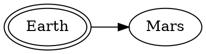

## hello mock docs

!!! test
Testing something

Abbreviations:
Some text about MOCDOC

This is a paragraph.
{: #test_id .test_class }

Apple
: Pomaceous fruit of plants of the genus Malus in
the family Rosaceae.

```javascript
import { test } from 'something';

const addThingToThing = (a, b) a + b;
```

- [abc](#abc)
- [xyz](#xyz)

## abc

This is a b c.

## xyz

This is x y z.

# The attack plan





# PlantUML Samples

```plantuml classes="uml myDiagram" alt="Diagram placeholder" title="My diagram"
@startuml
  Goofy ->  MickeyMouse: calls
  Goofy <-- MickeyMouse: responds
@enduml
```

:bulb:

=== "JavaScript"

    ```javascript
    import { test } from 'something';

    const addThingToThing = (a, b) a + b;
    ```

=== "Java"

    ```java
    public void function() {
        test();
    }
    ```

```java tab="java"
    public void function() {
      test();
    }
```

```java tab="java 2"
    public void function() {
      test();
    }
```

```javascript
import { test } from 'something';

const addThingToThing = (a, b) a + b;
```

<!-- prettier-ignore -->
*[MOCDOC]: Mock Documentation
