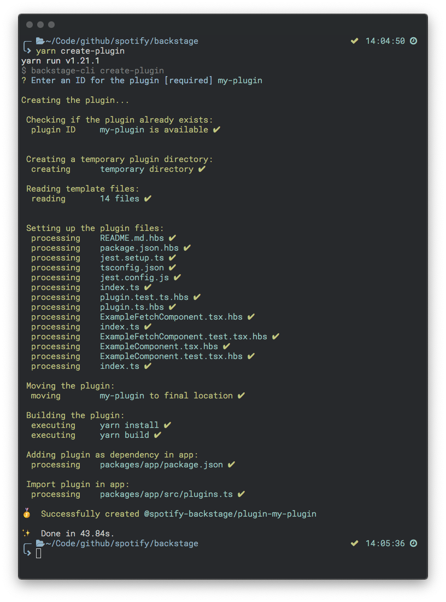

# Plugin Development in Backstage
Backstage plugins provides features to an Backstage App. 

Each plugin is treated as a self-contained web app and can include almost any type of content. 
Plugins all use a common set of platform API's and reusable UI components. 
Plugins can fetch data either from a backend or through any RESTful API exposed directly or through 
a proxy.

## Creating a new plugin
On your command-line, invoke the `backstage-cli` to create a new plugin:
```bash
yarn create-plugin
```



This will create a new Backstage Plugin based on the ID that was provided. It will be built and 
added to the Backstage App automatically.

*If `yarn start` is already running you should be able to see the default page for your new 
plugin directly by navigating to `http://localhost:3000/my-plugin`.*


## Plugin concepts / API

### Routing
Each plugin is responsible for registering it's components to corresponding routes in the app.

The app will call the `createPlugin` method on each plugin, passing in an `router` object with a set 
of methods on it.

```typescript
import { createPlugin } from '@spotify-backstage/core';
import ExampleComponent from './components/ExampleComponent';

export default createPlugin({
  id: 'my-plugin',
  register({ router }) {
    router.registerRoute('/my-plugin', ExampleComponent);
  },
});
```

#### `router` API
```typescript
type RouterHooks = {
  registerRoute(
    path: RoutePath,
    Component: ComponentType<any>,
    options?: RouteOptions,
  ): void;

  registerRedirect(
    path: RoutePath,
    target: RoutePath,
    options?: RouteOptions,
  ): void;
};
```
