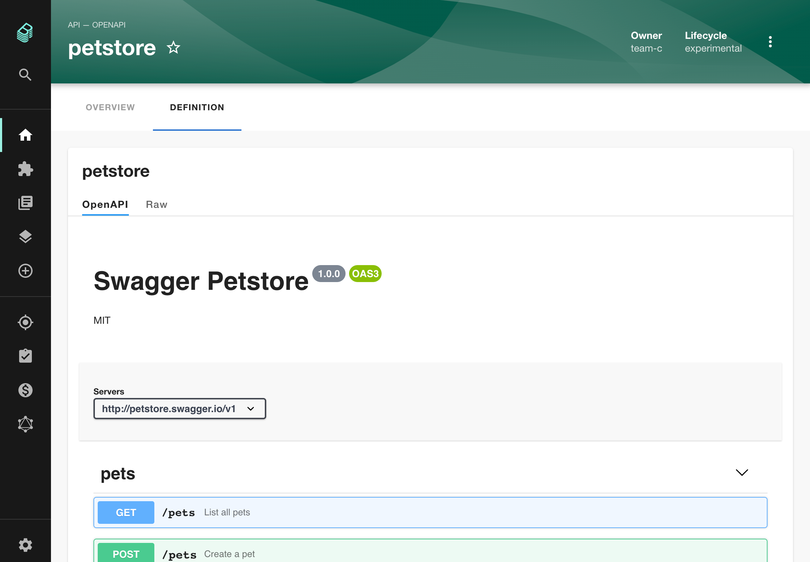

# Api Docs

> [!WARNING]
> This documentation is made for those using the experimental new Frontend system.
> If you are not using the new frontend system, please go [here](./README.md).

This is an extension for the catalog plugin that provides components to discover and display API entities.
APIs define the interface between components, see the [system model](https://backstage.io/docs/features/software-catalog/system-model) for details.
They are defined in machine readable formats and provide a human readable documentation.

The plugin provides a standalone list of APIs, as well as an integration into the API tab of a catalog entity.





Right now, the following API formats are supported:

- [OpenAPI](https://swagger.io/specification/) 2 & 3
- [AsyncAPI](https://www.asyncapi.com/docs/reference/specification/latest)
- [GraphQL](https://graphql.org/learn/schema/)

Other formats are displayed as plain text, but this can easily be extended.

To fill the catalog with APIs, [provide entities of kind API](https://backstage.io/docs/features/software-catalog/descriptor-format#kind-api).
To link that a component provides or consumes an API, see the [`providesApis`](https://backstage.io/docs/features/software-catalog/descriptor-format#specprovidesapis-optional) and [`consumesApis`](https://backstage.io/docs/features/software-catalog/descriptor-format#specconsumesapis-optional) properties on the Component kind.

## Table of Content

- [Installation](#installation)
- [Customization](#customization)
  - [Packages](#packages)
  - [Routes](#routes)
  - [Extensions](#extensions)
    - [Apis Nav Item](#apis-nav-item)
    - [Apis Explorer Page](#apis-explore-page)
    - [Apis Entity Cards](#apis-entities-cards)
      - [Has Apis Entity Card](#has-apis-entity-card)
      - [Definition Entity Card](#definition-entity-card)
      - [Provided Apis Entity Card](#provided-apis-entity-card)
      - [Consumed Apis Entity Card](#consumed-apis-entity-card)
      - [Providing Components Entity Card](#providing-components-entity-card)
      - [Consuming Components Entity Card](#consuming-components-entity-card)
    - [Apis Entity Contents](#apis-entity-contents)
      - [Definition Entity Content](#definition-entity-content)
      - [Apis Entity Content](#apis-entity-content)
    - [Apis Config Api](#apis-config-api)
      - [Custom Api Renderings](#custom-api-renderings)
      - [Adding Swagger UI Interceptor](#adding-requestinterceptor-to-swagger-ui)
      - [Providing Swagger UI Specific Supported Methods](#provide-specific-supported-methods-to-swagger-ui)
      - [Custom Resolvers for AsyncApi](#custom-resolvers-for-asyncapi)
    - [Integrations](#integrations)
      - [Implementing OAuth 2 Authorization Code flow with Swagger UI](#implementing-oauth-2-authorization-code-flow-with-swagger-ui)

## Installation

1. Install the `api-docs` plugin in you Backstage app:

   ```bash
   # From your Backstage root directory
   yarn --cwd packages/app add @backstage/plugin-api-docs
   ```

2. Enable which entity cards and tabs you would like to see on the catalog entity page:

   ```yaml
   # app-config.yaml
   app:
     experimental:
       # Auto discovering all plugins extensions
       packages: all
     extensions:
       # Enabling some entity cards
       # The cards will be displayed in the same order it appears in this setting list
       # Shows a table of components that provides a particular api
       - entity-card:api-docs/providing-components:
           config:
             # Presenting the card ony for entites of kind api
             filter: kind:api
       # Shows a table of components that consumes a particular api
       - entity-card:api-docs/consuming-components:
           config:
             # Presenting the card ony for entites of kind api
             filter: kind:api
       # Enabling some contents
       # The contents will be displayed in the same order it appears in this setting list
       # Shows a "Definition" tab for entities of kind api
       - entity-content:api-docs/definition
       # Shows an "Apis" tab for entities of kind component
       - entity-content:api-docs/apis
   ```

3. Then start the app, navigate to an entity's page and see the cards and contents in there;
4. You can also access the Apis explorer page by clicking on the "APIs" sidebar item.

## Customization

### Packages

The `api-docs` plugin can be automatically discovered, and it is also possible to enable it only in certain [environments](https://backstage.io/docs/conf/writing/#configuration-files). See [this](https://backstage.io/docs/frontend-system/architecture/app/#feature-discovery) packages documentation for more details.

### Routes

The `api-docs` plugin exposes regular and external routes that can be used to configure route bindings.

| Key           | Type           | Description                            |
| ------------- | -------------- | -------------------------------------- |
| `root`        | Regular route  | A route ref to the Apis Explorer page. |
| `registerApi` | External route | A route ref to Register Api page.      |

As an example, here is an association between the external register api page and a regular route from another plugin:

```yaml
# app-config.yaml
app:
  routes:
    bindings:
      # example binding the external register api route
      api-docs.registerApi: <plugin-id>.<regular-route-key>
```

Additionally, it is possible to point a route from another plugin to the Apis explorer page:

```yaml
# app-config.yaml
app:
  routes:
    bindings:
      # example binding a external route to the apis explorer page
      <plugin-id>.<external-route-key>: api-docs.root
```

Route binding is also possible through code. For more information, see [this](https://backstage.io/docs/frontend-system/architecture/routes#binding-external-route-references) documentation.

### Extensions

#### Apis Nav Item

This [nav item](https://backstage.io/docs/reference/frontend-plugin-api.createnavitemextension) extension adds a link to the Apis Explorer page in the main app sidebar.

| Kind       | Namespace  | Name | Id                  |
| ---------- | ---------- | ---- | ------------------- |
| `nav-item` | `api-docs` | -    | `nav-item:api-docs` |

##### Disable

This extension is enabled by default when you install the `api-docs` plugin, but you can disable it and prevent it from showing up in the sidebar by setting the following configuration:

```yaml
# app-config.yaml
app:
  extensions:
    # this is the extension id and it follows the naming pattern bellow:
    # <extension-kind>/<plugin-namespace>:<extension-name>
    # example disabling the apis docs nav item extension
    - nav-item:api-docs: false
    # or
    # - nav-item:api-docs:
    #     disabled: true
```

To enable the extension again, simple remove the previous `nav-item:api-docs: false` configuration or do:

```yaml
# app-config.yaml
app:
  extensions:
    # this is the extension id and it follows the naming pattern bellow:
    # <extension-kind>/<plugin-namespace>:<extension-name>
    - nav-item:api-docs
    # or
    # - nav-item:api-docs: true
    # or
    # - nav-item:api-docs:
    #     disabled: false
```

##### Config

The apis nav item can be customized under the `app.extensions.nav-item:api-docs.config` key in `app-config.yaml`. Configurations include:

```yaml
# app-config.yaml
# example configuring the apis docs nav item extension
app:
  extensions:
    # this is the extension id and it follows the naming pattern bellow:
    # <extension-kind>/<plugin-namespace>:<extension-name>
    - nav-item:api-docs:
        config:
          # The nav item title text, defaults to "APIs"
          title: 'Apis Explorer'
          # The nav item path text, defaults to "/api-docs"
          path: '/apis-explorer'
```

##### Override

The apis nav item icon can only be changed by overriding the extension, as the icon cannot be changed via the `app-config.yaml` file.

Here is an example overriding the nav item extension with a custom icon component:

```tsx
import {
  createFrontendModule,
  createNavItemExtension,
} from '@backstage/backstage-plugin-api';
import { MyCustomApiDocsIcon } from './components';

export default createFrontendModule({
  pluginId: 'api-docs',
  extensions: [
    createNavItemExtension({
      // It's your choice whether to use the original extension's title or a different one
      title: 'APIs',
      // Setting a custom icon component
      icon: MyCustomApiDocsIcon,
    }),
  ],
});
```

For more information about where to place extension overrides, see the official [documentation](https://backstage.io/docs/frontend-system/architecture/extension-overrides).

#### Apis Explore Page

This `api-docs` plugin installs an "Apis Explore" page extension that helps you visualize apis registered in the Backstage software catalog.

| Kind   | Namespace  | Name | Id              |
| ------ | ---------- | ---- | --------------- |
| `page` | `api-docs` | -    | `page:api-docs` |

##### Disable/Enable

The explore page extension is enable by default when you install the `api-docs` plugin, for disabling it, set the configuration below:

> [!CAUTION]
> The `api-docs` plugin also install a sidebar item that points to this page, remember to disable the nav item as well otherwise it will point to a not found page.

```yaml
# app-config.yaml
# example disabling the apis docs explorer page
app:
  extensions:
    # this is the extension id and it follows the naming pattern bellow:
    # <extension-kind>/<plugin-namespace>:<extension-name>
    - page:api-docs: false
    # or
    # - page:api-docs:
    #     disabled: true
```

To enable the extension again, simple remove the previous `page:api-docs: false` configuration or do:

```yaml
# app-config.yaml
app:
  extensions:
    # this is the extension id and it follows the naming pattern bellow:
    # <extension-kind>/<plugin-namespace>:<extension-name>
    - page:api-docs
    # or
    # - page:api-docs: true
    # or
    # - page:api-docs:
    #     disabled: false
```

##### Override

The explorer page implementation can be [overridden](https://backstage.io/docs/frontend-system/architecture/extension-overrides) in situations where its default extension is not customizable enough.

Here is an example overriding the APIs Explorer page component:

```tsx
import {
  createFrontendModule,
  createPageExtension,
} from '@backstage/backstage-plugin-api';
import { convertLegacyRouteRef } from '@backstage/core-compat-api';

export default createFrontendModule({
  pluginId: 'api-docs',
  extensions: [
    createPageExtension({
      // Ommitting name since we are overriding a plugin index page
      // It's up to you whether to use the original default path or not, but links that are hardcoded to the default path won't work if you change it
      defaultPath: '/api-docs',
      // Associating the page with a different route ref may result in the sidebar item or external plugin route pointing to an unreachable page
      routeRef: convertLegacyRouteRef(rootRoute),
      // Custom page components are loaded here
      loader: () =>
        import('./components').then(m => <m.MyCustomApiExplorerPage />),
    }),
  ],
});
```

#### Apis Entities Cards

The `api-docs` provide some entity cards you can enable to customize the Software Catalog entity page.

> [!IMPORTANT]
> The order in which cards are listed in the configuration file will determine the order in which they appear in overview cards and tab lists on entity pages.

See a complete cards list below:

##### Has Apis Entity Card

An [entity card](https://github.com/backstage/backstage/blob/master/plugins/catalog-react/report-alpha.api.md) extension that renders a table of entities that have an api relation with a particular Software catalog entity.

| Kind          | Namespace  | Name       | Id                              |
| ------------- | ---------- | ---------- | ------------------------------- |
| `entity-card` | `api-docs` | `has-apis` | `entity-card:api-docs/has-apis` |

###### Disable

This card is disabled by default when you install the `api-docs` plugin, but to ensure the card will always be disabled or enabled regardless of the extension's default definition, add the following configuration:

```yaml
# app-config.yaml
# example disabling the apis docs has apis entity card extension
app:
  extensions:
    # this is the extension id and it follows the naming pattern bellow:
    # <extension-kind>/<plugin-namespace>:<extension-name>
    # use false as value for disabling the extension and true for enabling
    - entity-card:api-docs/has-apis: false
    # or
    # - entity-card:api-docs/has-apis:
    #   - config:
    #       # set 'true' for enabling it again
    #       disabled: true
```

###### Config

For now there is only one configuration available for this entity card extension, which is setting an entity filter that determines when the card should be displayed on the entity page.

Here is an example showing the `has-apis` overview cards only for entities of kind component:

```yaml
# app-config.yaml
# example setting the extension to only show up for entities with kind "component"
app:
  extensions:
    # this is the extension id and it follows the naming pattern bellow:
    # <extension-kind>/<plugin-namespace>:<extension-name>
    - entity-card:api-docs/has-apis:
        config:
          # The default value is a function that verifies it is a components has api pat of relations
          # For more information about entity cards filters, check out this pull request
          # https://github.com/backstage/backstage/pull/21480
          filter: 'kind:component'
```

###### Override

Use extension overrides for completely re-implementing the has apis entity card extension:

```tsx
import { createFrontendModule } from '@backstage/backstage-plugin-api';
import { createEntityCardExtension } from '@backstage/plugin-catalog-react/alpha';

export default createFrontendModule({
  pluginId: 'api-docs',
  extensions: [
    createEntityCardExtension({
      // Name is necessary so the system knows that this extension will override the default 'has-apis' entity card extension provided by the 'api-docs' plugin
      name: 'has-apis',
      // Returing a custom card component
      loader: () =>
        import('./components').then(m => <m.MyCustomHasApisEntityCard />),
    }),
  ],
});
```

For more information about where to place extension overrides, see the official [documentation](https://backstage.io/docs/frontend-system/architecture/extension-overrides).

##### Definition Entity Card

An [entity card](https://github.com/backstage/backstage/blob/master/plugins/catalog-react/report-alpha.api.md) extension that renders an entity api definition widget.

| Kind          | Namespace  | Name         | Id                                |
| ------------- | ---------- | ------------ | --------------------------------- |
| `entity-card` | `api-docs` | `definition` | `entity-card:api-docs/definition` |

###### Disable

This card is disabled by default when you install the `api-docs` plugin, but to ensure the card will always be disabled or enabled regardless of the extension's default definition, add the following configuration:

```yaml
# app-config.yaml
# example disabling the definition entity card extension
app:
  extensions:
    # this is the extension id and it follows the naming pattern bellow:
    # <extension-kind>/<plugin-namespace>:<extension-name>
    # use false as value for disabling the extension and true for enabling
    - entity-card:api-docs/definition: false
    # or
    # - entity-card:api-docs/definition:
    #   - config:
    #       # set 'true' for enabling it again
    #       disabled: true
```

###### Config

For now there is only one configuration available for this entity card extension, which is setting an entity filter that determines when the card should be displayed on the entity page.

Here is an example showing the `definition` overview cards only for entities of kind component:

```yaml
# app-config.yaml
# example setting the extension to only show up for entities with kind "component"
app:
  extensions:
    # this is the extension id and it follows the naming pattern bellow:
    # <extension-kind>/<plugin-namespace>:<extension-name>
    - entity-card:api-docs/definition:
        config:
          # Default to 'kind:api'
          # For more information about entity cards filters, check out this pull request
          # https://github.com/backstage/backstage/pull/21480
          filter: 'kind:component'
```

###### Override

Use extension overrides for completely re-implementing the has apis entity card extension:

```tsx
import { createFrontendModule } from '@backstage/backstage-plugin-api';
import { createEntityCardExtension } from '@backstage/plugin-catalog-react/alpha';

export default createFrontendModule({
  pluginId: 'api-docs',
  extensions: [
    createEntityCardExtension({
      // Name is necessary so the system knows that this extension will override the default 'definition' entity card extension provided by the 'api-docs' plugin
      name: 'definition',
      // Returing a custom card component
      loader: () =>
        import('./components').then(m => <m.MyCustomApiDefinitionEntityCard />),
    }),
  ],
});
```

For more information about where to place extension overrides, see the official [documentation](https://backstage.io/docs/frontend-system/architecture/extension-overrides).

##### Provided Apis Entity Card

An [entity card](https://github.com/backstage/backstage/blob/master/plugins/catalog-react/report-alpha.api.md) extension that renders a table of apis provided by a particular Software Catalog Component.

| Kind          | Namespace  | Name            | Id                                   |
| ------------- | ---------- | --------------- | ------------------------------------ |
| `entity-card` | `api-docs` | `provided-apis` | `entity-card:api-docs/provided-apis` |

###### Disable

This card is disabled by default when you install the `api-docs` plugin, but to ensure the card will always be disabled or enabled regardless of the extension's default definition, add the following configuration:

```yaml
# app-config.yaml
# example disabling the provided apis entity card extension
app:
  extensions:
    # this is the extension id and it follows the naming pattern bellow:
    # <extension-kind>/<plugin-namespace>:<extension-name>
    # use false as value for disabling the extension and true for enabling
    - entity-card:api-docs/provided-apis: false
    # or
    # - entity-card:api-docs/provided-apis:
    #   - config:
    #       # set 'true' for enabling it again
    #       disabled: true
```

###### Config

For now there is only one configuration available for this entity card extension, which is setting an entity filter that determines when the card should be displayed on the entity page.

Here is an example showing the `provided-apis` overview cards only for entities of kind component:

```yaml
# app-config.yaml
# example setting the extension to only show up for entities with kind "component"
app:
  extensions:
    # this is the extension id and it follows the naming pattern bellow:
    # <extension-kind>/<plugin-namespace>:<extension-name>
    - entity-card:api-docs/provided-apis:
        config:
          # Default to 'kind:component'
          # For more information about entity cards filters, check out this pull request
          # https://github.com/backstage/backstage/pull/21480
          filter: 'kind:component'
```

###### Override

Use extension overrides for completely re-implementing the has apis entity card extension:

```tsx
import { createFrontendModule } from '@backstage/backstage-plugin-api';
import { createEntityCardExtension } from '@backstage/plugin-catalog-react/alpha';

export default createFrontendModule({
  pluginId: 'api-docs',
  extensions: [
    createEntityCardExtension({
      // Name is necessary so the system knows that this extension will override the default 'provided-apis' entity card extension provided by the 'api-docs' plugin
      name: 'provided-apis',
      // Returing a custom card component
      loader: () =>
        import('./components').then(m => <m.MyCustomProvidedApisEntityCard />),
    }),
  ],
});
```

For more information about where to place extension overrides, see the official [documentation](https://backstage.io/docs/frontend-system/architecture/extension-overrides).

##### Consumed Apis Entity Card

An [entity card](https://github.com/backstage/backstage/blob/master/plugins/catalog-react/report-alpha.api.md) extension that renders a table of apis consumed by a particular Software Catalog Component.

| Kind          | Namespace  | Name            | Id                                   |
| ------------- | ---------- | --------------- | ------------------------------------ |
| `entity-card` | `api-docs` | `consumed-apis` | `entity-card:api-docs/consumed-apis` |

###### Disable

This card is disabled by default when you install the `api-docs` plugin, but to ensure the card will always be disabled or enabled regardless of the extension's default definition, add the following configuration:

```yaml
# app-config.yaml
# example disabling the consumed apis entity card extension
app:
  extensions:
    # this is the extension id and it follows the naming pattern bellow:
    # <extension-kind>/<plugin-namespace>:<extension-name>
    # use false as value for disabling the extension and true for enabling
    - entity-card:api-docs/consumed-apis: false
    # or
    # - entity-card:api-docs/consumed-apis:
    #   - config:
    #       # set 'true' for enabling it again
    #       disabled: true
```

###### Config

For now there is only one configuration available for this entity card extension, which is setting an entity filter that determines when the card should be displayed on the entity page.

Here is an example showing the `consumed-apis` overview cards only for entities of kind component:

```yaml
# app-config.yaml
# example setting the extension to only show up for entities with kind "component"
app:
  extensions:
    # this is the extension id and it follows the naming pattern bellow:
    # <extension-kind>/<plugin-namespace>:<extension-name>
    - entity-card:api-docs/consumed-apis:
        config:
          # Default to 'kind:component'
          # For more information about entity cards filters, check out this pull request
          # https://github.com/backstage/backstage/pull/21480
          filter: 'kind:component'
```

###### Override

Use extension overrides for completely re-implementing the has apis entity card extension:

```tsx
import { createFrontendModule } from '@backstage/backstage-plugin-api';
import { createEntityCardExtension } from '@backstage/plugin-catalog-react/alpha';

export default createFrontendModule({
  pluginId: 'api-docs',
  extensions: [
    createEntityCardExtension({
      // Name is necessary so the system knows that this extension will override the default 'consumed-apis' entity card extension provided by the 'api-docs' plugin
      name: 'consumed-apis',
      // Returing a custom card component
      loader: () =>
        import('./components').then(m => <m.MyCustomConsumedApisEntityCard />),
    }),
  ],
});
```

For more information about where to place extension overrides, see the official [documentation](https://backstage.io/docs/frontend-system/architecture/extension-overrides).

##### Providing Components Entity Card

An [entity card](https://github.com/backstage/backstage/blob/master/plugins/catalog-react/report-alpha.api.md) extension that renders a table of components that provides a particular Software Catalog api.

| Kind          | Namespace  | Name                   | Id                                          |
| ------------- | ---------- | ---------------------- | ------------------------------------------- |
| `entity-card` | `api-docs` | `providing-components` | `entity-card:api-docs/providing-components` |

###### Disable

This card is disabled by default when you install the `api-docs` plugin, but to ensure the card will always be disabled or enabled regardless of the extension's default definition, add the following configuration:

```yaml
# app-config.yaml
# example disabling the providing components entity card extension
app:
  extensions:
    # this is the extension id and it follows the naming pattern bellow:
    # <extension-kind>/<plugin-namespace>:<extension-name>
    # use false as value for disabling the extension and true for enabling
    - entity-card:api-docs/providing-components: false
    # or
    # - entity-card:api-docs/providing-components:
    #   - config:
    #       # set 'true' for enabling it again
    #       disabled: true
```

###### Config

For now there is only one configuration available for this entity card extension, which is setting an entity filter that determines when the card should be displayed on the entity page.

Here is an example showing the `providing-components` overview cards only for entities of kind component:

```yaml
# app-config.yaml
# example setting the extension to only show up for entities with kind "component"
app:
  extensions:
    # this is the extension id and it follows the naming pattern bellow:
    # <extension-kind>/<plugin-namespace>:<extension-name>
    - entity-card:api-docs/providing-components:
        config:
          # Default to 'kind:api'
          # For more information about entity cards filters, check out this pull request
          # https://github.com/backstage/backstage/pull/21480
          filter: 'kind:component'
```

###### Override

Use extension overrides for completely re-implementing the has apis entity card extension:

```tsx
import { createFrontendModule } from '@backstage/backstage-plugin-api';
import { createEntityCardExtension } from '@backstage/plugin-catalog-react/alpha';

export default createFrontendModule({
  pluginId: 'api-docs',
  extensions: [
    createEntityCardExtension({
      // Name is necessary so the system knows that this extension will override the default 'providing-components' entity card extension provided by the 'api-docs' plugin
      name: 'providing-components',
      // Returing a custom card component
      loader: () =>
        import('./components').then(m => (
          <m.MyCustomProvidingComponentsEntityCard />
        )),
    }),
  ],
});
```

For more information about where to place extension overrides, see the official [documentation](https://backstage.io/docs/frontend-system/architecture/extension-overrides).

##### Consuming Components Entity Card

An [entity card](https://github.com/backstage/backstage/blob/master/plugins/catalog-react/report-alpha.api.md) extension that renders a table of components that consumes a particular Software Catalog api.

| Kind          | Namespace  | Name                   | Id                                          |
| ------------- | ---------- | ---------------------- | ------------------------------------------- |
| `entity-card` | `api-docs` | `consuming-components` | `entity-card:api-docs/consuming-components` |

###### Disable

This card is disabled by default when you install the `api-docs` plugin, but to ensure the card will always be disabled or enabled regardless of the extension's default definition, add the following configuration:

```yaml
# app-config.yaml
# example disabling the consuming components entity card extension
app:
  extensions:
    # this is the extension id and it follows the naming pattern bellow:
    # <extension-kind>/<plugin-namespace>:<extension-name>
    # use false as value for disabling the extension and true for enabling
    - entity-card:api-docs/consuming-components: false
    # or
    # - entity-card:api-docs/consuming-components:
    #   - config:
    #       # set 'true' for enabling it again
    #       disabled: true
```

###### Config

For now there is only one configuration available for this entity card extension, which is setting an entity filter that determines when the card should be displayed on the entity page.

Here is an example showing the `consuming-components` overview cards only for entities of kind component:

```yaml
# app-config.yaml
# example setting the extension to only show up for entities with kind "component"
app:
  extensions:
    # this is the extension id and it follows the naming pattern bellow:
    # <extension-kind>/<plugin-namespace>:<extension-name>
    - entity-card:api-docs/consuming-components:
        config:
          # Default to 'kind:api'
          # For more information about entity cards filters, check out this pull request
          # https://github.com/backstage/backstage/pull/21480
          filter: 'kind:component'
```

###### Override

Use extension overrides for completely re-implementing the has apis entity card extension:

```tsx
import { createFrontendModule } from '@backstage/backstage-plugin-api';
import { createEntityCardExtension } from '@backstage/plugin-catalog-react/alpha';

export default createFrontendModule({
  pluginId: 'api-docs',
  extensions: [
    createEntityCardExtension({
      // Name is necessary so the system knows that this extension will override the default 'consuming-components' entity card extension provided by the 'api-docs' plugin
      name: 'consuming-components',
      // Returing a custom card component
      loader: () =>
        import('./components').then(m => (
          <m.MyCustomConsumingComponentsEntityCard />
        )),
    }),
  ],
});
```

For more information about where to place extension overrides, see the official [documentation](https://backstage.io/docs/frontend-system/architecture/extension-overrides).

### Apis Entity Contents

The `api-docs` provide some entity contents you can enable to customize the Software Catalog entity page.

> [!IMPORTANT]
> The order in which contents are listed in the configuration file will determine the order in which they appear in overview contents and tabs on entity pages.

See a complete contents list below:

##### Definition Entity Content

An [entity content](https://github.com/backstage/backstage/blob/master/plugins/catalog-react/report-alpha.api.md) extension that renders a tab in the entity page showing a particular entity api definition.

| Kind             | Namespace  | Name         | Id                                   |
| ---------------- | ---------- | ------------ | ------------------------------------ |
| `entity-content` | `api-docs` | `definition` | `entity-content:api-docs/definition` |

###### Disable

This content is disabled by default when you install the `api-docs` plugin, but to ensure the content will always be disabled or enabled regardless of the extension's default definition, add the following configuration:

```yaml
# app-config.yaml
# example disabling the definition entity content extension
app:
  extensions:
    # this is the extension id and it follows the naming pattern bellow:
    # <extension-kind>/<plugin-namespace>:<extension-name>
    # use false as value for disabling the extension and true for enabling
    - entity-content:api-docs/definition: false
    # or
    # - entity-content:api-docs/definition:
    #   - config:
    #       # set 'true' for enabling it again
    #       disabled: true
```

###### Config

There are a few configuration options for this entity content extension, see the list below:

```yaml
# app-config.yaml
# example setting the extension to only show up for entities with kind "api"
app:
  extensions:
    # this is the extension id and it follows the naming pattern bellow:
    # <extension-kind>/<plugin-namespace>:<extension-name>
    - entity-content:api-docs/definition:
        config:
          # A text-based query used to filter whether the entity contentextension should be rendered or not.
          # For more information about entity cards filters, check out this pull request
          # https://github.com/backstage/backstage/pull/21480
          # defaults to 'kind:api'
          filter: 'kind:api'
          # The entity content table title
          # defaults to 'Definition'
          title: 'Definition'
          # the content tab path
          # default to "/definition"
          path: '/definition'
```

###### Override

Use extension overrides for completely re-implementing the has apis entity card extension:

```tsx
import { createFrontendModule } from '@backstage/backstage-plugin-api';
import { createEntityContentExtension } from '@backstage/plugin-catalog-react/alpha';

export default createFrontendModule({
  pluginId: 'api-docs',
  extensions: [
    createEntityContentExtension({
      // Name is necessary so the system knows that this extension will override the default 'definition' entity content extension provided by the 'api-docs' plugin
      name: 'definition',
      // Returning a custom content component
      loader: () =>
        import('./components').then(m => (
          <m.MyCustomApiDefinitionEntityContent />
        )),
    }),
  ],
});
```

For more information about where to place extension overrides, see the official [documentation](https://backstage.io/docs/frontend-system/architecture/extension-overrides).

##### Apis Entity Content

An Entity Content extension that renders a tab in the entity page showing a particular entity consumed and provided apis.

| Kind             | Namespace  | Name   | Id                             |
| ---------------- | ---------- | ------ | ------------------------------ |
| `entity-content` | `api-docs` | `apis` | `entity-content:api-docs/apis` |

###### Disable

This content is disabled by default when you install the `api-docs` plugin, but to ensure the content will always be disabled or enabled regardless of the extension's default definition, add the following configuration:

```yaml
# app-config.yaml
# example disabling the apis entity content extension
app:
  extensions:
    # this is the extension id and it follows the naming pattern bellow:
    # <extension-kind>/<plugin-namespace>:<extension-name>
    # use false as value for disabling the extension and true for enabling
    - entity-content:api-docs/apis: false
    # or
    # - entity-content:api-docs/apis:
    #   - config:
    #       # set 'true' for enabling it again
    #       disabled: true
```

###### Config

There are a few configuration options for this entity content extension, see the list below:

```yaml
# app-config.yaml
# example setting the extension to only show up for entities of kind "content"
app:
  extensions:
    # this is the extension id and it follows the naming pattern bellow:
    # <extension-kind>/<plugin-namespace>:<extension-name>
    - entity-content:api-docs/apis:
        config:
          # A text-based query used to filter whether the entity contentextension should be rendered or not.
          # For more information about entity cards filters, check out this pull request
          # https://github.com/backstage/backstage/pull/21480
          # defaults to 'kind:component'
          filter: 'kind:component'
          # The entity content table title
          # defaults to 'Definition'
          title: 'Definition'
          # the content tab path
          # default to "/definition"
          path: '/definition'
```

###### Override

Use extension overrides for completely re-implementing the apis entity content extension:

```tsx
import { createFrontendModule } from '@backstage/backstage-plugin-api';
import { createEntityContentExtension } from '@backstage/plugin-catalog-react/alpha';

export default createFrontendModule({
  pluginId: 'api-docs',
  extensions: [
    createEntityContentExtension({
      // Name is necessary so the system knows that this extension will override the default 'apis' entity content extension provided by the 'api-docs' plugin
      name: 'apis',
      // Returing a custom content component
      loader: () =>
        import('./components').then(m => <m.MyCustomApisEntityContent />),
    }),
  ],
});
```

For more information about where to place extension overrides, see the official [documentation](https://backstage.io/docs/frontend-system/architecture/extension-overrides).

#### Apis Config Api

This is an api used by the `api-docs` plugin to get the api definition widget.

| Kind  | Namespace                | Name | Id                           |
| ----- | ------------------------ | ---- | ---------------------------- |
| `api` | `plugin.api-docs.config` | -    | `api:plugin.api-docs.config` |

Changing the widgets returned by this API requires [overriding](https://backstage.io/docs/frontend-system/architecture/extension-overrides) the default extension implementation. Here are a few common override cases:

##### Custom Api Renderings

Add support for additional API types by providing a custom implementation for the `apiDocsConfigRef` and also use this to override the rendering of one of the already supported types.

This is an example with a made-up renderer for SQL schemas:

```tsx
import {
  createFrontendModule,
  createApiExtenion,
  createApiFactory,
} from '@backstage/frontend-plugin-api';
import { ApiEntity } from '@backstage/catalog-model';
import {
  apiDocsConfigRef,
  ApiDefinitionWidget,
  defaultDefinitionWidgets,
} from '@backstage/plugin-api-docs';
import { SqlRenderer } from '...';

export default createFrontendModule({
  pluginId: 'api-docs',
  extensions: [
    createApiExtenion({
      factory: createApiFactory({
        api: apiDocsConfigRef,
        deps: {},
        factory: () => {
          // load the default widgets
          const definitionWidgets = defaultDefinitionWidgets();
          return {
            getApiDefinitionWidget: (apiEntity: ApiEntity) => {
              // custom rendering for sql
              if (apiEntity.spec.type === 'sql') {
                return {
                  type: 'sql',
                  title: 'SQL',
                  component: definition => (
                    <SqlRenderer definition={definition} />
                  ),
                } as ApiDefinitionWidget;
              }

              // fallback to the defaults
              return definitionWidgets.find(
                d => d.type === apiEntity.spec.type,
              );
            },
          };
        },
      }),
    }),
  ],
});
```

##### Adding `requestInterceptor` to Swagger UI

Override the config api to configure a [`requestInterceptor` for Swagger UI](https://github.com/swagger-api/swagger-ui/tree/master/flavors/swagger-ui-react#requestinterceptor-proptypesfunc) as following:

```tsx
import {
  createFrontendModule,
  createApiExtenion,
  createApiFactory,
} from '@backstage/frontend-plugin-api';
import {
  apiDocsConfigRef,
  defaultDefinitionWidgets,
  OpenApiDefinitionWidget,
} from '@backstage/plugin-api-docs';
import { ApiEntity } from '@backstage/catalog-model';

export default createFrontendModule({
  pluginId: 'api-docs',
  extensions: [
    createApiExtenion({
      factory: createApiFactory({
        api: apiDocsConfigRef,
        deps: {},
        factory: () => {
          // Overriding openapi definition widget to add header
          const requestInterceptor = (req: any) => {
            req.headers.append('myheader', 'wombats');
            return req;
          };
          const definitionWidgets = defaultDefinitionWidgets().map(obj => {
            if (obj.type === 'openapi') {
              return {
                ...obj,
                component: definition => (
                  <OpenApiDefinitionWidget
                    definition={definition}
                    requestInterceptor={requestInterceptor}
                  />
                ),
              };
            }
            return obj;
          });

          return {
            getApiDefinitionWidget: (apiEntity: ApiEntity) => {
              return definitionWidgets.find(
                d => d.type === apiEntity.spec.type,
              );
            },
          };
        },
      }),
    }),
  ],
});
```

In the same way as the `requestInterceptor` you can override any property of Swagger UI.

##### Provide Specific Supported Methods to Swagger UI

This can be done through utilising the [supportedSubmitMethods prop](https://github.com/swagger-api/swagger-ui/tree/master/flavors/swagger-ui-react#supportedsubmitmethods-proptypesarrayofproptypesoneofget-put-post-delete-options-head-patch-trace).
If you want to limit the HTTP methods available for the `Try It Out` feature of an OpenAPI API component, you will need to override the config api and list the permitted methods for your API in the `supportedSubmitMethods` parameter:

```tsx
import {
  createFrontendModule,
  createApiExtenion,
  createApiFactory,
} from '@backstage/frontend-plugin-api';
import {
  apiDocsConfigRef,
  defaultDefinitionWidgets,
  OpenApiDefinitionWidget,
} from '@backstage/plugin-api-docs';
import { ApiEntity } from '@backstage/catalog-model';

export default createFrontendModule({
  pluginId: 'api-docs',
  extensions: [
    createApiExtenion({
      factory: createApiFactory({
        api: apiDocsConfigRef,
        deps: {},
        factory: () => {
          const supportedSubmitMethods = ['get', 'post', 'put', 'delete'];
          const definitionWidgets = defaultDefinitionWidgets().map(obj => {
            if (obj.type === 'openapi') {
              return {
                ...obj,
                component: definition => (
                  <OpenApiDefinitionWidget
                    definition={definition}
                    supportedSubmitMethods={supportedSubmitMethods}
                  />
                ),
              };
            }
            return obj;
          });

          return {
            getApiDefinitionWidget: (apiEntity: ApiEntity) => {
              return definitionWidgets.find(
                d => d.type === apiEntity.spec.type,
              );
            },
          };
        },
      }),
    }),
  ],
});
```

N.B. if you wish to disable the `Try It Out` feature for your API, you can provide an empty list to the `supportedSubmitMethods` parameter.

##### Custom Resolvers for AsyncApi

You can override the default http/https resolvers, for example to add authentication to requests to internal schema registries by providing the `resolvers` prop to the `AsyncApiDefinitionWidget`. This is an example:

```tsx
...
import {
  AsyncApiDefinitionWidget,
  apiDocsConfigRef,
  defaultDefinitionWidgets,
} from '@backstage/plugin-api-docs';
import { ApiEntity } from '@backstage/catalog-model';

export const apis: AnyApiFactory[] = [
...
  createApiFactory({
    api: apiDocsConfigRef,
    deps: {},
    factory: () => {
      const myCustomResolver = {
        schema: 'https',
        order: 1,
        canRead: true,
        async read(uri: any) {
          const response = await fetch(request, {
            headers: {
              X-Custom: 'Custom',
            },
          });
          return response.text();
        },
      };

      const definitionWidgets = defaultDefinitionWidgets().map(obj => {
        if (obj.type === 'asyncapi') {
          return {
            ...obj,
            component: (definition) => (
              <AsyncApiDefinitionWidget definition={definition} resolvers={[myCustomResolver]} />
            ),
          };
        }
        return obj;
      });

      return {
        getApiDefinitionWidget: (apiEntity: ApiEntity) => {
          return definitionWidgets.find(d => d.type === apiEntity.spec.type);
        },
      };
    }
  })
]
```

### Integrations

#### Implementing OAuth 2 Authorization Code flow with Swagger UI

##### Adding `oauth2-redirect.html` to support OAuth2 `redirect_uri` route

The Swagger UI package by expects to have a route to `/oauth2-redirect.html` which processes
the redirect callback for the OAuth2 Authorization Code flow, however, this file is not installed
by this plugin.

Grab a copy of [`oauth2-redirect.html`](https://github.com/swagger-api/swagger-ui/blob/master/dist/oauth2-redirect.html)
and put it in the `app/public/` directory in order to enable Swagger UI to complete this redirection.

This also may require you to adjust `Content Security Policy` header settings of your Backstage application, so that the script in `oauth2-redirect.html` can be executed. Since the script is static we can add the hash of it directly to our CSP policy, which we do by adding the following to the `csp` section of the app configuration:

```yaml
script-src:
  - "'self'"
  - "'unsafe-eval'" # this is required for scaffolder usage, and ajv validation.
  - "'sha256-GeDavzSZ8O71Jggf/pQkKbt52dfZkrdNMQ3e+Ox+AkI='" # oauth2-redirect.html
```

##### Configuring your OAuth2 Client

You'll need to make sure your OAuth2 client has been registered in your OAuth2 Authentication Server (AS)
with the appropriate `redirect_uris`, `scopes` and `grant_types`. For example, if your AS supports
the [OAuth 2.0 Dynamic Client Registration Protocol](https://tools.ietf.org/html/rfc7591), an example
POST request body would look like this:

```json
{
    "client_name": "Example Backstage api-docs plugin Swagger UI Client",
    "redirect_uris": [
        "https://www.getpostman.com/oauth2/callback",
        "http://localhost:3000/oauth2-redirect.html"
        "https://<yourhost>/oauth2-redirect.html"
    ],
    "scope": "read_pets write_pets",
    "grant_types": [
        "authorization_code"
    ]
}
```

The above `redirect_uris` are:

- [Postman](https://www.postman.com/) testing: `https://www.getpostman.com/oauth2/callback`
- Local Backstage app development: `http://localhost:3000/oauth2-redirect.html`
- Backstage app production: `https://<yourhost>/oauth2-redirect.html`

##### Configuring OAuth2 in your OpenAPI 3.0 schema

To configure [OAuth 2 Authorization Code](https://swagger.io/docs/specification/authentication/oauth2/) flow
in your OpenAPI 3.0 schema you'll need something like this snippet:

```yaml
components:
  securitySchemes:
    oauth:
      type: oauth2
      description: OAuth2 service
      flows:
        authorizationCode:
          authorizationUrl: https://api.example.com/oauth2/authorize
          tokenUrl: https://api.example.com/oauth2/token
          scopes:
            read_pets: read your pets
            write_pets: modify pets in your account
security:
  oauth:
    - [read_pets, write_pets]
```
