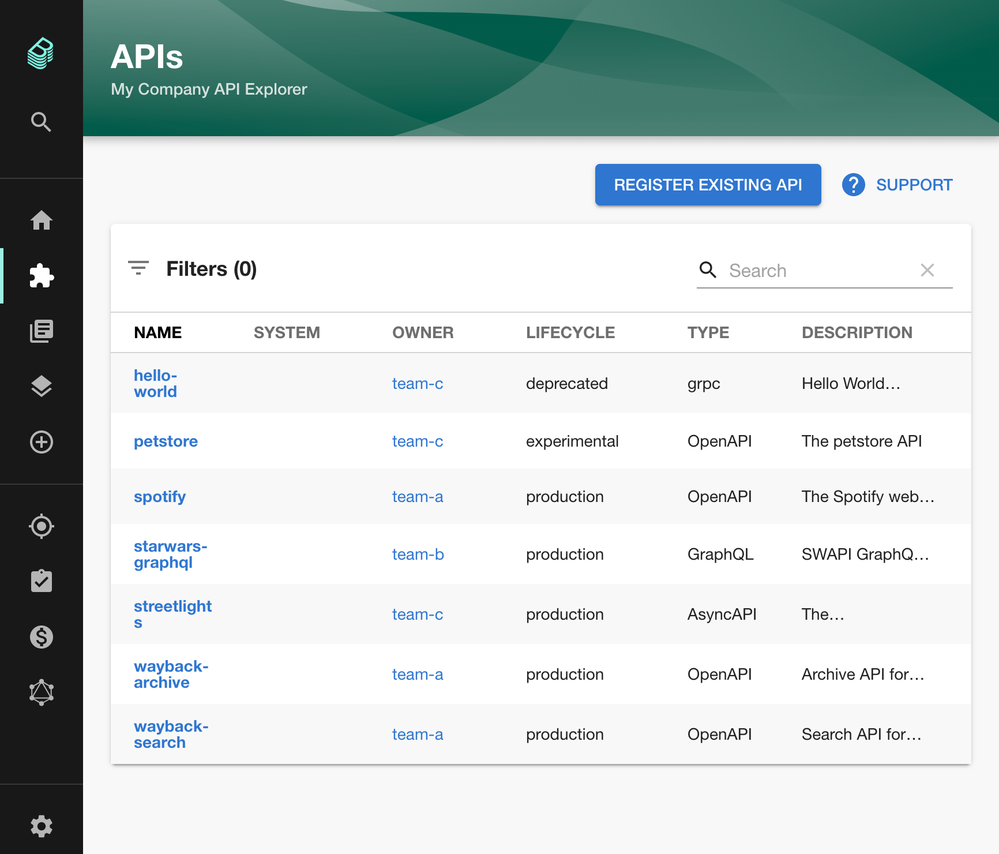
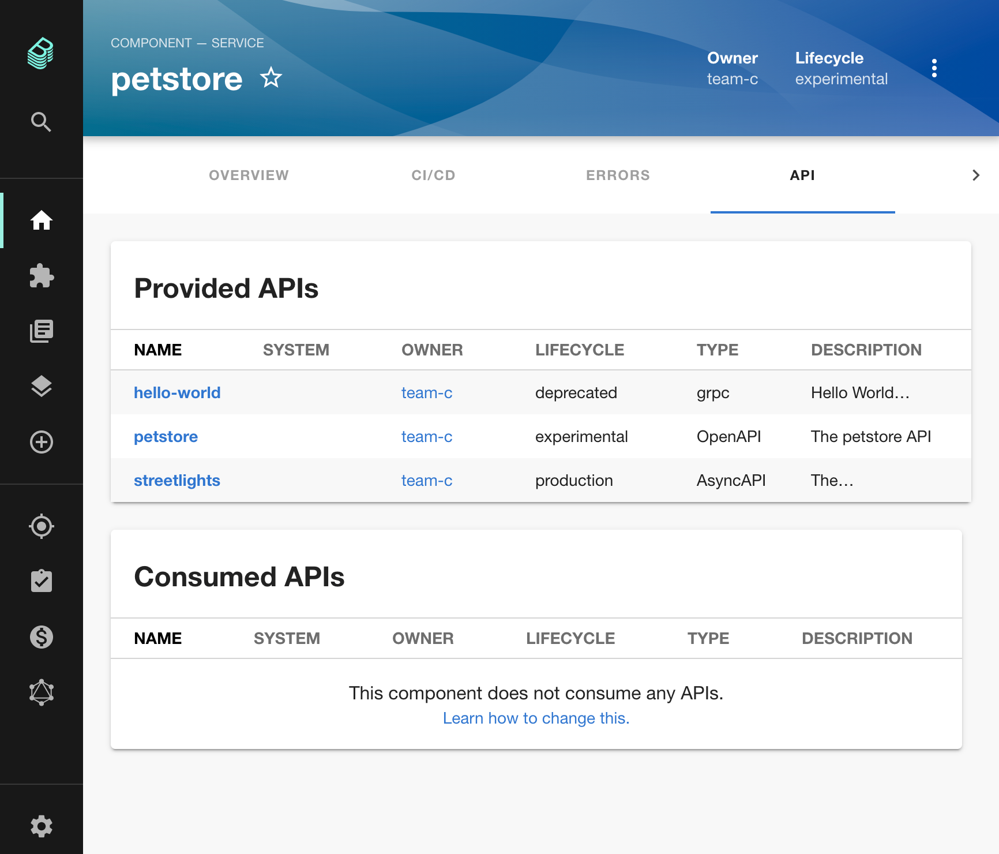

# API Documentation

WORK IN PROGRESS

This is an extension for the catalog plugin that provides components to discover and display API entities.
APIs define the interface between components, see the [system model](https://backstage.io/docs/features/software-catalog/system-model) for details.
They are defined in machine readable formats and provide a human readable documentation.

The plugin provides a standalone list of APIs, as well as an integration into the API tab of a catalog entity.





Right now, the following API formats are supported:

- [OpenAPI](https://swagger.io/specification/) 2 & 3
- [AsyncAPI](https://www.asyncapi.com/docs/specifications/latest/)
- [GraphQL](https://graphql.org/learn/schema/)

Other formats are displayed as plain text, but this can easily be extended.

To fill the catalog with APIs, [provide entities of kind API](https://backstage.io/docs/features/software-catalog/descriptor-format#kind-api).
To link that a component provides or consumes an API, see the [`providesApis`](https://backstage.io/docs/features/software-catalog/descriptor-format#specprovidesapis-optional) and [`consumesApis`](https://backstage.io/docs/features/software-catalog/descriptor-format#specconsumesapis-optional) properties on the Component kind.

## Implementing OAuth 2 Authorization Code flow with Swagger UI

### Adding `oauth2-redirect.html` to support OAuth2 `redirect_uri` route

The Swagger UI package by expects to have a route to `/oauth2-redirect.html` which processes
the redirect callback for the OAuth2 Authorization Code flow, however, this file is not installed
by this plugin.

Grab a copy of [oauth2-redirect.html](https://github.com/swagger-api/swagger-ui/blob/master/dist/oauth2-redirect.html)
and put it in the `app/public/` directory in order to enable Swagger UI to complete this redirection.

### Configuring your OAuth2 Client

You'll need to make sure your OAuth2 client has been registered in your OAuth2 Authentication Server (AS)
with the appropriate `redirect_uris`, `scopes` and `grant_types`. For example, if your AS supports
the [OAuth 2.0 Dynamic Client Registration Protocol](https://tools.ietf.org/html/rfc7591), an example
POST request body would look like this:

```json
{
    "client_name": "Example Backstage api-docs plugin Swagger UI Client",
    "redirect_uris": [
        "https://www.getpostman.com/oauth2/callback",
        "http://localhost:3000/oauth2-redirect.html"
        "https://<yourhost>/oauth2-redirect.html"
    ],
    "scope": "read_pets write_pets",
    "grant_types": [
        "authorization_code"
    ]
}
```

The above `redirect_uris` are:

- [Postman](https://www.postman.com/) testing: `https://www.getpostman.com/oauth2/callback`
- Local Backstage app development: `http://localhost:3000/oauth2-redirect.html`
- Backstage app production: `https://<yourhost>/oauth2-redirect.html`

### Configuring OAuth2 in your OpenAPI 3.0 schema

To configure [OAuth 2 Authorization Code](https://swagger.io/docs/specification/authentication/oauth2/) flow
in your OpenAPI 3.0 schema you'll need something like this snippet:

```yaml
components:
  securitySchemes:
    oauth:
      type: oauth2
      description: OAuth2 service
      flows:
        authorizationCode:
          authorizationUrl: https://api.example.com/oauth2/authorize
          tokenUrl: https://api.example.com/oauth2/token
          scopes:
            read_pets: read your pets
            write_pets: modify pets in your account
security:
  oauth:
    - [read_pets, write_pets]
```

## Links

- [The Backstage homepage](https://backstage.io)
