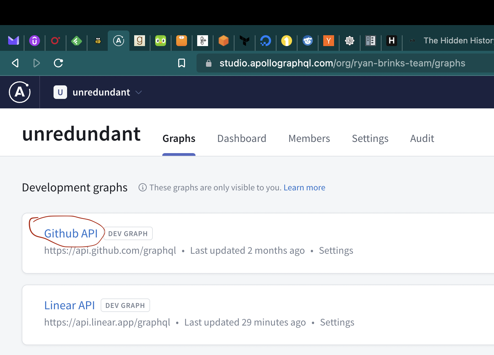
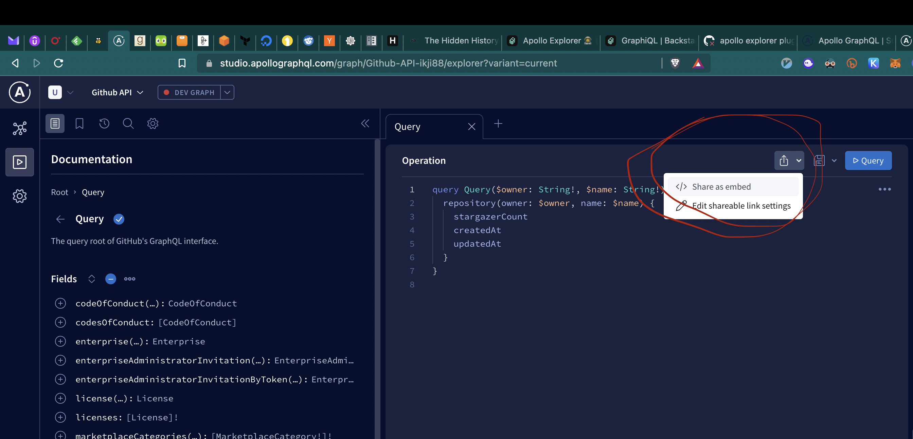
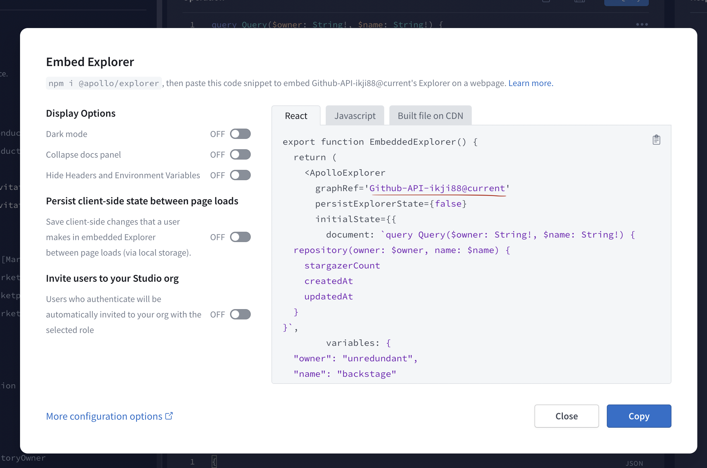
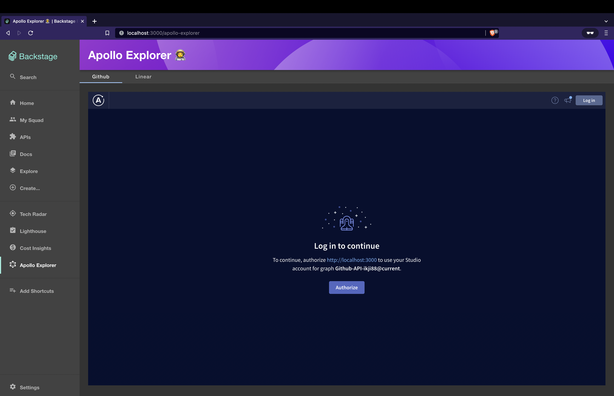
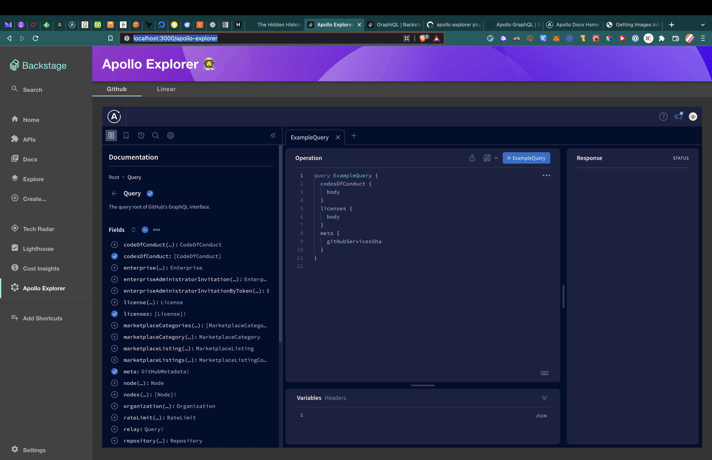

# apollo-explorer

Welcome to the Apollo Explorer plugin!

This plugin allows users to directly embed an [Apollo](https://www.apollographql.com) graph explorer directly into
Backstage!

## Getting started

### Getting an Apollo Graph Reference

First things first, you will need an Apollo account, and a graph imported into your account. This is beyond the scope of
this plugin, so if you are totally new to Apollo, please reference their official
documentation [here](https://www.apollographql.com/docs).

Once you have a graph set up in Apollo, we need to grab the graph reference. First, go to your Apollo graphs home page and choose the graph you wish to embed.



Once you are in your graph explorer, click the dropdown next to the share icon and select `Share as Embedded`



This modal contains a number of useful properties, all of which can be passed to the plugin via the component properties, but the only mandatory input we need from here is the `graphRef`.



Hold on to this snippet for a second while we set up the plugin ✨

### Installing the Backstage Plugin

First, add the plugin to your Backstage app

```shell
yarn --cwd packages/app add @backstage/plugin-apollo-explorer
```

Then, in `packages/app/src/App.tsx` add the plugin as a `Route`

```typescript
<Route
  path="/apollo-explorer"
  element={
    <ApolloExplorerPage
      endpoints={[
        { title: 'Github', graphRef: 'my-github-graph-ref@current' },
        { title: 'Linear', graphRef: 'my-linear-graph-ref@current' },
      ]}
    />
  }
/>
```

Then, in `packages/app/src/components/Root/Root.tsx` add a sidebar item so users can find your beautiful plugin!

```typescript
<SidebarItem icon={GraphiQLIcon} to="apollo-explorer" text="Apollo Explorer" />
```

That's it! You should now see an `Apollo Explorer` item in your sidebar, and if you click it, you should see your graph(s) load and direct you to authenticate via Apollo!



Once you authenticate, your graph is ready to use 🚀


