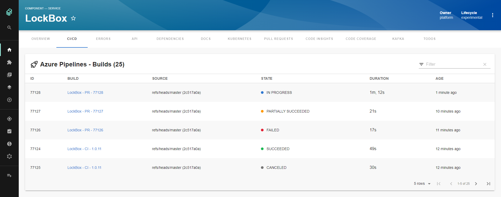

# Azure DevOps Plugin

Website: [https://dev.azure.com/](https://dev.azure.com/)



## Setup

The following sections will help you get the Azure DevOps plugin setup and running

### Configuration

The Azure DevOps plugin requires the following YAML to be added to your app-config.yaml:

```yaml
azureDevOps:
  host: dev.azure.com
  token: ${AZURE_TOKEN}
  organization: my-company
  top: 50
```

Configuration Details:

- `host` and `token` can be the same as the ones used for the `integration` section
- `AZURE_TOKEN` environment variable must be set to a [Personal Access Token](https://docs.microsoft.com/en-us/azure/devops/organizations/accounts/use-personal-access-tokens-to-authenticate?view=azure-devops&tabs=preview-page) with read access to both Code and Build
- `organization` is your Azure DevOps Organization name or for Azure DevOps Server (on-premise) this will be your Collection name
- `top` is strictly used by the frontend to limit the number of items returned, currently only used for Builds

### Backend

Here's how to get the backend up and running:

1. First we need to add the @backstage/plugin-azure-devops-backend package to your backend:

   ```sh
   # From the Backstage root directory
   cd packages/backend
   yarn add @backstage/plugin-azure-devops-backend
   ```

2. Then we will create a new file named `packages/backend/src/plugins/azuredevops.ts`, and add the
   following to it:

   ```ts
   import { createRouter } from '@backstage/plugin-azure-devops-backend';
   import { Router } from 'express';
   import type { PluginEnvironment } from '../types';

   export default async function createPlugin({
     logger,
     config,
   }: PluginEnvironment): Promise<Router> {
     return await createRouter({ logger, config });
   }
   ```

3. Next we wire this into the overall backend router, edit `packages/backend/src/index.ts`:

   ```ts
   import azureDevOps from './plugins/azuredevops';
   // ...
   async function main() {
     // ...
     const azureDevOpsEnv = useHotMemoize(module, () => createEnv('azure-devops'));
     apiRouter.use('/azure-devops', await azureDevOps(azureDevOpsEnv));
   ```

4. Now run `yarn start-backend` from the repo root
5. Finally open `http://localhost:7000/api/azure-devops/health` in a browser and it should return `{"status":"ok"}`

### Frontend

To get the frontend working you'll need to do the following two steps:

1. First we need to add the @backstage/plugin-azure-devops package to your frontend app:

   ```bash
   # From your Backstage root directory
   cd packages/app
   yarn add @backstage/plugin-azure-devops
   ```

2. Second we need to add the `EntityAzureDevOpsContent` extension to the entity page in your app:

```tsx
// In packages/app/src/components/catalog/EntityPage.tsx
import {
  EntityAzureDevOpsContent,
  isAzureDevOpsAvailable,
} from '@backstage/plugin-azure-devops';

// For example in the CI/CD section
const cicdContent = (
  <EntitySwitch>
    // ...
    <EntitySwitch.Case if={isAzureDevOpsAvailable}>
      <EntityAzureDevOpsContent />
    </EntitySwitch.Case>
    // ...
  </EntitySwitch>
```

### Entity Annotation

You need to add the following annotation to any entities you want to be able to use the Azure Devops plugin with:

```yaml
dev.azure.com/project-repo: <project-name>/<repo-name>
```

Let's break this down a little: `<project-name>` will be the name of your Team Project and `<repo-name>` will be the name of your repository which needs to be part of the Team Project you entered for `<project-name>`.

Here's what that will look like in action:

```yaml
# Example catalog-info.yaml entity definition file
apiVersion: backstage.io/v1alpha1
kind: Component
metadata:
  # ...
  annotations:
    dev.azure.com/project-repo: my-project/my-repo
spec:
  type: service
  # ...
```

## Features

- Lists the top _n_ builds for a given repository where _n_ is the value configured for `top`

## Limitations

- Currently multiple organizations is not supported
