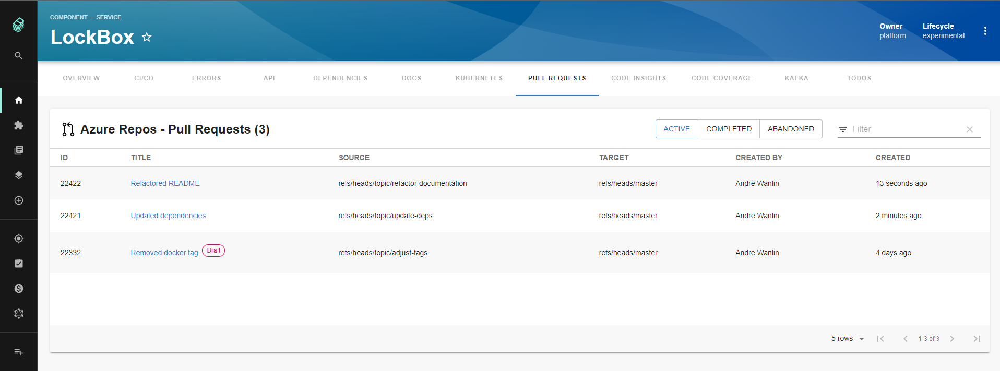
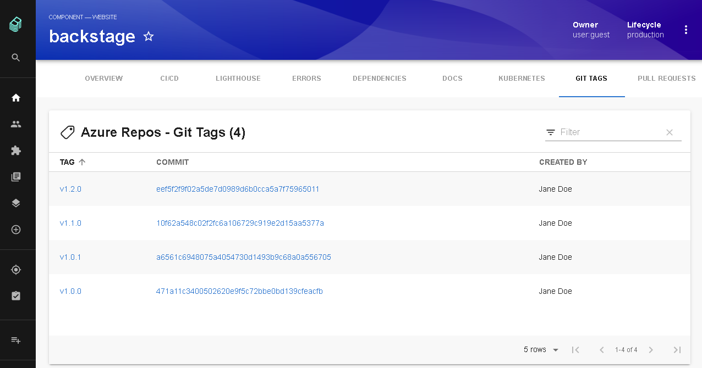
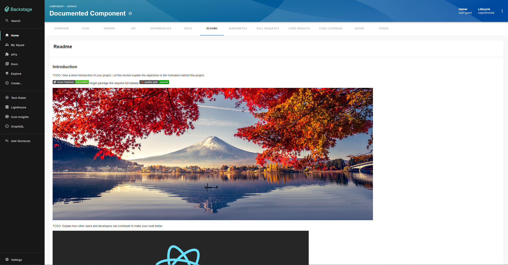

# Azure DevOps Plugin

Website: [https://dev.azure.com/](https://dev.azure.com/)

## Features

### Azure Pipelines

Lists the top _n_ builds for a given Azure Repo where _n_ is a configurable value


### Azure Repos

Lists the top _n_ Active, Completed, or Abandoned Pull Requests for a given repository where _n_ is a configurable value



### Azure Repos Git Tags

Lists all Git Tags for a given repository



### Azure Readme

Readme for a given repository



## Setup

The following sections will help you get the Azure DevOps plugin setup and running

### Azure DevOps Backend

You need to setup the [Azure DevOps backend plugin](https://github.com/backstage/backstage/tree/master/plugins/azure-devops-backend) before you move forward with any of these steps if you haven't already

### Entity Annotation

To be able to use the Azure DevOps plugin you need to add the following annotation to any entities you want to use it with:

```yaml
dev.azure.com/project-repo: <project-name>/<repo-name>
```

Let's break this down a little: `<project-name>` will be the name of your Team Project and `<repo-name>` will be the name of your repository which needs to be part of the Team Project you entered for `<project-name>`.

Here's what that will look like in action:

```yaml
# Example catalog-info.yaml entity definition file
apiVersion: backstage.io/v1alpha1
kind: Component
metadata:
  # ...
  annotations:
    dev.azure.com/project-repo: my-project/my-repo
spec:
  type: service
  # ...
```

#### Mono repos

If you have multiple entities within a single repo, you will need to specify which pipelines belong to each entity.

```yaml
dev.azure.com/project-repo: <my-project>/<my-repo>
dev.azure.com/build-definition: <build-definition-name>
```

#### Pipeline in different project to repo

If your pipeline is in a different project to the source code, you will need to specify this in the project annotation.

```yaml
dev.azure.com/project-repo: <project-with-source-code>/<my-repo>
dev.azure.com/build-definition: <build-definition-name>
dev.azure.com/project: <project-with-build-code>
```

#### Azure Pipelines Only

If you are only using Azure Pipelines along with a different SCM tool then you can use the following two annotations to see Builds:

```yaml
dev.azure.com/project: <project-name>
dev.azure.com/build-definition: <build-definition-name>
```

In this case `<project-name>` will be the name of your Team Project and `<build-definition-name>` will be the name of the Build Definition you would like to see Builds for, and it's possible to add more Builds separated by a comma. If the Build Definition name has spaces in it make sure to put quotes around it.

#### Multiple Organizations

If you have multiple organizations you'll need to also add this annotation:

```yaml
dev.azure.com/host-org: <host>/<organization>
```

For this annotation `<host>` will match the `host` value in the `integrations.azure` section in your `app-config.yaml` and `<organization>` will be the name of the Organization that is part of the `host`. Let's break this down with an example:

Say we have the following `integrations.azure` section:

```yaml
integrations:
  azure:
    - host: dev.azure.com
      credentials:
        - organizations:
            - my-org
            - my-other-org
          clientId: ${AZURE_CLIENT_ID}
          clientSecret: ${AZURE_CLIENT_SECRET}
          tenantId: ${AZURE_TENANT_ID}
        - organizations:
            - another-org
          clientId: ${AZURE_CLIENT_ID}
    - host: server.company.com
      credentials:
        - organizations:
            - yet-another-org
          personalAccessToken: ${PERSONAL_ACCESS_TOKEN}
```

If the entity we are viewing lives in the `my-other-org` organization then the `dev.azure.com/host-org` annotation would look like this:

```yaml
dev.azure.com/host-org: dev.azure.com/my-other-org
```

And if the entity was from `yet-another-org` it would look like this:

```yaml
dev.azure.com/host-org: server.company.com/yet-another-org
```

**Note:** To save you time, effort, and confusion setting up these annotations manually you can use the `AzureDevOpsAnnotatorProcessor` processor which will add the `dev.azure.com/host-org` and `dev.azure.com/project-repo` annotations for you with the correct values. The Azure DevOps backend plugin has details on how to [add this processor](https://github.com/backstage/backstage/tree/master/plugins/azure-devops-backend#processor).

### Azure Pipelines Component

To get the Azure Pipelines component working you'll need to do the following two steps:

1. First we need to add the `@backstage/plugin-azure-devops` package to your frontend app:

   ```bash
   # From your Backstage root directory
   yarn --cwd packages/app add @backstage/plugin-azure-devops
   ```

2. Second we need to add the `EntityAzurePipelinesContent` extension to the entity page in your app. How to do this will depend on which annotation you are using in your entities:

   1. If you are using the `dev.azure.com/project-repo` annotation then you'll want to do the following:

      ```tsx
      // In packages/app/src/components/catalog/EntityPage.tsx
      import {
        EntityAzurePipelinesContent,
        isAzureDevOpsAvailable,
      } from '@backstage/plugin-azure-devops';

      // For example in the CI/CD section
      const cicdContent = (
        <EntitySwitch>
          // ...
          <EntitySwitch.Case if={isAzureDevOpsAvailable}>
              <EntityAzurePipelinesContent defaultLimit={25} />
          </EntitySwitch.Case>
          // ...
        </EntitySwitch>
      ```

   2. If you are using the `dev.azure.com/project` and `dev.azure.com/build-definition` annotations then you'll want to do this:

      ```tsx
      // In packages/app/src/components/catalog/EntityPage.tsx
      import {
        EntityAzurePipelinesContent,
        isAzurePipelinesAvailable,
      } from '@backstage/plugin-azure-devops';

      // For example in the CI/CD section
      const cicdContent = (
        <EntitySwitch>
          // ...
          <EntitySwitch.Case if={isAzurePipelinesAvailable}>
            <EntityAzurePipelinesContent defaultLimit={25} />
          </EntitySwitch.Case>
          // ...
        </EntitySwitch>
      ```

**Notes:**

- The `if` prop is optional on the `EntitySwitch.Case`, you can remove it if you always want to see the tab even if the entity being viewed does not have the needed annotation
- The `defaultLimit` property on the `EntityAzurePipelinesContent` will set the max number of Builds you would like to see, if not set this will default to 10

### Azure Repos Component

To get the Azure Repos component working you'll need to do the following two steps:

1. First we need to add the @backstage/plugin-azure-devops package to your frontend app:

   ```bash
   # From your Backstage root directory
   yarn --cwd packages/app add @backstage/plugin-azure-devops
   ```

2. Second we need to add the `EntityAzurePullRequestsContent` extension to the entity page in your app:

   ```tsx
   // In packages/app/src/components/catalog/EntityPage.tsx
   import {
     EntityAzurePullRequestsContent,
     isAzureDevOpsAvailable,
   } from '@backstage/plugin-azure-devops';

   // For example in the Service section
   const serviceEntityPage = (
     <EntityLayout>
       // ...
       <EntityLayout.Route if={isAzureDevOpsAvailable} path="/pull-requests" title="Pull Requests">
         <EntityAzurePullRequestsContent defaultLimit={25} />
       </EntityLayout.Route>
       // ...
     </EntityLayout>
   ```

**Notes:**

- You'll need to add the `EntityLayout.Route` above from step 2 to all the entity sections you want to see Pull Requests in. For example if you wanted to see Pull Requests when looking at Website entities then you would need to add this to the `websiteEntityPage` section.
- The `if` prop is optional on the `EntityLayout.Route`, you can remove it if you always want to see the tab even if the entity being viewed does not have the needed annotation
- The `defaultLimit` property on the `EntityAzurePullRequestsContent` will set the max number of Pull Requests you would like to see, if not set this will default to 10

### Git Tags Component

To get the Git Tags component working you'll need to do the following two steps:

1. First we need to add the @backstage/plugin-azure-devops package to your frontend app:

   ```bash
   # From your Backstage root directory
   yarn --cwd packages/app add @backstage/plugin-azure-devops
   ```

2. Second we need to add the `EntityAzureGitTagsContent` extension to the entity page in your app:

   ```tsx
   // In packages/app/src/components/catalog/EntityPage.tsx
   import {
     EntityAzureGitTagsContent,
     isAzureDevOpsAvailable,
   } from '@backstage/plugin-azure-devops';

   // For example in the Service section
   const serviceEntityPage = (
     <EntityLayout>
       // ...
       <EntityLayout.Route if={isAzureDevOpsAvailable} path="/git-tags" title="Git Tags">
         <EntityAzureGitTagsContent />
       </EntityLayout.Route>
       // ...
     </EntityLayout>
   ```

**Notes:**

- You'll need to add the `EntityLayout.Route` above from step 2 to all the entity sections you want to see Git Tags in. For example if you wanted to see Git Tags when looking at Website entities then you would need to add this to the `websiteEntityPage` section.
- The `if` prop is optional on the `EntityLayout.Route`, you can remove it if you always want to see the tab even if the entity being viewed does not have the needed annotation

### Git README

To get the README component working you'll need to do the following two steps:

1. First we need to add the @backstage/plugin-azure-devops package to your frontend app:

   ```bash
   # From your Backstage root directory
   yarn --cwd packages/app add @backstage/plugin-azure-devops
   ```

2. Second we need to add the `EntityAzureReadmeCard` extension to the entity page in your app:

   ```tsx
   // In packages/app/src/components/catalog/EntityPage.tsx
   import {
     EntityAzureReadmeCard,
     isAzureDevOpsAvailable,
   } from '@backstage/plugin-azure-devops';

   // As it is a card, you can customize it the way you prefer
   // For example in the Service section

   const overviewContent = (
     <Grid container spacing={3} alignItems="stretch">
       <EntitySwitch>
         <EntitySwitch.Case if={isAzureDevOpsAvailable}>
           <Grid item md={6}>
             ...
           </Grid>
           <Grid item md={6}>
             <EntityAzureReadmeCard maxHeight={350} />
           </Grid>
         </EntitySwitch.Case>
       </EntitySwitch>
     </Grid>
   );
   ```

**Notes:**

- You'll need to add the `EntitySwitch.Case` above from step 2 to all the entity sections you want to see Readme in. For example if you wanted to see Readme when looking at Website entities then you would need to add this to the `websiteEntityPage` section.
- The `if` prop is optional on the `EntitySwitch.Case`, you can remove it if you always want to see the tab even if the entity being viewed does not have the needed annotation
- The `maxHeight` property on the `EntityAzureReadmeCard` will set the maximum screen size you would like to see, if not set it will default to 100%
