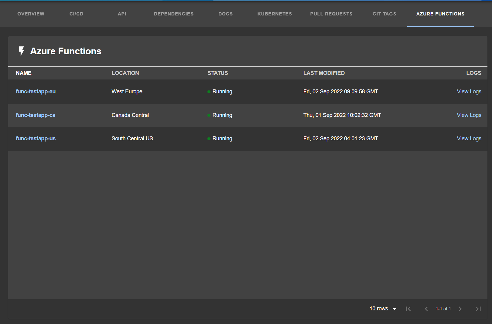

# Azure Sites Plugin

Azure Sites (Apps & Functions) plugin support for a given entity. View the current status of the site, quickly jump to site's Overview page, or Log Stream page.



_Inspired by [roadie.io AWS Lamda plugin](https://roadie.io/backstage/plugins/aws-lambda/)_

## Features

- Azure overview table

## Plugin Setup

The following sections will help you get the Azure plugin setup and running

### Azure Sites Backend

You need to set up the [Azure Sites Backend plugin](https://github.com/backstage/backstage/tree/master/plugins/azure-sites-backend) before you move forward with any of these steps if you haven't already.

### Entity Annotation

To be able to use the Azure Sites plugin you need to add the following annotation to any entities you want to use it with:

```yaml
azure.com/microsoft-web-sites: <name>
```

`<name>` supports case-insensitive exact / partial value.

Example of Partial Matching:

Let's say you have a number of functions apps, spread out over different regions (and possibly different subscriptions), and they follow a naming convention:

```
func-testapp-eu
func-testapp-ca
func-testapp-us
```

The annotation you will use to have the three functions' app appear in the overview table would look like this:

```yaml
azure.com/microsoft-web-sites: func-testapp
```

### Install the component

1. Install the plugin

```sh
# From your Backstage root directory
yarn --cwd packages/app add @backstage/plugin-azure-sites
```

2. Add widget component to your Backstage instance:

```ts
// In packages/app/src/components/catalog/EntityPage.tsx
import { EntityAzureSitesOverviewWidget, isAzureWebSiteNameAvailable } from '@backstage/plugin-azure-sites';

...

const serviceEntityPage = (
  <EntityLayout>
    //...
    <EntityLayout.Route if={e => Boolean(isAzureWebSiteNameAvailable(e))} path="/azure" title="Azure">
      <EntityAzureSitesOverviewWidget />
    </EntityLayout.Route>
    //...
  </EntityLayout>
);
```
