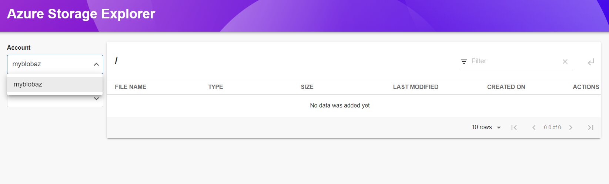
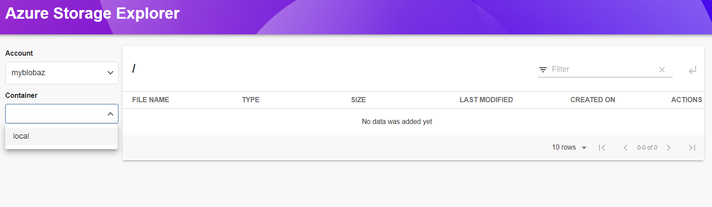
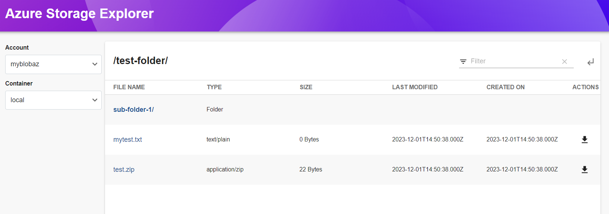
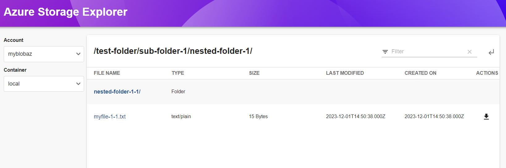
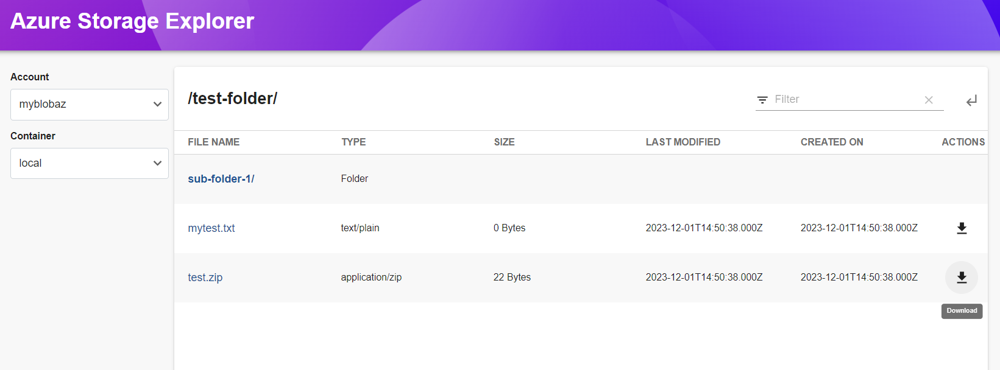

# Azure Storage

Welcome to the `AzureStorage` plugin!

## Introduction

This plugin helps to explore (navigate and download) the blobs in Azure storage account.











## Getting started

### AzureStorage Installation

This plugin needs to be added to an existing backstage instance.

```bash
# From your Backstage root directory
yarn add --cwd packages/app @backstage/plugin-azure-storage
```

### Configure Route

Add the following lines in `packages/app/src/App.tsx` to create new route

```typescript
import { AzureStoragePage } from '@backstage/plugin-azure-storage';

const routes = (
  <FlatRoutes>
    {/* ...other routes */}
    <Route path="/azure-storage" element={<AzureStoragePage />} />
    {/* ...other routes */}
  </FlatRoutes>
);
```

### Configure SideBar

Add the following line in `packages/app/src/components/Root/Root.tsx` to create a new element in the Sidebar

```typescript
import FolderIcon from '@material-ui/icons/Folder';

<SidebarPage>
  {/* ...other contents */}
  <SidebarItem
    icon={FolderIcon}
    to="azure-storage"
    text="Azure Storage Explorer"
  />
  {/* ...other contents */}
</SidebarPage>;
```

### AzureStorage Backend Installation

This plugin needs to be added to an existing backstage instance.

```bash
# From your Backstage root directory
yarn add --cwd packages/backend @backstage/plugin-azure-storage-backend
```

Create a file called `azure-storage.ts` inside `packages/backend/src/plugins/` and add the following

#### azure-storage.ts

```typescript
import { createRouter } from '@backstage/plugin-azure-storage-backend';
import { Router } from 'express';
import { PluginEnvironment } from '../types';

export default async function createPlugin(
  env: PluginEnvironment,
): Promise<Router> {
  return await createRouter({
    logger: env.logger,
    config: env.config,
  });
}
```

And import the plugin to `packages/backend/src/index.ts`.

```diff
diff --git a/packages/backend/src/index.ts b/packages/backend/src/index.ts
index c4736a5..5822302 100644
--- a/packages/backend/src/index.ts
+++ b/packages/backend/src/index.ts
@@ -28,6 +28,7 @@ import scaffolder from './plugins/scaffolder';
 import proxy from './plugins/proxy';
 import techdocs from './plugins/techdocs';
 import search from './plugins/search';
+import azurestorage from './plugins/azure-storage';
 import { PluginEnvironment } from './types';
 import { ServerPermissionClient } from '@backstage/plugin-permission-node';
 import { DefaultIdentityClient } from '@backstage/plugin-auth-node';
@@ -85,6 +86,7 @@ async function main() {
   const techdocsEnv = useHotMemoize(module, () => createEnv('techdocs'));
   const searchEnv = useHotMemoize(module, () => createEnv('search'));
   const appEnv = useHotMemoize(module, () => createEnv('app'));
+  const azureStorageEnv = useHotMemoize(module, () => createEnv('azurestorage'));

   const apiRouter = Router();
   apiRouter.use('/catalog', await catalog(catalogEnv));
@@ -93,6 +95,7 @@ async function main() {
   apiRouter.use('/techdocs', await techdocs(techdocsEnv));
   apiRouter.use('/proxy', await proxy(proxyEnv));
   apiRouter.use('/search', await search(searchEnv));
+  apiRouter.use('/azurestorage', await azurestorage(azureStorageEnv));

   // Add backends ABOVE this line; this 404 handler is the catch-all fallback
   apiRouter.use(notFoundHandler());

```

## Configuration

Setup Azure Storage accounts in `app-config.yaml`

```yaml
azureStorage:
  blobContainers:
    - accountName: 'storageAccount'
      authType: accessToken
      auth:
        accessToken: 'STORAGE ACCOUNT ACCESS TOKEN'
    - accountName: 'anotherStorageAccount'
      authType: clientToken
      auth:
        tenantId: 'AZURE TENANT ID'
        clientId: 'AZURE CLIENT ID'
        clientSecret: 'AZURE CLIENT SECRET'
```

## Authenticating Storage Account

This Plugin provides 2 types of authentication on your storage account.

### Access Token

When you create a storage account, Azure generates two 512-bit storage account access keys for that account. You can use this access keys to authenticate the Azure storage account ["More Info..."](https://learn.microsoft.com/en-us/azure/storage/common/storage-account-keys-manage?toc=%2Fazure%2Fstorage%2Fblobs%2Ftoc.json&bc=%2Fazure%2Fstorage%2Fblobs%2Fbreadcrumb%2Ftoc.json&tabs=azure-portal)

### Client Token

This method uses the RBAC authentication but only to Azure App Client. ["More info..."](https://learn.microsoft.com/en-us/azure/storage/blobs/assign-azure-role-data-access?tabs=portal)
