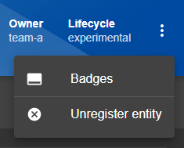
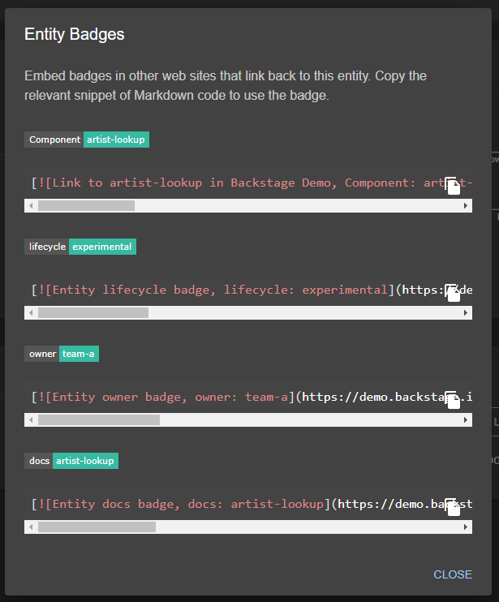

# @backstage/plugin-badges

The badges plugin offers a set of badges that can be used outside of
your backstage deployment, showing information related to data from
the catalog, such as entity owner and lifecycle data for instance.

The available badges are setup in the `badges-backend` plugin, see
link below for more details.

## Entity badges

To get markdown code for the entity badges, access the `Badges` context menu
(three dots in the upper right corner) of an entity page like this:



This will popup a badges dialog showing all available badges for that entity like this:



## Sample Badges

Here are some samples of badges for the `artists-lookup` service in the Demo Backstage site:

- Component: [](https://demo.backstage.io/catalog/default/component/artist-lookup)
- Lifecycle: [](https://demo.backstage.io/catalog/default/component/artist-lookup)
- Owner: [](https://demo.backstage.io/catalog/default/component/artist-lookup)
- Docs: [](https://demo.backstage.io/catalog/default/component/artist-lookup/docs)

## Usage

### Install the package

```bash
yarn add @backstage/plugin-badges
```

### Register plugin

This plugin requires explicit registration, so you will need to add it to your App's `plugins.ts` file:

```ts
// ...
export { badgesPlugin } from '@backstage/plugin-badges';
```

If you don't have a `plugins.ts` file see: [troubleshooting](#troubleshooting)

### Update your EntityPage

In your `EntityPage.tsx` file located in `packages\app\src\components\catalog` we'll need to make a few changes to get the Badges context menu added to the UI.

First we need to add the following imports:

```ts
import { EntityBadgesDialog } from '@backstage/plugin-badges';
import BadgeIcon from '@material-ui/icons/CallToAction';
```

Next we'll update the React import that looks like this:

```ts
import React from 'react';
```

To look like this:

```ts
import React, { ReactNode, useMemo, useState } from 'react';
```

Then we have to add this chunk of code after all the imports but before any of the other code:

```ts
const EntityLayoutWrapper = (props: { children?: ReactNode }) => {
  const [badgesDialogOpen, setBadgesDialogOpen] = useState(false);

  const extraMenuItems = useMemo(() => {
    return [
      {
        title: 'Badges',
        Icon: BadgeIcon,
        onClick: () => setBadgesDialogOpen(true),
      },
    ];
  }, []);

  return (
    <>
      <EntityLayout UNSTABLE_extraContextMenuItems={extraMenuItems}>
        {props.children}
      </EntityLayout>
      <EntityBadgesDialog
        open={badgesDialogOpen}
        onClose={() => setBadgesDialogOpen(false)}
      />
    </>
  );
};
```

The last step is to wrap all the entity pages in the `EntityLayoutWrapper` like this:

```diff
const defaultEntityPage = (
+  <EntityLayoutWrapper>
    <EntityLayout.Route path="/" title="Overview">
      {overviewContent}
    </EntityLayout.Route>

    <EntityLayout.Route path="/docs" title="Docs">
      <EntityTechdocsContent />
    </EntityLayout.Route>

    <EntityLayout.Route path="/todos" title="TODOs">
      <EntityTodoContent />
    </EntityLayout.Route>
+  </EntityLayoutWrapper>
);
```

Note: the above only shows an example for the `defaultEntityPage` for a full example of this you can look at [this EntityPage](https://github.com/backstage/backstage/blob/1fd9e6f601cabe42af8eb20b5d200ad1988ba309/packages/app/src/components/catalog/EntityPage.tsx#L318)

## Troubleshooting

If you don't have a `plugins.ts` file, you can create it with the path `packages/app/src/plugins.ts` and then import it into your `App.tsx`:

```diff
+ import * as plugins from './plugins';

const app = createApp({
  apis,
+   plugins: Object.values(plugins),
  bindRoutes({ bind }) {
    /* ... */
  },
});
```

Or simply edit `App.tsx` with:

```diff
+ import { badgesPlugin } from '@backstage/plugin-badges'

const app = createApp({
  apis,
+   plugins: [badgesPlugin],
  bindRoutes({ bind }) {
    /* ... */
  },
});
```

## Links

- [Backend part of the plugin](https://github.com/backstage/backstage/tree/master/plugins/badges-backend)
- [The Backstage homepage](https://backstage.io)
