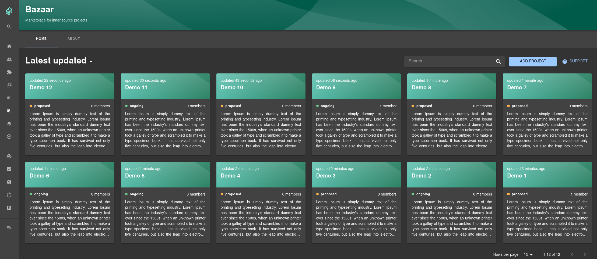
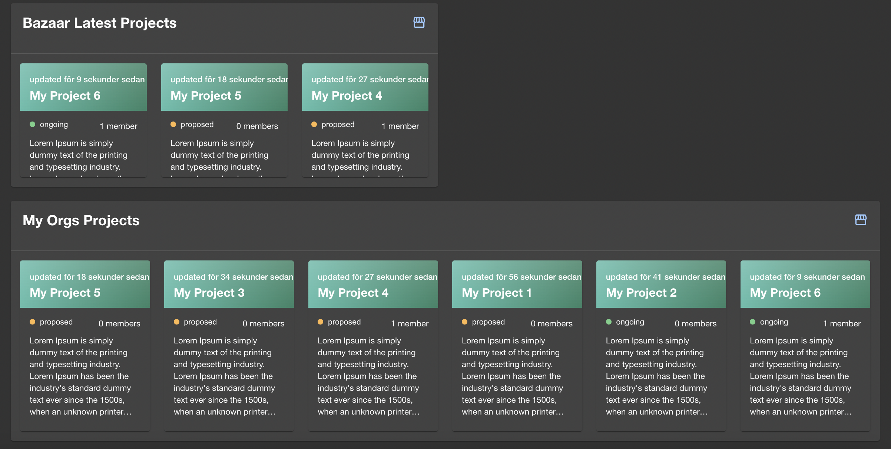
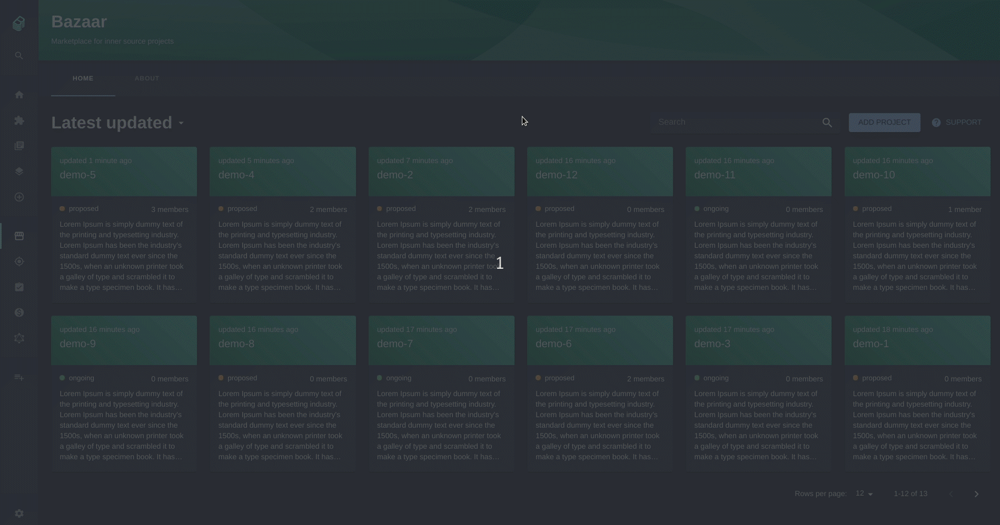

# @backstage/plugin-bazaar

### What is the Bazaar?

The Bazaar is a place where teams can propose projects for cross-functional team development. Essentially, it’s a marketplace for internal projects suitable for [Inner Sourcing](https://en.wikipedia.org/wiki/Inner_source). By “Inner Sourcing,” we mean projects that are developed internally within a company but follow Open Source best practices.

### Why?

Many companies today have a high need to increase the ease of cross-team cooperation. In large organizations, engineers often have limited ways of discovering or announcing projects that could benefit from a wider development effort in terms of different expertise, experiences, and teams spread across the organization. With no good way to find these existing internal projects to join, the possibility of working with Inner Sourcing practices suffers.

### How?

The Bazaar allows engineers and teams to open up and announce their new and exciting projects for transparent cooperation in other parts of larger organizations. The Bazaar ensures that new Inner Sourcing-friendly projects gain visibility through Backstage and a way for interested engineers to show their interest and, in the future, contribute with their specific skill set. The Bazaar also provides an easy way to manage, catalog, and browse these Inner Sourcing-friendly projects and components.

# Note

You will **need** to also perform the installation instructions in [Bazaar Backend](https://github.com/backstage/backstage/tree/master/plugins/bazaar-backend) in order for this plugin to work.

## Getting Started

First install the plugin into your app:

```bash
# From your Backstage root directory
yarn --cwd packages/app add @backstage/plugin-bazaar
```

Modify your app routes in `packages/app/src/App.tsx` to include the `Bazaar` component exported from the plugin, for example:

```diff
+ import { BazaarPage } from '@backstage/plugin-bazaar';

const routes = (

  <FlatRoutes>
    ...
+    <Route path="bazaar" element={<BazaarPage />} />
    {/* other routes... */}

```

`BazaarPage` can be given the optional properties `fullHeight` and `fullWidth` which are used to adjust the cards styling to fit more or less on the page as required (both default to `true`).

Add a **Bazaar icon** to the Sidebar to easily access the Bazaar. In `packages/app/src/components/Root.tsx` add:

```diff
+ import StorefrontIcon from '@material-ui/icons/Storefront';

  <SidebarDivider />
  <SidebarScrollWrapper>
+    <SidebarItem icon={StorefrontIcon} to="bazaar" text="Bazaar" />
    {/* ...other sidebar-items */}
```

Add a **Bazaar card** to the overview tab on the `packages/app/src/components/catalog/EntityPage.tsx` add:

```diff
+ import { EntityBazaarInfoCard, isBazaarAvailable } from '@backstage/plugin-bazaar';

const overviewContent = (

    <Grid item md={8} xs={12}>
      <EntityAboutCard variant="gridItem" />
    </Grid>
+   <EntitySwitch>
+     <EntitySwitch.Case if={isBazaarAvailable}>
+       <Grid item sm={6}>
+         <EntityBazaarInfoCard />
+       </Grid>
+     </EntitySwitch.Case>
+    </EntitySwitch>

    {/* ...other entity-cards */}
```

Add a **Bazaar overview card** to the homepage that displays either the latest projects or random projects. In `packages/app/src/components/home/HomePage.tsx` add:

```diff
+ import { BazaarOverviewCard } from '@backstage/plugin-bazaar';

export const homePage = (

    <Page themeId="home">
      <Content>
       <Grid container spacing={3}>

+       <Grid item xs={12} md={6}>
+         <BazaarOverviewCard order='latest'/>
+       </Grid>

+       <Grid item xs={12} >
+         <BazaarOverviewCard title='My Orgs Projects' order='random' fullWidth fullHeight />
+       </Grid>

        {/* ...other homepage items */}
```

The property `title` is optional and can be used to customize the title in the card header. If no title is submitted the default titles `Bazaar Random Projects` or `Bazaar Latest Projects` are displayed.

The properties `fullHeight` and `fullWidth` are also optional and can be used to adjust the cards styling.

# How does the Bazaar work?

### Layout

The latest modified Bazaar projects are displayed in the Bazaar landing page, located at the Bazaar icon in the sidebar. Each project is represented as a card containing its most relevant data to give an overview of the project. It is also possible to sort in alphabetical order or on the number of members. Here you can also search or add project to the Bazaar.



The "BazaarOverviewCard" can be displayed in Backstage homepage.



### Workflow

To add a project to the bazaar, simply click on the `add-project` button and fill in the form.

The following fields are mandatory:

- title - title of the project
- description - present your idea and what skills you are looking for
- status - whether or not the project has started
- size - small, medium or large
- responsible - main contact person of the project

The other fields are:

- project - link Bazaar project to existing entity in the catalog
- community link - link to where the project members can communicate, e.g. Teams or Discord link
- docs link - link to visit the documentation of the project
- start date
- end date

When clicking on a Bazaar project a card containing the Bazaar information will show up. If the Bazaar project is linked to an entity, the card is also visible on that entity's EntityPage. From that card it is possible to either link or unlink an entity to a project, edit or delete the project and join the project if it seems interesting to you. Once you have joined a project, you will get access to the community link if it exists.



## Future work and ideas

- Workflow

  - Make it possible for multiple Bazaar project to link to the same catalog entity

- Bazaar landing page

  - Add a tab 'My page', where your personal data is displayed. For example: your projects and its latest activities etc.

- Bazaar tab on the EntityPage

  - Fill Bazaar-tab with more content, for example images and achievements
  - Show all the members that have joined the project

- Dialogues

  - Extend the dialogue for adding a project with more fields, e.g. the possibility to add images
