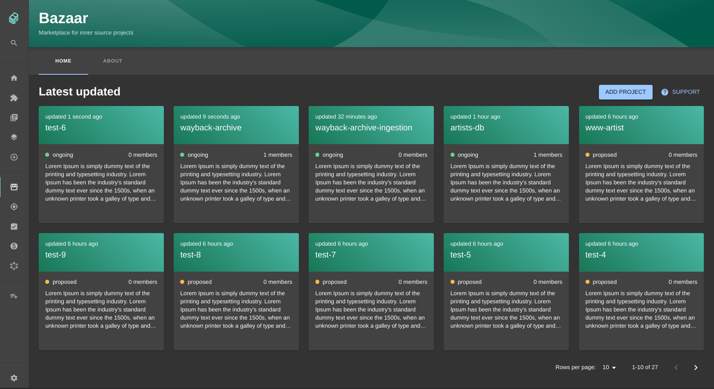
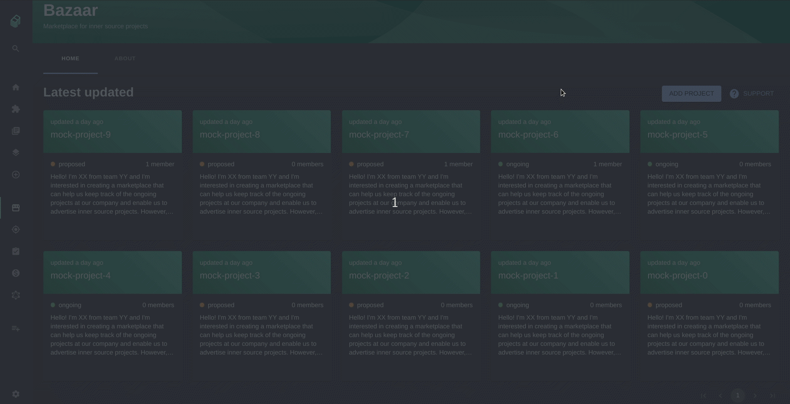

# @backstage/plugin-bazaar

### What is the Bazaar?

The Bazaar is a place where teams can propose projects for cross-functional team development. Essentially a marketplace for internal projects suitable for [Inner Sourcing](https://en.wikipedia.org/wiki/Inner_source). With "Inner Sourcing", we mean projects that are developed internally within a company, but with Open Source best practices.

### Why?

Many companies today are of high need to increase the ease of cross-team cooperation. In large organizations, engineers often have limited ways of discovering or announcing the projects which could benefit from a wider development effort in terms of different expertise, experiences, and teams spread across the organization. With no good way to find these existing internal projects to join, the possibility of working with Inner Sourcing practices suffers.

### How?

The Bazaar allows engineers and teams to open up and announce their new and exciting projects for transparent cooperation in other parts of larger organizations. The Bazaar ensures that new Inner Sourcing friendly projects gain visibility through Backstage and a way for interested engineers to show their interest and in the future contribute with their specific skill set. The Bazaar also provides an easy way to manage, catalog, and browse these Inner Sourcing friendly projects and components.

## Getting Started

First install the plugin into your app:

```sh
# From your Backstage root directory
cd packages/app
yarn add @backstage/plugin-bazaar
```

Modify your app routes in `packages/app/src/App.tsx` to include the `Bazaar` component exported from the plugin, for example:

```diff
+ import { BazaarPage } from '@backstage/plugin-bazaar';

const routes = (

  <FlatRoutes>
    ...
+    <Route path="bazaar" element={<BazaarPage />} />
    {/* other routes... */}

```

Add a **Bazaar icon** to the Sidebar to easily access the Bazaar. In `packages/app/src/components/Root.tsx` add:

```diff
+ import StorefrontIcon from '@material-ui/icons/Storefront';

  <SidebarDivider />
  <SidebarScrollWrapper>
+    <SidebarItem icon={StorefrontIcon} to="bazaar" text="Bazaar" />
    {/* ...other sidebar-items */}
```

Add a **Bazaar card** to the overview tab on the `packages/app/src/components/catalog/EntityPage.tsx` add:

```diff
+ import { EntityBazaarInfoCard } from '@backstage/plugin-bazaar';

const overviewContent = (

    <Grid item md={8} xs={12}>
      <EntityAboutCard variant="gridItem" />
    </Grid>

+   <Grid item sm={4}>
+     <EntityBazaarInfoCard />
+   </Grid>

    {/* ...other entity-cards */}
```

## How does the Bazaar work?

### Layout

The latest modified Bazaar projects are displayed in the Bazaar landing page, located at the Bazaar icon in the sidebar. Each project is represented as a card containing its most relevant data to give an overview of the project. The list of project is paginated.



### Workflow

To add a project to the Bazaar, you need to create a project with one of the templates in Backstage. Click the add project-button, choose the project and fill in the form. You will be asked to add an announcement for new team members. The purpose of the announcement is for you to present your ideas and what skills you are looking for. Further you need to provide the status of the project.

When the project is added, you will see the Bazaar information in the Bazaar card on the entity page. There you can join a project, edit or delete it.



### Database

The metadata related to the Bazaar is stored in a database. Right now there are two tables, one for storing the metadata and one for storing the members of a Bazaar project.

**metadata**:

- name - name of the entity
- entity_ref - namespace/kind/name of the entity
- announcement - announcement of the project and its current need of skills/team member
- status - status of the project, 'proposed' or 'ongoing'
- updated_at - date when the Bazaar information was last modified (ISO 8601 format)

**members**:

- entity_ref - namespace/kind/name of the entity
- user_name
- join_date - date when the user joined the project (ISO 8601 format)

## Future work and ideas

- Workflow

  - Make it possible to add a Bazaar project without linking it to a Backstage entity, this would make it easier to just add an idea to the Bazaar.

- Bazaar landing page

  - Add a tab 'My page', where your personal data is displayed. For example: your projects and its latest activities, projects or tags you are following etc.
  - Make it possible to sort the project based on the number of members

- Bazaar card

  - Make it possible to follow tags/projects

- Bazaar tab on the EntityPage

  - Fill Bazaar-tab with more content, for example images and achievements
  - Show all the members that have joined the project

- Dialogues

  - Extend the dialogue for adding a project with more fields, e.g. the possibility to add images

- Testing
  - Add tests to all the components
