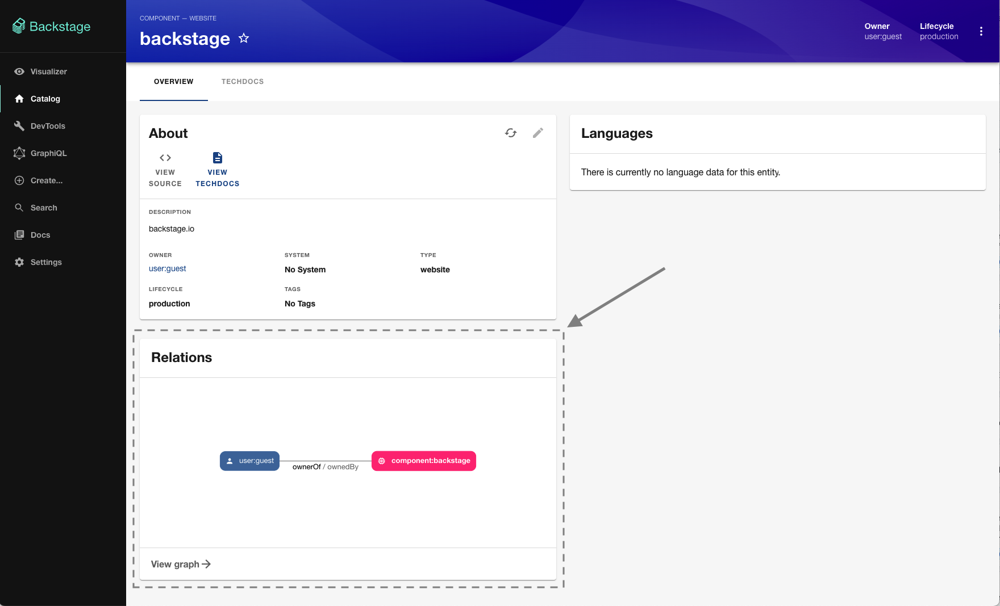

# Catalog Graph

> [!WARNING]
> This documentation is made for those using the experimental new Frontend system.
> If you are not using the new frontend system, please go [here](./README.md).

The Catalog graph plugin helps you to visualize the relations between entities, like ownership, grouping or API relationships.
It comes with these features:

- A card that displays the directly related entities to the current entity on the Catalog entity page. It can be customized, for example filtering for specific relations.

  

- A standalone page that can be added to your application providing a viewer for your entity relations.
  This viewer can be used to navigate through the entities and filter for specific relations, you can access it from the card "View Graph" action.

  

## Table of Content

- [Installation](#installation)
- [Customization](#customization)
  - [Packages](#packages)
  - [Routes](#routes)
  - [Extensions](#extensions)
    - [Catalog entity relations graph card](#catalog-entity-relations-graph-card)
    - [Catalog entity relations graph page](#catalog-entity-relations-graph-page)

## Installation

This plugin installation requires the following steps:

> [!IMPORTANT]
> In addition to installing this plugin, be sure to install the [Catalog](https://backstage.io/docs/features/software-catalog/) plugin, as the Catalog graph extends its capabilities.

1. Add the `@backstage/catalog-graph` dependency to your app `package.json` file and install it;
2. In your application's configuration file, enable the catalog entity relations graphic card extension so that the card begins to be presented on the catalog entity page:

```yaml
# app-config.yaml
app:
  experimental:
    # Auto discovering all plugins extensions
    packages: all
  extensions:
    # This is required because the card is not enable by default once you install the plugin
    - entity-card:catalog-graph/relations
```

3. Then start the app, navigate to an entity's page and see the Relations graph there;
4. By clicking on the "View Graph" card action, you will be redirected to the catalog entity relations page.

## Customization

This plugin can be customized in two ways: via the `app-config.yaml` file or through code. The following sections will explain to you what kind of configurations are available for use, as well as how you can customize the plugin implementation.

### Packages

The features of this plug-in can be discovered automatically as soon as you install it, but you can also configure the plug-in not to be enabled for certain [environments](https://backstage.io/docs/conf/writing/#configuration-files). See the examples below:

_Enabling auto discovering the plugin extensions in production_

```yaml
# app-config.production.yaml
# Overriding configurations for the local production environment
app:
  experimental:
    packages:
      # Only the following packages will be included
      include:
        - '@backstage/plugin-catalog-graph'
```

_Disabling auto discovering the plugin extensions in development_

```yaml
# app-config.local.yaml
# Overriding configurations for the local development environment
app:
  experimental:
    packages:
      # All but the following package will be included
      exclude:
        - '@backstage/plugin-catalog-graph'
```

For more options of package configurations, see [this](https://backstage.io/docs/frontend-system/architecture/app/#feature-discovery) documentation.

### Routes

The Catalog graph plugin exposes regular and external routes that can be used to configure route bindings.

| Key             | Type           | Description                             |
| --------------- | -------------- | --------------------------------------- |
| `catalogGraph`  | Regular route  | A route ref to the Catalog graph page.  |
| `catalogEntity` | External route | A route ref to the Catalog entity page. |

As an example, here is an association between the external entity page and a different route other than the Catalog plugin's default entity page:

```yaml
# app-config.yaml
app:
  routes:
    bindings:
      # example binding the external catalog graph to a regular route
      # defaults to catalog.catalogEntity
      catalog-graph.catalogEntity: <some-plugin-id>.<some-regular-route-key>
```

Additionally, it is possible to point a route from another plugin to the Catalog graph page:

```yaml
# app-config.yaml
app:
  routes:
    bindings:
      # example binding a external route to the catalog graph page
      <plugin-id>.<external-route-key>: catalog-graph.catalogGraph
```

Route binding is also possible through code. For more information, see [this](https://backstage.io/docs/frontend-system/architecture/routes#binding-external-route-references) documentation.

### Extensions

The Catalog graphics plugin provides extensions for each of its features, see below how to customize these extensions:

#### Catalog Entity Relations Graph Card

An [entity card](https://backstage.io/docs/frontend-system/building-plugins/extension-types#entitycard---reference) extension that renders the relation graph for an entity on the Catalog entity page and has an action that redirects users to the more advanced [relations graph page](#catalog-entity-relations-graph-page).

| kind        | namespace     | name             | id                                    | Default enabled |
| ----------- | ------------- | ---------------- | ------------------------------------- | --------------- |
| entity-card | catalog-graph | entity-relations | `entity-card:catalog-graph/relations` | No              |

##### Output

A React component defined by the [coreExtensionData.reactElement](https://backstage.io/docs/reference/frontend-plugin-api.coreextensiondata/) type.

##### Inputs

There are no inputs available for this extension.

##### Config

The card configurations should be defined under the `app.extensions.entity-card:catalog-graph/relations.config` key:

```yaml
# app-config.yaml
app:
  extensions:
    # this is the extension id and it follows the naming pattern bellow:
    # <extension-kind>/<plugin-namespace>:<extension-name>
    - entity-card:catalog-graph/relations:
        config:
          # example configuring the card title
          # defaults to "Relations"
          title: 'Entities Relations Graph'
```

See below the complete list of available configs:

| Key              | Description                                                                                                                                                                                                      | Type                                         | Optional | Default value                                                                                                    |
| ---------------- | ---------------------------------------------------------------------------------------------------------------------------------------------------------------------------------------------------------------- | -------------------------------------------- | -------- | ---------------------------------------------------------------------------------------------------------------- |
| `filter`         | A [text-based query](<(https://github.com/backstage/backstage/pull/21480)>) used to filter whether the extension should be rendered or not.                                                                      | `string`                                     | yes      | -                                                                                                                |
| `title`          | The card title text.                                                                                                                                                                                             | `string`                                     | yes      | `'Relations'`                                                                                                    |
| `height`         | The card height fixed size.                                                                                                                                                                                      | `number`                                     | yes      | -                                                                                                                |
| `kinds`          | Restricted list of entity [kinds](https://backstage.io/docs/features/software-catalog/descriptor-format/#contents) to display in the graph.                                                                      | `string[]`                                   | yes      | -                                                                                                                |
| `relations`      | Restricted list of entity [relations](https://backstage.io/docs/features/software-catalog/descriptor-format/#common-to-all-kinds-relations) to display in the graph.                                             | `string[]`                                   | yes      | -                                                                                                                |
| `maxDepth`       | A maximum number of levels of relations to display in the graph.                                                                                                                                                 | `number`                                     | yes      | `1`                                                                                                              |
| `unidirectional` | Shows only relations that are from the source to the target entity.                                                                                                                                              | `boolean`                                    | yes      | `true`                                                                                                           |
| `mergeRelations` | Merge the relations line into a single one.                                                                                                                                                                      | `boolean`                                    | yes      | `true`                                                                                                           |
| `direction`      | Render direction of the graph.                                                                                                                                                                                   | `TB` \| `BT` \| `LR` \| `RL`                 | yes      | `'LR'`                                                                                                           |
| `relationPairs`  | A list of [pairs of entity relations](https://backstage.io/docs/features/software-catalog/well-known-relations#relations), used to define which relations are merged together and which the primary relation is. | `[string[], string[]]`                       | yes      | Show all entity [relations](https://backstage.io/docs/features/software-catalog/well-known-relations#relations). |
| `zoom`           | Controls zoom behavior of graph.                                                                                                                                                                                 | `enabled` \| `disabled` \| `enable-on-click` | yes      | `'enabled'`                                                                                                      |
| `curve`          | A factory name for curve generators addressing both lines and areas.                                                                                                                                             | `curveStepBefore` \| `curveMonotoneX`        | yes      | `'enable-on-click' `                                                                                             |

##### Disable

The card is disabled by default when you install the plugin, but you can prevent future versions from enabling it by adding this configuration:

```yaml
# app-config.yaml
app:
  extensions:
    # this is the extension id and it follows the naming pattern bellow:
    # <extension-kind>/<plugin-namespace>:<extension-name>
    # example disbaling the graph card extension
    - entity-card:catalog-graph/relations: false
```

##### Override

Overriding the card extension allows you to modify how it is implemented.

> [!CAUTION]
> To maintain the same level of configuration, you should define the same or an extended configuration schema.

Here is an example overriding the card extension with a custom component:

```tsx
import { createExtensionOverrides, createSchemaFromZod } from '@backstage/backstage-plugin-api';
import { createEntityCardExtension } from '@backstage/plugin-catalog-react/alpha';

export default createExtensionOverrides(
  extensions: [
    createEntityCardExtension({
      // These namespace and name are necessary so the system knows that this extension will replace the default 'entity-relations' card extension provided by the 'catalog-graph' plugin
      namespace: 'catalog-graph',
      name: 'entity-relations',
      configSchema: createSchemaFromZod(z => z.object({
        filter: z.string().optional(),
        // Ommitting the rest of default configs for simplicity in this example
      })),
      loader: () => import('./components').then(m => <m.MyEntityRelationsCard />)
    })
  ]
);
```

For more information about where to place extension overrides, see the official [documentation](https://backstage.io/docs/frontend-system/architecture/extension-overrides).

#### Catalog Entity Relations Graph Page

A [page](https://backstage.io/docs/reference/frontend-plugin-api.createapiextension) extension that lets you customize the relations displayed for a Catalog entity in the graph viewer using a series of filters.

| Kind | Namespace     | Name | Id                   | Default enabled |
| ---- | ------------- | :--: | -------------------- | :-------------: |
| page | catalog-graph |  -   | `page:catalog-graph` |       Yes       |

##### Output

A React component defined by the [coreExtensionData.reactElement](https://backstage.io/docs/reference/frontend-plugin-api.coreextensiondata/) type.

##### Inputs

There are no inputs available for this extension.

##### Config

The page configurations should be defined under the `app.extensions.page:catalog-graph.config` key:

```yaml
# app-config.yaml
app:
  extensions:
    # this is the extension id and it follows the naming pattern bellow:
    # <extension-kind>/<plugin-namespace>:<extension-name>
    - page:catalog-graph:
        config:
          # example configuring the page path
          # defaults to "/catalog-graph"
          path: '/entity-graph'
```

See below the complete list of available configs:

| Key              | Description                                                                                                                                                                                                      | Type                                                                                                                                                                                                                                                | Optional | Default value                                                                                                    |
| ---------------- | ---------------------------------------------------------------------------------------------------------------------------------------------------------------------------------------------------------------- | --------------------------------------------------------------------------------------------------------------------------------------------------------------------------------------------------------------------------------------------------- | -------- | ---------------------------------------------------------------------------------------------------------------- |
| `path`           | The page route path.                                                                                                                                                                                             | `string`                                                                                                                                                                                                                                            | true     | `'/catalog-graph' `                                                                                              |
| `initialState`   | These are the initial filter values, as opposed to configuration of the available filter values.                                                                                                                 | `{ selectedRelations?: string[],selectedKinds?: string[],rootEntityRefs?: string[],maxDepth?: number,unidirectional?: boolean,mergeRelations?: boolean,direction?: Direction,showFilters?: boolean,curve?: 'curveStepBefore' \| 'curveMonotoneX' }` | true     | `{}`                                                                                                             |
| `kinds`          | Restricted list of entity [kinds](https://backstage.io/docs/features/software-catalog/descriptor-format/#contents) to display in the graph.                                                                      | `string[]`                                                                                                                                                                                                                                          | yes      | -                                                                                                                |
| `relations`      | Restricted list of entity [relations](https://backstage.io/docs/features/software-catalog/descriptor-format/#common-to-all-kinds-relations) to display in the graph.                                             | `string[]`                                                                                                                                                                                                                                          | yes      | -                                                                                                                |
| `maxDepth`       | A maximum number of levels of relations to display in the graph.                                                                                                                                                 | `number`                                                                                                                                                                                                                                            | yes      | `1`                                                                                                              |
| `unidirectional` | Shows only relations that are from the source to the target entity.                                                                                                                                              | `boolean`                                                                                                                                                                                                                                           | yes      | `true`                                                                                                           |
| `mergeRelations` | Merge the relations line into a single one.                                                                                                                                                                      | `boolean`                                                                                                                                                                                                                                           | yes      | `true`                                                                                                           |
| `direction`      | Render direction of the graph.                                                                                                                                                                                   | `TB` \| `BT` \| `LR` \| `RL`                                                                                                                                                                                                                        | yes      | `'LR'`                                                                                                           |
| `relationPairs`  | A list of [pairs of entity relations](https://backstage.io/docs/features/software-catalog/well-known-relations#relations), used to define which relations are merged together and which the primary relation is. | `[string[], string[]]`                                                                                                                                                                                                                              | yes      | Show all entity [relations](https://backstage.io/docs/features/software-catalog/well-known-relations#relations). |
| `zoom`           | Controls zoom behavior of graph.                                                                                                                                                                                 | `enabled` \| `disabled` \| `enable-on-click`                                                                                                                                                                                                        | yes      | `'enabled'`                                                                                                      |
| `curve`          | A factory name for curve generators addressing both lines and areas.                                                                                                                                             | `curveStepBefore` \| `curveMonotoneX`                                                                                                                                                                                                               | yes      | `'enable-on-click' `                                                                                             |

##### Disable

When you install the plugin, the page is automatically enabled, but you can disable it with the following setting:

```yaml
# app-config.yaml
app:
  extensions:
    # this is the extension id and it follows the naming pattern bellow:
    # <extension-kind>/<plugin-namespace>:<extension-name>
    # example disbaling the graph page extension
    - page:catalog-graph: false
```

##### Override

Overriding the page extension allows you to modify how it is implemented.

> [!CAUTION]
> To maintain the same level of configuration, you need to define the same or an extended configuration schema. In order to avoid side effects on external plugins that expect this page to be associated with the default path and route reference, remember to use the same default path so that applications that use the default path still point to the same page and the same route reference.

Here is example overriding the page extension with a custom component:

```tsx
import { createExtensionOverrides, createPageExtension, createSchemaFromZod } from '@backstage/backstage-plugin-api';
import { convertLegacyRouteRef } from '@backstage/core-compat-api';
import { catalogGraphRouteRef } from '@backstage/plugin-catalog-graph';

export default createExtensionOverrides(
  extensions: [
    createPageExtension({
      // Ommiting name since it is an index page
      // This namespace is necessary so the system knows that this extension will replace the default 'catalog-graph' page extension
      namespace: 'catalog-graph',
      defaultPath: '/catalog-graph',
      routeRef: convertLegacyRouteRef(catalogGraphRouteRef),
      createSchemaFromZod(z => z.object({
        path: z.string().default('/catalog-graph')
        // Ommitting the rest of default configs for simplicity in this example
      })),
      loader: () => import('./components').then(m => <m.CustomEntityRelationsPage />)
    })
  ]
);
```

For more information about where to place extension overrides, see the official [documentation](https://backstage.io/docs/frontend-system/architecture/extension-overrides).
