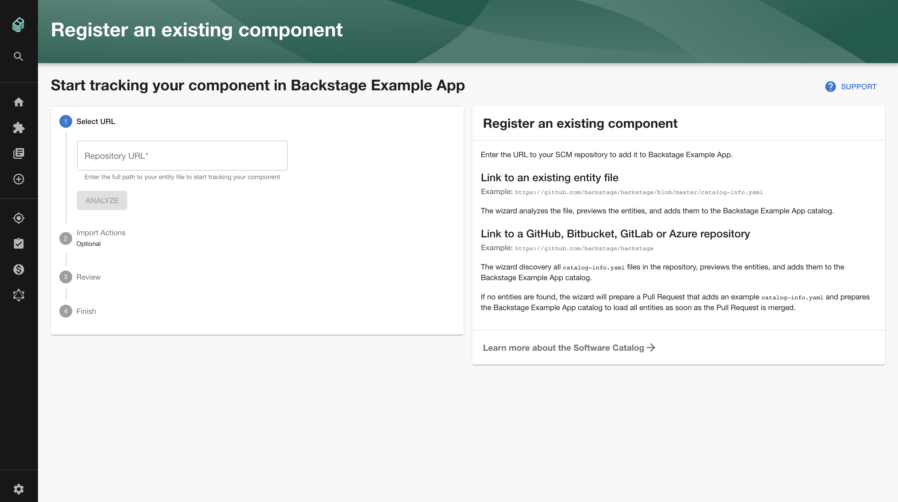

# Catalog Import

The Catalog Import Plugin provides a wizard to onboard projects with existing `catalog-info.yaml` files.
It also assists by creating pull requests in repositories where no `catalog-info.yaml` exists.



Current features:

- Import `catalog-info.yaml` files from a URL in a repository of one of the supported Git integrations (example `https://github.com/backstage/backstage/catalog-info.yaml`).
- _[GitHub only]_ Search for all `catalog-info.yaml` files in a Git repository (example: `https://github.com/backstage/backstage`).
- _[GitHub only]_ Analyze a repository, generate a Component entity, and create a Pull Request to onboard the repository.

Some features are not yet available for all supported Git providers.

## Getting Started

1. Install the Catalog Import Plugin:

```bash
# From your Backstage root directory
cd packages/app
yarn add @backstage/plugin-catalog-import
```

2. Add the `CatalogImportPage` extension to the app:

```tsx
// packages/app/src/App.tsx

import { CatalogImportPage } from '@backstage/plugin-catalog-import';

<Route path="/catalog-import" element={<CatalogImportPage />} />;
```

## Customizations

### Disable the creation of Pull Requests

The pull request feature can be disabled by options that are passed to the `CatalogImportPage`:

```tsx
// packages/app/src/App.tsx

<Route
  path="/catalog-import"
  element={<CatalogImportPage pullRequest={{ disable: true }} />}
/>
```

### Customize the title and body of the Pull Request

The pull request form is filled with a default title and body.
This can be configured by options that are passed to the `CatalogImportPage`:

```tsx
// packages/app/src/App.tsx

<Route
  path="/catalog-import"
  element={
    <CatalogImportPage
      pullRequest={{
        preparePullRequest: () => ({
          title: 'My title',
          body: 'My **markdown** body',
        }),
      }}
    />
  }
/>
```

## Development

Use `yarn start` to run a [development version](./dev/index.tsx) of the plugin that can be used to validate each flow with mocked data.
